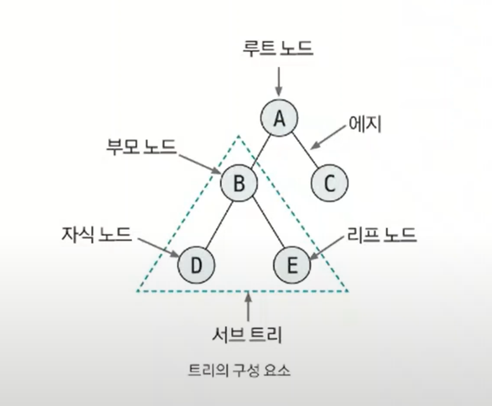
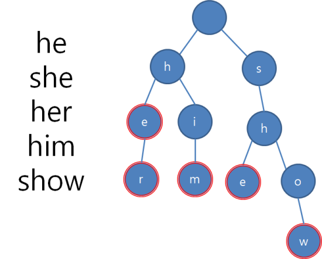

# 트리

- 트리는 노드와 에지로 연결된 그래프의 특수한 형태를 가지고 있다.
- **특징**
  - 순환 구조(cycle)를 지니고 있지 않고, 1개의 루트 노드가 존재한다.
  - 루트 노드를 제외한 노드는 단 1개의 부모 노드를 갖는다.
  - 트리의 부분 트리(subtree) 역시 트리의 모든 특징을 따른다.

## 트리 핵심 이론

- 트리의 구성 요소

| 구성 요소 | 설명                                |
|-------|-----------------------------------|
| 노드    | 데이터의 index와 value를 표현하는 요소        |
| 에지    | 노드와 노드의 연결 관계를 나타내는 선             |
| 루트 노드 | 트리에서 가장 상위에 존재하는 노드               |
| 부모 노드 | 두 노드 사이의 관계에서 상위 노드에 해당하는 노드      |
| 자식 노드 | 두 노드 사이의 관계에서 하위 노드에 해당하는 노드      |
| 리프 노드 | 트리에서 가장 하위에 존재하는 노드(자식 노드가 없는 노드) |
| 서브 트리 | 전체 트리에 속한 작은 트리                   |

### [예제 문제(백준 - 트리의 부모 찾기)](https://github.com/genesis12345678/TIL/blob/main/algorithm/tree/tree/Example_1.md#%ED%8A%B8%EB%A6%AC-%EC%98%88%EC%A0%9C---1)

### [예제 문제(백준 - 트리)](https://github.com/genesis12345678/TIL/blob/main/algorithm/tree/tree/Example_2.md#%ED%8A%B8%EB%A6%AC-%EC%98%88%EC%A0%9C---2)

 

# 트라이

- 트라이(trie)는 문자열 검색을 빠르게 실행할 수 있도록 설계한 트리 형태의 자료구조이다.

## 트라이 핵심 이론

- 트라이는 일반적으로 단어들을 사전의 형태로 생성한 후 트리의 부모 자식 노드 관계를 이용해 검색을 수행한다.
- **트라이의 특징**
  - `N진 트리` : 문자 종류의 개수에 따라 N이 결정된다. 예를 들어 알파벳은 26진 트리로 구성된다.
  - 루트 노드는 항상 빈 문자열을 뜻하는 공백 상태를 유지한다.

- 단어를 삽입할 때마다 루트 노드에서부터 검색한다.
- 찾는 단어 하나가 공백 상태면 해당 단어 노드에서 신규 노드를 생성한다.
- 이렇게 공백 상태이면 신규 노드를 생성하고, 아니면 이동하는 원리로 트라이 자료구조를 구현한다.

### [예제 문제(백준 - 문자열 집합)](https://github.com/genesis12345678/TIL/blob/main/algorithm/tree/tree/Example_3.md#%ED%8A%B8%EB%9D%BC%EC%9D%B4-%EC%98%88%EC%A0%9C---1)