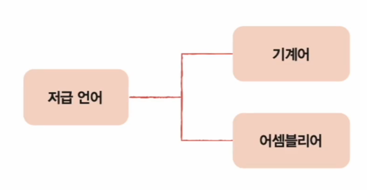
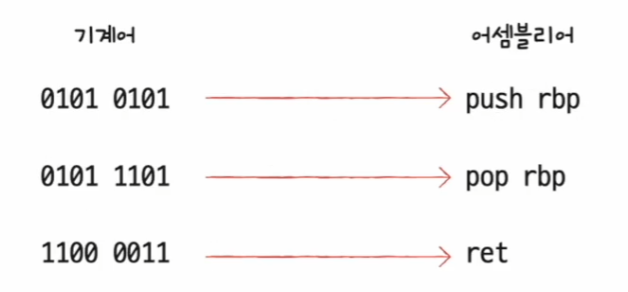
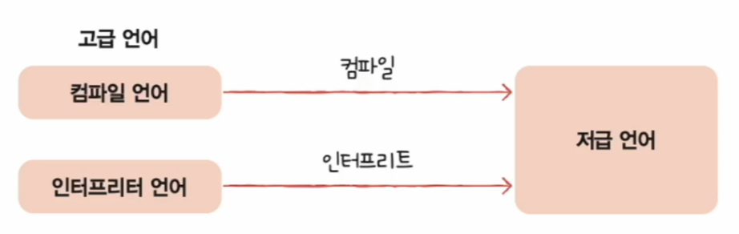

# 컴퓨터 구조와 운영체제

# 명령어 - 소스 코드와 명령어

## 고급 언어와 저급 언어

- **컴퓨터는 명령어를 처리하는 기계**라고 할 수 있고, 명령어는 컴퓨터를 실질적으로 작동시키는 중요한 정보이다.
- 우리가 프로그램을 만들 때 사용하는 프로그래밍 언어(C, Java, Python 등)는 컴퓨터가 이해하는 언어가 아닌 **사람이 이해하고 작성하기 쉽게 만들어진 언어**이며, 
    이렇게 사람을 위한 언어를 **고급 언어**라고 한다.
- 반대로 컴퓨터가 직접 이해하고 실행할 수 있는 언어를 **저급 언어**라고 한다. 저급 언어는 명령어로 이루어져 있으며, **컴퓨터가 이해하고 실행할 수 있는 언어는 오직 저급 언어뿐**이다.
- 그래서 고급 언어로 작성된 소스 코드가 실행되려면 반드시 저급 언어, 즉 명령어로 변환되어야 한다.

저급 언어는 **기계어**와 **어셈블리어** 두 종류가 있다.

- **기계어**
  - 기계어는 0과 1의 이진수 또는 십육진수로 표현하는 언어다.
  - 기계어는 오로지 컴퓨터만을 위해 만들어진 언어이기 때문에 사람이 읽으면 그 의미를 이해하기 어렵다.
- **어셈블리어**
  - 어셈블리어는 0과 1로 표현된 명령어(기계어)를 읽기 편한 형태로 번역한 언어이다.
  - 0과 1로 이루어진 기계어를 읽기 편하게 만든 저급 언어일 뿐이므로, 개발자가 직접 어셈블리어를 이용해 복잡한 프로그램을 만들기는 쉽지 않다.

---

## 컴파일 언어와 인터프리터 언어

- 개발자가 고급 언어로 작성한 소스 코드는 결국 저급 언어로 변환되어 실행되는데, 이때 **컴파일** 방식과 **인터프리트** 방식이 있다.
- 컴파일 방식으로 작동하는 프로그래밍 언어를 **컴파일 언어**, 인터프리트 방식으로 작동하는 프로그래밍 언어를 **인터프리터 언어**라고 한다.

### 컴파일 언어

- **컴파일 언어**는 컴파일러에 의해 소스 코드 전체가 저급 언어로 변환되어 실행되는 고급 언어이다.(C, Java 등)
- 컴퓨터는 개발자가 만든 소스 코드를 이해하지 못한다. 때문에 컴파일 언어로 작성된 소스 코드는 코드 전체가 저급 언어로 변환되는 과정을 거치는데, 이 과정을 **컴파일(complie)** 이라고 하며,
    컴파일을 수행해 주는 도구를 **컴파일러** 라고 한다.
- 컴파일러는 개발자가 작성한 소스 코드 전체를 쭉 훑어보며 소스 코드에 문법적인 오류는 없는지, 실행 가능한 코드인지, 실행하는 데 불필요한 코드는 없는지 등을 따지며
    소스 코드 전체를 저급 언어로 컴파일한다.
- 이때 컴파일러가 소스 코드 내에서 오류를 하나라도 발견하면 해당 소스 코드는 컴파일에 실패한다.
- 컴파일리 성공적으로 수행되면 컴파일러를 통해 저급 언어로 변환된 코드를 **목적 코드**라고 한다.

### 인터프리터 언어

- 인터프리터 언어는 인터프리터에 의해 소스 코드가 한 줄씩 실행되는 고급 언어이다.(Python 등)
- 소스 코드 전체가 저급 언어로 변환되는 컴파일 언어와는 달리, 인터프리터 언어는 소스 코드를 한 줄씩 차례로 실행한다. 그리고 한 줄씩 저급 언어로 변환하여
    실행해 주는 도구를 **인터프리터**라고 한다.
- 때문에 인터프리터 언어는 소스 코드 전체를 저급 언어로 변환하는 시간을 기다릴 필요가 없다.
- 그리고 소스 코드 내에 오류가 하나라도 있으면 컴파일이 불가능했던 컴파일 언어와는 달리, 인터프리터 언어는 소스 코드를 한 줄씩 실행하기 대문에 소스 코드
    N번째 줄에 오류가 있더라도 N-1번째 줄까지는 실행이 된다.

- 생각과 다르데 일반적으로 인터프리터 언어는 컴파일 언어보다 느리다.
- 컴파일을 통해 나온 결과물, 즉 목적 코드는 컴퓨터가 이해하고 실행할 수 있는 저급 언어인 반면, 인터프리터 언어는 마지막까지 한 줄씩 저급 언어로 해석하며 실행해야 하기 때문이다.

> - 컴파일 언어라고 해서 인터프리트가 불가능하거나, 인터프리터 언어라고 해서 컴파일이 불가능 한 것은 아니다.
> - 프로그래밍 언어는 컴파일 언어와 인터프리터 언어로 명확하게 구분되지 않는다.
> - '고급 언어가 저급 언어로 변환되는 대표적인 방법에는 컴파일 방식과 인터프리트 방식이 있다' 정도로 이해하는 것이 좋다.

---

[메인 ⏫]()

[다음 ↪️ - 컴퓨터 구조(명령어) - 명령어 구조]()