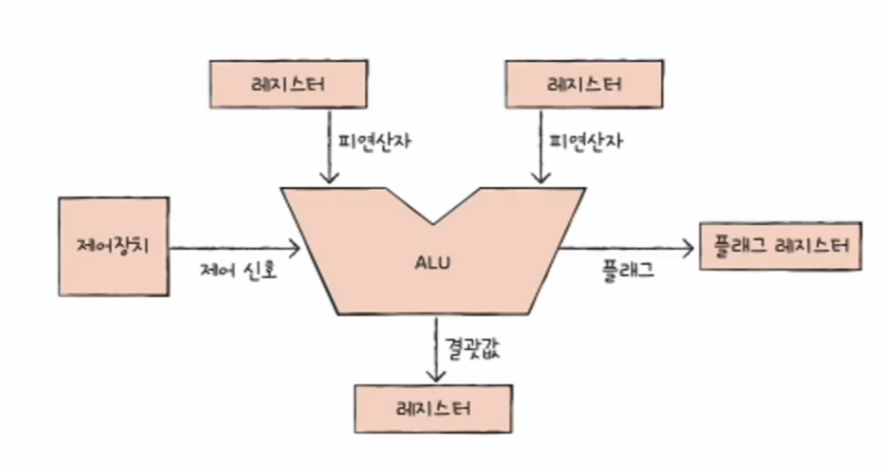
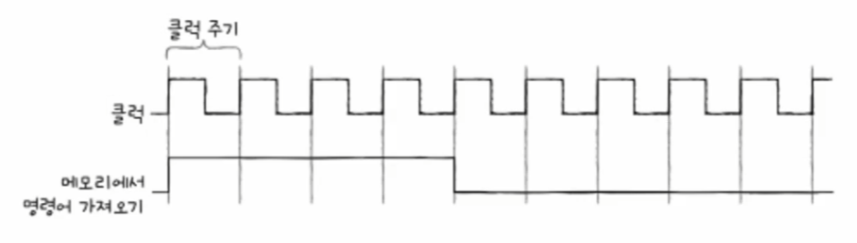

# 컴퓨터 구조와 운영체제

# CPU 작동 원리 - ALU와 제어장치

## ALU

### **`ALU`가 받아들이는 정보**
- `ALU`는 CPU 내부에서 계산을 담당하는 CPU의 구성 요소 중 하나이다.
- `ALU`는 계산을 하기 위해 피연산자와 수행할 연산이 필요하다. 그래서 `ALU`는 레지스터를 통해 **피연산자**를 받아들이고, 제어장치로부터 수행할 연산을 알려주는
    **제어 신호**를 받아들인다.

### **`ALU`가 내보내는 정보**
- 연산을 수행한 결과는 성능 향상을 위해 바로 메모리에 저장되지 않고 일시적으로 레지스터에 저장된다.
- 계산 결과와 더불어 **플래그**라는 연산 결과에 대한 추가적인 상태 정보를 내보낸다. `ALU`가 내보내는 대표적인 플래그는 다음과 같다.

| 플래그 종류    | 의미                                                                       |
|-----------|--------------------------------------------------------------------------|
| 부호 플래그    | - 연산한 결과의 부호  - `1`: 음수  - `0`: 양수                               |
| 제로 플래그    | - 연산 결과가 0인지 여부  - `1`: 0  - `0`: 0이 아님                          |
| 캐리 플래그    | - 연산 결과 올림수나 빌림수가 발생 여부  - `1`: 올림수나 빌림수 발생  - `0`: 발생하지 않음      |
| 오버플로우 플래그 | - 오버플로우 발생 여부  - `1`: 오버플로우 발생  - `0`: 발생하지 않음                   |
| 인터럽트 플래그  | - 인터럽트 가능 여부  - `1`: 인터럽트 가능  - `0`: 인터럽트 불가능                    |
| 슈퍼바이저 플래그 | - 커널 모드 또는 사용자 모드 실행 중 여부  - `1`: 커널 모드 실행 중  - `0`: 사용자 모드 실행 중 |

- 이런 플래그들은 CPU가 프로그램을 실행하는 도중 반드시 기억해야 하는 일종의 참고 정보로서, **플래그 레지스터**라는 레지스터에 저장된다.

---

## 제어장치

**제어장치**는 제어 신호를 내보내고, 명령어를 해석하는 부품이다. 그리고 **제어 신호**는 컴퓨터 부품들을 관리하고 작동시키기 위한 일종의 전기 신호이다.

### 제어장치가 받아들이는 정보

1. **클럭 신호**

- 클럭이란 컴퓨터의 모든 부품을 일사불란하게 움직일 수 있게 하는 시간 단위로, 클럭 주기에 맞춰 명령어들이 수행된다.
- 이때 컴퓨터의 모든 부품이 한 클럭마다 작동하는 것이 아니라, 하나의 명령어가 여러 클럭에 걸쳐 실행될 수 있다.

2. **해석해야 할 명렁어**
- CPU가 해석해야 할 명령어는 명령어 레지스터라는 레지스터에 저장된다.
- 제어장치는 명령어 레지스터로부터 해석할 명령어를 받아들이고 해석한 뒤, 제어 신호를 발생시켜 컴퓨터 부품들에 수행해야 할 내용을 알려준다.

3. **플래그 레지스터 속 플래그 값**
- 플래그는 ALU 연산에 대한 추가적인 상태 정보로, 제어장치는 플래그 값을 받아들이고 이를 참고하여 제어 신호를 발생시킨다.

4. **시스템 버스(제어 버스)로 전달된 제어 신호**
- 제어 신호는 CPU뿐만 아니라 입출력장치를 비롯한 CPU 외부 장치도 발생시킬 수 있다.
- 제어장치는 제어 버스를 통해 외부로부터 전달된 제어 신호를 받아들인다.

### 제어장치가 내보내는 정보

- **CPU 내부에 전달하는 제어 신호**
  - **ALU에 전달하는 제어 신호** : 수행할 연산을 지시
  - **레지스터에 전달하는 제어 신호** : 데이터를 이동시키거나 레지스터에 저장된 명령어를 해석
- **CPU 외부에 전달하는 제어 신호**
  - 제어 버스로 제어 신호를 내보낸다는 말과 같으며, 크게 두가지가 있다.
    - **메모리에 전달하는 제어 신호** : 메모리에 저장된 값을 읽거나 새로운 값을 쓸 때
    - **입출력장치에 전달하는 제어 신호** : 입출력장치의 값을 읽거나 새로운 값을 쓸 때

---

[이전 ↩️ - 컴퓨터 구조(명령어) - 명령어 구조](https://github.com/genesis12345678/TIL/blob/main/cs/command/Structure.md)

[메인 ⏫](https://github.com/genesis12345678/TIL/blob/main/cs/Main.md)

[다음 ↪️ - 컴퓨터 구조(CPU 작동 원리) - 레지스터](https://github.com/genesis12345678/TIL/blob/main/cs/cpu/Register.md)