# 컴퓨터 구조와 운영체제

# CPU 작동 원리 - 명령어 사이클과 인터럽트

- **명령어 사이클** : 하나의 명령어를 처리하는 정형화된 흐름
- **인터럽트** : 정해진 흐름에 따라 명령어를 처리하다가 흐름이 끊어지는 상황

## 명령어 사이클

- 프로그램 속 각각의 명령어들은 일정한 주기가 반복되며 실행되는데 이 주기를 **명령어 사이클** 이라고 한다.
- 프로그램 속 각가의 명령어들은 명령어 사이클이 반복되며 실행된다.

### 인출 사이클

메모리에 있는 명령어를 CPU로 가져오는 단계

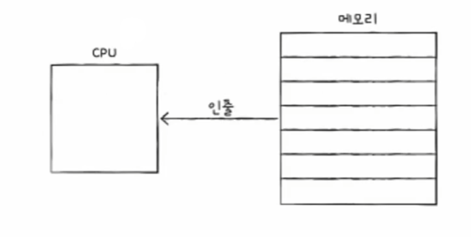

### 실행 사이클

- CPU로 가져온 명령어를 실행하는 단계
- 제어장치가 명령어 레지스터에 담긴 값을 해석하고, 제어 신호를 발생시키는 단계

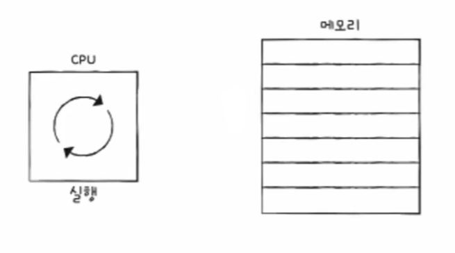

일반적으로 명령어는 인출과 실행 사이클을 반복하며 실행된다.

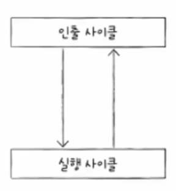

- 하지만 모든 명령어가 이렇게 간단히 실행되지는 않는다. 명령어를 인출하여 CPU로 가져와도 곧바로 실행할 수 없는 경우도 있다.
- 예를 들어 간접 주소 지정 방식의 경우 오퍼랜드 필드에 유효 주소의 주소를 명시하므로, 명령어를 실행하기 위해서는 메모리 접근을 한 번 더 해야 한다.

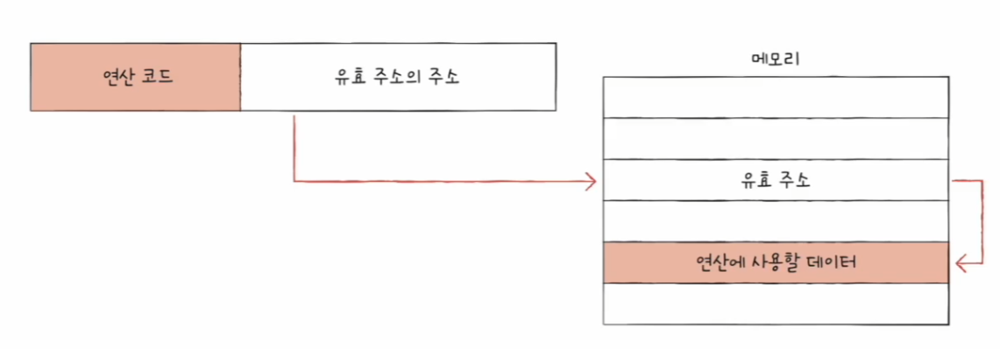

### 간접 사이클

이 단계를 간접 사이클이라고 한다.

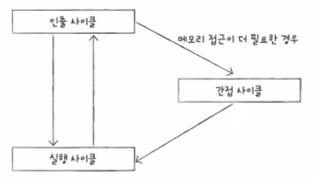

---

## 인터럽트

- CPU의 작업을 방해하는 신호를 **인터럽트**라고 한다.
- 인터럽트의 종류에는 크게 **동기 인터럽트**와 **비동기 인터럽트**가 있다.

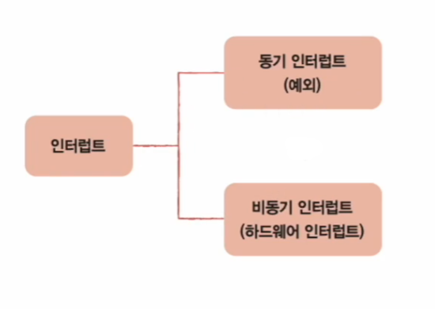

- **동기 인터럽트**
  - CPU에 의해 발생하는 인터럽트
  - CPU가 명령어들을 수행하다가 예외적인 상황에 마주쳤을 때 발생하는 인터럽트로, 이런 점에서 **예외**라고 부른다.

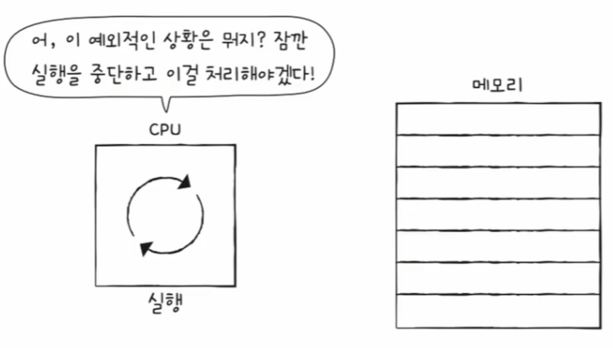

- **비동기 인터럽트**
  - 주로 입출력장치에 의해 발생하는 인터럽트
  - 입출력장치에 의한 비동기 인터럽트는 알림 역할을 한다.

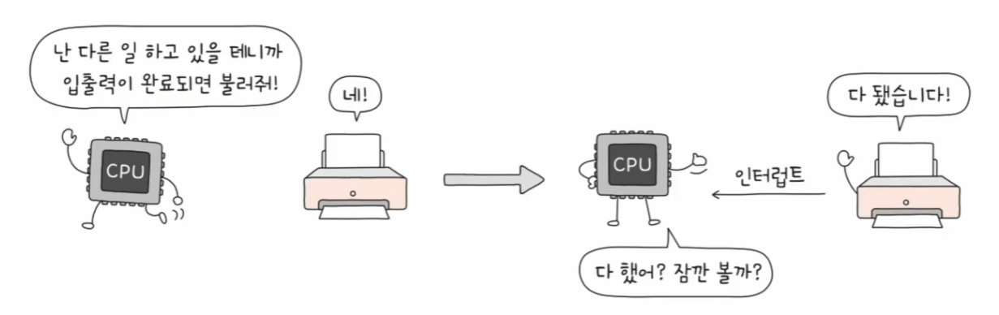

### 하드웨어 인터럽트 (비동기 인터럽트)

- **하드웨어 인터럽트**는 알림과 같은 인터럽트이다.
- CPU는 입출력 작업 도중에도 효율적으로 명령어를 처리하기 위해 이런 알림과 같은 하드웨어 인터럽트를 사용한다.

#### 하드웨어 인터럽트 처리 순서

1. 입출력장치는 CPU에 **인터럽트 요청 신호**를 보낸다.
- 인터럽트는 CPU의 정상적인 실행 흐름을 끊는 것이기 때문에 인터럽트하기 전에는 요청 신호를 보내야 한다.
2. CPU는 실행 사이클이 끝나고 명령어를 인출하기 전 항상 인터럽트 여부를 확인한다.
3. CPU는 인터럽트 요청을 확인하고 **인터럽트 플래그**를 통해 현재 인터럽트를 받아들일 수 있는지 여부를 확인한다.
- CPU가 인터럽트 요청을 수용하기 위해서는 플래그 레지스터의 인터럽트 플래그가 활성화되어 있어야 한다.
- 인터럽트 플래그는 말 그대로 하드웨어 인터럽트를 받아들일지, 무시할지 결정하는 플래그이다.
- 하지만 인터럽트 플래그가 불가능으로 설정되더라도 무시할 수 없는 인터럽트 요청(정전, 하드웨어 고장 등)도 있기 때문에 모든 하드웨어 인터럽트를 인터럽트 플래그로 막을 수 있는 것은 아니다.

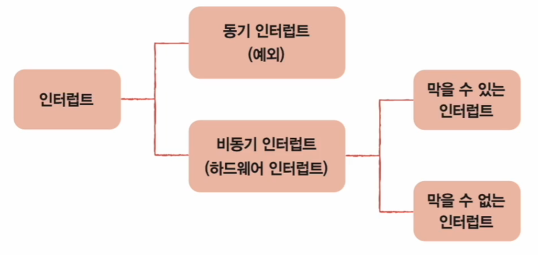

4. 인터럽트를 받아들일 수 있다면 CPU는 **지금까지의 작업을 백업**한다.(스택 영역에)
5. CPU는 **인터럽트 벡터**를 참조하여 **인터럽트 서비스 루틴**을 실행한다.
- **인터럽트 서비스 루틴**은 인터럽트가 발생했을 때 해당 인터럽트를 어떻게 처리하고 작동해야 할지에 대한 정보로 이루어진 프로그램이다.
  - 인터럽트 서비스 루틴도 프로그램이기 때문에 메모리에 저장된다.

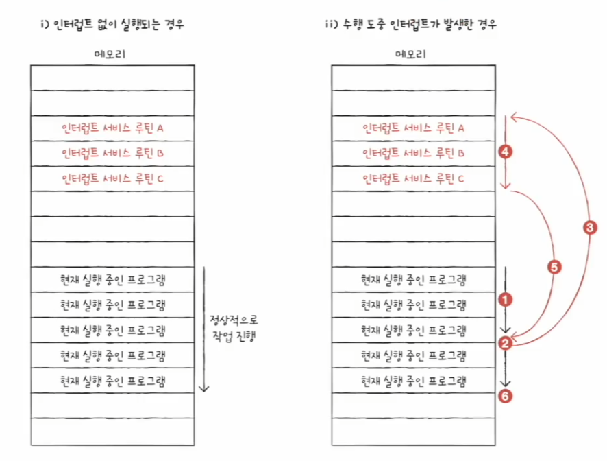

- 인터럽트를 처리하는 방법은 입출력장치마다 다르므로 각기 다른 인터럽트 서비스 루틴을 가지고 있다.
- CPU는 수많은 인터럽트 서비스 루틴을 구분하기 위해 **인터럽트 벡터**를 사용한다. 인터럽트 벡터는 인터럽트 서비스 루틴을 식별하기 위한 정보로, 인터럽트 벡터를 알면
    인터럽트 서비스 루틴의 시작 주소를 알 수 있다.

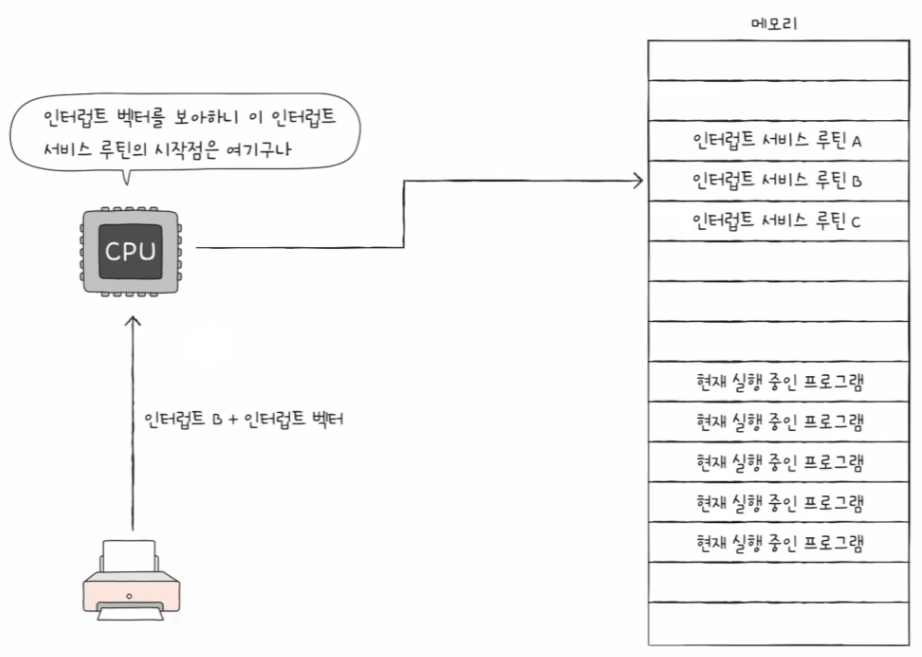

> **정리** : CPU가 인터럽트를 처리한다는 것은 인터럽트 서비스 루틴을 실행하고, 본래 수행하던 작업으로 다시 되돌아온다는 것과 같다. 그리고 CPU가 인터럽트 서비스 루틴을
> 실행하려면 인터럽트 서비스 루틴의 시작 주소를 알아야 하는데, 이는 인터럽트 벡터를 통해 알 수 있다.

6. 인터럽트 서비스 루틴 실행이 끝나면 `4`에서 백업해 둔 작업을 복구하여 실행을 재개한다.

CPU 명령어 사이클에 인터럽트 사이클까지 추가한 결과 다음과 같아진다. CPU는 이와 같은 과정을 반복해 나가며 프로그램을 실행한다고 볼 수 있다.

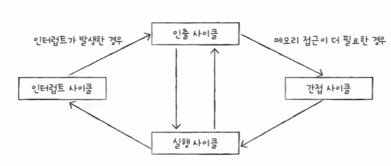

---

[이전 ↩️ - 컴퓨터 구조(CPU 작동 원리) - 레지스터]()

[메인 ⏫](https://github.com/genesis12345678/TIL/blob/main/cs/Main.md)

[다음 ↪️ - 컴퓨터 구조(CPU의 성능 향상 기법) - ]()