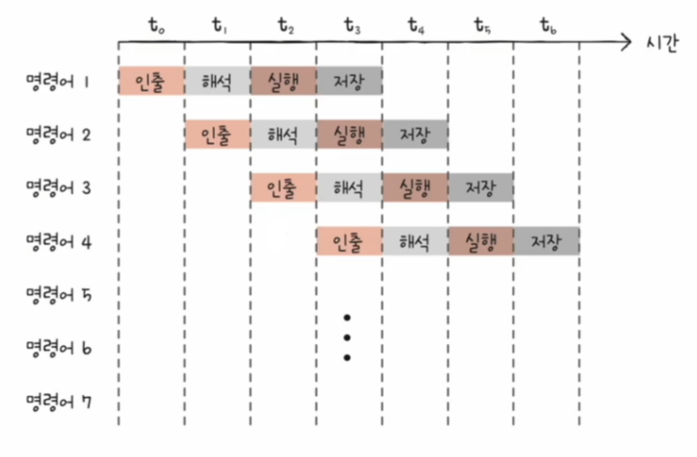
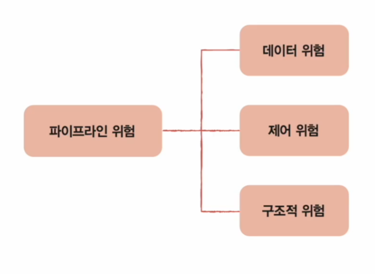
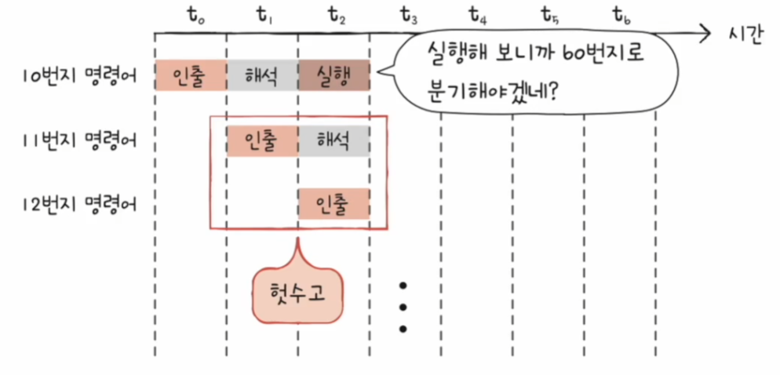
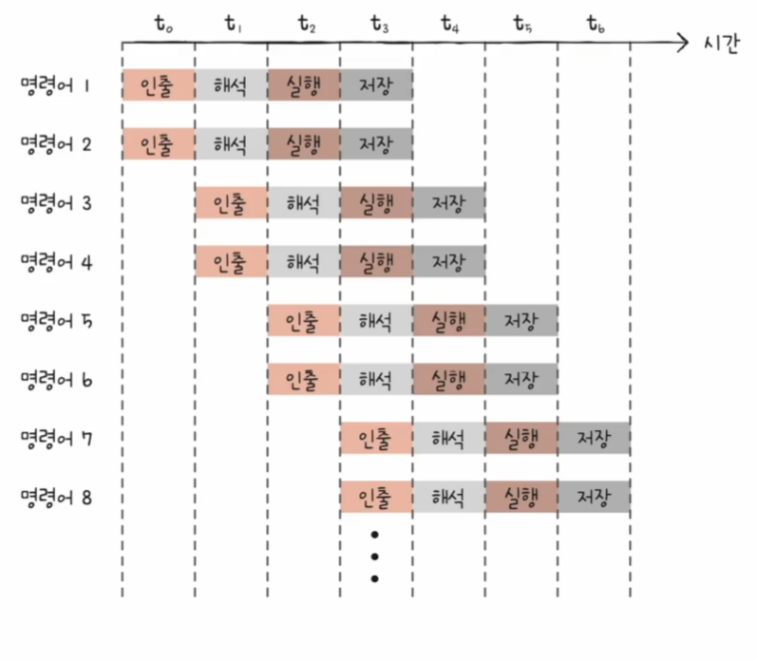
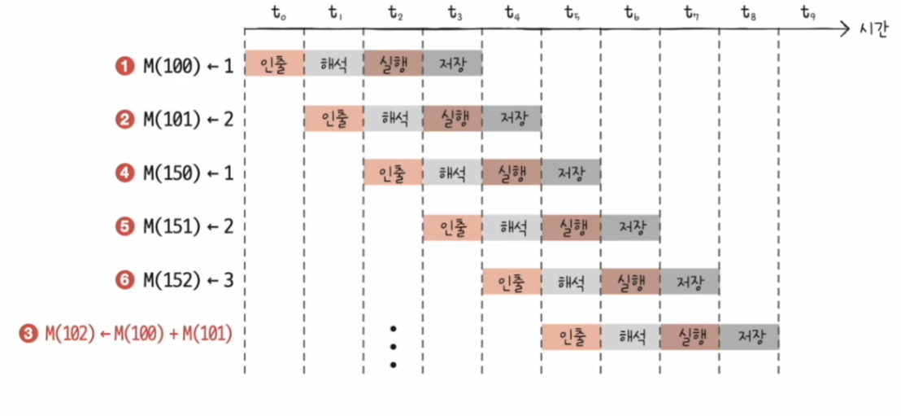

# 컴퓨터 구조와 운영체제

# CPU의 성능 향상 기법 - 명령어 병렬 처리 기법

- 빠른 CPU를 만들려면 높은 클럭 속도와 멀티코어, 멀티스레드를 지원하는 CPU를 만드는 것도 중요하지만, CPU가 쉬지 않고 작동하게 하는 것이 중요하다.
- 명령어를 동시에 처리하여 CPU를 한시도 쉬지 않고 작동시키는 기법인 **명령어 병렬 처리 기법**에 대해 알아보자.

## 명령어 파이프라인

- 명령어 처리 과정을 클럭 단위로 나누어 보면 일반적으로 다음과 같다.
1. 명령어 인출
2. 명령어 해석
3. 명령어 실행
4. 결과 저장
- 여기서 중요한 점은 같은 단계가 겹치지만 않는다면 CPU는 각 단계를 동시에 실행할 수 있다는 것이다.
- 예를 들어 CPU는 한 명령어를 인출하는 동시에 다른 명령어를 실행할 수 있는 것이다.

- 이처럼 명령어들을 **명령어 파이프라인**에 넣고 동시에 처리하는 기법을 **명령어 파이프라이닝** 이라고 한다.
- 파이프라이닝이 높은 성능을 가져오기는 하지만, 특정 상황에서는 **파이프라인 위험**이라는 상황을 마주할 수 있다. 크게 다음과 같은 위험들이 있다.

### 데이터 위험 

- **데이터 위험**은 명령어 간 데이터 의존성에 의해 발생한다.
- 모든 명령어를 동시에 처리할 순 없다. 어떤 명령어는 이전 명령어의 결과를 받아야만 실행할 수 있는 경우가 있다.
- 이렇게 데이터 의존적인 두 명령어를 무작정 동시에 실행하려고 하면 파이프라인이 제대로 작동하지 않는 것을 **데이터 위험**이라고 한다.

### 제어 위험

- **제어 위험**은 프로그램 카운터의 갑작스러운 변화에 의해 발생한다.
- 기본적으로 프로그램 카운터는 현재 실행 중인 명령어의 다음 주소로 갱신되는데, 프로그램 실행 흐름이 바뀌어 명령어가 실행되면서 프로그램 카운터 값에
    갑작스러운 변화가 생길 수 있다.
- 이렇게 되면 명령어 파이프라인에 미리 가지고 와서 처리 중이었던 명령어들은 아무 쓸모가 없어지는데, 이를 **제어 위험**이라고 한다.

> **분기 예측** : 프로그램이 어디로 분기할지 미리 예측한 후 그 주소를 인출하는 기술

### 구조적 위험

- **구조적 위험**은 명령어들을 겹쳐 실행하는 과정에서 서로 다른 명령어가 동시에 ALU, 레지스터 등과 같은 CPU 부품울 사용하려고 할 때 발생한다.
- **자원 위험**이라고도 한다.

---

## 슈퍼스칼라

- CPU 내부에 여러 개의 명령어 파이프라인을 포함한 구조를 말한다.

- 슈퍼스칼라 구조로 명령어 처리가 가능한 CPU를 슈퍼스칼라 프로세서 또는 슈퍼스칼라 CPU라고 한다.
- 슈퍼스칼라 프로세서는 매 클럭 주기마다 동시에 여러 명령어를 인출하고 실행할 수도 있다.
- 이론적으로는 파이프라인 개수에 비례하여 프로그램 처리 속도가 빨라진다. 하지만 **파이프라인 위험도**의 증가로 인해 파이프라인 개수에 비례하여 빨라지지는 않는다.

---

## 비순차적 명령어 처리

- 이름 그대로 명령어들을 순차적으로 실행하지 않는 기법이다.
- 파이프라이닝, 슈퍼스칼라 기법과 같이 모든 명령어를 순차적으로만 처리한다면 예상치 못한 상황에서 명령어 파이프라인은 멈춰 버리게 된다.
- 명령어를 순차적으로만 실행하지 않고 순서를 바꿔 실행해도 무방한 명령어를 먼저 실행하여 명령어 파이프라인이 멈추는 것을 방지하는 기법을 **비순차적 명령어 처리 기법**이라고 한다.

- 비순차적 명령어 처리가 가능한 CPU는 명령어들이 어떤 명령어와 데이터 의존성을 가지고 있는지, 순서를 바꿔 실행할 수 있는 명령어에는 어떤 것들이 있는지 판단할 수 있어야 한다.

---

[이전 ↩️ - 컴퓨터 구조(CPU의 성능 향상 기법) - 빠른 CPU를 위한 설계 기법]()

[메인 ⏫](https://github.com/genesis12345678/TIL/blob/main/cs/Main.md)

[다음 ↪️ - 컴퓨터 구조(CPU의 성능 향상 기법) - CISC & RISC]()