# 컴퓨터 구조와 운영체제

# CPU 작동 원리 - 레지스터

- 프로그램 속 명령어와 데이터는 실행 전후로 반드시 레지스터에 저장되고, CPU 안에는 다양한 종류와 역할을 가진 레지스터들이 있다.
- CPU마다 레지스터는 모두 다르다. 그중 많은 CPU가 공통으로 포함하고 있는 레지스터들에 대해 알아보자.

## 알아야 할 레지스터

### 프로그램 카운터

- 메모리에서 가져올 명령어의 주소, 즉 메모리에서 읽어 들일 명령어의 주소를 저장한다.

### 명령어 레지스터

- 해석할 명령어, 즉 방금 메모리에서 읽어 들인 명령어를 저장하는 레지스터이다.
- 제어장치는 명령어 레지스터 속 명령어를 받아들이고 이를 해석한 뒤 제어 신호를 내보낸다.

### 메모리 주소 레지스터

- 메모리의 주소를 저장하는 레지스터이다.
- CPU가 읽어 들이고자 하는 주소 값을 주소 버스로 보낼 때 메모리 주소 레지스터를 거치게 된다.

### 메모리 버퍼 레지스터 (메모리 데이터 레지스터)

- 메모리와 주고받을 값(데이터와 명령어)을 저장하는 레지스터이다. 즉, 메모리에 쓰고 싶은 값이나 메모리로부터 전달받은 값은 메모리 버퍼 레지스터를 거친다.
- CPU가 주소 버스로 내보낼 값이 메모리 주소 레지스터를 거친다면, 데이터 버스로 주고 받을 값은 메모리 버퍼 레지스터를 거친다.

> 다음 예시를 통해 위 레지스터들이 어떻게 작동하는지 알아보자.
>
> 1. CPU가 실행할 프로그램이 1000번지부터 1500번까지 저장되어 있고, 프로그램을 처음부터 실행하기 위해 **프로그램 카운터**에는 1000이 저장된다.
> 
> 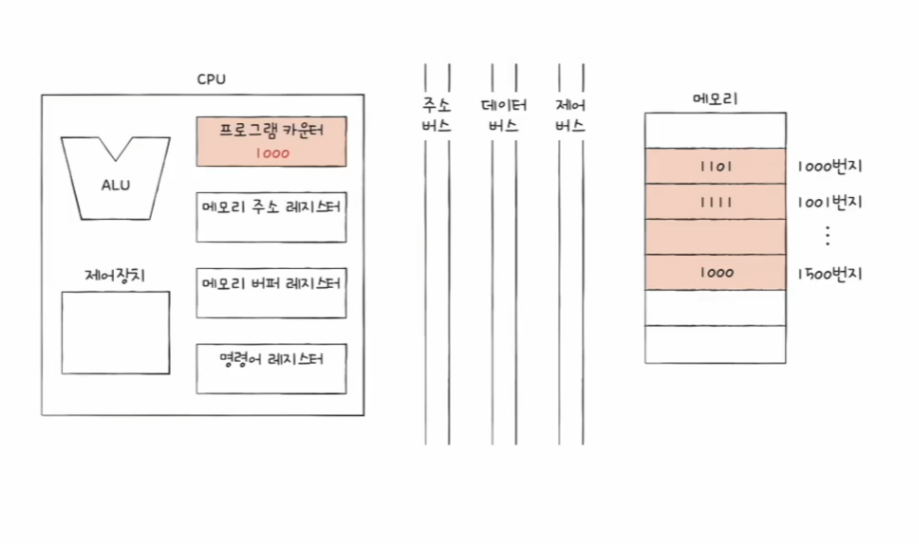
> 
> 2. 1000번지를 읽어들이기 위해서 주소 버스로 1000번지를 내보내야 하고, 이를 위해 **메모리 주소 레지스터**에는 1000이 저장된다.
> 
> 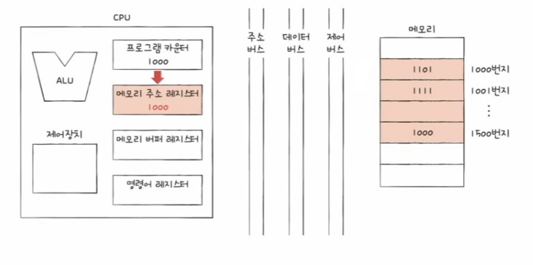
> 
> 3. 메모리 읽기 제어 신호와 메모리 주소 레지스터값이 각각 제어 버스와 주소 버스를 통해 메모리로 보내진다.
> 
> 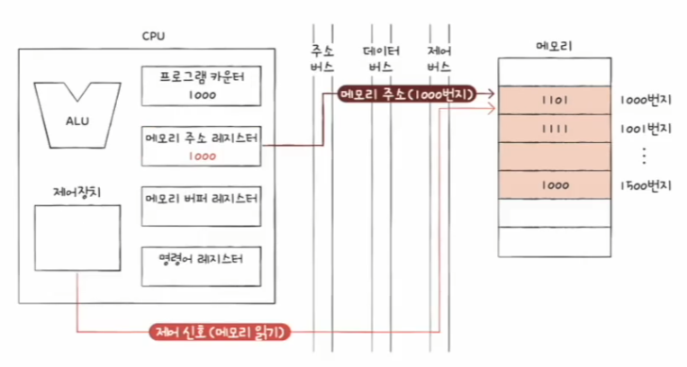
> 
> 4. 메모리 1000번지에 저장된 값은 데이터 버스를 통해 **메모리 버퍼 레지스터**로 전달되고, **프로그램 카운터는 증가**되어 다음 명령어를 읽어 들을 준비를 한다.
> 
> 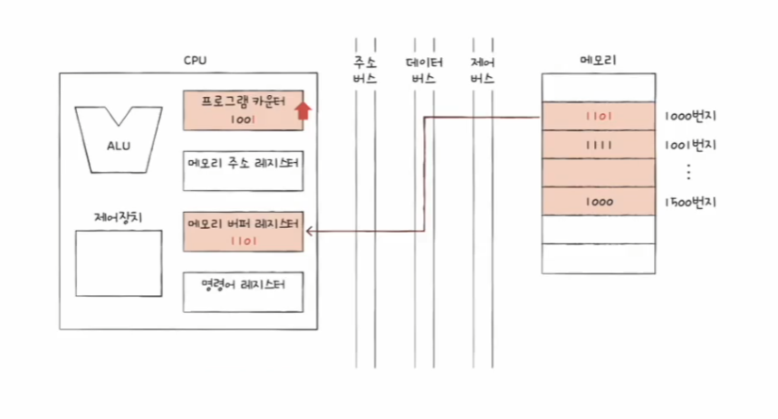
> 
> 5. 메모리 버퍼 레지스터에 저장된 값은 **명령어 레지스터**로 이동한다.
> 
> 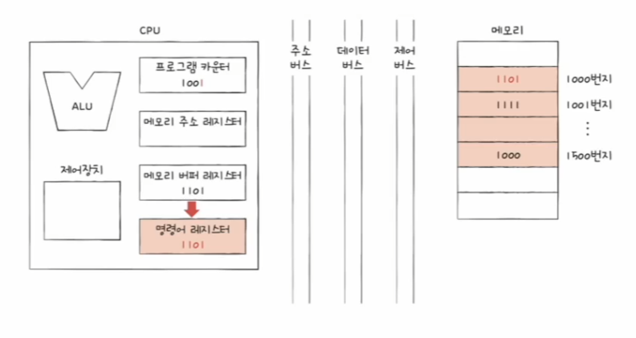
> 
> 6. 제어장치는 명령어 레지스터의 명령어를 해석하고 제어 신호를 발생시킨다.

### 플래그 레지스터

- ALU 연산 결과 또는 CPU 상태에 대한 부가적인 정보를 저장하는 레지스터

### 범용 레지스터

- 이름 그대로 다양하고 일반적인 상황에서 자유롭게 사용할 수 있는 레지스터
- 데이터와 주소를 모두 저장할 수 있으며, 일반적으로 CPU 안에는 여러 개의 범용 레지스터들이 있다.

---

## 특정 레지스터를 이용한 주소 지정 방식

- 위에서 설명한 프로그램 카운터, 그리고 스택 포인터와 베이스 레지스터는 주소 지정 방식에 사용될 수 있는 특별한 레지스터이다.

### 스택 주소 지정 방식

- **스택 주소 지정 방식**은 스택과 스택 포인터를 이용한 주소 지정 방식으로, **스택 포인터**란 스택의 꼭대기를 나타내는 레지스터이다. 즉, 스택 포인터는
    스택에 마지막으로 저장한 값의 위치를 저장하는 레지스터이다.
- 예를 들어 스택 포인터에 4번지가 저장되어 있다면 스택은 4번지까지 데이터가 채워져 있다는 것이다.

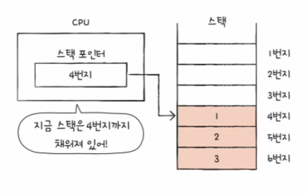

- 스택은 메모리 안에 있다. 정확히는 메모리 안에 스택처럼 사용할 영역이 정해져 있고, 이를 **스택 영역**이라고 한다.
- 이 영역은 다른 주소 공간과는 다르게 스택처럼 사용하기로 암묵적으로 약속된 영역이다.

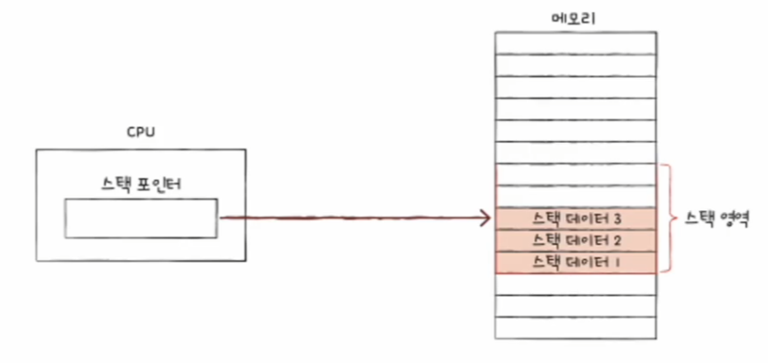

### 변위 주소 지정 방식

- 명령어는 연산 코드와 오퍼랜드로 이루어져 있고, 오퍼랜드 필드에는 거의 메모리의 주소가 담긴다.
- **변위 주소 지정 방식**은 오퍼랜드 필드의 값(변위)과 특정 레지스터의 값을 더하여 유효 주소를 얻어내는 주소 지정 방식이다.

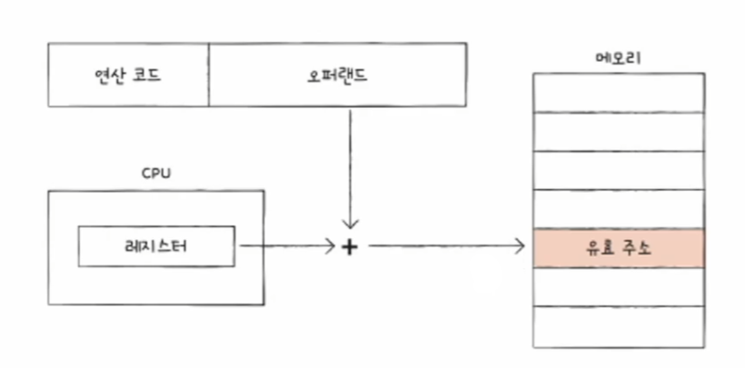

- 변위 주소 지정 방식을 사용하는 명령어는 다음과 같이 연산 코드 필드, 어떤 레지스터의 값과 더할지를 나타내는 레지스터 필드, 주소를 담고 있는 오퍼랜드 필드가 있다.

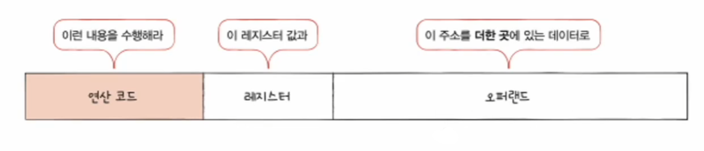

이때 오퍼랜드 필드의 주소와 어떤 레지스터를 더하는지에 따라 **상대 주소 지정 방식**, **베이스 레지스터 주소 지정 방식** 등으로 나뉜다.

**상대 주소 지정 방식**

- **상대 주소 지정 방식**은 오퍼랜드와 프로그램 카운터의 값을 더하여 유효 주소를 얻는 방식이다.
- 프로그램 카운터에는 읽어 들일 명령어의 주소가 저장되어 있다. 오퍼랜드 필드의 값이 음수, 양수에 따라 실행하려는 명령어의 이전 또는 이후 번지 명령어를 실행한다.

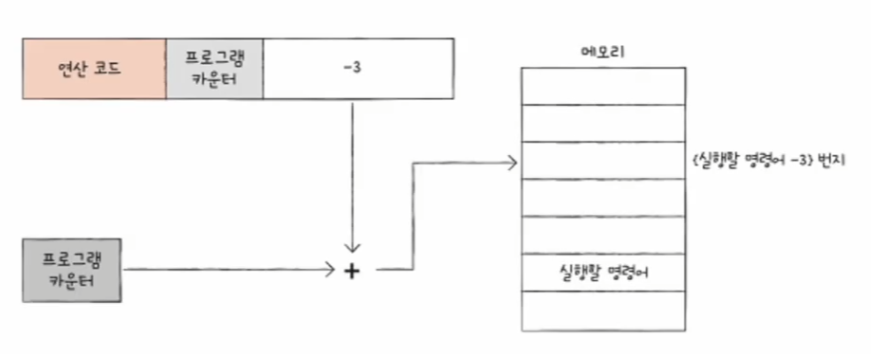

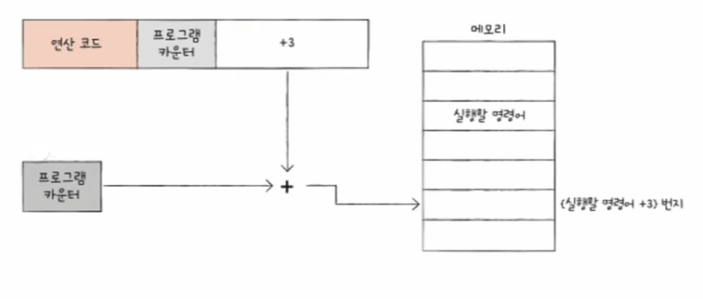

**베이스 레지스터 주소 지정 방식**

- **베이스 레지스터 주소 지정 방식**은 오퍼랜드와 베이스 레지스터의 값을 더하여 유효 주소를 얻는 방식이다.
- 베이스 레지스터는 기준 주소, 오퍼랜드는 기준 주소로부터 떨어진 거리로서의 역할을 한다.
- 즉, 이 방식은 베이스 레지스터 속 기준 주소로부터 얼마나 떨어져 있는 주소에 접근할 것인지를 연산하여 유효 주소를 얻어내는 방식이다.

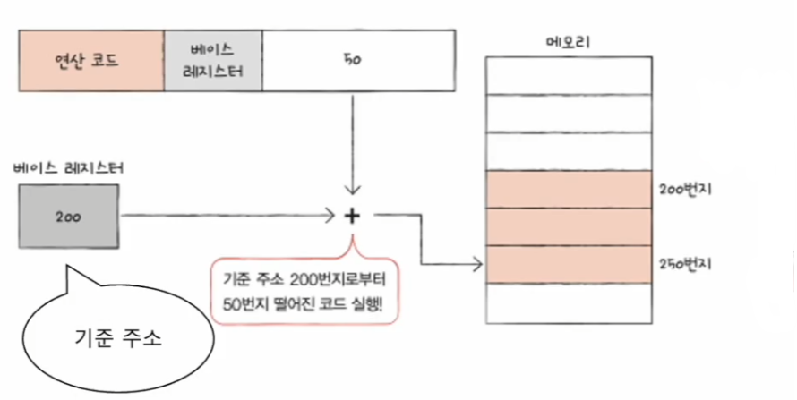

---

[이전 ↩️ - 컴퓨터 구조(CPU 작동 원리) - ALU와 레지스터]()

[메인 ⏫](https://github.com/genesis12345678/TIL/blob/main/cs/Main.md)

[다음 ↪️ - 컴퓨터 구조(CPU 작동 원리) - 명령어 사이클과 인터럽트]()