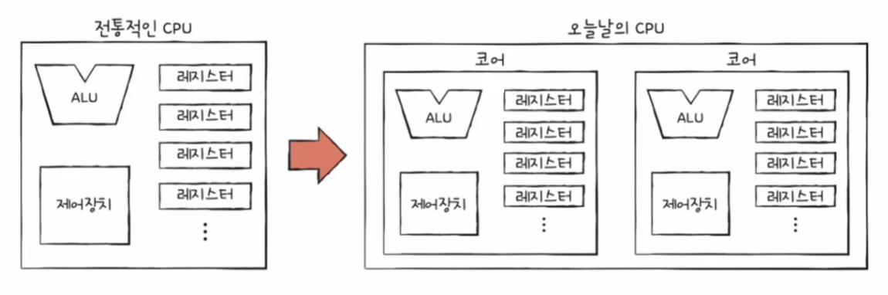
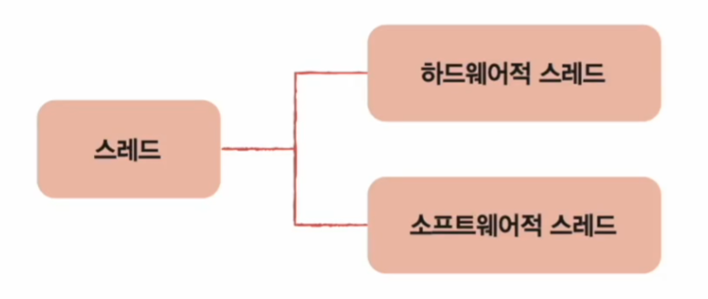
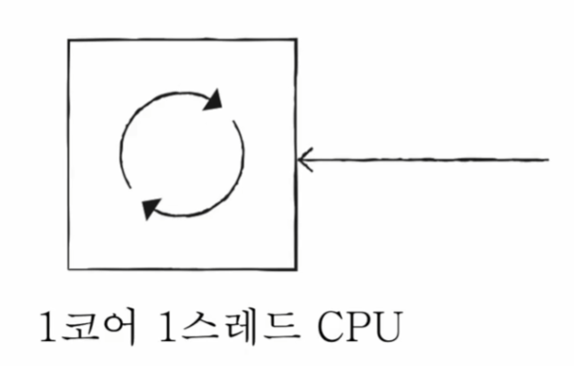
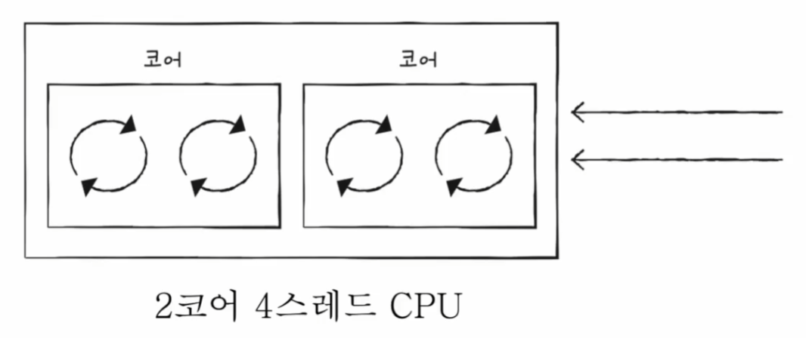
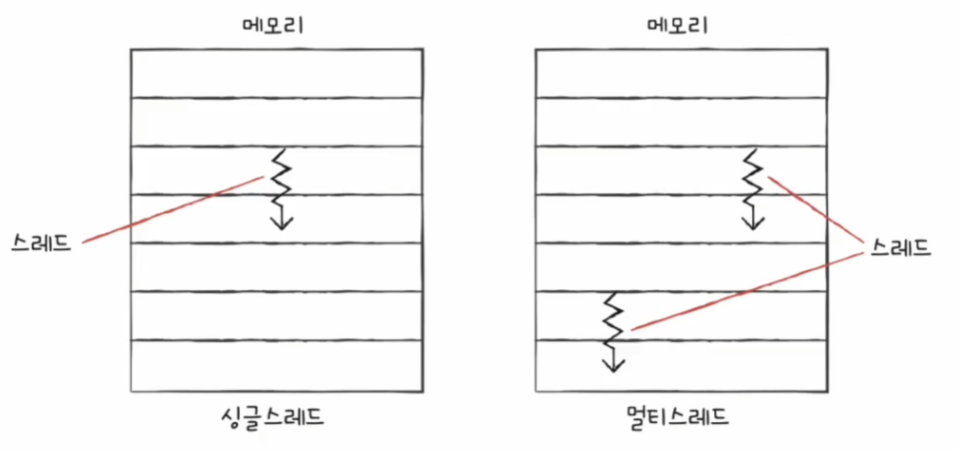
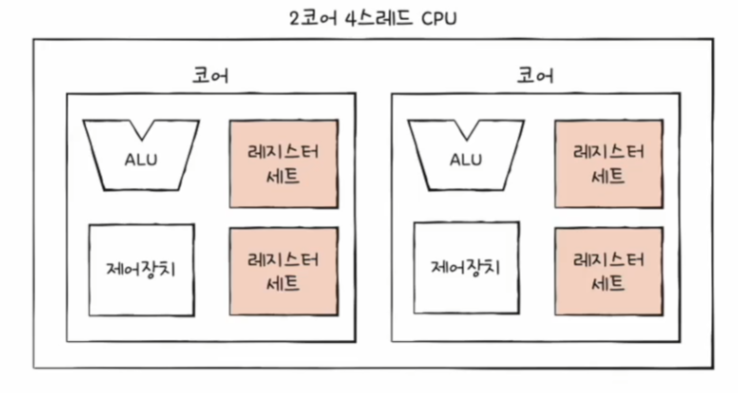
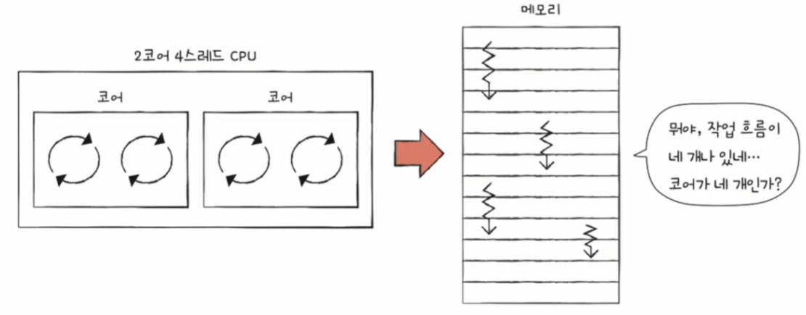

# 컴퓨터 구조와 운영체제

# CPU의 성능 향상 기법 - 빠른 CPU를 위한 설계 기법

## 클럭

조금이라도 더 빠른 CPU를 만들려면 어떻게 CPU를 설계하면 될까?

- 컴퓨터 부품들은 클럭 신호에 맞춰 일사불란하게 움직인다.
- CPU는 명령어 사이클이라는 정해진 흐름에 맞춰 명령어들을 실행한다.

위 두 문장을 보면 클럭 속도가 높아지면 CPU는 명령어 사이클을 더 빠르게 반복할 것이고, 다른 부품들도 더 빠르게 작동할 것이다.

실제로 헤르츠(Hz, 1초에 클럭이 몇번 반복되는지) 단위로 측정되는 클럭 속도는 CPU 속도 단위로 간주되기도 한다. 

> **오버클럭킹** : 클럭 속도는 일정하지 않고 유연하게 속도를 조절한다. 최대 클럭 속도를 강제로 더 끌어올리는 기법을 말한다.

- **그렇다면 클럭 신호만 마냥 높이면 CPU가 빨라지는 것일까?**
- 그렇지 않다. CPU는 발열에 약하기 때문에 클럭 속도만 무작정 높이면 발열 문제가 심각해진다.

클럭 속도를 높이는 방법 외에 CPU의 성능을 높이는 방법에 대해 알아보자.

### 코어와 멀티코어

- CPU의 성능을 높이는 방법 중 하나는 **코어**를 늘리는 방법이 있다.
- 기술이 발전함에 따라 CPU는 단순히 **명령어를 실행하는 부품**에서 **명령어를 실행하는 부품을 여러 개 포함하는 부품**으로 확장되었다.

- 코어를 여러 개 포함하고 있는 CPU를 **멀티코어 CPU** 또는 **멀티코어 프로세서**라고 부른다. CPU 내에 명령어를 처리하는 일꾼이 여러 명 있는 것과 같다.
- 하지만 코어 수에 비례해서 무조건 연산 속도가 증가하지는 않는다. 또한 처리하고자 하는 작업량보다 코어 수가 지나치게 많아도 전체 성능에는 큰 영향이 없다.
- 중요한 것은 **코어마다 처리할 명령어들을 적절하게 분배**하는 것이고 그에 따라서 연산 속도는 크게 달라질 수 있다.

### 스레드와 멀티스레드

- CPU의 성능을 높이는 방법 중 하나는 **스레드**를 늘리는 방법이 있다.
- 스레드의 사전적 의미는 "실행 흐름의 단위"이며, CPU에서 사용되는 스레드와 프로그래밍에서 사용되는 스레드는 차이가 있다.
- CPU에서 사용되는 **하드웨어적 스레드**가 있고, 프로그램에서 사용되는 **소프트웨어적 스레드**가 있다.

#### 하드웨어적 스레드

- 스레드를 하드웨어적으로 정의하면 **하나의 코어가 동시에 처리하는 명령어 단위**를 의미한다.
- 다음은 한 번에 하나씩 명령어를 실행하는 CPU인 1코어 1스레드 CPU다.

- 다음과 같이 여러 스레드를 지원하는 CPU는 하나의 코어로도 여러 개의 명령어를 동시에 실행할 수 있다.

- 이처럼 하나의 코어로 여러 명령어를 동시에 처리하는 CPU를 **멀티스레드 프로세서** 또는 **멀티스레드 CPU** 라고 한다.
- 예를 들어 8코어 16스레드 같은 경우, 명령어를 실행하는 부품을 8개 포함하고, 한 번에 16개의 명령어를 처리할 수 있는 CPU를 의미한다. 코어 하나당 2개의 
    하드웨어 스레드를 처리한다는 뜻과 같다.

#### 소프트웨어적 스레드

- 스레드를 소프트웨어적으로 정의하면 **하나의 프로그램에서 독립적으로 실행되는 단위**를 의미한다.
- 하나의 프로그램은 실행되는 과정에서 한 부분만 실행될 수도 있고, 프로그램의 여러 부분이 동시에 실행될 수도 있다.

> **정리**
> 
> - **하드웨어적 스레드** : 하나의 코어가 동시에 처리하는 명령어 단위
> - **소프트웨어적 스레드** : 하나의 프로그램에서 독립적으로 실행되는 단위
> - **한 번에 하나씩 명령어를 처리하는 1코어 1스레드 CPU도 여러 개의 소프트웨어적 스레드를 실행할 수 있다.**

### 멀티스레드 프로세서

- 소프트웨어적 스레드를 **스레드**, 하드웨어적 스레드를 **하드웨어 스레드**라고 해보자.
- **멀티스레드 프로세서**는 하나의 코어로 여러 개의 명령어를 동시에 처리하는 CPU이다. 어떻게 처리하는 것일까?
  - 실제로는 매우 복잡하지만, 가장 큰 핵심은 레지스터이다. 하나의 코어로 여러 명령어를 동시에 처리하도록 만들려면 하나의 명령어를 처리하기 위해 꼭 필요한 레지스터를 여러 개 가지고 있으면 된다.
    - 프로그램 카운터, 스택 포인터, 메모리 버퍼 레지스터, 메모리 주소 레지스터 등

- 레지스터 세트가 한 개인 CPU는 한 개의 명령어를 처리하기 위한 정보들을 기억할 것이고, 레지스터 세트가 두 개인 CPU는 두 개의 명령어를 처리하기 위한 정보들을
    기억할 수 있다.
- 메모리 속 프로그램 입장에서 하드웨어 스레드는 한 번에 하나의 명령어를 처리하는 CPU나 다름없다. 
- 예를 들어 2코어 4스레드 CPU는 한 번에 네 개의 명령어를 처리할 수 있는데, 프로그램 입장에서는 한 번에 하나의 명령어를 처리하는 CPU가 네 개 있는 것처럼 보인다.
- 그래서 하드웨어 스레드를 **논리 프로세서**라고도 부른다.

---

> **정리**
> 
> - **코어** : 명령어를 실행할 수 있는 하드웨어 부품
> - **스레드** : 명령어를 실행하는 단위
> - **멀티코어 프로세서** : 명령어를 실행할 수 있는 하드웨어 부품이 CPU 안에 두 개 이상 있는 CPU
> - **멀티스레드** 프로세서 : 하나의 코어로 여러 개의 명령어를 동시에 실행할 수 있는 CPU

---

[이전 ↩️ - 컴퓨터 구조(CPU 작동 원리) - 명령어 사이클과 인터럽트](https://github.com/genesis12345678/TIL/blob/main/cs/cpu/Interrupt.md)

[메인 ⏫](https://github.com/genesis12345678/TIL/blob/main/cs/Main.md)

[다음 ↪️ - 컴퓨터 구조(CPU의 성능 향상 기법) - 명령어 병렬 처리 기법](https://github.com/genesis12345678/TIL/blob/main/cs/cpu/Parallelism.md)