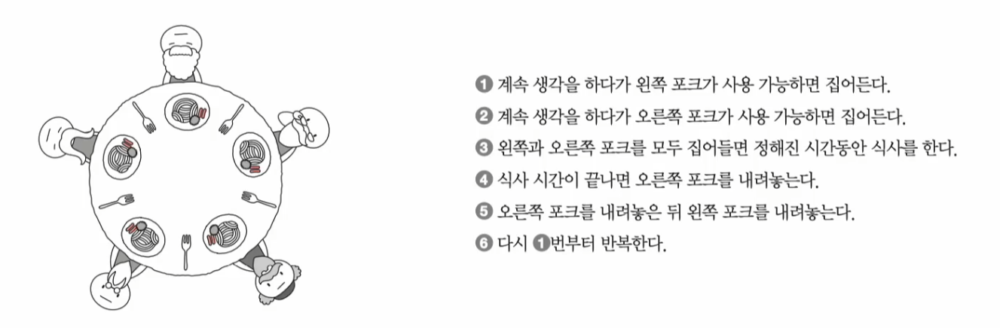
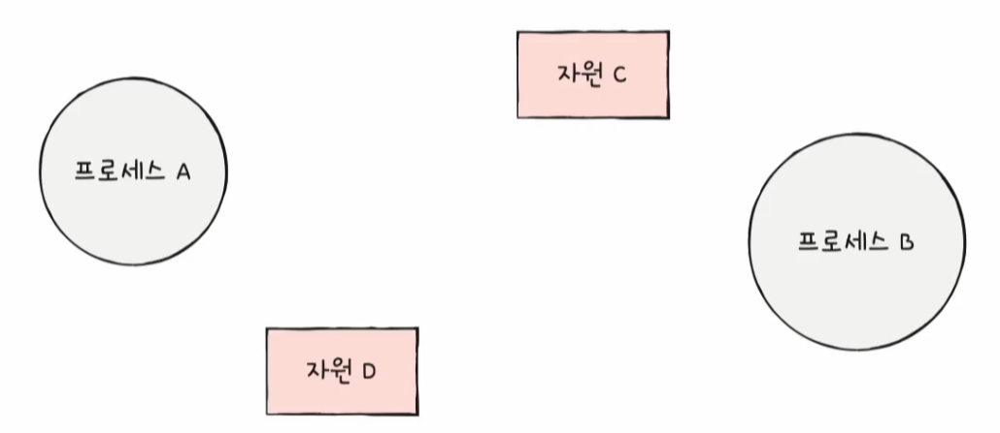
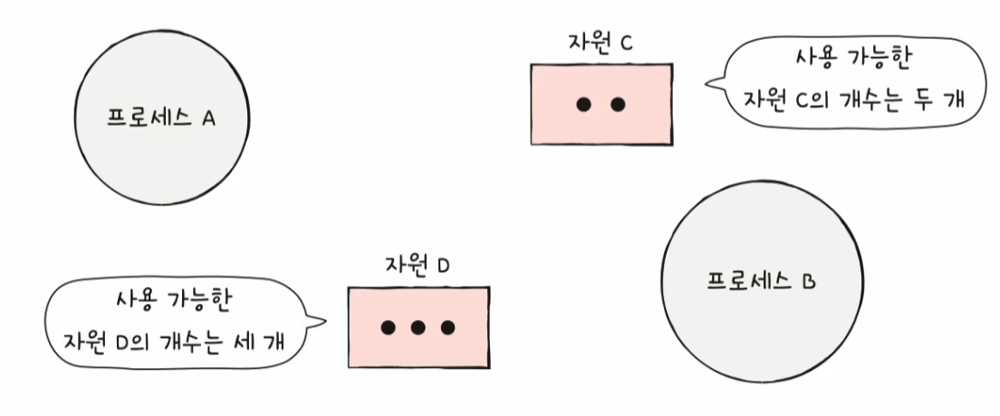
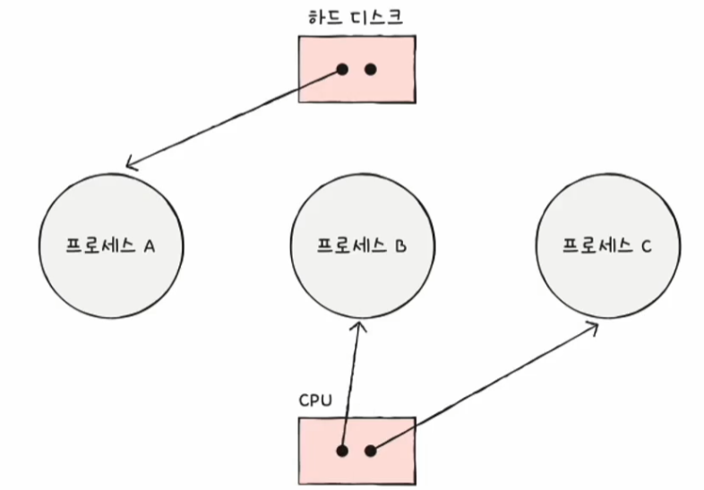
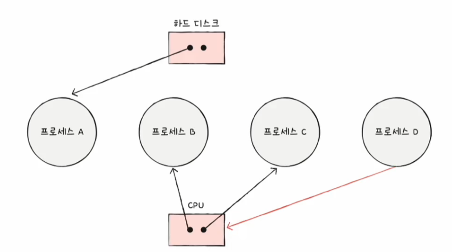
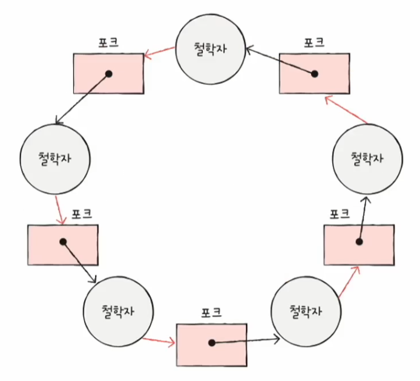

# 컴퓨터 구조와 운영체제

# 운영체제 - 교착 상태

## 교착 상태란

### 식사하는 철학자 문제

- **식사하는 철학자 문제**는 교착 상태를 설명하는 대표적인 예시다.
- 다섯 명의 철학자가 식사를 하기 위해서는 반드시 두 개의 포크를 사용해야 한다는 것을 가정한다.
- 그리고 다음과 같은 순서로 식사를 한다.

- 한두 명의 철학자가 식사할 때는 아무런 문제가 없지만, 모든 철학자가 동시에 포크를 집어 식사를 하면 어떤 철학자도 식사를 할 수 없고 영원히 생각만 하는 상황이 발생한다.
- 모든 철학자가 왼쪽 포크를 집어들면 모든 철학자는 다른 철학자가 포크를 내려놓을 때까지 기다리게 된다.
- 이렇게 일어나지 않을 사건을 기다리며 진행이 멈춰 버리는 현상을 **교착 상태**라고 한다.
- 위 문제에서 철학자는 프로세스 또는 스레드, 생각하는 행위는 자원을 기다리는 것이다. 그리고 포크는 임계 구역이라 볼 수 있다.

---

## 자원 할당 그래프

- 자원 할당 그래프는 교착 상태를 단순하게 표현할 수 있는 간단한 그래프로, 어떤 프로세스가 어떤 자원을 사용하고 어떤 자원을 기다리고 있는지를 표현한다.
- 자원 할당 그래프는 다음과 같은 규칙으로 그려진다.

### 1. 프로세스는 원으로, 자원의 종류는 사각형으로 표현한다.

### 2. 사용할 수 있는 자원의 개수는 자원 사각형 내에 점으로 표현한다.

### 3. 프로세스가 어떤 자원을 할당받아 사용 중이라면 자원에서 프로세스를 향해 화살표를 표시한다.

프로세스가 자원 이용을 끝내고 운영체제에 자원을 반납하면 화살표는 삭제된다.

### 4. 프로세스가 어떤 자원을 기다리고 있다면 프로세스에서 자원으로 화살표를 표시한다.

위에서 본 식사하는 철학자 문제를 자원 할당 그래프로 표현하면 다음과 같다.

---

## 교착 상태 발생 조건

- 교착 상태는 다음 조건 중 하나라도 만족하지 않는다면 교착 상태가 발생하지 않지만, 조건이 모두 만족될 때 교착 상태가 발생할 가능성이 생긴다.

### 1. 상호 배제

- 교착 상태가 발생하는 근본적인 원인은 해당 자원을 하나의 프로세스만 이용 가능했기 때문이다.
- 식사하는 철학자 문제에서 하나의 포크를 여러 명이 동시에 사용할 수 있다면 교착 상태는 발생하지 않는다.
- 프로세스도 마찬가지로 한 프로세스가 사용하는 자원을 다른 프로세스가 사용할 수 없을 때, 즉 **상호 배제** 상황에서 교착 상태가 발생할 수 있다.

### 2. 점유와 대기

- 식사하는 철학자 문제에서 왼쪽 포크를 들고 다른 철학자의 포크를 기다렸기 때문에 누구도 식사를 할 수 없었다.
- 즉 자원을 보유한 채 다른 자원을 기다렸기 때문에 문제가 발생한 것이다.
- 프로세스도 마찬가지로 어떤 자원을 할당받은 상태에서 다른 자원을 할당받기를 기다린다면 교착 상태가 발생할 수 있고, 이를 **점유와 대기**라고 한다.

### 3. 비선점

- 식사하는 철학자 문제에서 누군가가 다른 철학자의 포크를 강제로 빼앗을 수 있었다면 교착 상태는 발생하지 않는다.
- **비선점** 자원은 그 자원을 이용하는 프로세스의 작업이 끝나야만 이용할 수 있다.
- 즉 어떤 프로세스도 다른 프로세스의 자원을 강제로 빼앗지 못했기 때문에 교착 상태가 발생한 것이다.

### 4. 원형 대기

- 자원 할당 그래프가 원의 형태로 그려지면 교착 상태가 발생할 수 있다.
- 자원 할당 그래프가 원의 형태를 띄지 않는다면 교착 상태는 발생하지 않지만, 원의 형태를 띈다고 해서 반드시 교착 상태가 발생하는 것은 아니다.

---

[이전 ↩️ - 운영체제(프로세스 동기화) - 동기화 기법](https://github.com/genesis12345678/TIL/blob/main/cs/sync/SyncWay.md)

[메인 ⏫](https://github.com/genesis12345678/TIL/blob/main/cs/Main.md)

[다음 ↪️ - 운영체제(교착 상태) - 교착 상태 해결 방법](https://github.com/genesis12345678/TIL/blob/main/cs/deadlock/DeadlockSolve.md)