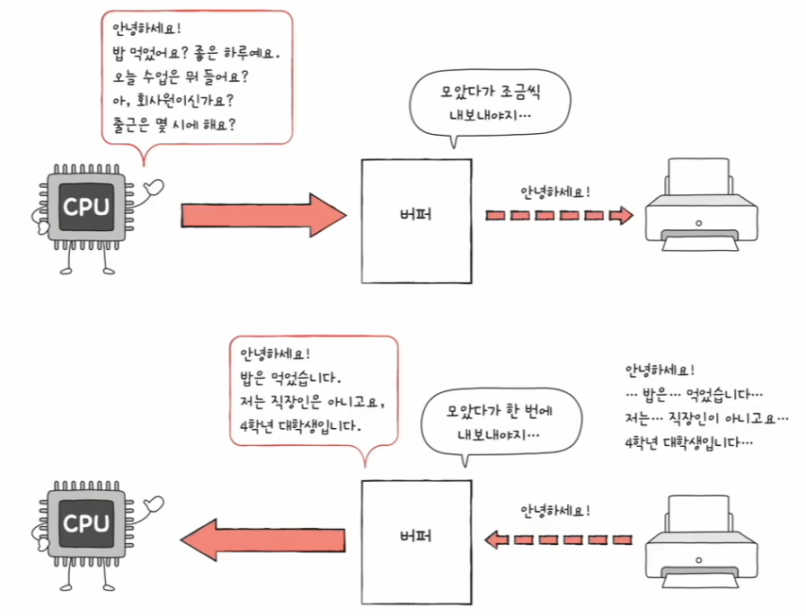
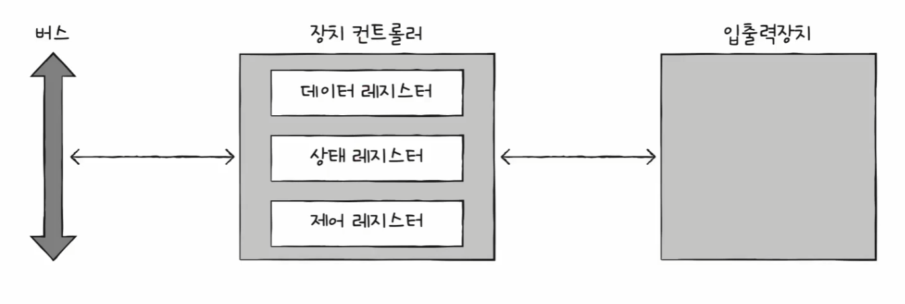
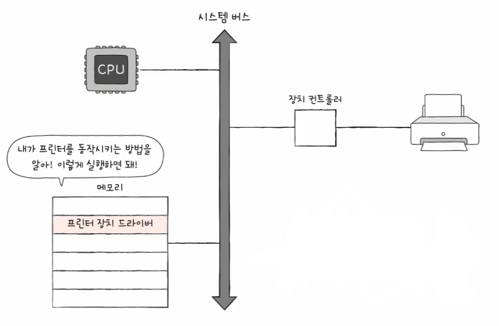

# 컴퓨터 구조와 운영체제

# 입출력장치 - 장치 컨트롤러와 장치 드라이버

## 장치 컨트롤러

- 입출력장치는 다음과 같은 이유로 CPU, 메모리보다 다루기 어렵다.
  - **입출력장치에는 종류가 너무 많다.**
    - 다양한 입출력장치와 정보를 주고받는 방식을 규격화하기 어렵다.
  - **일반적으로 CPU와 메모리의 데이터 전송률은 높지만 입출력장치의 전송률은 낮다.**
    - **전송률** : 데이터를 얼마나 빨리 교환할 수 있는지를 나타내는 지표
- 이와 같은 이유로 입출력장치는 컴퓨터에 직접 연결되지 않고 **장치 컨트롤러**라는 하드웨어를 통해 연결된다.
- 모든 입출력장치는 각자의 장치 컨트롤러를 통해 컴퓨터 내부와 정보를 주고받고, 장치 컨트롤러는 하나 이상의 입출력장치와 연결되어 있다.
- 입출력장치 종류가 많아 정보 규격화가 어려웠던 문제는 장치 컨트롤러가 일종의 번역가 역할을 함으로써 해결한다. 그 과정에서 장치 컨트롤러는 자신과 연결된
    입출력장치에 문제는 없는지 오류를 검출하기도 한다.
- 또한 장치 컨트롤러는 **데이터 버퍼링**이라는 기능이 있다.
  - **버퍼링** : 전송률이 높은 장치와 낮은 장치 사이에 주고받는 데이터를 **버퍼**라는 임시 저장 공간에 저장하여 전송률을 비슷하게 맞추는 방법
- 즉, 버퍼링은 버퍼에 데이터를 조금씩 모았다가 한꺼번에 내보내거나 데이터를 한 번에 많이 받아 조금씩 내보내는 방법이다.
- 장치 컨트롤러는 일반적으로 전송률이 높은 CPU와 일반적으로 전송률이 낮은 입출력장치와의 전송률 차이를 데이터 버퍼링으로 완화한다.

### 장치 컨트롤러 간단 내부 구조

- **데이터 레지스터**
  - CPU와 입출력장치 사이에 주고받을 데이터가 담기는 레지스터(버퍼 역할)
  - 최근에는 레지스터 대신 RAM을 사용하기도 한다.
- **상태 레지스터**
  - 입출력장치가 입출력 작업을 할 준비가 되었는지, 입출력 작업이 완료되었는지, 입출력장치에 오류는 없는지 등의 상태 정보를 저장한다.
- **제어 레지스터**
  - 입출력 장치가 수행할 내용에 대한 제어 정보와 명령을 저장한다.

이 레지스터에 담긴 값들은 버스를 타고 CPU나 다른 입출력장치로 전달되기도 하고, 장치 컨트롤러에 연결된 입출력장치로 전달된다.

---

## 장치 드라이버

- 새로운 장치를 컴퓨터에 연결하려면 장치 드라이버를 설치해야 한다.
- **장치 드라이버**는 장치 컨트롤러의 동작을 감지하고 제어함으로써 장치 컨트롤러가 컴퓨터 내부와 정보를 주고받을 수 있게 하는 프로그램이다.
- 프로그램이기에 당연히 실행 과정에서 메모리에 저장된다.
- 즉, 장치 컨트롤러가 입출력 장치를 연결하기 위한 하드웨어적인 통로라면, 장치 드라이버는 입출력 장치를 연결하기 위한 소프트웨어적인 통로이다.

- 컴퓨터(운영 체제)가 연결된 장치의 드라이버를 인식하고 실행할 수 있다면 그 장치는 컴퓨터 내부와 정보를 주고받을 수 있고,  
    반대로 장치 드라이버를 인식하거나 실행할 수 없다면 그 장치는 컴퓨터 내부와 정보를 주고받을 수 없다.

---

[이전 ↩️ - 컴퓨터 구조(보조기억장치) - RAID](https://github.com/genesis12345678/TIL/blob/main/cs/ssd/RAID.md)

[메인 ⏫](https://github.com/genesis12345678/TIL/blob/main/cs/Main.md)

[다음 ↪️ - 컴퓨터 구조(입출력장치) - 다양한 입출력방법]()