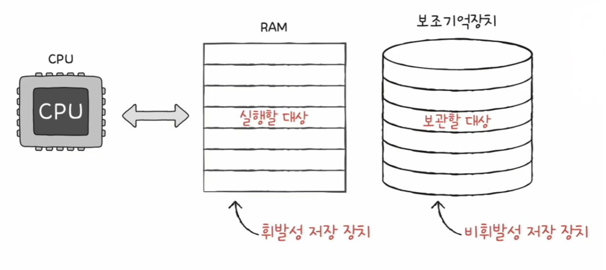
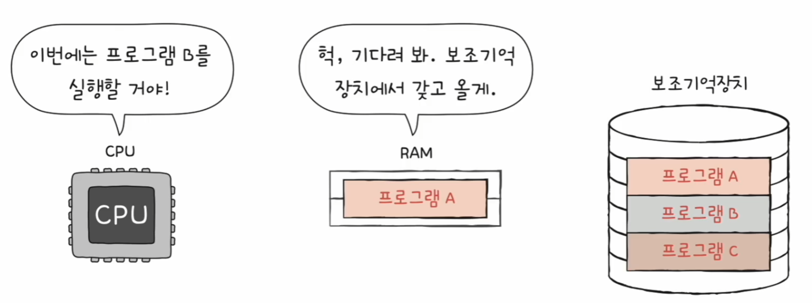
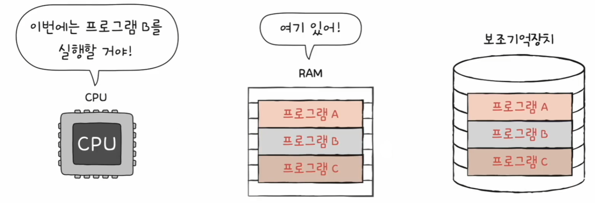
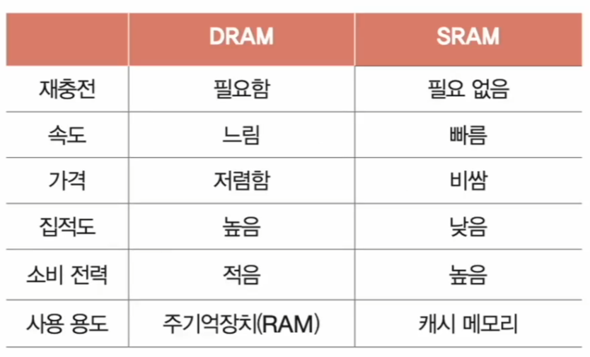
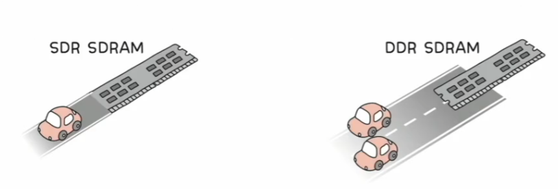

# 컴퓨터 구조와 운영체제

# 메모리와 캐시 메모리 - RAM 특징과 종류

## RAM의 특징

- RAM은 **실행할 프로그램의 명령어와 데이터**가 저장된다.
- RAM은 **휘발성 저장 장치**로 전원을 끄면 RAM에 저장된 내용이 사라진다. 반면 전원이 꺼져도 저장된 내용이 유지되는 저장 장치를 **비휘발성 저장 장치**라고 한다.(하드 디스크, SSD, USB 메모리 등)
- 비휘발성 저장 장치인 보조기억장치는 전원을 꺼도 내용을 유지하지만, CPU는 보조기억장치에 직접 접근하지 못한다.
- 그래서 일반적으로 보조기억장치인 비휘발성 저장 장치에 **보관할 대상**을 저장하고, 휘발성 저장 장치인 RAM에는 **실행할 대상**을 저장한다.
- CPU가 실행하고 싶은 프로그램이 보조기억장치에 있다면 이를 RAM으로 복사하여 저장한 뒤 실행한다.

---

## RAM의 용량과 성능

CPU가 실행하고 싶은 프로그램이 보조기억장치에 있다면 이를 RAM으로 가져올 때, RAM 용량이 적다면 보조기억장치에 실행할 프로그램을 가져오는 일이 잦아 실행 시간이 길어진다.

- RAM 용량이 적은 경우
  - 새로운 프로그램을 시작할 때마다 보조기억장치에서 RAM으로 가져와야 한다.

- RAM 용량이 충분히 큰 경우
  - 프로그램이 모두 RAM에 있어 보조기억장치에 접근하는 수고를 덜 수 있다.

- CPU가 실행할 프로그램을 책, 보조기억장치는 책이 꽂혀 있는 책장, RAM은 책을 읽는 책상과 같다.
- 책상이 크다면 여러 권을 동시에 가져와 책을 가지고 오는 시간을 절약할 수 있다.
- 이처럼 RAM 용량이 크면 많은 프로그램들을 동시에 빠르게 실행하는 데 유리하다.

---

## RAM의 종류

### DRAM

- **Dynamic** RAM, 저장된 데이터가 동적으로 사라지는 RAM을 의미
- **DRAM**은 시간이 지나면 저장된 데이터가 점차 사라진다. 그렇기 때문에 데이터의 소멸을 막기 위해 일정 주기로 데이터를 재활성화(다시 저장)해야 한다.
- 단점이 많은 것 같은 **DRAM**은 소비 전력이 비교적 낮고, 저렴하고, 직접도가 높아 대용량으로 설계하기 용이하기 때문에 일반적으로 메모리로써 사용하는 RAM이다.

### SRAM

- **Static** RAM, 저장된 데이터가 변하지 않는 RAM을 의미
- 시간이 지나면 점차 저장된 내용이 소실되는 DRAM과는 달리, **SRAM**은 시간이 지나도 저장된 데이터가 사라지지 않는다.
  - (SRAM도 휘발성이기 때문에 전원을 끄면 사라진다.)
- 주기적으로 데이터를 재활성화할 필요가 없고, DRAM보다 일반적으로 속도도 더 빠르다.
- 하지만 **SRAM**은 DRAM보다 집적도가 낮고, 소비 전력도 크며, 가격도 더 비싸기 때문에 일반적으로 사용되는 RAM은 아니다.
- 대신 **SRAM**은 메모리가 아닌 대용량으로 만들어질 필요는 없지만 속도가 빨라야 하는 저장 장치, 주로 **캐시 메모리**에서 사용된다.

#### DRAM vs SRAM

### SDRAM

- **Synchronous** Dynamic RAM, 클럭 신호와 동기화된, 발전된 형태의 DRAM
- 클럭 신호과 동기화되었다는 말은 클럭 타이밍에 맞춰 CPU와 정보를 주고받을 수 있음을 의미한다.
- **SDRAM**은 클럭에 맞춰 동작하며 클럭마다 CPU와 정보를 주고받을 수 있는 DRAM이다.

### DDR SDRAM

- **Double Data Rate** SDRAM, 대역폭을 넓혀 속도를 빠르게 만든 SDRAM
- 최근 가장 흔히 사용되는 RAM이며, **대역폭**이란 데이터를 주고받는 길의 너비를 의미한다.
- 한 클럭에 하나씩 정보를 주고받을 수 있는 SDRAM과 비교했을 때 DDR SDRAM은 너비가 두 배인 도로와 같다.
- 당연히 DDR SDRAM의 전송 속도가 두 배 정도 빠르다. 이런 이유로 한 클럭당 하나씩 데이터를 주고받을 수 있는 SDRAM을 SDR SDRAM(Single Data Rate SDRAM)이라 부르기도 한다.

- [SDR] SDRAM ->(2배) DDR SDRAM ->(2배) DDR2 SDRAM ->(2배) DDR3 SDRAM ->(2배) DDR4 SDRAM
  - 최근에 흔히 사용하는 메모리는 DDR4 SDRAM으로 SDRAM보다 16배 넓은 대역폭을 가진다.

---

[이전 ↩️ - 컴퓨터 구조(CPU의 성능 향상 기법) - CISC & RISC]()

[메인 ⏫](https://github.com/genesis12345678/TIL/blob/main/cs/Main.md)

[다음 ↪️ - 컴퓨터 구조(메모리와 캐시 메모리) - 메모리의 주소 공간]()