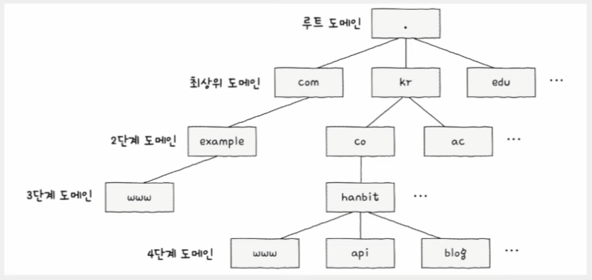
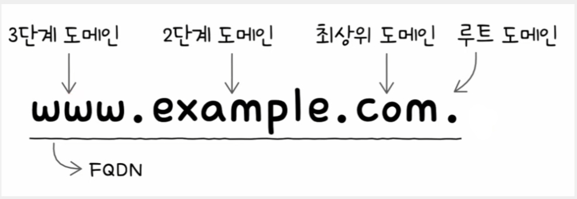
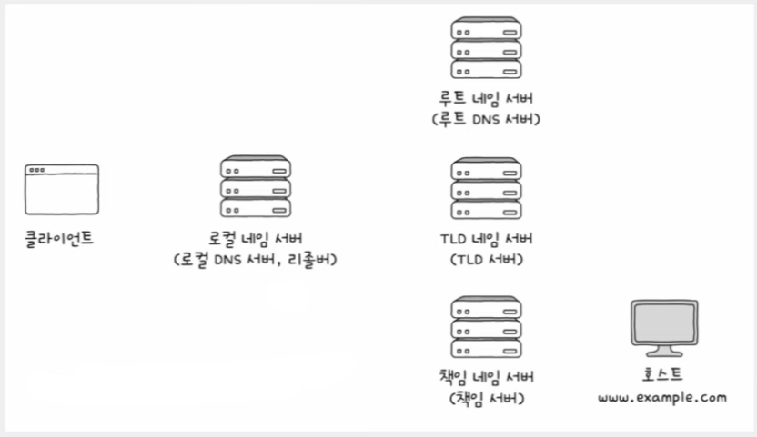
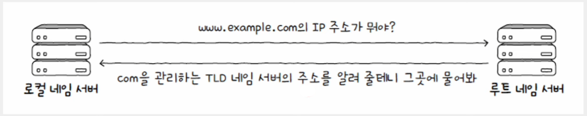
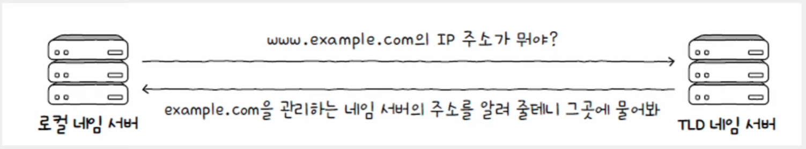
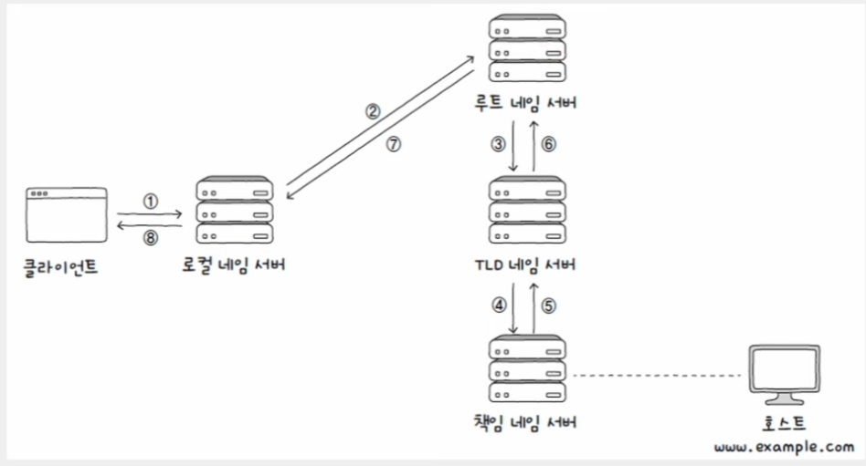
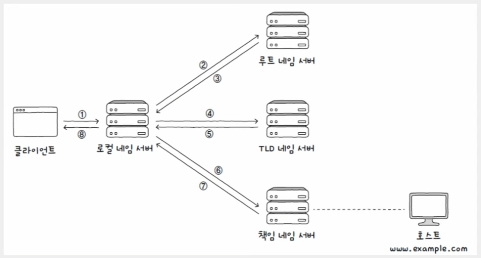
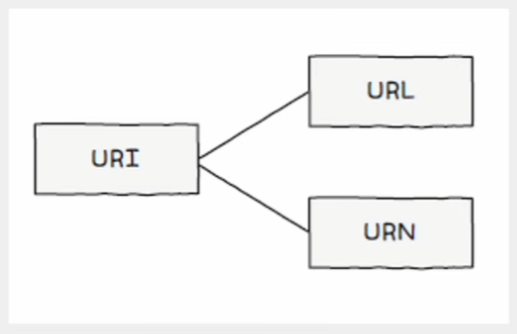
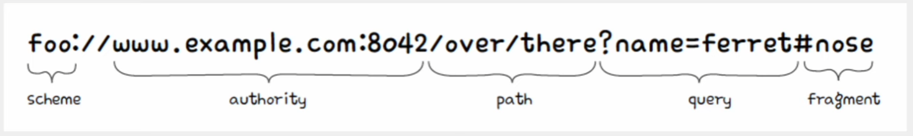

# 네트워크 - 응용 계층

## 도메인 네임과 네임 서버

- 네트워크상의 어떤 호스트를 특정하기 위해 IP 주소를 사용하지만, 이는 한계가 있다. 통신하고자 하는 모든 호스트의 IP 주소를 기억하고 있기도 어렵고, 호스트의 IP 주소는 언제든지 바뀔 수 있기 때문이다.
- 그래서 일반적으로 상대 호스트 특정을 위해 IP 주소보다는 **도메인 네임**을 많이 사용한다. 도메인 네임은 호스트의 IP 주소와 대응되는 문자열 형태의 호스트 특정 정보이다.
- 도메인 네임과 IP 주소는 **네임 서버**에서 관리되고 **DNS 서버**라고도 부른다.
- IP 주소가 바뀌더라도 바뀐 IP 주소에 도메인 네임을 다시 대응하면 되기 때문에 간편하다.

도메인 네임은 점(`.`)을 기준으로 계층적으로 분류된다. 최상단에 **루트 도메인**, 그 다음 단계인 **최상위 도메인(TLD, Top-Level Domain)**, 계속 그 다음 단계의
도메인이 있는 식이다.

`www.example.com` 처럼 전체 도메인 계층을 모두 포함하는 도메인 네임을 **전체 주소 도메인 네임(FQDN, Fully-Qualified Domain Name)** 이라고 한다.
`FQDN`까지 알면 비로소 하나의 호스트를 식별할 수 있게 된다.

- 계층적인 도메인 네임을 효율적으로 관리하기 위해 네임 서버 또한 계층적인 형태를 이룬다.
- 또한 네임 서버는 여러 개 존재하며 전 세계 여러 군데에 **분산되어** 위치해 있다.
- 이렇게 계층적이고 분산된 도메인 네임에 대한 관리 체계를 **도메인 네임 시스템(DNS)** 이라고 한다.

---

## 계층적 네임 서버

- **도메인 네임에 대응하는 IP 주소를 알아내는 과정**을 흔히 "도메인 네임을 풀이(resolve)한다(Resolving)"라고도 표현한다.
- 이 과정에서 다양한 네임 서버들이 사용되는데, 주요 네임 서버의 유형은 크게 네 가지가 있다.
  - 로컬 네임 서버
  - 루트 네임 서버
  - TLD(최상위 도메인) 네임 서버
  - 책임 네임 서버

### 로컬 네임 서버

- 클라이언트와 맞닿아 있는 네임 서버로, 클라이언트가 도메인 네임을 통해 IP 주소를 알아내고자 할 때 가장 먼저 찾게 되는 네임 서버이다.
- 클라이언트가 로컬 네임 서버를 찾기 위해 로컬 네임 서버의 주소를 알아야 한다. 그리고 로컬 네임 서버의 주소는 일반적으로 [ISP](https://namu.wiki/w/%EC%9D%B8%ED%84%B0%EB%84%B7%20%EC%84%9C%EB%B9%84%EC%8A%A4%20%EC%A0%9C%EA%B3%B5%EC%82%AC%EC%97%85%EC%9E%90)에서 할당해주는 경우가 많다.
- ISP 대신 **공개 DNS 서버**를 이용할 수도 있다.(구글의 `8.8.8.8`, `8.8.4.4` 등)

### 루트 네임 서버

- 로컬 네임 서버가 대응되는 IP 주소를 모를 경우 **루트 네임 서버**에게 해당 도메인 네임을 질의하게 된다.
- 루트 네임 서버는 루트 도메인을 관리하는 네임 서버로, 질의에 대해 TLD 네임 서버의 IP 주소를 반환할 수 있다.

### TLD 네임 서버

- TLD를 관리하는 네임 서버
- DNS 질의에 대해 TLD의 하위 도메인 네임을 관리하는 네임 서버 주소를 반환할 수 있다.
- 하위 도메인 네임을 관리하는 네임 서버는 그보다 하위 도메인 네임을 관리하는 네임 서버 주소를 반환할 수 있다.

### 책임 네임 서버

- 특정 도메인 영역을 관리하는 네임 서버로, 다른 네임 서버에게 떠넘기지 않고 곧바로 답할 수 있는 네임 서버를 의미한다.
- 즉, 책임 네임 서버는 로컬 네임 서버가 마지막으로 질의하는 네임 서버이다.
- 일반적으로 로컬 네임 서버는 책임 네임 서버로부터 원하는 IP 주소를 얻어낸다.

### 재귀적 질의

- 다음과 같이 순서대로 질의하고, 최종 응답 결과를 역순으로 전달하는 방식이다.

### 반복적 질의

- 네임 서버와 질의-응답 과정을 반복하여 최종 응답 결과를 클라이언트에게 전달하는 방식이다.

> **DNS 캐시**
> 
> - 위와 같은 도메인 네임 리졸빙 과정은 시간이 오래 걸리고 네트워크상의 메시지 수가 지나치게 늘어날 수 있다는 문제가 있다. (루트 네임 서버에 과부하가 우려된다.)
> - 그래서 실제로는 네임 서버들이 기존에 응답받은 결과를 임시로 저장했다가 추후 같은 질의에 이를 활용하는 **DNS 캐시**를 사용하는 경우가 많다.
> - DNS 캐시를 저장하는 용도로만 사용되는 서버도 있다.
> - DNS 캐시에 임시 저장된 값은 TTL 값과 함께 저장된다.

---

## 자원을 식별하는 URI

- 위의 설명이 클라이언트가 메시지를 주고받고자 하는 **대상을 식별**하는 방법이었다면, 이번에는 송수신하고자 하는 **정보를 식별**하는 방법이다.
- 우선 **자원(resource)** 이란, 네트워크상의 메시지를 통해 주고받는 대상을 의미한다.
- 이는 HTML 파일, 이미지나 동영상 파일, 텍스트 파일이 될 수도 있다. 즉, 두 호스트가 네트워크를 통해 서로 정보를 주고받을 때, 송수신하는 대상이
자원인 것이다.

> 오늘날 인터넷 환경을 이루는 대부분의 통신은 **HTTP**를 기반으로 이루어지므로, 자원이라는 용어는 **HTTP 요청 메시지의 대상**이라고도 표현한다.

- 자원을 식별할 수 있는 정보를 **URI(Uniform Resource Identifier)** 라고 한다. 자원을 식별하는 통일된 방식인 것이다.
- URI에는 위치를 이용해 자원을 식별하는 **URL**, 이름을 이용해 자원을 식별하는 **URN**이 있다.

### URL (Uniform Resource Locator)

- **scheme**
  - URL의 첫 부분, 자원에 접근하는 방법을 의미한다.
  - 일반적으로 사용할 프로토콜이 명시된다.(http, https 등)
- **authority**
  - 호스트를 특정할 수 있는 정보
  - IP 주소 또는 도메인 네임이 명시된다.
  - 콜론(`:`) 뒤에 포트 번호를 덧붙일 수도 있다.
- **path**
  - 자원이 위치한 경로가 명시된다.
  - 자원의 위치는 슬래시(`/`)를 기준으로 계층적으로 표현되고, 최상위 경로 또한 슬래시로 표현된다.
- **query**
  - HTTP는 요청-응답 기반의 프로토콜로써 자원을 식별하기 위해 scheme, authority, path 외에 더 많은 정보가 필요할 수 있다.
  - 이럴 때 사용할 수 있는 것이 **쿼리 문자열**(또는 **쿼리 파라미터**)이다.
  - 쿼리 문자열은 물음표(`?`)로 시작되는 `<키=값>` 형태의 데이터로, 앰퍼샌드(`&`)를 사용하여 여러 쿼리 문자열을 연결할 수 있다.
  - 쿼리 문자열은 서버를 개발하는 개발자가 설계하기 나름이다.
- **fragment**
  - 자원의 한 조각을 가리키기 위한 정보
  - 주로 HTML 파일과 같은 자원에서 특정 부분을 가리키기 위해 사용된다.

### URN (Uniform Resource Name)

- **URL**은 위치를 기반으로 자원을 식별한다. 하지만 자원의 위치가 변경되면 기존 URL로는 자원을 식별할 수 없다는 고질적인 문제가 있다.
- 반면 URN은 자원에 고유한 이름을 붙이는 이름 기반 식별자이다. 따라서 **자원의 위치와 무관하게** 자원을 식별할 수 있다는 장점이 있다.
- URN은 아직 URL만큼 널리 채택된 방식은 아니다. 자원을 식별할 URI로는 URN보다는 URL이 더 많이 사용된다.

---

[이전 ↩️ - 전송 계층 - TCP의 오류,흐름,혼잡 제어](https://github.com/genesis12345678/TIL/blob/main/cs/network/transport_layer/TCP.md)

[메인 ⏫](https://github.com/genesis12345678/TIL/blob/main/cs/network/Main.md)

[다음 ↪️ - 응용 계층 - HTTP]()