# 네트워크 - 응용 계층

## HTTP의 특성

**HTTP(Hypertext Transfer Protocol)** 은 응용 계층에서 정보를 주고받는 데 사용되는 프로토콜로, 네 가지의 주요 특성이 있다.

### 1. 요청-응답 기반 프로토콜

- HTTP는 **클라이언트-구조** 기반의 **요청-응답 프로토콜**이다.
- HTTP는 클라이언트와 서버가 서로 HTTP 요청 메시지와 HTTP 응답 메시지를 주고받는 구조로 동작한다. 같은 HTTP 메시지일지라도 요청 메시지와 응답 메시지의
메시지 형태가 다르다.

### 2. 미디어 독립적 프로토콜

- HTTP는 주고받을 자원의 특성과 무관하게 그저 자원을 주고받을 수 있는 인터페이스 역할만을 수행한다. HTTP를 통해서 HTML, JPEG, PDF, JSON 등 다양한
종류의 자원을 주고받을 수 있다.
- HTTP에서 메시지를 주고받는 자원의 종류를 **미디어 타입**(또는 **MIME 타입**)이라고 한다.
- 즉, HTTP는 주고받을 **미디어 타입에 특별히 제한을 두지 않고** 독립적으로 동작하는 미디어 독립적 프로토콜이다.
- 미디어 타입은 기본적으로 슬래시(`/`)를 기준으로 **타입/서브타입** 형식으로 구성된다. **타입**은 데이터의 유형, **서브타입**은 주어진 타입에 대한 세부 유형을 나타낸다.
- 미디어 타입에는 부가적인 설명을 위해 선택적으로 매개변수를 포함할 수 있다.
  - `type/subtype;parameter=value` 형식으로 표현
  - 예: `type/html;charset=UTF-8`

> **자주 사용되는 미디어 타입 종류**
>
> 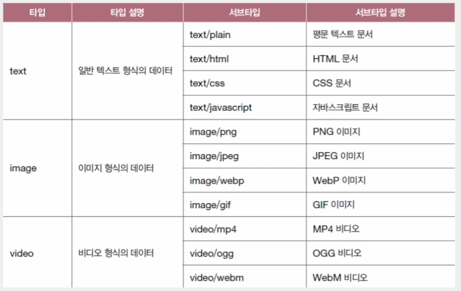
>
> 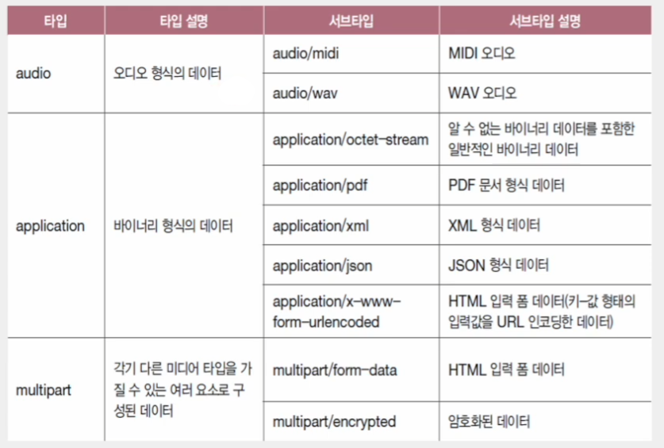

### 3. 스테이트리스 프로토콜

- HTTP는 상태를 유지하지 않는 **스테이트리스 프로토콜**이다. 서버가 HTTP 요청을 보낸 클라이언트와 관련된 상태를 기억하지 않는다는 의미이다.
- 즉, 클라이언트의 모든 HTTP 요청은 기본적으로 **독립적인 요청으로 간주된다.**
- 이러한 HTTP의 스테이트리스한 특징은 확장성과 견고함이라는 목표를 이루기 위해서다.
- 상태를 유지하지 않고 모든 요청을 독립적인 요청으로 처리하는 것은 특정 클라이언트가 특정 서버에 종속되지 않도록 하며, 서버의 추가나 문제 발생 시
대처가 용이하도록 한다.
- 즉, 스테이트리스한 특성은 언제든 쉽게 서버를 추가할 수 있기 때문에 **확장성**이 높고, 서버 중 하나에 문제가 생겨도 다른 서버로 대체가 가능하기 때문에
**견고성**이 높다.

### 4. 지속 연결 프로토콜

- HTTP 1.0 이하의 초기 HTTP 버전은 3-way handshake로 TCP 연결을 수립한 후, 요청에 대한 응답을 받으면 연결을 종료하고, 추가적인 요청-응답을 하기 위해서
다시 TCP 연결 수립 과정을 반복하는 방식으로 동작하는 **비지속 연결**을 사용했다.
- 최근 HTTP 1.1 이상의 HTTP 버전에서는 **지속 연결**(또는 **킵 얼라이브(Keep-alive)**)이라는 기술을 제공한다.
- 하나의 TCP 연결상에서 여러 개의 요청-응답을 주고받을 수 있는 기술이다.

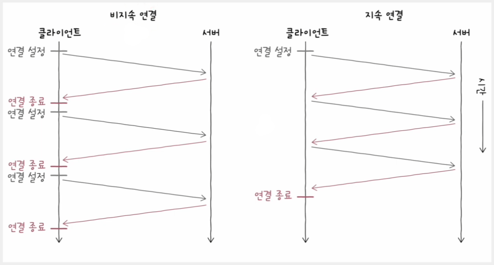

---

## HTTP 메시지 구조

### 시작 라인

- HTTP 메시지가 요청 메시지일 경우 시작 라인은 **요청 라인**이 되고, HTTP 메시지가 응답 메시지일 경우 시작 라인은 **상태 라인**이 된다.

**요청 라인**의 형식은 다음과 같다.

- **메서드**
  - 클라이언트가 서버의 자원에 대해 수행할 작업의 종류를 나타낸다.
  - `GET`, `POST`, `PUT`, `DELETE` 등
- **요청 대상**
  - HTTP 요청을 보낼 서버의 자원을 의미한다.
  - 보통 (쿼리가 포함된) URI의 경로가 명시된다.
- **HTTP 버전**
  - 사용된 HTTP 버전을 의미한다.

**상태 라인**의 형식은 다음과 같다.

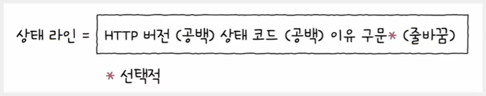

- **HTTP 버전**
  - 사용된 HTTP 버전을 의미한다.
- **상태 코드**
  - 요청에 대한 결과를 나타내는 세 자리 정수
- **이유 구문**
  - 상태 코드에 대한 문자열 형태의 설명

### 필드 라인

- 0개 이상의 **HTTP 헤더**가 명시되어 **헤더 라인**이라고도 부른다.
- HTTP 헤더란 HTTP 통신에 필요한 부가 정보를 의미한다.
- 콜론(`:`)을 기준으로 **헤더 이름**과 하나 이상의 **헤더 값**으로 구성된다.

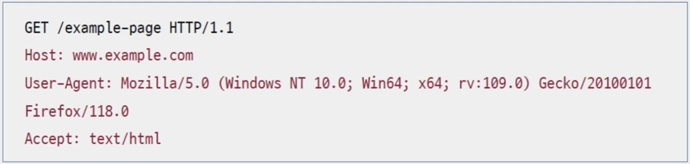

### 메시지 본문

- HTTP 요청 혹은 응답 메시지에서 본문이 필요할 경우 **메시지 본문**에 명시된다.
- 메시지 본문은 존재하지 않을 수도 있으며, `JSON`, `HTML` 등 다양한 콘텐츠 타입이 사용될 수도 있다.

---

## HTTP 메서드

HTTP 요청 메시지에서 사용될 수 있는 메서드의 종류는 대음과 같이 있다.

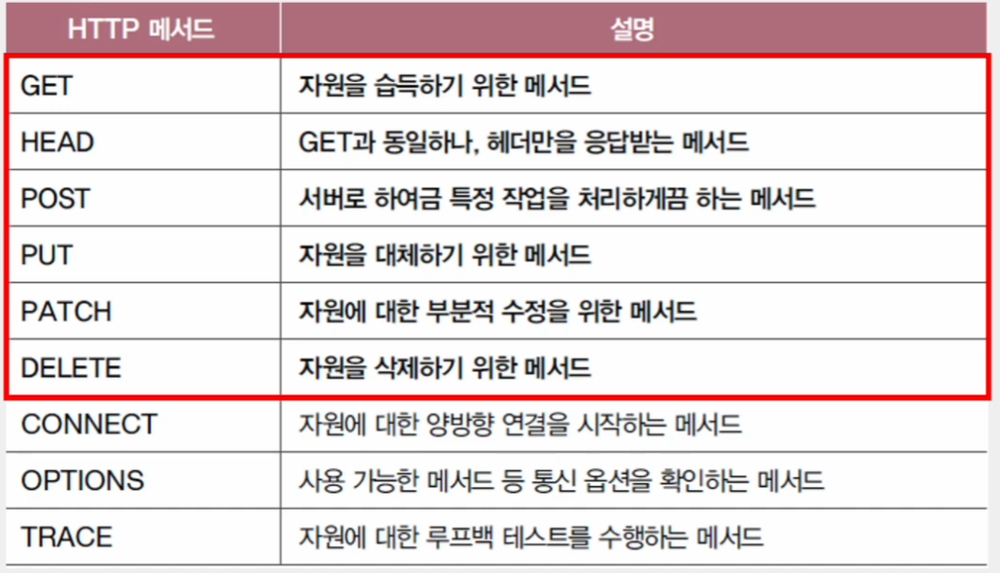

### GET

- 특정 자원을 조회할 때 사용되는 메서드
- 자원은 `HTML`, `JSON`, 이미지 파일, 일반 텍스트 파일 등이 될 수 있다.
- **GET** 메서드에 요청 메시지 본문을 포함시키는 것은 바람직하지 않다. 메시지 본문보다 **쿼리 문자열**이 사용되는 경우가 많다.

### HEAD

- **GET** 메서드와 동일한 역할을 한다. 차이점은 응답 메시지에 메시지 본문이 포함되지 않는다는 것이다.
- 즉, HEAD 메서드를 사용하면 서버는 요청에 대한 응답으로 응답 메시지의 헤더만을 반환한다.

### POST

- 서버에게 특정 작업을 처리하도록 요청하는 메서드
- 대부분 클라이언트가 서버에 새로운 자원을 생성하고자 할 때 사용된다. 
- 만약 성공적으로 **POST** 요청이 처리되어 새로운 자원이 생성되면 서버는 응답 메시지의 `Location` 헤더를 통해 새로 생성된 자원의 위치를
클라이언트에게 알려 줄 수 있다.

### PUT

- 요청 자원이 없다면 메시지 본문으로 자원을 새롭게 생성한다.
- 요청 자원이 있다면 메시지 본문으로 **자원을 완전히 대체한다.**

### PATCH

- 리소스의 부분적은 수정을 할 때 사용된다.
- PUT 메서드가 덮어쓰기, 대체라면, PATCH 메서드는 부분적 수정이다.

### DELETE

- 특정 자원을 삭제하고 싶을 때 사용하는 메서드

---

## HTTP 상태 코드

### 200번대 - 성공 상태 코드

- 요청이 성공했음을 의미한다. 
- 주요 상태 코드는 다음과 같다.

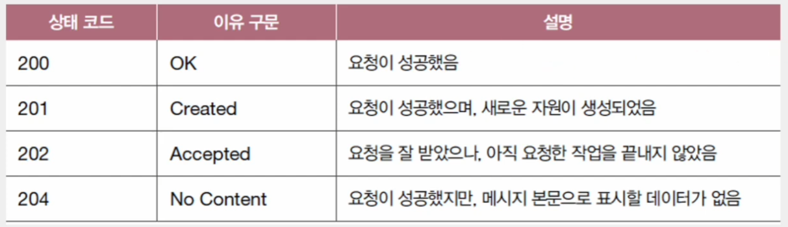

### 300번대 - 리다이렉션 상태 코드

- [공식 문서](https://www.rfc-editor.org/rfc/rfc9110.html#name-redirection-3xx)에서는 리다이렉션을 "요청을 완수하기 위해 추가적인 조치가 필요한 상태"라고 정의한다.
- **리다이렉션**은 클라이언트가 요청한 자원이 다른 곳에 있을 때, 클라이언트의 요청을 다른 곳으로 이동시키는 것을 의미한다.
- 클라이언트가 요청한 자원이 다른 URL에 있을 경우, 서버는 응답 메시지의 `Location` 헤더를 통해 요청한 자원이 위치한 URL을 안내해 줄 수 있다. 이를 수신한
클라이언트는 `Location` 헤더에 명시된 URL로 즉시 재요청을 보내 새로운 URL에 대한 응답을 받게 된다.

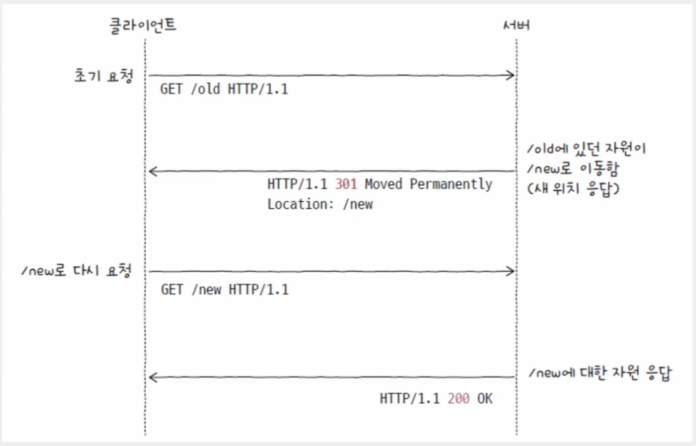

리다이렉션은 **영구적인 리다이렉션**과 **일시적인 리다이렉션**으로 구분된다.

#### 영구적인 리다이렉션

- 자원이 완전히 새로운 곳으로 이동하여 경로가 영구적으로 재지정되는 것을 의미한다.
- 이 경우 기존의 URL에 요청 메시지를 보내면 항상 새로운 URL로 리다이렉트 된다.

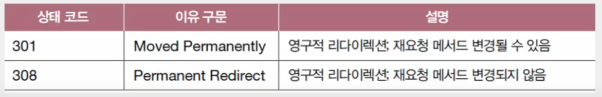

#### 일시적인 리다이렉션

- 자원의 위치가 임시로 변경되었거나 임시로 사용할 URL이 필요한 경우에 주로 사용된다.
- 어떤 URL에 대해 일시적인 리다이렉션 관련 상태 코드를 응답받았다면 여전히 요청을 보낸 URL은 기억해야 한다.
  - 영구적인 리다이렉션은 자원의 위치가 영구적으로 변경된 것이기 때문에, 요청을 보낸 URL은 기억할 필요가 없다.

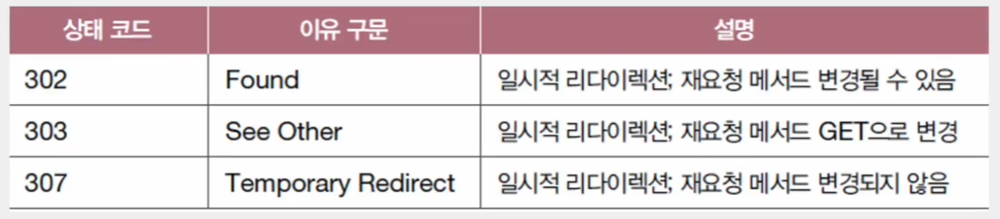

### 400번대 - 클라이언트 에러 상태 코드

- 클라이언트에 의한 에러가 있음을 알려주는 상태 코드

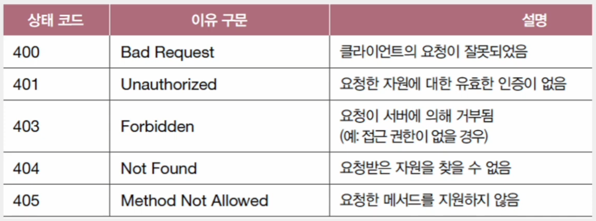

> 서버가 상태 코드 `401`로 응답할 때는 반드시 `WWW-Authenticate` 라는 헤더를 통해 인증 방법을 알려주어야 한다.

### 500번대 - 서버 에러 상태 코드

- 클라이언트가 올바르게 요청을 보내더라도 발생할 수 있는 서버 에러에 대한 상태 코드

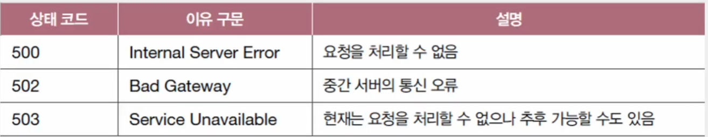

---

## HTTP 버전별 특징

### HTTP/0.9

- 현재 거의 사용되지 않는 초창기 HTTP 버전
- 사용 가능한 메서드가 `GET`뿐이고, 요청 메시지는 한 줄로 구성되어 있다.
- 헤더도 지원되지 않았다.

### HTTP/1.0

- `GET` 이외에 메서드가 도입되었고, 헤더가 지원되기 시작했다.
- 여전히 지속 연결은 지원하지 않았다.

### HTTP/1.1

- 현재 널리 사용되는 버전으로, 지속 연결을 지원되기 시작했다.
- 특정 요청에 대한 응답이 수신되기 전에 다음 요청을 보낼 수 있는 파이프라이닝 기능과 콘텐츠 협상 기능 등 다양한 편의 기능 및
사용 가능한 헤더가 추가되었다.

> **HTTP/1.1의 고질적인 문제, HOL 블로킹(Head-Of-Line blocking)**
> 
> - HOL 블로킹이란 같은 큐에 대기하며 순차적으로 처리되는 여러 패킷이 있을 경우, 첫 번째 패킷의 처리 지연으로 인해 나머지 패킷들의 처리도 모두
> 지연되는 문제 상황을 의미한다.
> 
> 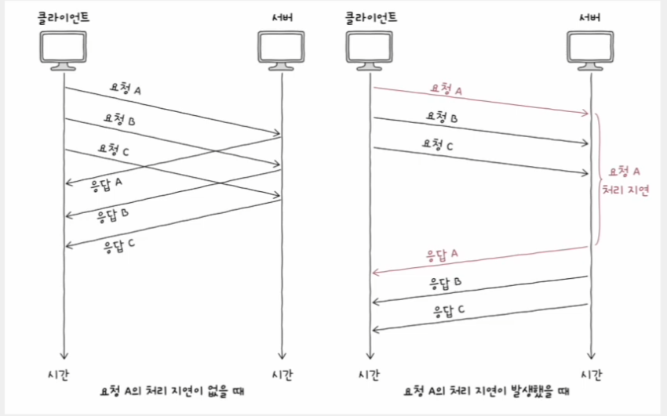

### HTTP/2.0

- HTTP/1.1의 효율과 성능을 높이기 위한 버전
- 송수신 효율을 높이기 위해 헤더를 압축하여 전송한다.
- 텍스트 기반의 메시지를 송수신한 이전 버전과는 달리 바이너리 데이터 기반의 메시지를 송수신한다.
- 또한 클라이언트가 요청하지 않았더라도 미래에 필요할 것으로 예상되는 자원을 미리 전송해 주는 **서버 푸시** 기능을 제공한다.

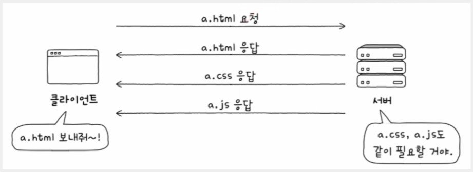

> - HTTP/2.0은 **HTTP 멀티플렉싱** 기법을 통해 HTTP/1.1의 고질적인 문제였던 HOL 블로킹 문제를 완화했다.
> - HTTP 멀티플렉싱은 여러 스트림을 이용해 병렬적으로 메시지를 주고받는 기술이다.
> - 요청과 응답을 주고받는 단위는 하나의 스트림에서 이루어지고, 이러한 스트림을 여러 개 활용하는 동시에 스트림별로 독립적인 송수신이 가능하다.
> - 즉, 스트림별 메시지들은 꼭 일정한 순서를 유지할 필요가 없으며, 별도의 스트림을 통해 여러 데이터를 병렬적으로 주고받으며 HOL 블로킹을 완화한다.

### HTTP/3.0

- 이전까지의 HTTP 버전들은 모두 TCP를 기반으로 동작했다.
- HTTP/3.0부터는 UDP를 기반으로 구현된 **QUIC(Quick UDP Internet Connections)** 프로토콜을 기반으로 동작한다.
- UDP 기반이기 때문에 HTTP/3.0은 속도 측면에서 큰 개선이 이루어졌다.

---

[이전 ↩️ - 응용 계층 - DNS와 자원]()

[메인 ⏫](https://github.com/genesis12345678/TIL/blob/main/cs/network/Main.md)

[다음 ↪️ - 응용 계층 - HTTP 헤더와 HTTP 기반 기술]()