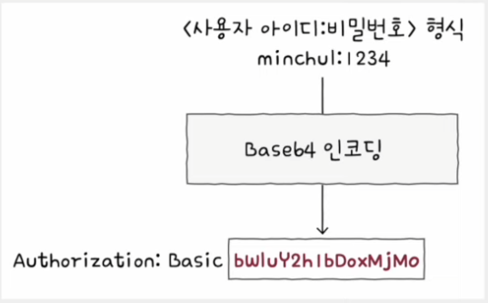
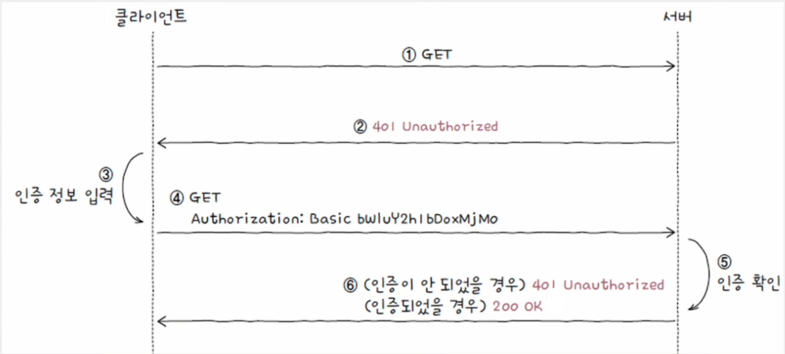
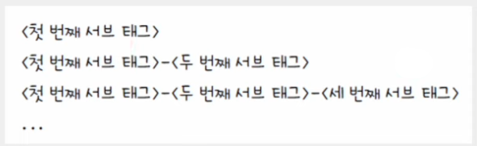
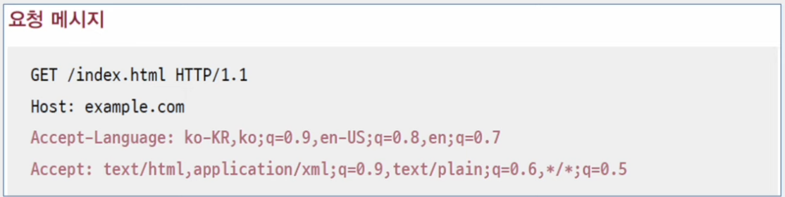

# 네트워크 - 응용 계층

## HTTP 헤더

### 요청 시 활용되는 HTTP 헤더

#### Host

- 요청을 보낼 호스트를 나타내는 헤더
- 주로 도메인 네임이 명시되며, 포트 번호가 포함되어 있을 수 있다.

#### User-Agent

- 웹 브라우저와 같이 HTTP 요청을 시작하는 클라이언트 측의 프로그램을 유저 에이전트(User Agent)라고 한다.
- **User-Agent** 헤더에는 요청 메시지 생성에 관여한 클라이언트 프로그램과 관련된 다양한 정보가 명시된다.
  - 서버 입장에서는 **User-Agent** 헤더를 통해 클라이언트의 접속 환경을 유추할 수 있다.

#### Referer

- 클라이언트가 요청을 보낼 때 머무르고 있던 URL이 명시된다.
- **Referer** 헤더를 통해 클라이언트의 유입 경로를 파악할 수 있다.

#### Authorization

- 클라이언트의 인증 정보를 담는 헤더
- 인증 타입과 인증을 위한 정보가 명시된다. 인증 타입에 따라 인증 정보에 명시될 값이 달라진다.

```text
Authorization: <type> <credentials>
```

- 인증 타입의 종류는 다양하지만, 가장 기본적인 HTTP 인증 타입은 **Basic** 타입이다.
- **`username:password`** 를 [Base64 인코딩](https://github.com/kangtegong/self-learning-cs2/tree/main/encoding)한 값을 인증 정보로 삼는 방식이다.



### 응답 시 활용되는 HTTP 헤더

#### Server

- 요청을 처리하는 서버 측의 소프트웨어와 관련된 정보를 명시한다.

#### Allow

- 클라이언트에게 허용된 HTTP 메서드 목록을 알려 주기 위해 사용된다.
- 상태 코드 **405(Method Not Allowed)** 를 응답하는 메시지에서 **Allow** 헤더가 함께 사용된다.

#### Retry-After

- 상태 코드 **503(Service Unavaliable**, 현재는 요청을 처리할 수 없으나 추후 가능할 수도 있음)과 함께 사용될 수 있는 헤더
- 자원을 사용할 수 있는 날짜 혹은 시각을 나타낸다.

#### Location

- 클라이언트에게 자원의 위치를 알려 주기 위해 사용되는 헤더
- 주로 리다이렉션이 발생했을 때나 새로운 자원이 생성되었을 때 사용된다.

#### WWW-Authenticate

- 상태 코드 401(Unauthorized)과 함께 사용되는 헤더
- 자원에 접근하기 위한 인증 방식을 설명하는 헤더이다.

> **`Authorization`과 `WWW-Authenticate` 헤더를 통한 HTTP 인증 과정(Basic 인증)**
> 
> 1. 인증되지 않은 클라이언트가 서버에 **GET** 요청 메시지를 전송
> 2. 서버는 **401(Unauthorized)** 과 함께 `WWW-Authenticate` 헤더를 통해 인증 방식을 알림
> 3. 클라이언트는 사용자로부터 인증 정보(사용자 아이디, 비밀번호)를 전달받음
> 4. 클라이언트는 Base64 인코딩한 값을 `Authorization` 헤더를 통해 다시 요청 메시지를 전송
> 5. 서버는 인증 정보를 확인
> 6. 인증이 유효하면 상태 코드 200으로 응답하고, 인증되지 않았으면 상태 코드 401로 응답
> 
> 

### 요청과 응답 모두에서 활용되는 HTTP 헤더

#### Date

- 메시지가 생성된 날짜와 시각에 관련된 정보를 담은 헤더

#### Connection

- 클라이언트의 요청과 응답 간의 연결 방식을 설정하는 헤더
- 지속 연결(keep-alive)이 Connection에 명시되는 대표적인 연결 방식이다.
- 가장 대표적으로 사용되는 값은 `Keep-alive`와 `close`이다.

#### Content-Length

- 본문의 바이트 단위 크기(길이)를 나타낸다.

#### Content-Type, Content-Language, Content-Encoding

- 전송하려는 메시지 본문의 표현 방식을 설명하는 헤더로, 표현 헤더의 일종이다.
- **Content-Type 헤더**
  - 메시지 본문에서 사용된 미디어 타입
- **Content-Language 헤더**
  - 메시지 본문에 사용된 자연어를 명시
  - 언어 태그로 명시되며, 언어 태그는 하이픈(`-`)으로 구분된 구조이다.
  - **언어 코드-국가 코드**의 조합으로 어떤 국가에서 사용하는 어떤 언어인지를 알 수 있다.



- **Content-Encoding**
  - 메시지 본문을 압축하거나 변환한 방식
  - HTTP를 통해 송수신되는 데이터는 전송 속도 개선을 위해 압축이나 변환될 수 있는데, 이때 사용된 방식이 명시된다.
  - 수신 측은 이 헤더를 통해 압축 및 변환 방식을 인식하고, 압축 해제 및 재변환하여 본문 내용을 확인할 수 있다.
  - 대표적인 값은 `gzip`, `compress`, `deflate`, `br` 등이 있다.

---

## HTTP 기반 기술

### 캐시

- **Cache** : 불필요한 대역폭 낭비와 응답 지연을 방지하기 위해 정보의 사본을 임시로 저장하는 기술
- 캐시는 웹 브라우저에 저장되어 있기도 하고(**개인 전용 캐시**), 클라이언트와 서버 사이에 위치한 중간 서버에 저장되어 있기도 하다.(**공용 캐시**)

캐시의 중요한 점은 캐시는 원본이 아닌 "사본"을 저장한다는 점이다. 원본이 아니기 때문에 캐시된 데이터는 얼마든지 원본 데이터와 달라질 수 있다.
원본 데이터가 변경되었는데도 계속해서 캐시된 사본 데이터를 참조하다 보면 문제가 발생할 수 있다.

> "캐시된 사본 데이터가 얼마나 최신 원본 데이터와 유사한지"를 **캐시 신선도**라고 표현한다.

- 신선도를 유지하는 가장 기본적인 방법은 "캐시된 데이터에 유효 기간을 설정하는 방법"이다.
- 캐시 데이터에 유효 기간을 설정하고, 기간이 만료되었다면 원본 데이터를 다시 요청하는 방식으로 캐시 신선도를 유지할 수 있다.
- 캐시할 데이터에 유효 기간을 설정하는 방법으로 응답 메시지의 **Expires 헤더(날짜)** 와 **Cache-Control 헤더의 Max-Age 값(초)** 을 사용할 수 있다.

캐시의 유효 기간이 만료되었더라도 원본 데이터가 변하지 않았다면, 즉 캐시된 자원이 여전히 최신 정보라면 클라이언트는 굳이 서버로부터 같은 자원을 응답받을
필요가 없다.

따라서 캐시의 유효 기간이 만료되었다면 클라이언트는 캐시된 자원이 여전히 최신의 상태의 정보인지 재검사해야 한다. 캐시의 신선도를 재검사하는 방법은 날짜 또는
엔티티 태그를 기반으로 서버에게 물어보는 방법이 있다.

#### 날짜 기반 캐시 신선도 재검사

- 클라이언트는 `If-Modified-Since` 헤더를 통해 서버에게 특정 시점 이후로 원본 데이터에 변경이 있었는지 물어볼 수 있다.
- `If-Modified-Since` 헤더에 명시된 시점 이후로 원본에 변경이 있었다면 그때만 새 자원으로 응답하도록 서버에게 요청하는 헤더이다.

이때 서버 입장에서는 다음과 같은 셋 중 하나의 상황일 것이다.

1. **요청받은 자원이 변경되었음**
   - 서버는 상태 코드 **200(OK)** 과 함께 새로운 자원을 반환한다.
2. **요청받은 자원이 변경되지 않았음**
   - 상태 코드 **304(Not Modified)** 를 통해 클라이언트에게 자원이 변경되지 않았음을 알린다. 클라이언트는 캐시된 자원을 사용할 수 있다.
   - 또한, 상태 코드 304를 통한 자원의 "변경 여부"뿐만 아니라 `Last-Modified` 헤더로 자원의 "마지막 변경 시점"도 클라이언트에게 알려 줄 수 있다.
   - `Last-Modified` 헤더는 특정 자원이 마지막으로 수정된 시점을 나타낸다.
3. **요청받은 자원이 삭제되었음**
   - 서버는 상태 코드 **404(Not Found)** 를 통해 요청한 자원이 존재하지 않음을 알린다.

#### 엔티티 태그 기반 캐시 신선도 재검사

- 엔티티 태그(**Etag**)는 자원의 버전을 식별하기 위한 정보이다. 버전이란 유의미한 변경 사항을 의미한다.
- 자원이 변경될 때마다 자원의 버전을 식별하는 Etag 값이 변경되고, 자원이 변경되지 않았다면 Etag 값도 변경되지 않는다.
- 클라이언트가 Etag 값이 부여된 자원을 캐시할 때 캐시 신선도를 검사하기 위해 `If-None-Match` 헤더를 사용할 수 있다. 이 Etag 값과 일치하는 자원이 있는지
물어보는 것이다.
- 이 자원이 변경되었다면(Etag 값이 바뀌었다면) 그때만 새 자원으로 응답하라는 요청과 같다.

날짜 기반과 마찬가지로 서버의 자원은 크게 셋 중 하나의 상황일 것이다.

1. **요청받은 자원이 변경되었음(Etag 값이 변경됨)**
    - 서버는 상태 코드 **200(OK)** 과 함께 변경된 데이터와 Etag 값을 응답한다.
2. **요청받은 자원이 변경되지 않았음(Etag 값이 동일함)**
    - 서버는 상태 코드 **304(Not Modified)** 응답
3. **요청받은 자원이 삭제되었음**
    - 서버는 상태 코드 **404(Not Found)** 응답

### 쿠키

- **쿠키(Cookie)** 는 서버에서 생성되어 클라이언트 측에 저장되는 데이터로, 상태를 유지하지 않는 HTTP의 특성을 보완하기 위한 수단이다.
- 기본적으로 **<이름, 값>** 쌍의 형태를 띠고 있고, 추가로 적용 범위와 만료 기간 등 다양한 **속성**을 가질 수 있다.
- 서버는 쿠키를 생성하여 클라이언트에게 전송하고, 클라이언트는 전달받은 쿠키를 저장해 두었다가 추후 요청 메시지에 쿠키를 포함하여 전송한다. 서버는
쿠키 정보를 참고해 두 개의 요청이 같은 클라이언트에서 왔는지, 로그인 상태를 유지하고 있는지 등을 알 수 있다.

> **쿠키를 활용하는 인증 기술, 세션 인증**
> 
> - HTTP는 **스테이트리스 프로토콜**이지만, 매 요청마다 번거로운 인증 과정을 거쳐야 하는 것은 아니다.
> - 쿠키를 통해 전달되는 대표적인 정보로 **세션 아이디**가 있다. **세션 인증**은 다음과 같은 순서로 이루어진다.
> 
> 1. 클라이언트는 서버에게(아이디, 비밀번호 등) 인증 정보를 전송한다.
> 2. 인증 정보가 올바르다면, 서버는 세션 아이디를 생성해 클라이언트에게 전송한다.
> 3. 서버는 생성한 세션 아이디를 데이터베이스에 저장한다.
> 4. 클라이언트는 추후 요청을 보낼 때 쿠키 내에 세션 아이디를 포함하여 전송한다.
> 5. 서버는 쿠키 속 세션 아이디와 저장된 세션 아이디를 비교하여 클라이언트를 식별한다.

쿠키는 서버가 생성하고, 클라이언트는 서버로부터 전달받은 쿠키를 활용한다. 서버는 응답 메시지의 `Set-Cookie` 헤더를 통해 클라이언트에게 쿠키를 전달하고,
클라이언트는 요청 메시지의 `Cookie` 헤더를 통해 서버에 쿠키를 전달할 수 있다.

쿠키는 이름과 값 외에도 도메인과 경로라는 속성이 있다.

쿠키는 사용 가능한 **도메인**이 정해져 있다. 예를 들어 `www.naver.com`에게 받은 쿠키를 전혀 다른 웹 사이트인 `www.google.com`에게 전송하면 안 된다.
이는 응답 메시지 속 `Set-Cookie` 헤더의 `domain` 속성으로 정해진다.

또한 같은 도메인이라도 **경로별로** 쿠키를 구분하여 사용하고 싶을 때가 있을 수 있다. `path` 속성에 쿠키가 적용될 경로를 명시하면 지정된 경로와 하위 경로에서 
쿠키를 활용할 수 있다.

또 다른 쿠키의 속성으로 쿠키 유효 기간이 있다.

`Expires` 속성을 통해 쿠키 만료 시점을 지정할 수 있고, `Max-Age` 속성을 통해 초 단위 유효 기간을 지정할 수 있다. `Expires`로 명시된 시점이 지나거나
`Max-Age`로 명시된 유효 기간이 지나면 해당 쿠키는 삭제되어 전달되지 않는다.

> **쿠키의 한계**
> 
> - **쿠키의 대표적인 한계는 바로 보안이다.**
> - 쿠키 정보는 쉽게 노출되거나 조작될 수 있기 때문에 쿠키에 개인 정보 등의 보안에 민감한 정보를 담아 송수신하는 것은 바람직하지 않다.
> - 이를 보완하기 위한 속성으로 `Secure`와 `HttpOnly` 속성이 있다.
> 
> `Secure`는 **HTTPS 프로토콜**이 사용되는 경우에만 쿠키를 전송되도록 하는 속성이다.
> 
> `HttpOnly`는 HTTP 송수신을 통해서만 쿠키를 이용하도록 제한하는 속성이다. 사실 쿠키 관련 데이터는 자바스크립트 언어를 통해서도 접근이 가능하다.
> 누군가 악의적인 의도로 자바스크립트를 통해 쿠키를 중간에 가로채어 위변조할 수 있는 것이다.
> `HttpOnly`는 이런 상황을 방지하기 위해 자바스크립트에서 쿠키에 접근하지 못하도록 하는 속성이다. 

> **웹 스토리지: 로컬 스토리지와 세션 스토리지**
> 
> - 쿠키 이외에도 클라이언트가 저장하고 클라이언트의 상태를 추측할 수 있는 <키-값> 쌍 형태의 정보가 있는데, 바로 **웹 스토리지(web storage)** 이다.
> - 웹 스토리지는 웹 브라우저 내에 저장 공간으로, 일반적으로 쿠키보다 더 큰 데이터를 저장할 수 있다.
> - 또한 쿠키는 서버로 자동 전송되지만, 웹 스토리지의 정보는 서버로 자동 전송되지 않는다.
> - 웹 스토리지에는 크게 로컬 스토리지와 세션 스토리지가 있다.
> - **세션 스토리지(session storage)** 는 세션이 유지되는 동안(브라우저가 열려 있는 동안) 유지되는 정보이고, **로컬 스토리지(local storage)** 는 별도로 삭제
> 하지 않는 한 영구적으로 저장이 가능한 정보이다.

### 콘텐츠 협상

- 콘텐츠 협상이란, 같은 URI에 대해 가장 적합한 자원의 형태를 제공하는 메커니즘을 의미한다.
- 같은 URI로 식별 가능한 HTML 문서라 해도 영어나 한국어로 요청하면 그에 맞는 형태로 제공하는 것이다.
- 여기서 "송수신 가능한 자원의 형태"를 **자원의 표현**이라고 한다. 즉, 콘텐츠 협상은 클라이언트에게 가장 적합한 자원의 표현을 제공하는 메커니즘을 의미한다.

> **GET 메서드의 엄밀한 정의**
> 
> - 일반적으로 **GET** 메서드를 "자원을 습득하기 위한 메서드"로 정의한다.
> - 하지만 자원에 대한 다양한 표현이 가능하고, 클라이언트가 습득하는 것은 다양한 표현 중 하나인 것이다.
> - 따라서 **GET** 메서드를 다시 정의하면, "자원의 특정 표현을 습득하기 위한 메서드"라 할 수 있다.

콘텐츠 협상 관련 HTTP 헤더는 다음과 같다.

- **Accept 헤더**
  - 선호하는 미디어 타입
- **Accept-Language**
  - 선호하는 언어
- **Accept-Charset 및 Accept-Encoding**
  - 선호하는 문자 인코딩과 압축 방식

콘텐츠 협상에서 중요한 점은 **선호도에 우선순위를 반영할 수 있다는 점이다.** 예를 들어 클라이언트가 "한국어를 가장 선호하지만, 영어도 받을 용의가 있다." 또는
미디어 타입은 HTML 문서를 가장 선호하고, 다음으로 XML을 선호하고, 다음으로 일반 텍스트를 선호한다"라는 식으로 여러 선호도를 담은 요청 메시지를 보낼 수도 있다.

- 이러한 우선순위는 콘텐츠 협상 관련 헤더의 `q` 값으로 표현된다.
  - `q`는 Quality Value의 약자로, 특정 표현을 얼마나 선호하는지를 나타내는 값이다.
- 생략되었을 경우 1, 범위는 0부터 1까지이며, 값이 클수록 우선순위가 높다.



---

[이전 ↩️ - 응용 계층 - HTTP]()

[메인 ⏫](https://github.com/genesis12345678/TIL/blob/main/cs/network/Main.md)

[다음 ↪️ - 전송 계층 - ]()