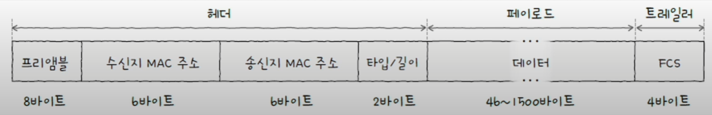
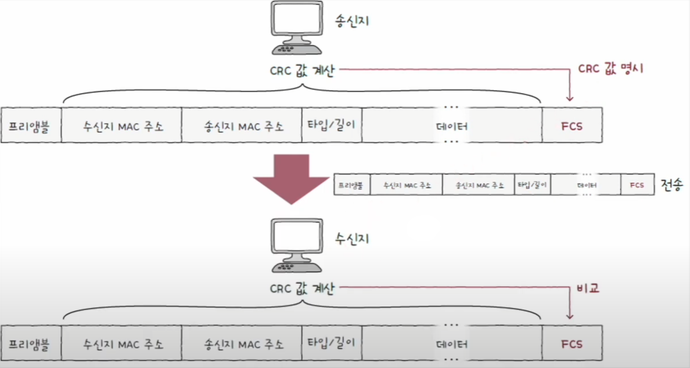
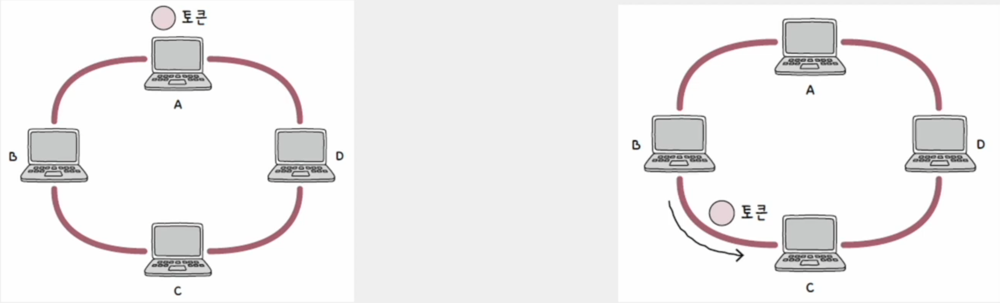

# 네트워크 - 물리 & 데이터 링크 계층

## 이더넷

- **물리 계층**과 **데이터 링크 계층**은 서로 밀접하게 연관되어 있는데, **이더넷**이라는 공통된 기술이 사용되기 때문이다.
- 이더넷은 현대 LAN, 특히 유선 LAN 환경에서 가장 대중적으로 사용되는 기술이다.
- 이더넷은 다양한 통신 매체의 규격들과 송수신되는 프레임의 형태, 프레임을 주고받는 방법 등이 정의된 네트워크 기술이다.

---

## 통신 매체 표기 형태

이더넷 표준 구격에 따라 구현된 통신 매체는 통신 매체의 속도와 특성을 한눈에 파악하기 쉽도록
다음과 같은 형태로 표기한다.

**[전송 속도]**`BASE` - **[추가 특성]**

### 1. 전송 속도

숫자만 표기되어 있으면 `Mbps`, 숫자 뒤에 `G`가 붙는 경우 `Gbps` 속도를 의미한다.

| 전송 속도 표기 | 의미                |
|----------|-------------------|
| 10       | 10 Mbps           |
| 100      | 100 Mbps          |
| 1000     | 1000 Mbps(1 Gbps) |
| 2.5G     | 2.5 Gbps          |
| 5G       | 5 Gbps            |
| 10G      | 10 Gbps           |
| 40G      | 40 Gbps           |
| 100G     | 100 Gbps          |

### 2. BASE

- 베이스밴드(BASEband)의 약자로, 변조 타입을 의미한다.
- 변조 타입이란 비트 신호로 변환된 데이터를 통신 매체로 전송하는 방법을 의미한다.

### 3. 추가 특성

- 통신 매체의 특성을 명시하며, 명시할 수 있는 특성의 종류는 다양하다.
- 전송 가능한 최대 거리, 데이터가 비트 신호로 변환되는 방식, 비트 신호를 옮길 수 있는 전송로 수가 명시되기도 한다.

가장 중요한 추가 특성은 **통신 매체의 종류**이다.

---

## 통신 매체 종류

| 추가 특성 표기(통신 매체의 종류) | 케이블 종류       |
|---------------------|--------------|
| C                   | 동축 케이블       |
| T                   | 트위스티드 페어 케이블 |
| S                   | 단파장 광섬유 케이블  |
| L                   | 장파장 광섬유 케이블  |

> - 10BASE-T 케이블 : **10Mbps** 속도를 지원하는 **트위스티드 페어 케이블**
> - 1000BASE-SX 케이블 : **1000Mbps** 속도를 지원하는 **단파장 광섬유 케이블**
> - 1000BASE-LX 케이블 : **1000Mbps** 속도를 지원하는 **장파장 광섬유 케이블**

---

## 이더넷 프레임

위의 내용은 물리 계층과 관련된 이더넷 표준과 통신 매체였다. 이번에는 데이터 링크 계층의
이더넷 프레임을 알아보자.

이더넷 네트워크에서 주고받는 프레임인 이더넷 프레임 형식은 정해져 있다. 
이더넷 프레임은 상위 계층으로부터 받아들인 정보에 헤더와 트레일러를 추가하는 **캡슐화** 과정을 통해 만들어진다.
수신지 입장에서는 프레임의 헤더와 트레일러를 제거한 뒤 상위 계층으로 올려보내는 **역캡슐화** 과정을 거친다.

이더넷 프레임 헤더는 기본적으로 다음과 같이 구성된다.

### 1. 프리앰블 (preamble)

- 이더넷 프레임의 시작을 알리는 8바이트(64비트) 크기의 정보이다.
- 첫 7바이트는 `10101010` 값을 가지고, 마지막 바이트는 `10101011` 값을 가진다.
- 송수신지 간의 동기화를 위해 사용되는 정보다.

### 2. 수신지 MAC 주소 & 수신지 MAC 주소

- 가장 중요한 부분으로, 물리적 주소라고도 불리는 MAC 주소가 있다.
- **MAC 주소**는 네트워크 인터페이스마다 부여되는 6바이트(48비트) 길이의 주소로, LAN 내의 수신지와 송신지를 특정할 수 있다.
- **MAC 주소**는 **일반적으로** 고유하고, 변경되지 않는 주소로써 네트워크 인터페이스마다 부여된다.
- 보통 NIC라는 장치가 네트워크 인터페이스 역할을 담당하며, 한 컴퓨터에 여러 개의 MAC 주소가 있을 수 있다.

### 3. 타입/길이

- 타입 또는 길이가 명시된다.
- 필드에 명시된 크기가 1500(16진수 06DC) 이하일 경우, 프레임의 크기(길이)를 나타내는 데 사용된다.
- 필드에 명시된 크기가 1536(16진수 0600) 이상일 경우, 타입을 나타내는 데 사용된다.
- 타입이란 이더넷 프레임이 어떤 정보를 캡슐화했는지를 나타내는 정보이다.(이더타입이라고도 부른다.)
- 대표적으로 상위 계층에서 사용된 프로토콜의 이름이 명시된다.

### 4. 데이터

- 상위 계층에서 전달받거나 상위 계층으로 전달해야 할 내용이다.
- 네트워크 계층의 데이터와 헤더를 합친 PDU가 이곳에 포함된다.
- 최대 크기는 1500 바이트이며, 최소 크기는 46바이트이다. 유의할 점은 최소 크기 이하의 데이터라면 크기를 맞추기 위해
패딩이라는 정보가 내부에 채워진다.(보통 46바이트 이상이 될 때까지 0으로 채움)

### 5. FCS (Frame Check Sequence)

- 수신한 이더넷 프레임에 오류가 있는지 확인하기 위한 필드다.
- 이 필드에는 CRC(Cyclic Redundancy Check), 즉 순환 중복 검사라고 불리는 오류 검출용 값이 들어간다.

송신지는 프리앰블을 제외한 나머지 필드 값들을 바탕으로 CRC 값을 계산한 후, 이 값을 FCS 필드에 명시한다.
수신지는 수신한 프레임에서 프리앰블과 FCS 필드를 제외한 나머지 필드 값들을 바탕으로 CRC 값을 계산한 뒤, 이 값을
FCS 필드 값과 비교한다. 

비교 값이 일치하지 않으면 프레임에 오류가 있다고 판단해 해당 프레임을 폐기한다.

---

## 토큰 링

이더넷 외에 다른 LAN 기술에는 대표적으로 **토큰 링** 방식이 있다.

- 토큰 링 네트워크에서는 호스트들이 링(고리) 형태로 연결된다. 호스트끼리 돌아가며 토큰이라는 특별한 정보를 주고받는다.
- 네트워크 내 다른 호스트에게 메시지를 전송하려면 반드시 이 토큰을 가지고 있어야 한다.

---

[이전 ↩️ - 네트워크 기본 개념](https://github.com/genesis12345678/TIL/blob/main/cs/network/basic/Basic.md)

[메인 ⏫](https://github.com/genesis12345678/TIL/blob/main/cs/network/Main.md)

[다음 ↪️ - 물리 & 데이터 링크 계층 - NIC와 케이블]()