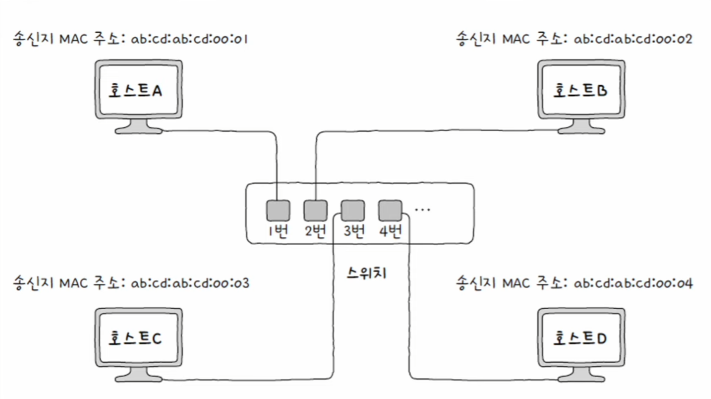
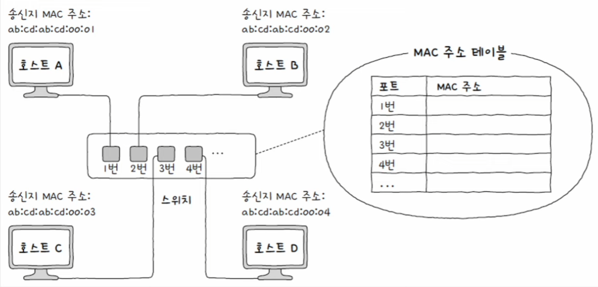
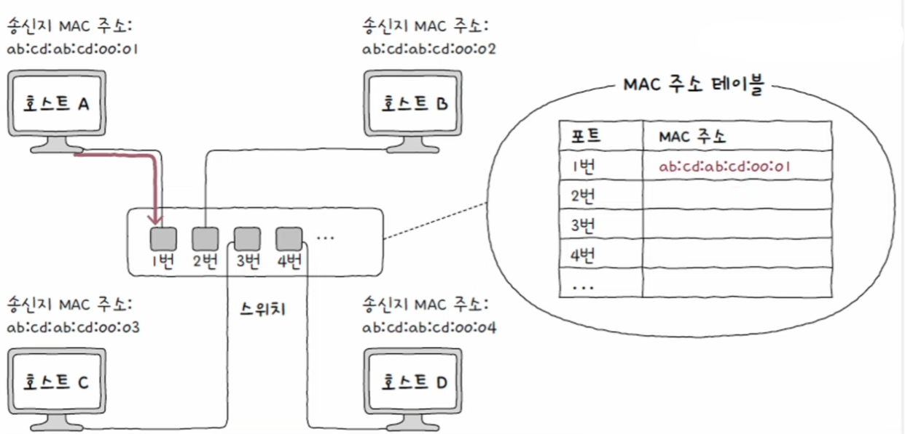
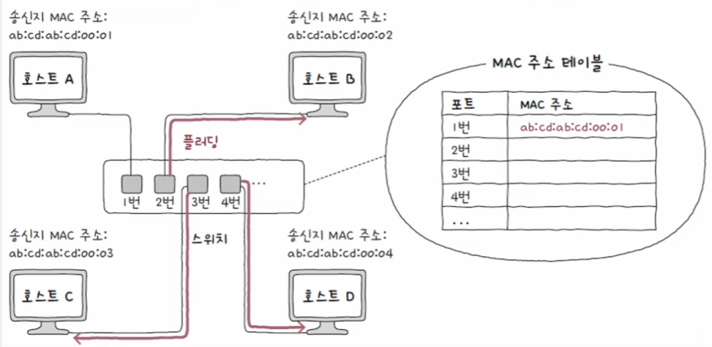
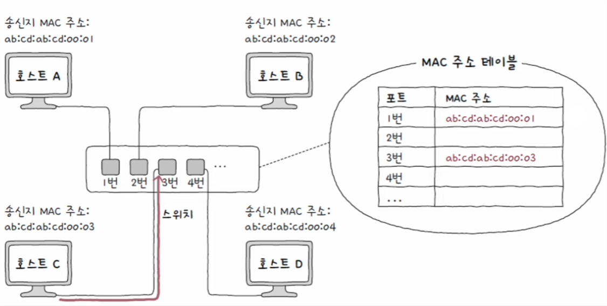
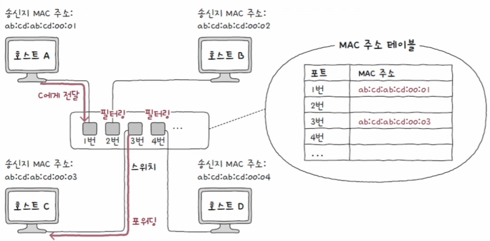
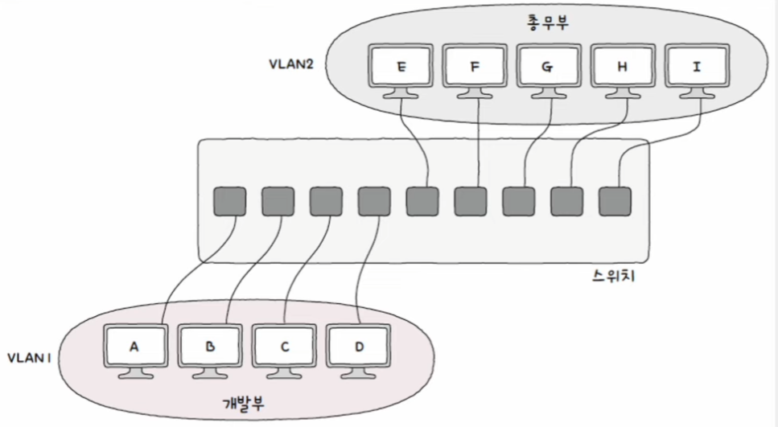
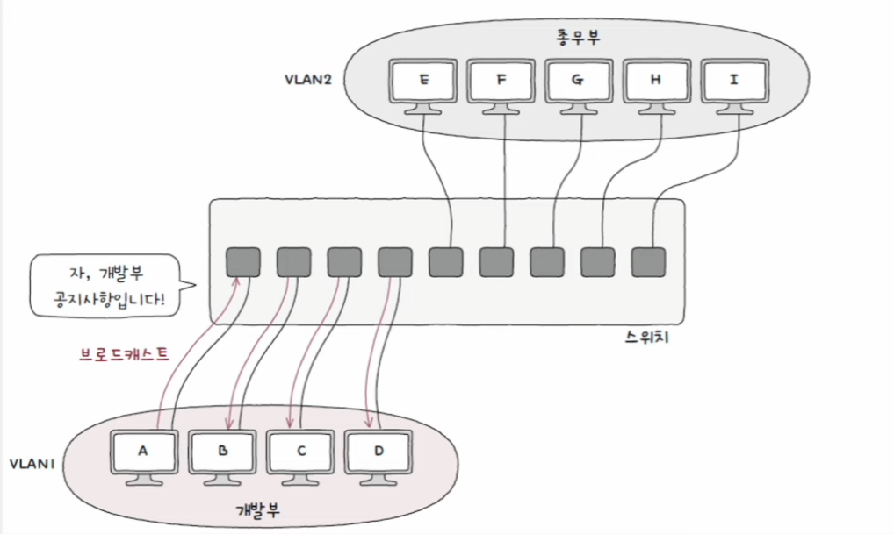
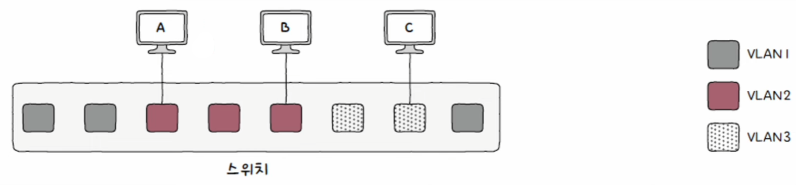
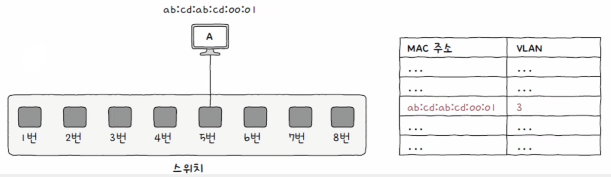

# 네트워크 - 물리 & 데이터 링크 계층

## 데이터 링크 계층의 대표적인 장비 - 스위치

- 스위치는 데이터 링크 계층의 네트워크 장비로, 2계층에서 사용한다 하여 L2 스위치라고도 부른다.
- 스위치는 허브와 비슷하게 여러 포트에 호스트를 연결할 수 있다. 차이점은 스위치는 MAC 주소를 학습해 특정
MAC 주소를 가진 호스트에만 프레임을 전달할 수 있고, 전이중 모드의 통신을 지원한다.
- 즉, 스위치를 이용하면 포트별로 콜리전 도메인이 나뉘고, CSMA/CD 프로토콜이 필요하지 않다.

---

## 스위치의 특징 - MAC 주소 학습

- **스위치는 특정 포트와 해당 포트에 연결된 호스트의 MAC 주소와의 관계를 기억한다는 특징이 있다.**
- 이를 통해 원하는 호스트에만 프레임을 전달할 수 있다. 이러한 기능을 **MAC 주소 학습**이라고 한다.

스위치는 MAC 주소 학습을 위해 포트와 연결된 호스트의 MAC 주소 간의 연관 관계를 메모리에 표 형태로 기억하는데, 이러한 정보를 **MAC 주소 테이블**이라고 한다.

**플러딩, 포워딩과 필터링, 에이징**이라는 세 가지 기능을 통해 MAC 주소 학습이 이루어진다.

다음과 같이 구성된 네트워크에서 **호스트 A**가 **호스트 C**로 프레임을 전송한다고 해보자. (1번 포트 -> 3번 포트)

스위치가 MAC 주소를 학습하기 전에는 아직 어떤 포트에 어떤 MAC 주소를 가진 호스트와 연결되어 있는지 알 수 없다.

스위치의 MAC 주소 학습은 **프레임 내 "송신지 MAC 주소" 필드를 바탕으로 이루어진다.** 프레임 내 송신지 MAC 주소 정보를 바탕으로 호스트 A의 MAC 주소와
연결된 포트를 MAC 주소 테이블에 저장한다. 아직 수신지 호스트 C가 어느 포트에 연결되어있는지는 알 수 없다.

이 상황에서 스위치는 송신지 포트를 제외한 모든 포트로 프레임을 전송한다. 이러한 스위치의 동작을 **플러딩(flooding)** 이라고 한다.
호스트 B, C, D는 프레임을 전달받고, 호스트 B와 D는 프레임을 폐기한다.

호스트 C는 스위치로 응답 프레임을 전송하고, 스위치는 이 프레임에 있는 "송신지 MAC 주소" 필드를 MAC 주소 테이블에 기록한다.
이제 호스트 A와 C가 프레임을 주고받을 때는 다른 포트로 프레임을 내보낼 필요가 없게 된다.

전달받은 프레임을 어디로 내보낼 지 결정하는 스위치의 기능을 **필터링(filtering)** 이라고 한다. 
그리고 전송될 포트에 실제로 프레임을 내보내는 것을 **포워딩(forwarding)** 이라고 한다.

> **<에이징(aging)>**
> 
> 만약 MAC 주소 테이블에 등록된 특정 포트에서 일정 시간 동안 프레임을 전송받지 못했다면 해당 항목은 삭제된다.

---

## 스위치의 특징 - VLAN (Virtual LAN)

- 한 대의 스위치로 가상의 LAN을 만드는 방법이다.
- 스위치에 연결된 호스트 중에서도 서로 메시지를 주고받을 일이 적거나 브로드캐스트 메시지를 받을 필요가 없어서 굳이 같은 네트워크(LAN)에 속할 필요가 없는
호스트가 있을 수 있다. 이들을 분리하기 위해 새로운 스위치 장비를 구매할 수도 없기에 이때 구성하는 것이 VLAN이다.
- VLAN을 구성하면 **한 대의 물리적 스위치라 해도 여러 대의 스위치가 있는 것처럼 논리적인 단위**로 LAN을 구획할 수 있다. **호스트의 물리적 위치와 관계없이**
논리적인 LAN을 구성할 수 있는 것이다.

다음과 같이 VLAN이 구성됐을 때, 두 VLAN이 통신하기 위해서는 데이터 링크 계층의 장비가 아니라 네트워크 계층
이상의 장비가 필요하다.

또한 브로드캐스트 도메인도 달라진다. 서로 다른 네트워크로 간주하기 때문에 다른 VLAN에 속한 호스트에게까지는 전달되지 않는다.

### 포트 기반 VLAN

- 스위치의 **포트가 VLAN을 결정하는 방식** (정적 VLAN)
- 사전에 특정 포트에 VLAN을 할당하고, 해당 포트에 호스트를 연결함으로써 VLAN에 포함시킬 수 있다.

### MAC 기반 VLAN

- 사전에 설정된 **MAC 주소에 따라 VLAN을 결정하는 방식** (동적 VLAN)
- 송수신하는 프레임 속 MAC 주소가 호스트가 속할 VLAN을 결정하는 방식이다.

---

[이전 ↩️ - 물리 & 데이터 링크 계층 - 허브](https://github.com/genesis12345678/TIL/blob/main/cs/network/data_layer/Hub.md)

[메인 ⏫](https://github.com/genesis12345678/TIL/blob/main/cs/network/Main.md)

[다음 ↪️ - 네트워크 계층 - 개요]()