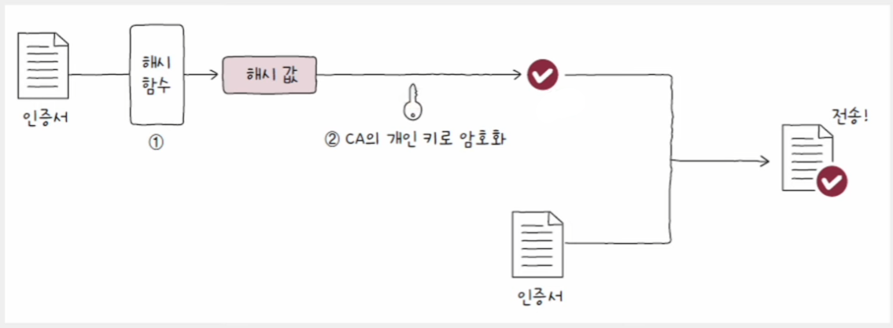
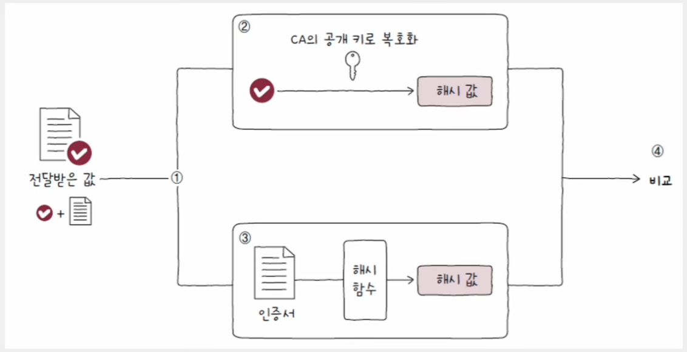
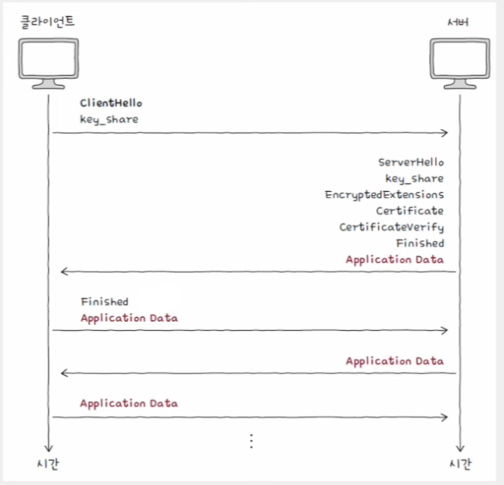

# 네트워크 - 안전성을 위한 기술

## 암호와 인증서

### 대칭 키 암호화 방식

**암호화와 복호화에 동일한 키를 사용하는 방식**

- 동일한 키를 사용하므로 키가 유출되면 큰 문제가 발생한다.
- 따라서 상대방에게 키를 안전하게 전달하는 방법이 필요하다.
- 애초에 암호화를 사용하는 목적 자체는 "제 3자의 도청과 변조를 피해 상대방에게 안전하게 정보를 전달하는 것"이다. 
- 만약 상대방에게 키를 안전하게 전달할 수 있는 방법이 있다면 그 방법으로 메세지를 주고받으면 됐지, 굳이 암호화를 할 필요가 없을 것이다.
- 그래서 등장한 것이 공개 키 암호화 빙식이다.

키를 안전하게 전송하기 어렵지만, 적은 부하 덕분에 암호화 및 복호화를 빠르게 수행할 수 있다.

### 공개 키 암호화 방식

**암호화에 사용되는 키와 복호화에 사용되는 키가 다른 방식**으로, **비대칭 키 암호화**라고도 부른다.

- 공개 키와 개인 키의 한 쌍의 키를 사용하여 한 키로 암호화했다면 다른 키로 복호화할 수 있다.
- 공개 키를 알아도 개인 키를 유추할 수 없다. 반대로 개인 키만으로 공개 키를 유추할 수 없다.
- 공개 키로 암호화하고 개인 키로 복호화할 수 있다면, 공개 키는 누구에게나 공개해도 무방하다. 암호화만을 위해 사용되었기 때문에 공개 키를 안다고 해서
    원문 메시지를 유추할 수 없다.
- 반면 개인 키만큼은 절대로 유출되지 않도록 보안을 유지해야 한다.

암호화 및 복호화에 시간과 부하가 상대적으로 많이 들지만, 키를 안전하게 공유할 수 있다.

> **세션 키**
> 
> - 대칭 키 암호화 방식과 공개 키 암호화 방식의 장단점을 고려해 두 방식을 함께 사용하는 대칭 키
> - 예를 들어 대칭 키를 상대에게 안전하게 전달하기 위해 공개 키로 암호화하고, 개인 키로 암호화된 대칭 키를 복호화할 수 있다.
> - 이렇게 하면 대칭 키를 안전하게 공유함과 동시에 공유한 대칭 키를 이용해 빠르게 암호화 및 복호화를 수행할 수 있다.

### 인증서와 디지털 서명

- 네트워크에서 사용되는 인증서라는 용어는 일반적으로 공개 키 인증서를 의미한다. 
- **공개 키 인증서**란 공개 키와 공개 키의 유효성을 입증하기 위한 전자 문서이다.
- 이러한 인증서는 **인증 기관(CA**, Certification Authority)이라는 제 3의 기관에서 발급한다.
- 인증 기관은 인증서의 발급, 검증, 저장과 같은 역할을 수행할 수 있는 공인 기간이다. (전 세계적으로 다양한 CA들이 존재)

CA가 발급한 인증서에는 이 공개 키 인증서가 진짜임을 보증한다는 내용을 담은 **서명 값(signature)** 이 있다. 클라이언트는 이 서명 값을
바탕으로 인증서를 검증할 수 있다.

서명 값은 **인증서 내용에 대한 해시 값**을 CA의 **개인 키로 암호화**하는 방식으로 만들어진다. CA는 이렇게 얻어낸 정보를 서명 값으로 삼아 클라이언트에게
인증서와 함께 전송한다.

- 아래 그림과 같이 웹 브라우저를 통해 서버로부터 서명 값이 붙은 인증서를 전달받았다고 해보자.
- 인증서 검증을 위해 가장 먼저 할 일은 서명 값과 인증서를 분리하는 것이다.(①)
- 서명 값은 CA의 개인 키로 암호화한 것이다. CA의 공개 키는 공개되어 있기에, 서명 값은 CA의 공개 키로 복호화할 수 있다.
- 서명 값을 CA의 공개 키로 복호화하면 인증서 내용에 대한 해시 값을 얻을 수 있다.(②)
- 다음으로 인증서 데이터에 대한 해시 값을 직접 구한 뒤(③), 이를 복호화한 값과 비교한다.(④)

값이 일치한다면 전달받은 인증서는 확실히 CA의 개인 키로 만들어졌다고 보장할 수 있다. CA의 공개 키로 복호화가 가능하다는 뜻이기 때문이다.
따라서 인증서에 포함된 공개 키를 안심하고 사용할 수 있다. 개인 키로 암호화된 메시지를 공개 키로 복호화함으로써 신원을 증명하는 이러한 절차를
**디지털 서명**이라고 한다.

---

## HTTPS: SSL과 TLS

- SSL(Secure Sockets Layer)과 TLS(Transport Layer Security)는 인증과 암호화를 수행하는 프로토콜이다.
  - TLS는 SSL을 계승한 프로토콜이다.(작동 과정은 큰 틀에서 보면 유사)
- SSL/TLS를 사용하는 대표적인 프로토콜은 HTTPS이다. HTTPS는 HTTP 메시지의 안전한 송수신을 위해 개발된 프로토콜이다.

HTTPS 메시지는 크게 다음과 같은 단계를 거쳐 송수신된다.

1. [TCP 3-way handshake](https://github.com/genesis12345678/TIL/blob/main/cs/network/transport_layer/TCP_UDP.md#tcp-%EC%97%B0%EA%B2%B0-%EC%88%98%EB%A6%BD%EA%B3%BC-%EC%A2%85%EB%A3%8C)
2. **TLS handshake**

- 암호화 통신을 위한 키 교환, 인증서 송수신과 검증이 이루어진다.

- **TLS handshake 키 교환**
  - 가장 먼저 클라이언트는 `ClientHello` 메시지를 보낸다. 
    - 암호화된 통신을 위해 서로 맞춰 봐야 할 정보들을 제시하는 메시지
    - 지원되는 TLS 버전, 사용 가능한 암호화 방식과 해시 함수, 키를 만들기 위해 사용할 클라이언트의 난수 등이 포함
    - 이때 "사용 가능한 암호화 방식과 해시 함수를 담은 정보"를 **암호 스위트(cipher suite)** 라고 한다.
  - 서버는 `ClientHello` 메시지에 대한 응답으로 `ServerHello` 메시지를 전송한다.
    - 제시된 정보들을 선택하는 메시지
    - 선택된 TLS 버전, 암호 스위트 등의 정보, 키를 만들기 위해 사용할 서버의 난수 등이 포함되어 있다.
  - `ClientHello`, `ServerHello` 메시지를 주고받으면 암호화된 통신을 위해 사전 협의해야 할 정보들이 결정된다.
  - 이렇게 결정된 정보를 토대로 서버와 클라이언트는 암호화에 사용할 키를 만들어낼 수 있다. 이것이 **TLS handshake에서의 키 교환**이다.
      이 단계 이후부터 클라이언트와 서버는 키로 암호화된 암호문을 주고받을 수 있게 된다.
- **TLS handshake 인증서 및 인증서 검증**
  - 서버는 `Certificate` 메시지와 `CertificateVerify` 메시지를 전송한다. 각각 인증서와 검증을 위한 디지털 서명을 의미한다.
  - 클라이언트는 이 메시지를 토대로 서버의 공개 키를 검증하게 된다. 
  - 이어서 서버와 클라이언트는 **TLS handshake**의 마지막을 의미하는 `Finished` 메시지를 주고받는다.
  - 이제 **TLS handshake**를 통해 얻어낸 키를 기반으로 암호화된 데이터(Application Data)를 주고받을 수 있다.
3. **암호화된 메시지 송수신**

---

[메인 ⏫](https://github.com/genesis12345678/TIL/blob/main/cs/network/Main.md)