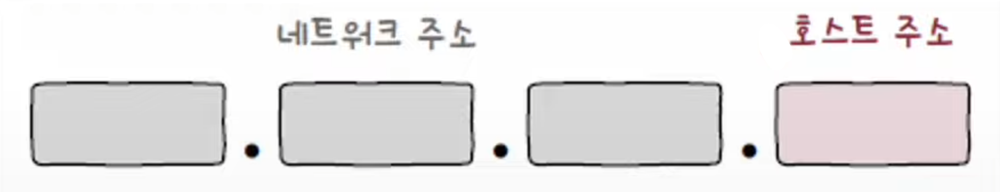
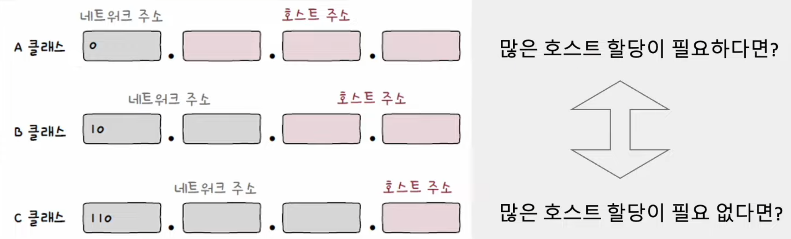
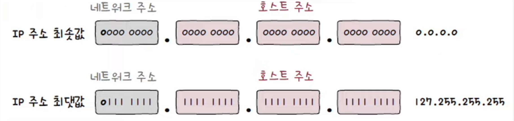
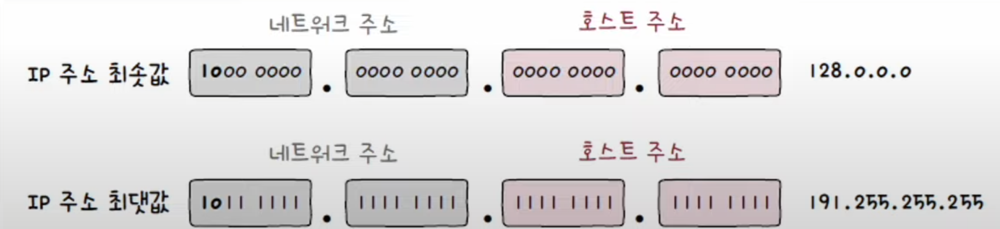
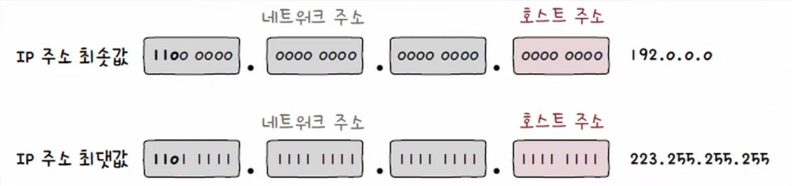
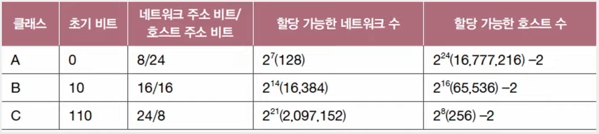
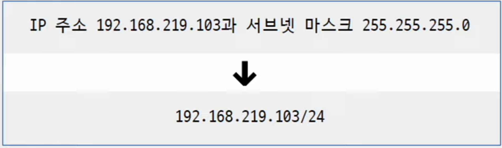
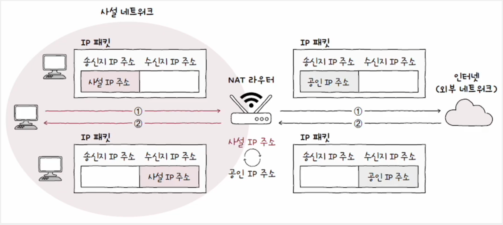
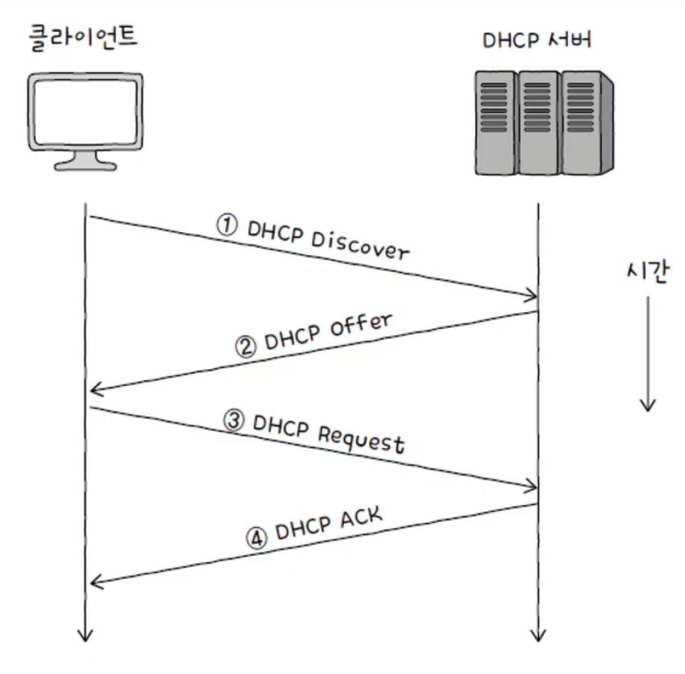

# 네트워크 - 네트워크 계층

## 네트워크 주소와 호스트 주소

하나의 IP 주소는 크게 **네트워크 주소**(네트워크 ID, 네트워크 식별자)와 **호스트 주소**(호스트 ID, 호스트 식별자)로 구성된다.

예를 들어 다음은 네트워크 주소가 16비트, 호스트 주소가 16비트인 IP 주소이다.

만약 네트워크 주소가 하나의 옥텟(8비트)으로 이루어져 있다면, 한 네트워크당 호스트 주소 할당에 24비트를 사용할 수 있다.

또 만약 네트워크 주소가 세 개의 옥텟으로 이루어져 있다면, 네트워크당 호스트 주소 할당에 8비트를 사용할 수 있다.

호스트 주소 공간을 크게 할당하면 할당되지 않은 다수의 IP 주소가 낭비될 수 있다. 반대로 호스트 주소 공간을
작게 할당하면 호스트가 사용할 IP 주소가 부족해질 수 있다.

이런 고민을 해결하기 위해 생겨난 개념이 바로 IP 주소의 **클래스**이다.

---

## 클래스풀 주소 체계

- **클래스**는 네트워크 크기에 따라 IP 주소를 분류하는 기준이다.
- 클래스를 기반으로 IP 주소를 관리하는 주소 쳬게를 **클래스풀 주소 체계**라고 한다.
- 필요한 호스트 IP 개수에 따라 네트워크 크기를 가변적으로 조정할 수 있다.

A, B, C, D, E 5개의 클래스가 있으며, 이중 D와 E는 예약된 클래스이기 때문에 네트워크의 크기를 나누는 데에
실질적으로 사용되는 클래스는 A, B, C 이다.

### A 클래스

- 네트워크 주소는 비트 `0`으로 시작하는 1옥텟, 호스트 주소는 3옥텟으로 구성된다.
- 이론상 `2^7`개의 A 클래스 네트워크가 존재할 수 있고, `2^24`개의 호스트 주소를 가질 수 있다.
- A 클래스로 나타낼 수 있는 IP 주소 범위는 최소 `0.0.0.0` ~ 최대 `127.255.255.255`이다.

### B 클래스

- 네트워크 주소는 비트 `10`으로 시작하는 2옥텟, 호스트 주소는 2옥텟으로 구성된다.
- 이론상 `2^14`개의 B 클래스 네트워크가 존재할 수 있고, `2^16`개의 호스트 주소를 가질 수 있다.
- B 클래스로 나타낼 수 있는 IP 주소 범위는 최소 `128.0.0.0` ~ 최대 `191.255.255.255`이다.

### B 클래스

- 네트워크 주소는 비트 `110`으로 시작하는 3옥텟, 호스트 주소는 1옥텟으로 구성된다.
- 이론상 `2^21`개의 C 클래스 네트워크가 존재할 수 있고, `2^8`개의 호스트 주소를 가질 수 있다.
- C 클래스로 나타낼 수 있는 IP 주소 범위는 최소 `192.0.0.0` ~ 최대 `223.255.255.255`이다.

호스트 주소가 전부 0인 IP 주소와 전부 1인 IP 주소는 각각 해당 네트워크 자체를 의미하는 네트워크 주소로 사용되고,
브로드캐스트를 위한 주소로 사용되기 때문에 IP 주소로 활용할 수 없다.

즉, 각 클래스에서 이론적으로 가능한 호스트 주소의 개수에 2를 뺀 값이 실질적으로 가능한 호스트에게
할당 가능한 주소이다.

---

## 클래스리스 주소 체계

- 클래스풀 주소 체계를 이용하면 네트워크의 영역을 결정하고 할당 가능한 호스트의 주소 공간을 유동적으로 관리할 수 있지만 한계가 있다.
- 클래스별 네트워크의 크기가 고정되어 있기 때문에 다수의 IP 주소가 낭비될 가능성이 크다는 문제가 있다.

그래서 클래스풀 주소 체계보다 더 유동적이고 정교하게 네트워크를 구획할 수 있는 **클래스리스 주소 체계**가 등장했다.
이름처럼 클래스 개념 없이 클래스에 구애받지 않고 네트워크의 영역을 나누어서 호스트에게 IP 주소 공간을 할당하는 방식이다.

### 서브넷 마스크

클래스리스 주소 체계에서는 네트워크와 호스트를 구분 짓는 수단으로 **서브넷 마스크**를 이용한다.

**서브넷 마스크**는 IP 주소상에서 네트워크 주소는 `1`, 호스트는 `0`으로 표기한 비트열을 의미한다. 네트워크 내의
부분적인 네트워크(서브네트워크)를 구분 짓는 (마스크) 비트열인 셈이다.

예를 들면 A, B, C 클래스의 기본 서브넷 마스크는 다음과 같다.

- A 클래스 : `255.0.0.0 (11111111.00000000.00000000.00000000)`
- B 클래스 : `255.255.0.0 (11111111.11111111.00000000.00000000)`
- C 클래스 : `255.255.0.0 (11111111.11111111.11111111.00000000)`

### 서브네팅

- 서브넷 마스크를 이용해 클래스를 원하는 크기로 더 잘게 쪼개어 사용하는 것을 **서브네팅**이라고 한다.
- 서브넷 마스크를 이용해 네트워크 주소와 호스트 주소를 구분 짓는 방법은 
IP 주소와 서브넷 마스크를 비트 AND 연산하면 된다. 이 결과가 네트워크 주소가 된다.

### 서브넷 마스크 - CIDR 표기법

- "IP 주소 / 서브넷 마스크상의 1의 개수"로 표기하는 형식을 CIDR 표기법이라고 한다.
- 예를 들어 C 클래스의 기본 서브넷 마스크(`11111111.11111111.11111111.00000000`)를 CIDR 표기법을 따르면 `/24`로 표기할 수 있다.

---

## 공인 IP 주소와 사설 IP 주소

### 공인 IP 주소

- 전 세계에서 고유한 IP 주소
- 네트워크 간의 통신, 인터넷을 이용할 때 사용하는 IP 주소
- ISP나 공인 IP 주소 할당 기관을 통해 할당받을 수 있다.

### 사설 IP 주소 (with NAT)

- 사설 네트워크에서 사용하기 위한 IP 주소
- 사설 네트워크란 인터넷, 외부 네트워크에 공개되지 않은 네트워크를 의미한다.
- IP 주소 공간 중 사설 IP 주소로 사용하도록 특별히 예약된 IP 주소 공간
  - `10.0.0.0/8 (10.0.0.0 - 10.255.255.255)`
  - `172.16.0.0/12 (172.16.0.0 - 172.31.255.255)`
  - `192.168.0.0/16 (192.168.0.0 - 192.168.255.255)`
- 사설 IP 주소의 할당 주체는 일반적으로 라우터(공유기)이다.
- 할당받은 사설 IP 주소는 해당 호스트가 속한 사설 네트워크상에서만 유효한 주소다. 따라서 다른 네트워크상의
사설 IP 주소와 충분히 중복될 수 있다.

일반적으로 네트워크 간의 통신은 공인 IP 주소를 통해 이루어진다. 그렇다면 **사설 IP 주소를 사용하는
외부 네트워크와 어떻게 통신할까?**

- 이때 사용되는 기술이 NAT이다. **NAT(Network Address Translation)** 는 IP 주소를 변환하는 기술이다.
- 주로 네트워크 내부에서 사용되는 사설 IP 주소와 네트워크 외부에서 사용되는 공인 IP 주소를 변환하는 데 사용된다.
- 대부분의 라우터와 (가정용)공유기는 NAT 기능을 내장하고 있다.
  - 사설 네트워크의 패킷 속 사설 IP 주소는 공유기를 거쳐 공인 IP 주소로 변경된다.
  - 외부 네트워크의 패킷 속 공인 IP 주소는 공유기를 거쳐 사설 IP 주소로 변경된다.

---

## 정적 IP 주소와 동적 IP 주소

### 정적 IP 주소

- 호스트에 직접 수작업으로 IP 주소를 부여하는 방식을 **정적 할당**이라고 한다. 그리고 이렇게 할당된 IP 주소를 **정적 IP 주소**라고 한다.

### 동적 IP 주소

- IP 주소를 정적으로만 할당하다 보면 호스트의 수가 많아질 경우 관리가 힘들어진다. 잘못된 IP 주소를 입력할 수도 있고, 중복된 IP 주소를 입력할 수도 있다.
- 이럴 때 사용 가능한 할당 방식이 **동적 할당**이며, 동적 할당으로 할당된 IP 주소를 **동적 IP 주소**라고 한다.
- IP 동적 할당에 사용되는 대표적인 프로토콜은 **DHCP** 이다.

### DHCP (Dynamic Host Configuration Protocol)

- DHCP를 통한 IP 주소 할당은 IP 주소를 할당받고자 하는 호스트와 해당 호스트에게 IP 주소를 제공하는 DHCP 서버간에 메시지 송수신을 통해 이루어진다.
- DHCP 서버의 역할은 일반적으로 라우터(공유기)가 수행하는데, 특정 호스트에 DHCP 서버 기능을 추가할 수도 있다.
- DHCP 서버는 클라이언트에게 할당 가능한 IP 주소 목록을 관리하다가, 클라이언트 요청시 IP 주소를 할당한다.
- **DHCP 로 할당받은 IP 주소는 사용할 기간(임대 기간)이 정해져 있다.** 일반적으로 수 시간에서 수 일이며, 임대 기간이 끝난 IP 주소는 다시 DHCP 서버로 반납된다.

IP 주소를 할당받는 과정에서 클라이언트와 DHCP 서버 간에 주고받는 메시지의 종류는 크게 다음과 같이 네 가지가 있다.

#### 1. DHCP Discover (클라이언트 -> DHCP 서버)

- 브로드캐스트로 DHCP 서버를 찾는 메시지를 전송한다.
- 이 시점에 클라이언트는 아직 IP 주소를 할당받지 못한 것이므로 송신지 IP 주소는 `0.0.0.0`으로 설정된다.

#### 2. DHCP Offer (DHCP 서버 -> 클라이언트)

- 클라이언트에게 할당 가능한 IP 주소 정보를 제안하는 메시지
- 클라이언트에게 제안할 IP 주소 외에 서브넷 마스크, 임대 기간 등의 정보도 포함되어 있다.

#### 3. DHCP Request (클라이언트 -> DHCP 서버)

- DHCP Offer에 대한 응답으로, 브로드캐스트로 전송된다.

#### 4. DHCP ACK (DHCP 서버 -> 클라이언트)

- 최종 승인과도 같은 메시지로, DHCP ACK 메시지까지 받은 클라이언트는 이제 할당받은 IP 주소를 자신의 IP 주소로 설정 후 **임대 기간 동안** IP 주소를 사용한다.

> - 사용 기간이 모두 끝나면 원칙적으로는 IP 주소가 DHCP 서버에 반납되고 위 과정을 다시 거쳐 IP 주소를 재할당받아야 한다.
> - 하지만 IP 주소 임대 기간이 끝나기 전에 임대 기간을 연장하는 **임대 갱신**을 할 수도 있다.
> - 임대 갱신은 IP 주소의 임대 기간이 끝나기 전에 기본적으로 두 차례 자동으로 수행된다.
> - 자동 임대 갱신 과정이 모두 실패하면 그때 IP 주소는 DHCP 서버로 반납된다.

---

[이전 ↩️ - 네트워크 계층 - 개요](https://github.com/genesis12345678/TIL/blob/main/cs/network/network_layer/Basic.md)

[메인 ⏫](https://github.com/genesis12345678/TIL/blob/main/cs/network/Main.md)

[다음 ↪️ - 네트워크 계층 - 라우팅](https://github.com/genesis12345678/TIL/blob/main/cs/network/network_layer/Routing.md)