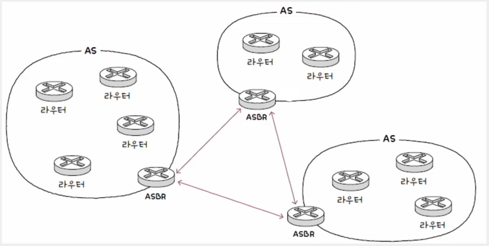
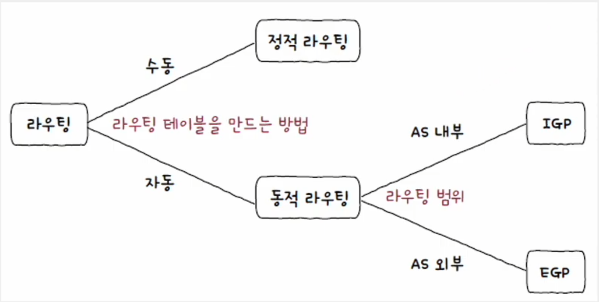
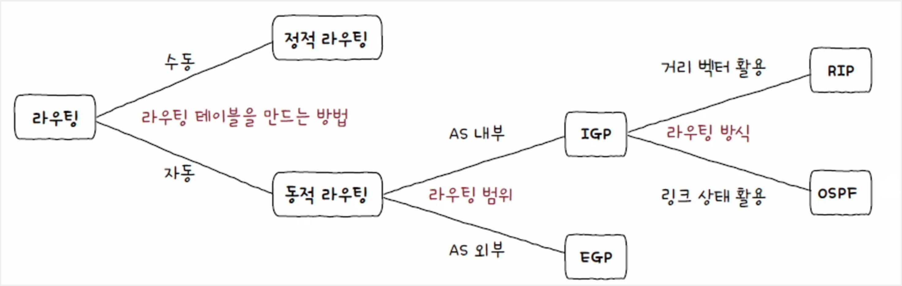
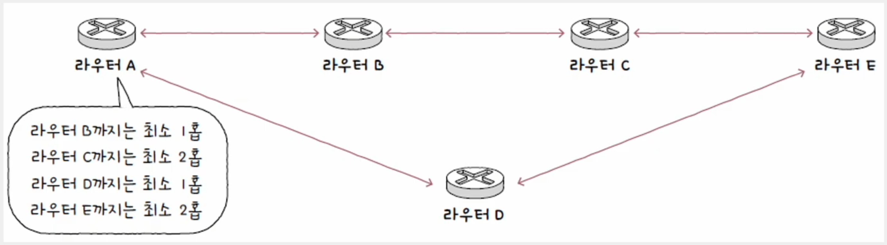
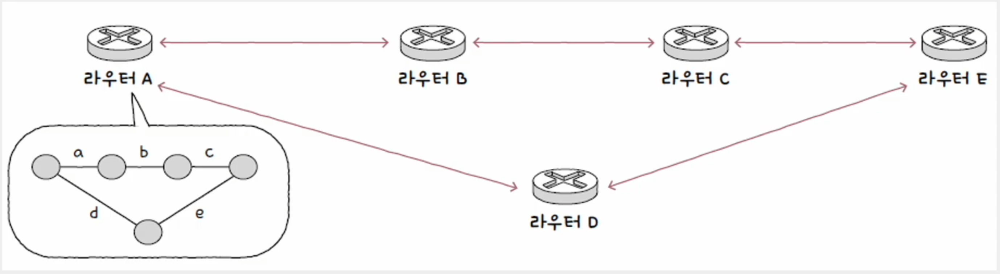
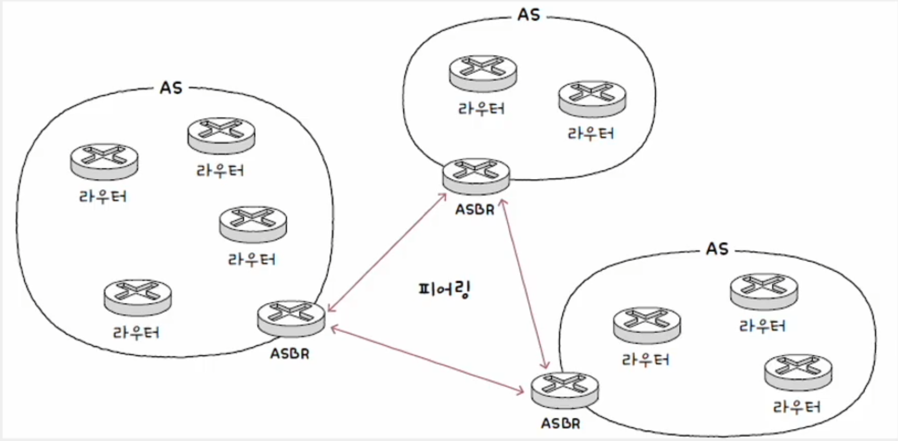
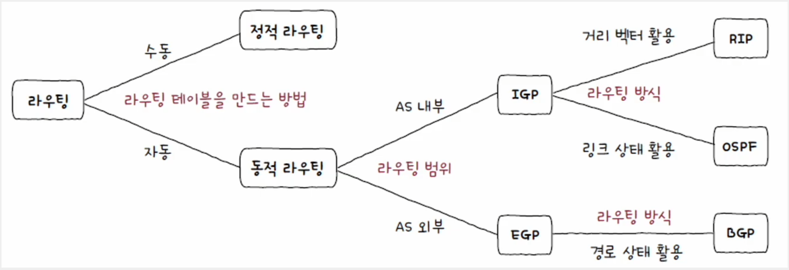

# 네트워크 - 네트워크 계층

## 라우팅 테이블

- 라우터의 핵심 기능은 패킷이 이동할 최적의 경로를 설정한 뒤 해당 경로로 패킷을 이동시키는 것이고, 이를 **라우팅**이라고 한다.
- 이러한 라우팅의 핵심은 라우터가 저장하고 관리하는 **라우팅 테이블**이다. 라우팅 테이블은 특정 수신지까지
도달하기 위한 정보를 명시한 일종의 표와 같은 정보이다. 라우터는 라우팅 테이블을 참고해 수신지까지의 도달 경로를 판단한다.

라우팅 테이블에 포함된 정보는 라우팅 방식, 호스트의 환경에 따라 달라질 수 있는데, 공통적이자 핵심적인 정보는 다음과 같다.

- **수신지 IP 주소와 서브넷 마스크**
  - 최종적으로 패킷을 전달할 대상
- **다음 홉**
  - 최종 수신지까지 가기 위해 다음으로 거쳐야 할 호스트의 IP 주소나 인터페이스
  - 게이트웨이라고 명시되기도 한다.
- **네트워크 인터페이스**
  - 패킷을 내보낼 통로
  - 인터페이스(NIC) 이름이 직접적으로 명시되거나 인터페이스에 대응하는 IP 주소가 명시된다.
- **메트릭**
  - 해당 경로로 이동하는 데에 드는 비용
  - 라우팅 테이블의 여러 경로 중 메트릭이 낮은 경로를 선호한다.

패킷 내의 수신지 IP 주소가 라우팅 테이블에 있는 수신지 IP 주소, 서브넷 마스크 항목과 일치하지 않을 수 있다.
즉, 라우팅 테이블에 없는 경로로 패킷을 전송해야 할 때가 있다. 이 경우 기본적으로 패킷을 내보낼 경로를 설정하여
해당 경로로 패킷을 내보낼 수 있는데, 이 기본 경로를 **디폴트 라우트**라고 한다.

디폴트 라우트는 모든 IP 주소를 의미하는 `0.0.0.0/0`로 명시한다.

---

## 정적 라우팅과 동적 라우팅

### 정적 라우팅

- 사용자가 수동으로 직접 채워 넣은 라우팅 테이블의 항목을 토대로 라우팅되는 방식
- 라우팅 테이블 항목을 다루는 명령어가 있다. 이렇게 수동으로 구성된 라우팅 테이블 항목을 통해
수행되는 라우팅을 정적 라우팅이라 표현한다.

### 동적 라우팅

- 네트워크의 규모가 커지고 관리해야 할 라우터가 늘어나면 정적 라우팅만으로는 관리가 힘들어진다.
- **동적 라우팅**은 자동으로 라우팅 테이블 항목을 만들고, 이를 이용하여 라우팅하는 방식이다.
- 동적 라우팅을 하면 라우팅 테이블 항목이 수시로 변할 수 있고, 네트워크 경로상에 문제가 발생했을 때
이를 우회할 수 있게 경로가 자동으로 갱신되기도 한다.

---

## 라우팅 프로토콜

> 

>     

>         <b> 라우터들의 집단 네트워크, AS </b>
>     

> <li>동적 라우팅과 라우팅 프로토콜을 이해하기 위한 배경지식이 있다.</li> 
> <li>동일한 라우팅 정책으로 운용되는 라우터들의 집단 네트워크인 <b>AS(Autonomous System)</b>이다.</li>
> <li>AS마다 인터넷 상에서 고유한 AS 번호가 할당된다. AS 번호는 사설 IP 주소처럼 사실 AS 번호도 있지만, 일반적으로 고유한 번호를 지칭한다.</li>
> 
> 한 AS 내에는 다수의 라우터가 있다. 라우터들은 AS 내부에서만 통신할 수도 있고, AS 외부와 통신할 수도 있다.
> AS 외부와 통신할 경우 AS 경계에서 AS 내외로 통신을 주고받을 수 있는 **AS 경계 라우터**라는 특별한 라우터를 이용한다.
> 
> 
> 
> 

- **라우팅 프로토콜**은 라우터끼리 자신들의 정보를 교환하며 패킷이 이동할 최적의 경로를 찾기 위한 프로토콜이다.
- 라우팅 프로토콜은 크게 AS 내부에서 수행되느냐, AS 외부에서 수행되느냐에 따라 종류를 나눌 수 있다.

### IGP (Interior Gateway Protocol)

- 대표적인 IGP로는 **RIP(Routing Information Protocol)** 와 **OSPF(Open Shortest Path First)** 가 있다.
- 최적의 경로를 선택하는 과정에서 RIP는 거리 벡터를, OSPF는 링크 상태를 사용하는 라우팅 프로토콜이다.

#### RIP - 거리 벡터 기반의 라우팅 프로토콜
- 거리는 패킷이 경유한 라우터의 수, 즉 홉의 수를 의미한다.
- 특정 수신지까지 도달하기 위해 홉 수가 가장 적은 경로를 최적의 경로라고 판단한다.
- 홉 수가 적을수록 라우팅 테이블상의 메트릭 값도 작아진다.
- 주기적으로 인접 라우터끼리 경로 정보를 교환하며 라우팅 테이블을 갱신하고, 특정 수신지까지의 홉 수를 계산한다.

#### OSPF - 링크 상태 라우팅 프로토콜
- 현재 네트워크 구성을 지도처럼 그린 뒤 최적의 경로를 선택한다.
- 현재 네트워크의 상태(링크 정보)를 그래프의 형태로 **링크 상태 데이터베이스**에 저장한다. 링크 상태 데이터베이스에는
라우터들의 연결 관계, 연결 비용 등 네트워크의 상태를 그래프로 표현하기 위한 데이터가 저장되어 있다.
- 최적의 경로를 결정하기 위해 대역폭을 기반으로 메트릭을 계산한다. 대역폭이 높은 링크일수록 메트릭이 낮은 경로로 인식한다.

### EGP (Exterior Gateway Protocol)

- 대표적인 EGP로는 **BGP(Border Gateway Protocol)** 가 있다.
- AS 간의 통신에서 사용되는 대표적인 프로토콜로, 엄밀하게는 AS 간의 통신이 "가능한" 프로토콜이다.
- AS 간의 통신을 위한 e(external)BGP, AS 내의 통신을 위한 i(internal)BGP라고도 한다.
- BGP 메시지를 주고받을 수 있도록 연결된 BGP 라우터를 **피어(peer)** 라고 한다. 즉, 다른 AS 와의 BGP 연결을
유지하기 위해서는 BGP 라우터끼리 연결되어 피어가 되어야 하며, 이렇게 피어 관계가 되도록 연결하는 과정을 **피어링(peering)** 이라고 한다.

BGP에는 경로에 대한 부가 정보인 속성이 있다. 대표적인 속성으로는 세 가지가 있다.

#### 1. AS-PATH 속성

- 메시지가 수신지에 이르는 과정에서 통과하는 AS들의 목록
- 메시지가 AS를 거칠 때마다 `AS-PATH`에는 거쳐 간 AS가 추가된다.

이 속성과 관련된 BGP의 특징 두 가지가 있다.

1. BGP는 AS 간 라우팅을 할 때 거치게 될 라우터의 수가 아닌 AS의 수를 고려한다.
- `AS-PATH` 길이가 더 짧은 경로가 거치게 될 라우터의 홉 수가 더 많을 수 있다.
2. BGP는 RIP처럼 단순히 수신지에 이르는 "거리"가 아닌, 메시지의 "경로"를 고려한다.
- BGP는 경로 벡터 라우팅 프로토콜의 일종이라 부르기도 한다.

#### 2. NEXT-HOP 속성

- 다음 홉, 다음으로 거칠 라우터의 IP 주소

#### 3. LOCAL-PREF 속성

- LOCAL PREFerence, 지역 선호도
- AS 외부 경로 선택에 있어 AS 내부에서(local) 어떤 경로를 선호할지에 대한 척도를 나타내는 속성이다.
- 일반적으로 `AS-PATH`나 `NEXT-HOP` 속성보다 우선시된다.

---

[이전 ↩️ - 네트워크 계층 - IP 주소](https://github.com/genesis12345678/TIL/blob/main/cs/network/network_layer/IP.md)

[메인 ⏫](https://github.com/genesis12345678/TIL/blob/main/cs/network/Main.md)

[다음 ↪️ - 전송 계층 - 개요]()