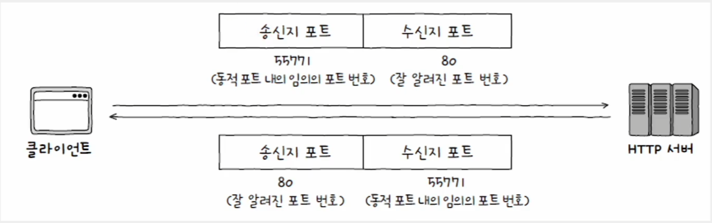
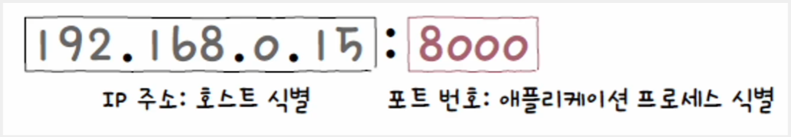
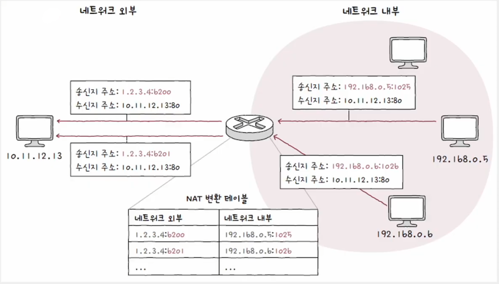
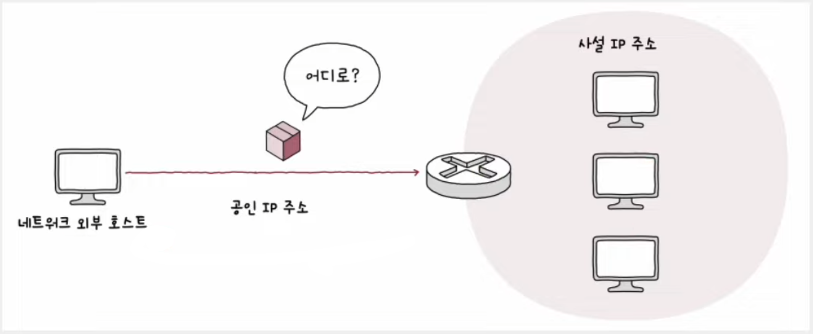
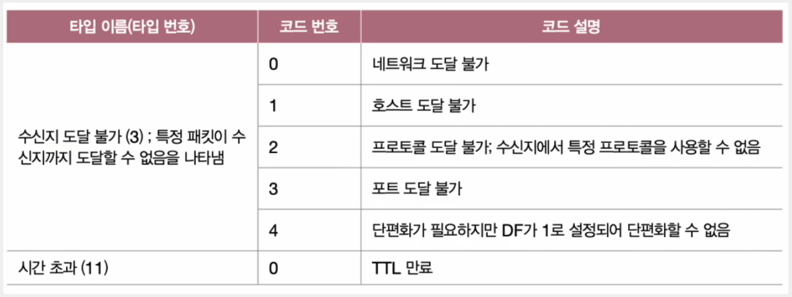

# 네트워크 - 전송 계층

## IP의 한계

- 네트워크 계층의 핵심 프로토콜인 IP는 크게 IP 단편화와 IP 주소 지정을 하는데, 외에도 IP의 한계라고
볼 수 있는 두 가지 중요한 특징이 있다.
-  IP는 **비신뢰성 프로토콜**이자 **비연결형 프로토콜**이다. 즉, IP를 통한 패킷의 전달은 신뢰성이 없는
통신이자 연결을 수립하는 과정이 없는 통신이다.
- **신뢰할 수 없는 통신**은 패킷이 수신지까지 제대로 전송되었다는 보장을 하지 않는 특징이다. 다른 말로 최선형 전달
이라고 부르는데, "최선을 다해 보겠지만 전송 결과에 대해서는 어떠한 보장도 하지 않겠다"라는 것을 의미한다.
- **비연결형 통신**은 송수신 호스트 간에 사전 연결 수립 작업을 거치지 않는 특징을 의미한다. 그저 수신지를 향해
패킷을 보내기만 할 뿐이다.
- IP가 신뢰할 수 없는, 비연결형 통신을 하는 주된 이유는 성능 때문이다. 신뢰성 있는 전송이 모든 경우에 필요한 것은 아니다.

---

## 포트

- **포트(port)** 란 특정 애플리케이션을 식별할 수 있는 정보이다.
- 패킷을 전송할 때, 수신지 호스트의 주소까지 전달했다고 해서 전송이 끝난 것이 아니고, 실행 중인 특정
  애플리케이션 프로세스까지 전달되어야 한다. 패킷의 최종 수신 대상은 특정 애플리케이션 프로세스인 것이다.

### 포트의 분류

- 전송 계층에서는 포트 번호를 통해 특정 애플리케이션을 식별한다. 정확히는 패킷 내 송수신지 포트를 통해 송수신지
호스트의 애플리케이션을 식별한다.
- 포트 번호는 16비트로 표현 가능하여 사용 가능한 포트의 수는 `2^16(65536)`개로, 할당 가능한 포트 번호는 `0 ~ 65535`번이다.

| 포트 종류    | 포트 번호 범위      |
|----------|---------------|
| 잘 알려진 포트 | 0 ~ 1023      |
| 등록된 포트   | 1024 ~ 49151  |
| 동적 포트    | 49152 ~ 65535 |

0번부터 1023번까지의 포트 번호는 **잘 알려진 포트(well-known port)** 로, 대표적으로 다음과 같이 있다.

| 잘 알려진 포트 번호 | 설명     |
|-------------|--------|
| 20, 21      | FTP    |
| 22          | SSH    |
| 23          | TELNET |
| 53          | DNS    |
| 67,68       | DHCP   |
| 80          | HTTP   |
| 443         | HTTPS  |

1024번부터 49151번까지는 **등록된 포트(registerd port)** 로, 대표적으로 다음과 같이 있다.

| 등록된 포트 번호 | 설명                          |
|-----------|-----------------------------|
| 1194      | OpenVPN                     |
| 1433      | Microsoft SQL Server 데이터베이스 |
| 3306      | MySQL 데이터베이스                |
| 6379      | Redis                       |
| 8080      | HTTP 대체                     |

- 49152번부터 65535번까지는 **동적 포트(dynamic port)**, 사설 포트, 임시 포트라고 부른다.
- 특별히 관리되지 않은 포트 번호 범위로 자유롭게 사용할 수 있다.
- 서버는 대부분 잘 알려진 포트와 등록된 포트를 사용하고, 클라이언트는 대부분 동적 포트를 사용한다.

포트 번호는 일반적으로 다음과 같이 IP 주소와 함께 표기되는 경우가 많다. IP 주소와 포트 번호로 특정 
호스트에서 실행 중인 특정 애플리케이션 프로세스를 식별할 수 있다.

---

## 포트 기반 NAT

- [NAT](https://github.com/genesis12345678/TIL/blob/main/cs/network/network_layer/IP.md#%EA%B3%B5%EC%9D%B8-ip-%EC%A3%BC%EC%86%8C%EC%99%80-%EC%82%AC%EC%84%A4-ip-%EC%A3%BC%EC%86%8C)는
IP 주소를 변환하는 기술로, 사설 IP 주소와 공인 IP 주소를 변환하는 데 사용된다. 이러한 변환을 위해 주로
사용되는 것이 NAT **변환 테이블**이다.
- NAT 변환 테이블(NAT 테이블)에는 변환의 대상이 되는 IP 주소 쌍이 명시되어 있다.

- 위와 같이 사설 IP 주소 하나당 공인 IP 주소 하나가 대응되는 방식은 사설 IP 주소의 수만큼
공인 IP 주소가 필요하기 때문에 **공인 IP 주소의 낭비**라고 볼 수 있다.
- 이러한 한계를 극복하기 위해 포트가 활용된다.

### NAPT (Network Address Port Translation)

- 포트 기반의 NAT를 **NAPT**라고 한다.
- NAPT는 포트를 활용해 하나의 공인 IP 주소를 여러 사설 IP 주소가 공유할 수 있도록 하는 NAT의 일종이다.
- NAPT는 NAT 테이블에 변환할 IP 주소 쌍과 더불어 **포트 번호도 함께 기록하고 변환한다.**
- 사설 IP 주소와 공인 IP 주소를 `N:1`로 관리하여 공인 IP 주소 수 부족 문제를 개선한 기술이다.

---

## 포트 포워딩 (Port Forwarding)

- 네트워크 내 특정 호스트에 IP 주소와 포트 번호를 미리 할당하고, 해당 `IP 주소:포트 번호`로써 
해당 호스트에게 패킷을 전달하는 기능

예를 들어, 네트워크 내부의 여러 호스트가 공인 IP 주소를 공유하는 상황에서 네트워크 외부에서 내부로
통신을 시작하는 상황일 때, 외부 호스트 입장에서는 어떤 IP 주소 및 포트를 수신지 주소로 삼아야 할까?

- 이때 주로 사용되는 것이 포트 포워딩이다.
- 특정 IP 주소와 포트 번호 쌍을 특정 호스트에게 할당한 뒤, 외부에서 통신을 시작할 호스트에게 해당
접속 정보(IP 주소:포트 번호 쌍)을 알려주면 된다.
- 이처럼 포트 포워딩은 주로 네트워크 외부에서 내부로 통신을 시작할 때, 네트워크 내부의 서버를 외부에서
접속할 수 있도록 접속 정보를 공개하기 위해 자주 사용된다.

---

## ICMP (Internet Control Message Protocol)

- IP의 신뢰할 수 없는 전송 특성과 비연결형 전송 특성을 보완하기 위한 네트워크 계층의 프로토콜
- ICMP는 IP 패킷 전송 과정에 대한 **피드백 메시지**를 제공한다. 메시지의 종류로는 크게 **전송 과정에서 발생한
문제 상황에 대한 오류 보고**와 **네트워크에 대한 진단 정보(네트워크상의 정보 제공)** 가 있다.
- ICMP 메시지는 타입과 코드로 정의된다. 타입에는 ICMP 메시지 유형 번호, 코드에는 구체적인 메시지 내용
번호가 명시된다.

**오류 보고**를 위한 대표적인 ICMP 메시지 타입으로는 수신지 도달 불가와 시간 초과가 있다.

**네트워크상의 정보 제공**을 위한 대표적인 ICMP 메시지는 다음과 같다.

> 유의할 점은, **ICMP가 IP의 신뢰성을 보장하는 것은 아니다.**
> 
> ICMP는 IP의 신뢰할 수 없는 특성을 보완하기 위한 도우미 역할만을 할 뿐, IP 패킷은 수신지까지
> 도달하지 못하거나 ICMP 메시지를 담은 패킷 자체가 송신지까지 되돌아오지 못할 수 있다.
> 
> 신뢰성을 완전히 보장하기 위해서는 전송 계층의 프로토콜이 필요하다.
> 
> 참고 : [공식 문서(RFC 792)](https://datatracker.ietf.org/doc/html/rfc792)

---

[이전 ↩️ - 네트워크 계층 - 라우팅](https://github.com/genesis12345678/TIL/blob/main/cs/network/network_layer/Routing.md)

[메인 ⏫](https://github.com/genesis12345678/TIL/blob/main/cs/network/Main.md)

[다음 ↪️ - 전송 계층 - TCP와 UDP](https://github.com/genesis12345678/TIL/blob/main/cs/network/transport_layer/TCP_UDP.md)