# 네트워크 - 전송 계층

## 오류 제어 (재전송 기법)

- TCP 세그먼트에 오류 검출을 위한 체크섬 필드가 있지만, 체크섬은 세그먼트의 훼손 여부만 나타낼 뿐이다. 따라서
체크섬만으로는 송신 호스트가 세그먼트 전송 과정에 문제가 있다는 것을 인지할 수는 없다.
- TCP가 신뢰성을 제대로 보장하려면 **송신 호스트가 송신한 세그먼트에 문제가 발생했음을 인지할 수** 있어야 하고, **오류를 감지하게 되면
해당 세그먼트를 재전송할 수** 있어야 한다.

TCP가 오류를 검출하고 세그먼트를 재전송하는 상황에는 크게 두 가지가 있다.

#### 1. 중복된 ACK 세그먼트를 수신했을 때

- TCP는 중복된 `ACK` 세그먼트를 수신했을 때 오류가 생겼음을 감지한다.
- 수신 호스트 측이 받은 세그먼트의 순서 번호 중에서 일부가 누락되었다면 중복된 `ACK` 세그먼트를 전송하게 된다.(밑 오른쪽 그림)

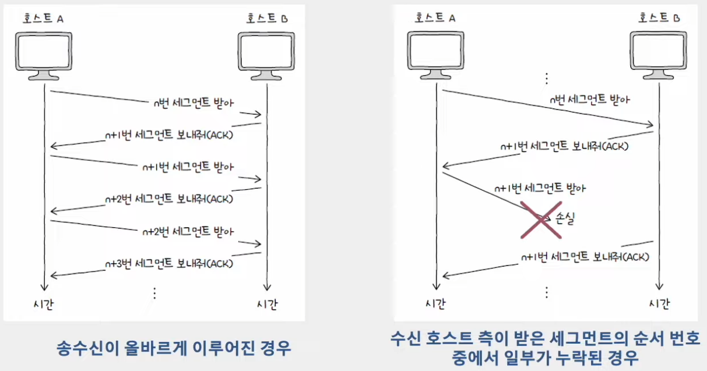

#### 2. 타임아웃이 발생했을 때

- TCP는 타임아웃이 발생하면 문제가 생겼음을 인지한다.
- 호스트가 세그먼트를 전송할 때마다 **재전송 타이머**라는 값을 시작한다. 이 타이머의 카운트다운이 끝난 상황을 **타임아웃**이라고 한다.
- 타임아웃이 발생할 때까지 `ACK` 세그먼트를 받지 못하면 세그먼트가 상대 호스트에게 정상적으로 도착하지 않았다고 간주하고 세그먼트를 재전송한다.

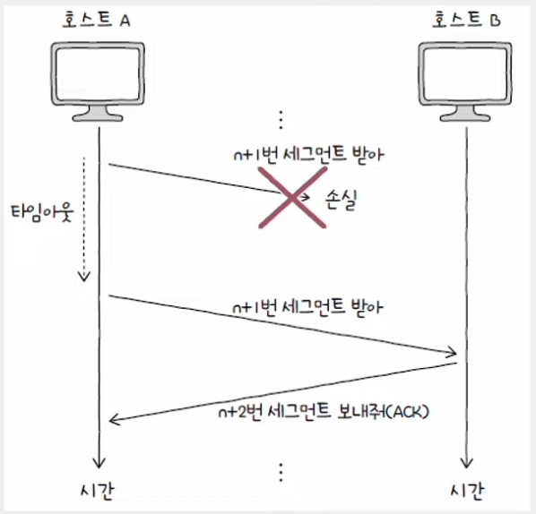

수신 호스트의 답변(ACK)과 타임아웃 발생을 토대로 문제를 진단하고, 문제가 생긴 메시지를 재전송함으로써 신뢰성을 확보하는 방식을 **ARQ(Automatic Repeat Request, 자동 재전송 요구)**
라고 한다. 가장 대표적인 ARQ의 세 가지 종류에 대해 알아보자.

### Stop-and-Wait ARQ

- ARQ 중 가장 단순한 방식으로, 제대로 전달했음을 확인하기 전까지는 새로운 메시지를 보내지 않는 방식이다.
- 즉, 메시지를 송신하고 이에 대한 확인 응답을 받는 것을 반복한다. 단순하지만, 높은 신뢰성을 보장하는 방식이다.
- 하지만 네트워크의 이용 효율이 낮아지고, 성능이 저하될 수 있다는 문제가 있다.

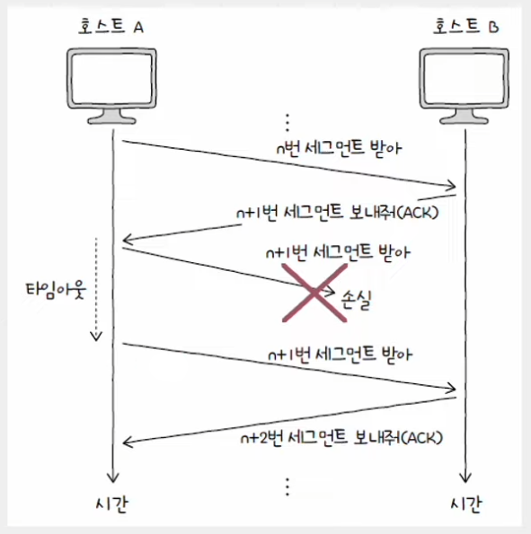

> - Stop-and-Wait 방식의 문제를 해결하려면 각 세그먼트에 대한 ACK 세그먼트가 도착하기 전이더라도 여러 세그먼트를 보낼 수 있어야 한다.
> - 연속해서 메시지를 전송할 수 있는 기술을 **파이프라이닝**이라고 한다.
>
> 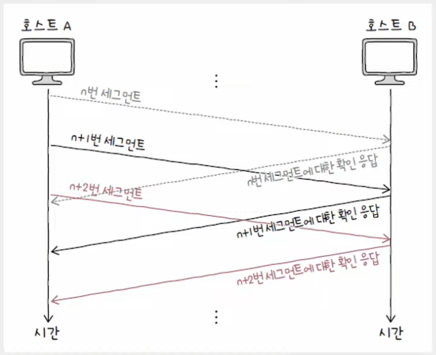

### Go-Back-N ARQ

- 파이프라이닝 방식을 활용해 여러 세그먼트를 전송하고, 도중에 잘못 전송된 세그먼트가 발생할 경우 해당 세그먼트부터 전부 다시 전송하는 방식
- 순서 번호 n번에 대한 `ACK` 세그먼트는 "n번만의" 확인 응답이 아닌 "n번까지의" 확인 응답이라는 점에서 **Go-Back-N ARQ**의 `ACK` 세그먼트를 **누적 확인 응답**이라고 한다.

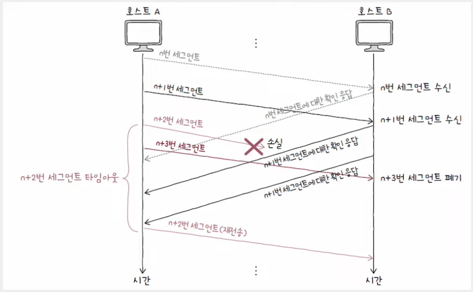

> **빠른 재전송**
> 
> - 재전송 타이머가 만료되기 전이라도 세 번의 동일한 ACK 세그먼트를 받았다면 곧바로 재전송하는 기능
> - 타이머가 끝날 대까지 기다리는 시간을 줄일 수 있다.
> 
> 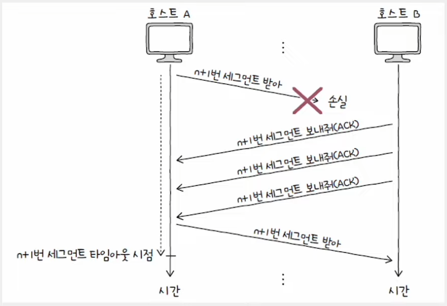

### Selective Repeat ARQ

- 선택적으로 재전송하는 방법으로, 각각의 패킷들에 대해 ACK 세그먼트를 보내는 방식
- **Go-Back-N ARQ**의 `ACK` 세그먼트가 **누적 확인 응답**이라면, **Selective Repeat ARQ**의 `ACK` 세그먼트는 **개별 확인 응답**이다.
- 오늘날 대부분의 호스트는 TCP 통신에서 **Selective Repeat ARQ**를 지원한다.

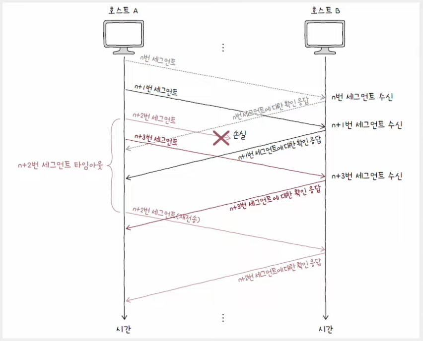

---

## 흐름 제어

- **송신 호스트가 수신 호스트의 처리 속도를 고려하며 송수신 속도를 균일하게 유지하는 기능**
- 호스트가 한 번에 받아서 처리할 수 있는 세그먼트의 양에는 한계가 있다. 따라서 파이프라이닝 기반의 **Go-Back-N ARQ와 Selective Repeat ARQ**가 정상적으로
동작하려면 수신 호스트가 한 번에 얼마나 받아 처리할 수 있는지 반드시 고려해야 한다.
  - Stop-and-Wait ARQ를 사용하면 별도의 흐름 제어가 필요하지 않다.
- **수신 버퍼** : 수신된 세그먼트가 애플리케이션 프로세스에 의해 읽히기 전 임시로 저장되는 공간
- **버퍼 오버플로우** : 저장 가능한 공간보다 더 많은 데이터가 저장되는 상황

TCP에서는 흐름 제어로 **슬라이딩 윈도우**를 사용한다. **윈도우**란, 송신 호스트가 파이프라이닝할 수 있는 최대량을 의미한다. 즉, 윈도우의 크기만큼
확인 응답을 받지 않고도 한 번에 전송 가능하다는 의미이다.

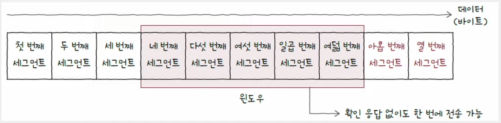

> **수신 호스트도 윈도우를 고려한다**. 송신 측 윈도우는 수신 호스트가 알려주는 수신 측 윈도우를 토대로 알 수 있는 정보다.

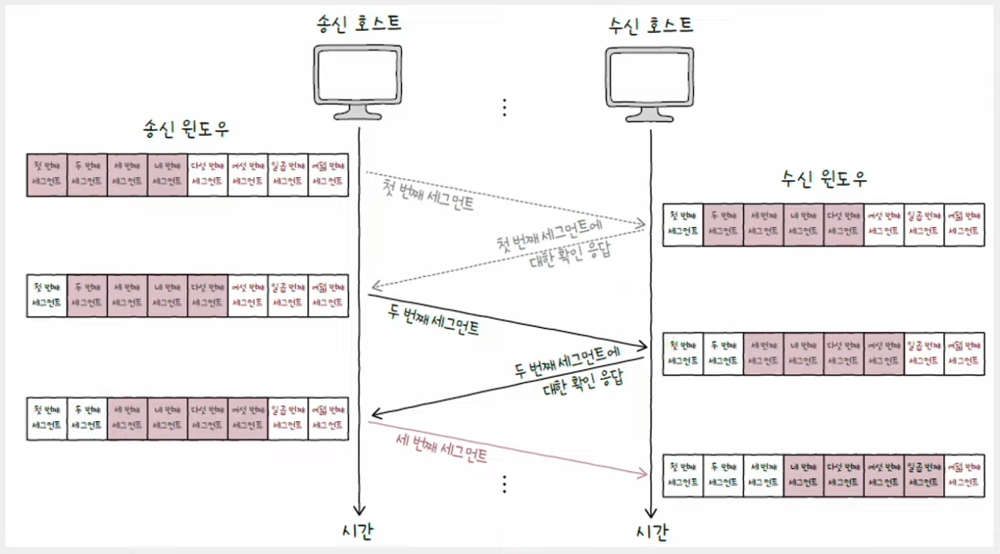

---

## 혼잡 제어

- **혼잡(congestion)** 이란, 많은 트래픽으로 인해 패킷의 처리 속도가 늦어지거나 유실될 우려가 있는 네트워크 상황을 의미한다.
- TCP의 혼잡 제어란, 송신 호스트가 혼잡한 정도에 맞춰 유동적으로 전송량을 조절하는 기능이다.
- 흐름 제어의 주체가 수신 호스트라면, 혼잡 제어의 주체는 송신 호스트이다.

혼잡 제어에는 혼잡 윈도우라는 개념이 있다. **혼잡 윈도우**는 혼잡 없이 전송할 수 있을 법한 데이터양을 의미한다.
혼잡 윈도우의 크기를 정해 혼잡 제어를 수행하는 대표적인 **혼잡 제어 알고리즘**에 대해 알아보자.

### 느린 시작 알고리즘

- 혼잡 윈도우를 1부터 시작해 문제없이 수신된 `ACK` 세그먼트 하나당 1씩 증가시키는 방식
- 혼잡 윈도우는 **RTT**마다 2배씩 지수적으로 증가한다. 따라서 초기 전송 속도를 빠르게 확보할 수 있다.
  - **RTT(Round Trip Time)** : 메시지를 전송한 뒤 그에 대한 답변을 받는 데까지 걸리는 시간 

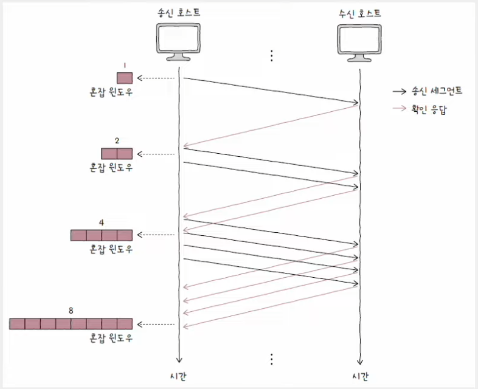

- 혼잡 윈도우를 계속해서 지수적으로 증가시킬 수는 없기 때문에 **느린 시작 임계치**라는 값이 정해져 있다.
- 혼잡 윈도우 값이 계속 증가하다가 다음 세 가지 상황에 따라 세 가지 방법 중 하나를 선택한다.

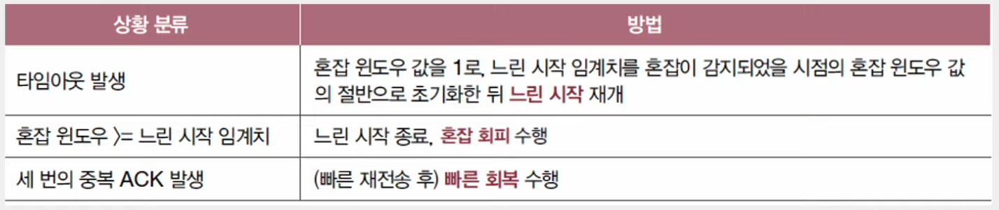

### 혼잡 회피 알고리즘

- **RTT**마다 혼잡 윈도우를 **1MSS(Maximum Segment Size)** 씩 증가시키는 알고리즘
- 느린 시작 임계치를 넘어선 시점부터 혼잡이 발생할 우려가 있으니 혼잡 윈도우 크기를 선형적으로 증가시킨다.

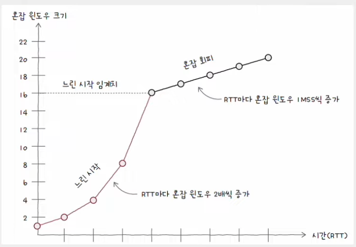

### 빠른 회복 알고리즘

- 세 번의 중복된 `ACK` 세그먼트를 수신하면 빠른 재전송과 더불어 빠른 회복 알고리즘이 수행된다.
- 보통 세 번의 중복 세그먼트 수신 상황보다는 **타임 아웃 상황**이 더 심각한 문제로 간주된다. 따라서 세 번의 중복 세그먼트를 수신했을 때 느린 시작은 건너뛰게 된다.
- 즉, 빠른 전송률 회복을 위해 느린 시작은 건너뛰고 혼잡 회피를 수행하는 알고리즘이다.
- 단, 빠른 회복 도중이라도 타임아웃이 발생하면 다시 느린 시작을 수행한다.

세 가지 혼잡 제어 알고리즘을 종합해보면 다음과 같다.(ssthresh : slow start threshold, 느린 시작 임계치)

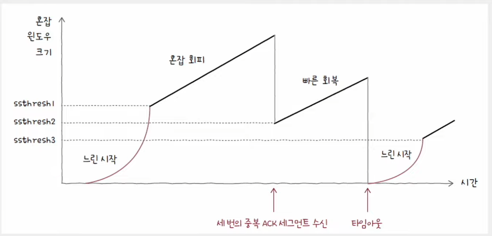

---

[이전 ↩️ - 전송 계층 - TCP와 UDP](https://github.com/genesis12345678/TIL/blob/main/cs/network/transport_layer/TCP_UDP.md)

[메인 ⏫](https://github.com/genesis12345678/TIL/blob/main/cs/network/Main.md)

[다음 ↪️ - 응용 계층 - DNS와 자원]()