# 네트워크 - 전송 계층

## TCP 통신 단계와 세그먼트 구조

- TCP는 통신하기 전에 연결을 수립하고 통신이 끝나면 연결을 종료하는 데, 연결 수립과 종료를 이해하려면 MSS 단위와
TCP의 세그먼트 구조를 이해해야 한다.
- MSS는 Maximum Segment Size의 약자로, TCP로 전송할 수 있는 최대 페이로드 크기를 의미한다. (TCP 헤더 크기는 제외)
- 헤더의 크기까지 포함한 [MTU](https://github.com/genesis12345678/TIL/blob/main/cs/network/network_layer/Basic.md#%EC%9D%B8%ED%84%B0%EB%84%B7-%ED%94%84%EB%A1%9C%ED%86%A0%EC%BD%9C-ip--internet-protocol)와는 대조적이다.

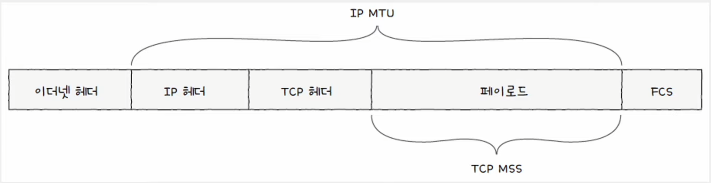

TCP 세그먼트 헤더 구조는 다음과 같다.

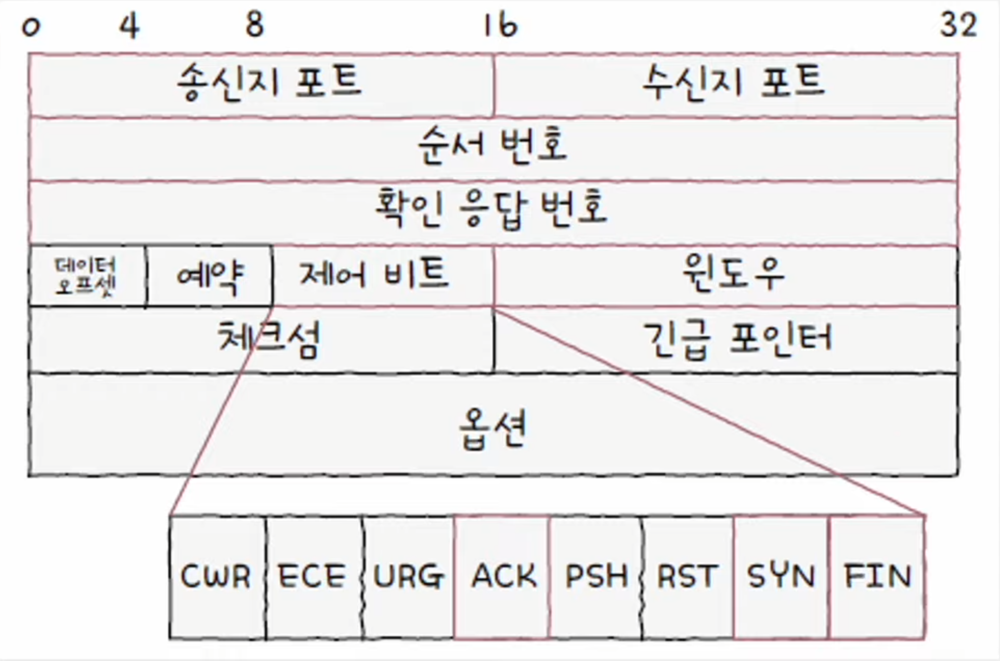

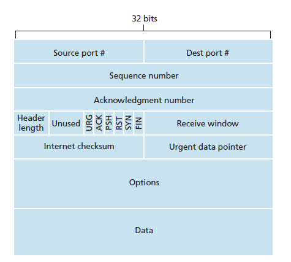

### 송수신지 포트

- 송수신지 애플리케이션을 식별하는 포트 번호가 명시되는 필드

### 순서 번호와 확인 응답 번호 (★)

- **순서 번호**는 송수신되는 세그먼트의 올바른 순서를 보장하기 위해 세그먼트 데이터의 첫 바이트에 부여되는 번호이다.
- **확인 응답 번호**는 상대 호스트가 보낸 세그먼트에 대한 응답으로, 다음으로 수신하기를 기대하는 순서 번호가 명시된다.
- 이 두 필드는 TCP의 신뢰성을 보장하기 위해 사용되는 중요한 필드이다.

예를 들어 전송 계층으로 응용 계층으로부터 전송해야 하는 1900바이트 크기의 데이터를 전달받았을 때, 이는 MSS 단위로
전송될 수 있다.

MSS가 500바이트라고 가정했을 떄, 다음과 같이 네 개의 세그먼트로 쪼갤 수 있다.

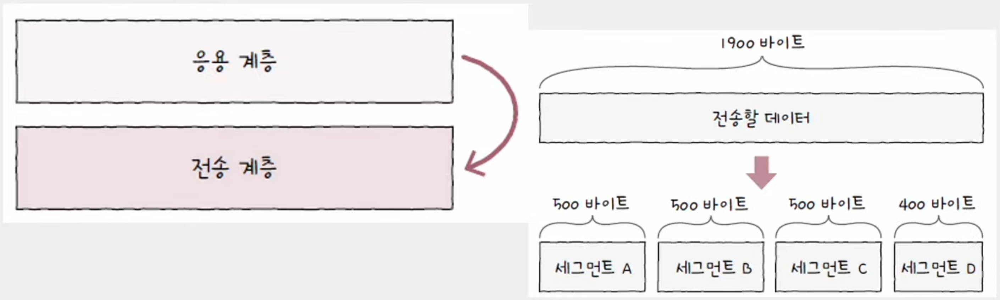

처음 통신을 위해 연결을 수립한 경우 초기 순서 번호는 무작위 값이며, 초기 순서 번호가 100이라면 각 세그먼트의
순서 번호는 다음과 같을 것이다. 

순서 번호는 **초기 순서 번호 + 송신한 바이트 수**와 같다.

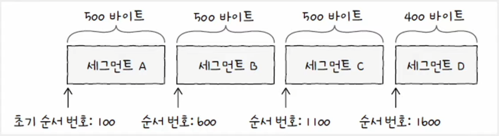

확인 응답 번호는 일반적으로 "수신한 순서 번호 + 1"로 설정된다. (**확인 응답 번호 값을 보내기 위해서는
제어 비트에서 승인을 나타내는 필드인 ACK 플래그를 1로 설정해야 한다.**)

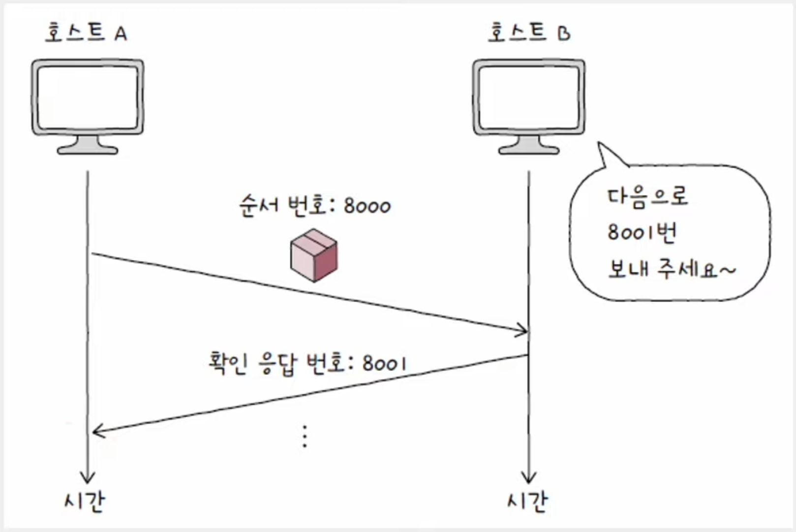

### 제어 비트 (★)

- 플래그 비트라고도 부르며, 현재 세그먼트에 대한 부가 정보를 나타낸다.
- 기본적으로 8비트로 구성되는데, TCP에서 중요한 비트는 다음 세 가지이다.
  - **ACK** : 세그먼트의 승인을 나타내기 위한 비트
  - **SYN** : 연결을 수립하기 위한 비트
  - **FIN** : 연결을 종료하기 위한 비트

### 윈도우

- 수신 윈도우(한 번에 수신하고자 하는 데이터의 양)의 크기가 명시된다.

---

## TCP 연결 수립과 종료

### 연결 수립 (3-way handshake)

- 호스트 A와 B가 통신하기 전에 세 단계를 거친 뒤 본격적인 송수신이 시작된다.
- 처음 연결을 시작하는 호스트의 연결 수립 과정을 **액티브 오픈(클라이언트)** 이라 하고, 연결을 수락하는 호스트의
연결 수립 과정을 **패시브 오픈(서버)** 라고 한다.

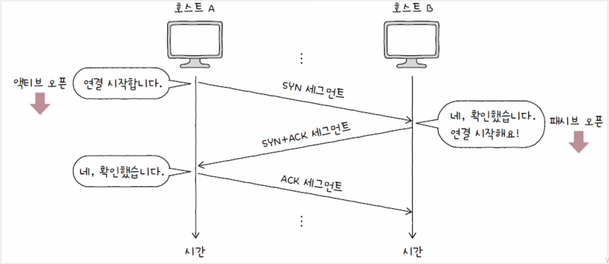

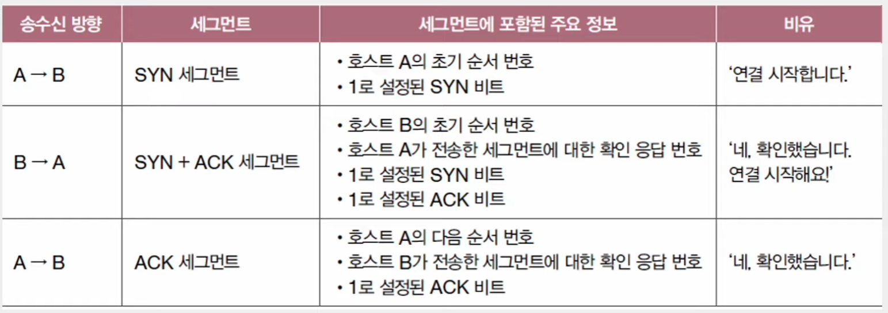

### 연결 종료 (4-way handshake)

- 연결 수립과 마찬가지로 먼저 연결을 종료하려는 호스트에 의해 수행되는 **액티브 클로즈**와 연결 종료 요청을 받아들이는
**패시브 클로즈**가 있다.

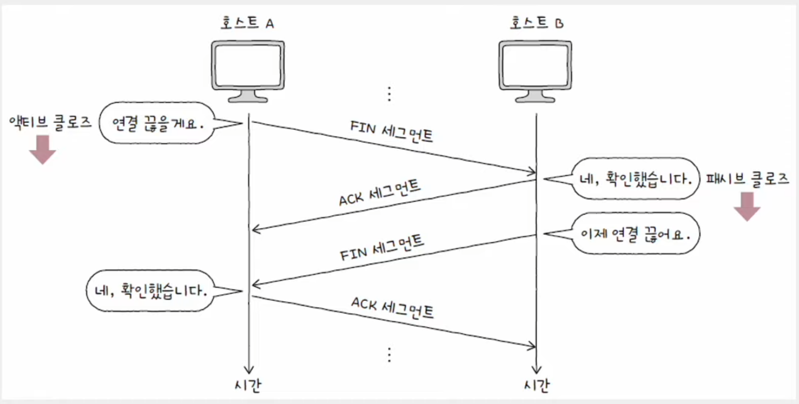

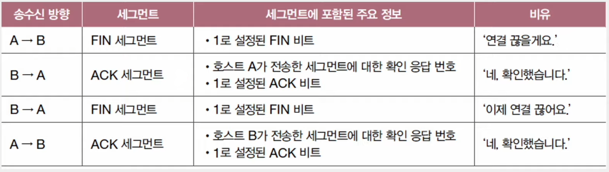

---

## TCP 상태

- TCP는 연결형 통신과 신뢰할 수 있는 통신을 유지하기 위해 다양한 상태를 유지한다.
- 상태는 현재 어떤 통신 과정에 있는지를 나타내는 정보로, TCP를 **스테이트풀 프로토콜**이라고도 부른다.

### 연결이 수립되지 않은 상태

- **CLOSED** : 아무런 연결이 없는 상태
- **LISTEN**
  - 일종의 연결 대기 상태로, `SYN` 세그먼트를 기다리는 상태
  - 일반적으로 서버로서 동작하는 패시브 오픈 호스트는 **LISTEN** 상태를 유지한다.
  - **LISTEN** 상태인 호스트에게 `SYN` 세그먼트를 보내면 3-way handshake가 시작된다.

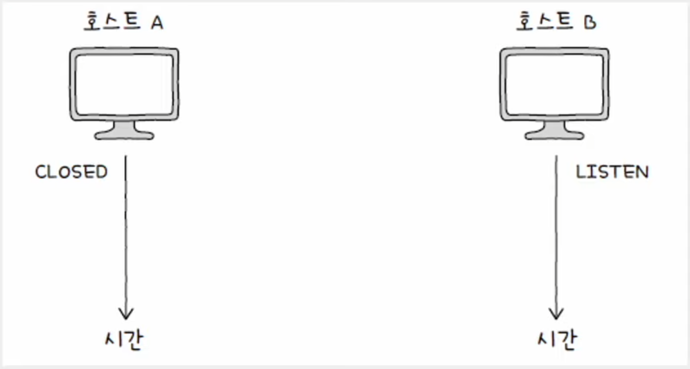

### 연결 수립 상태

- **SYN-SENT**
  - 연결 요청을 보낸 뒤 대기하는 상태
  - 액티브 오픈 호스트가 `SYN` 세그먼트를 보낸 뒤 그에 대한 응답인 `SYN + ACK` 세그먼트를 기다리는 상태
- **SYN-RECEIVED** : 패시브 오픈 호스트가 `SYN + ACK` 세그먼트를 보낸 뒤 그에 대한 `ACK` 세그먼트를 기다리는 상태
- **ESTABLISHED** : 연결이 확립되었음을 나타내는 상태

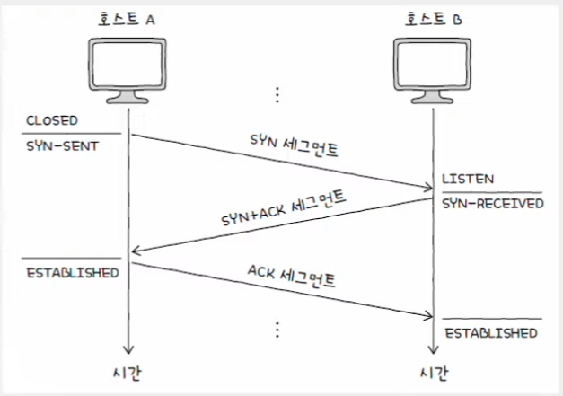

### 연결 종료 상태

- **FIN-WAIT-1** : 일반적인 TCP 연결 종료 과정에 있어 연결 종료의 첫 단계
- **CLOSE-WAIT** : 종료 요청은 FIN 세그먼트를 받은 패시브 클로즈 호스트가 그에 대한 응답으로 `ACK` 
세그먼트를 보낸 후 대기하는 상태
- **FIN-WAIT-2** : **FIN-WAIT-1** 상태에서 `ACK` 세그먼트를 받고 상태 호스트의 `FIN` 세그먼트를 기다리는 상태
- **LAST-ACK** : **CLOSE-WAIT** 상태에서 `FIN` 세그먼트를 전송한 뒤 이에 대한 `ACK` 세그먼트를 기다리는 상태
- **TIME-WAIT**
  - 액티브 클로즈 호스트가 `FIN` 세그먼트를 수신한 뒤, 이에 대한 `ACK` 세그먼트를 전송한 뒤 접어드는 상태
  - 패시브 클로즈 호스트는 마지막 `ACK` 세그먼트를 수신하면 **CLOSED** 상태로 전이된다.
  - **TIME-WAIT** 상태에 접어든 액티브 클로즈 호스트는 **일정 시간을 기다린 뒤** **CLOSED** 상태로 전이된다.

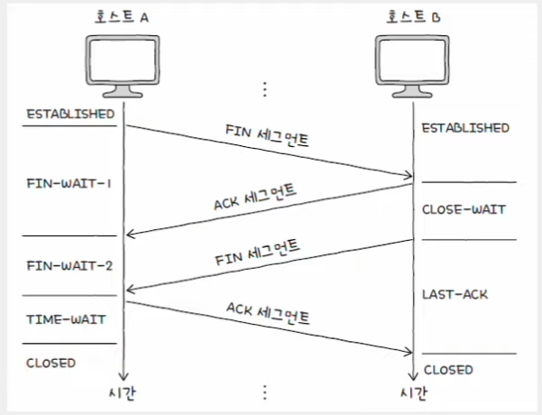

> **TIME-WAIT 상태가 필요한 이유**
> 
> - 상대 호스트가 받았어야 할 마지막 `ACK` 세그먼트가 올바르게 전송되지 않았을 수 있기 때문이다.
> - **TIME-WAIT** 상태에서 일정 시간 대기하지 않고 바로 연결을 종료해버리면 상대 호스트 입장에서는 마지막
> `ACK` 세그먼트를 재전송받을 수 없다.
> - 또 다른 이유는 한 연결을 종료하고 다른 연결을 수립하는 과정 사이에 대기 시간이 없다면 서로 다른 연결의
> 패킷들이 혼란을 야기할 수 있다.

---

## UDP 데이터그램 구조

- UDP는 TCP와 달리 비연결형 통신을 수행하는 신뢰할 수 없는 프로토콜이다.
- 연결 수립 및 해제, 재전송을 통합 오류 제어, 흐름 제어, 혼잡 제어 등을 수행하지 않는다.
- TCP처럼 상태를 유지하지도 않기 때문에 UDP를 **스테이트리스 프로토콜**이라고도 한다.
- UDP는 TCP에 비해 적은 오버헤드로 패킷을 빠르게 처리한다.
- 주로 실시간 스트리밍 서비스, 인터넷 전화처럼 실시간성이 강조되는 상황에서 TCP보다 더 많이 쓰인다.

UDP는 TCP에 비해 제공하는 기능이 적은 만큼 필드도 단순하다.

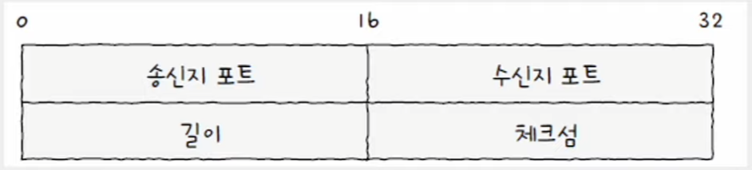

- **송신지 & 수신지 포트** : 송수신지의 포트 번호
- **길이** : 헤더를 포함한 UDP 데이터그램의 바이트
- **체크섬**
  - 데이터그램 전송 과정에서 오류가 발생했는지 검사하기 위한 필드
  - 수신지는 이 필드의 값을 토대로 데이터그램의 정보가 훼손되었는지 판단하고, 문제가 있다고 판단한 데이터그램은 폐기한다.
  - 수신지까지 잘 도달했는지를 나타내는 신뢰성/비신뢰성과는 관련이 없다.

---

[이전 ↩️ - 전송 계층 - 개요](https://github.com/genesis12345678/TIL/blob/main/cs/network/transport_layer/Basic.md)

[메인 ⏫](https://github.com/genesis12345678/TIL/blob/main/cs/network/Main.md)

[다음 ↪️ - 전송 계층 - TCP의 오류,흐름,혼잡 제어](https://github.com/genesis12345678/TIL/blob/main/cs/network/transport_layer/TCP.md)