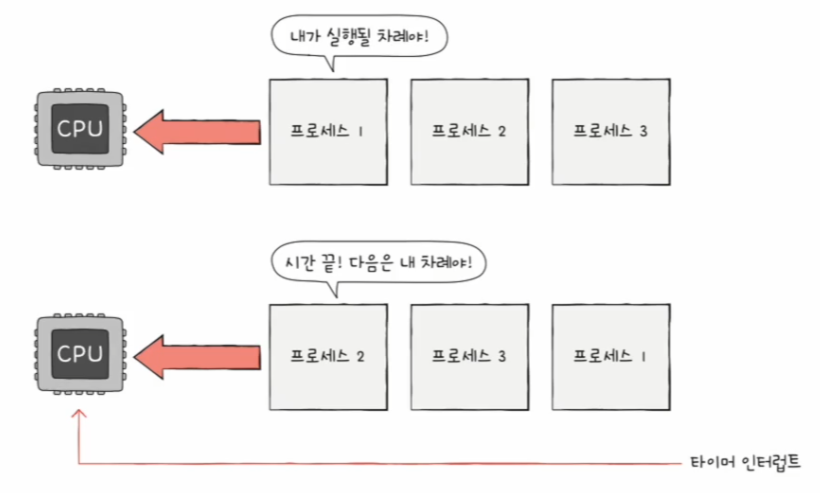
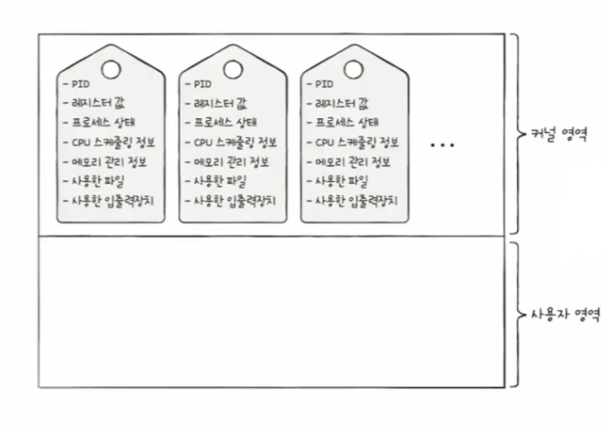
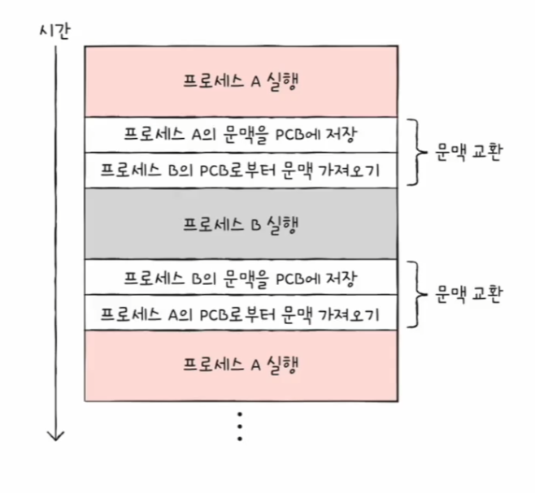

# 컴퓨터 구조와 운영체제

# 운영체제 - 프로세스

- 프로그램은 실행되기 전까지는 그저 보조기억장치에 있는 데이터 덩어리일 뿐이고, 보조기억장치에 저장된 프로그램을 메모리에 적재하고 실행하는 순간
    그 프로그램은 프로세스가 된다.
- 그리고 이 과정을 프로세스를 생성한다라고 표현한다.
- **포그라운드 프로세스**
  - 사용자가 볼 수 있는 공간에서 실행되는 프로세스
- **백그라운드 프로세스**
  - 사용자가 볼 수 없는 공간에서 실행되는 프로세스
  - 사용자와 직접 상호작용이 가능한 백그라운드 프로세스가 있고, 상호작용하지 않고 그저 묵묵히 정해진 일만 수행하는 **데몬** 또는 **서비스**라고 부르는 백그라운드 프로세스가 있다.

---

## 프로세스 제어 블록

- 모든 프로세스는 실행을 위해 CPU가 필요하지만, CPU 자원은 한정되어 있다. 즉, 모든 프로세스가 CPU를 동시에 사용할 수는 없다.
- 그래서 프로세스들은 차례대로 돌아가며 한정된 시간만큼만 CPU를 이용한다.
- 정해진 시간만큼 CPU를 이용하고, 시간이 끝났음을 알리는 타이머 인터럽트가 발생하면 자신의 차례를 양보하고 다음 차례가 올 때까지 기다린다.

- 운영체제는 빠르게 번갈아 수행되는 프로세스의 실행 순서를 관리하고, 프로세스에 CPU를 비롯한 자원을 배분한다.
- 이를 위해 운영체제는 **프로세스 제어 블록(PCB)**을 이용한다.
- **PCB**는 프로세스와 관련된 정보를 저장하는 자료 구조이다. PCB에는 해당 프로세스를 식별하기 위해 꼭 필요한 정보들이 저장된다.
- **PCB는 커널 영역에 생성**되며, 운영체제는 수많은 프로세스들 사이에서 PCB로 특정 프로세스를 식별하고 해당 프로세스를 처리하는 데 필요한 정보를 판단한다.
- PCB는 프로세스 생성 시에 만들어지고 실행이 끝나면 폐기된다. 즉, 새로운 프로세스가 생성되었다는 것은 운영체제가 PCB를 생성한 것과 같고, 프로세스가 종료되었다는 것은
    운영체제가 해당 PCB를 폐기한 것과 같다.

PCB에 담기는 정보는 운영체제마다 차이가 있지만, 대표적인 정보는 다음과 같다.

### 프로세스 ID

- **프로세스 ID(PID)** 는 특정 프로세스를 식별하기 위해 부여하는 고유한 번호이다.
- 같은 일을 수행하는 프로그램이라 할지라도 두번 실행하면 PID가 다른 두 개의 프로세스가 생성된다.

### 레지스터 값

- 프로세스는 자신의 실행 차례까 돌아오면 이전까지 사용했던 레지스터의 중간값들을 모두 복원한다.
- 그래야 이전까지 진행했던 작업들을 그대로 이어 실행할 수 있기 때문이다.
- PCB 안에는 프로세스가 실행하며 사용했던 프로그램 카운터를 비롯한 레지스터 값들이 담긴다.

### 프로세스 상태

- 현재 프로세스가 입출력장치를 사용하기 위해 기다리고 있는 상태인지, CPU를 사용하기 위해 기다리고 있는 상태인지, CPU를 이용하고 있는 상태인지 등의
    프로세스 상태 정보가 PCB에 저장된다.

### CPU 스케줄링 정보

- 프로세스가 언제, 어떤 순서로 CPU를 할당받을지에 대한 정보도 PCB에 기록된다.

### 메모리 관리 정보

- 프로세스마다 메모리에 저장된 위치가 다르기 때문에 PCB에는 프로세스가 어느 주소에 저장되어 있는지에 대한 정보가 있어야 한다.
- PCB에는 베이스 레지스터, 한계 레지스터 값과 같은 정보들이 담기며, 프로세스의 주소를 알기 위한 중요한 정보 중 하나인 페이지 테이블 정보도 PCB에 담긴다.

### 사용한 파일과 입출력장치 목록

- 프로세스가 실행 과정에서 특정 입출력장치나 파일을 사용하면 PCB에 해당 내용이 명시된다.
- 어떤 입출력장치가 이 프로세스에 할당되었는지, 어떤 파일들을 열었는지에 대한 정보들이 PCB에 기록된다.

---

## 문맥 교환

- 하나의 프로세스에서 다른 프로세스로 실행 순서가 넘어가면 직전까지 실행되던 프로세스는 프로그램 카운터를 비롯한 각종 레지스터 값, 메모리 정보, 실행을 위해
    열었떤 파일이나 사용한 입출력장치 등 지금까지의 중간 정보를 백업해야 한다.
- 그래야만 다음 차례가 왔을 때 이전까지 실행했던 내용에 이어 다시 실행을 재개할 수 있을 것이다.
- 이러한 중간 정보, 즉 하나의 프로세스 수행을 재개하기 위해 기억해야 할 정보를 **문맥(context)** 이라고 한다.
- 하나의 프로세스 문맥은 해당 프로세스의 PCB에 표현되어 있다.
- 기존 프로세스의 문맥을 PCB에 백업하고, 새로운 프로세스를 실행하기 위한 문맥을 PCB로부터 복구하여 새로운 프로세스를 실행하는 것을 **문맥 교환(context switching)** 이라고 하며,
    여러 프로세스가 끊임없이 빠르게 번갈아 가며 실행되는 원리이다.

- 문맥 교환이 자주 일어나면 프로세스는 그만큼 빨리 번갈아 가며 수행되기 때문에 프로세스들에 동시에 실행되는 것처럼 보인다.
  - 문맥 교환을 너무 자주하면 오버헤드가 발생할 수 있기 때문에 교환이 자주 일어나는 것은 반드시 좋은 것은 아니다.

---

## 프로세스의 메모리 영역

- 프로세스가 생성되면 커널 영역에 PCB가 생성된다. 
- 그리고 하나의 프로세스는 사용자 영역에 크게 다음과 같은 영역으로 나뉘어 저장된다.

### 코드 영역(텍스트 영역)

- 실행할 수 있는 코드, 즉 기계어로 이루어진 명령어가 저장된다.
- 코드 영역에는 데이터가 아닌 CPU가 실행할 명령어가 담겨 있기 때문에 쓰기가 금지되어 있다.(read-only)

### 데이터 영역

- 프로그램이 실행되는 동안 유지할 데이터가 저장된다.(전역 변수 등 프로그램 전체에서 접근할 수 있는 코드)
- **코드 영역과 데이터 영역**은 크기가 변하지 않는다. 그래서 **정적 할당 영역**이라고도 부른다.

### 힙 영역

- 프로그램을 만드는 사용자가 직접 할당할 수 있는 저장 공간이다.
- 프로그래밍 과정에서 힙 영역에 메모리 공간을 할당했다면 언젠가는 해당 공간을 반환해야 한다. 메모리 공간을 반환한다는 의미는 더 이상 해당 메모리 공간을 사용하지 않겠다
    라고 운영체제에 말하는 것과 같다.
- 메모리 공간을 반환하지 않는다면 할당한 공간은 메모리 내에 계속 남아 메모리 낭비를 초래하고, 이런 문제를 **메모리 누수**라고 한다.

### 스택 영역

- 데이터를 일시적으로 저장하는 공간이다. (매개 변수, 지역 변수 등 함수의 실행이 끝나면 사라지는 데이터)
- 일시적으로 저장할 데이터는 스택 여역에 `PUSH` 되고, 더 이상 필요하지 않은 데이터는 `POP` 됨으로써 스택 영역에서 사라진다.
- **힙 영역과 스택 영역**은 실시간으로 그 크기가 변할 수 있기 때문에 **동적 할당 영역**이라고 부른다.
- 그래서 일반적으로 **힙 영역은 메모리의 낮은 주소에서 높은 주소**로, **스택 영역은 높은 주소에서 낮은 주소**로 할당된다.
- 그래야 힙 영역과 스택 영역에 데이터가 쌓여도 새롭게 할당되는 주소가 겹칠 일이 없을 것이다.

---

[이전 ↩️ - 운영체제 - 운영체제란?](https://github.com/genesis12345678/TIL/blob/main/cs/os/OS.md)

[메인 ⏫](https://github.com/genesis12345678/TIL/blob/main/cs/Main.md)

[다음 ↪️ - 운영체제(프로세스와 스레드) - 프로세스 상태와 계층 구조]()