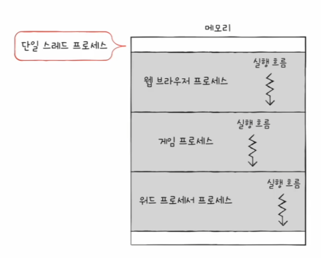
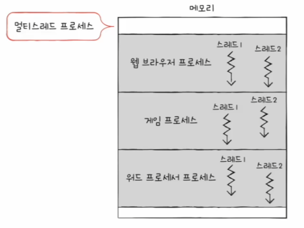
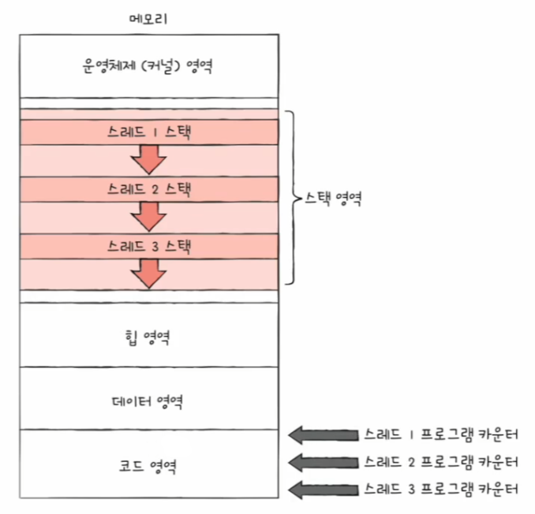
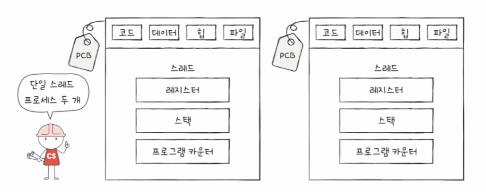
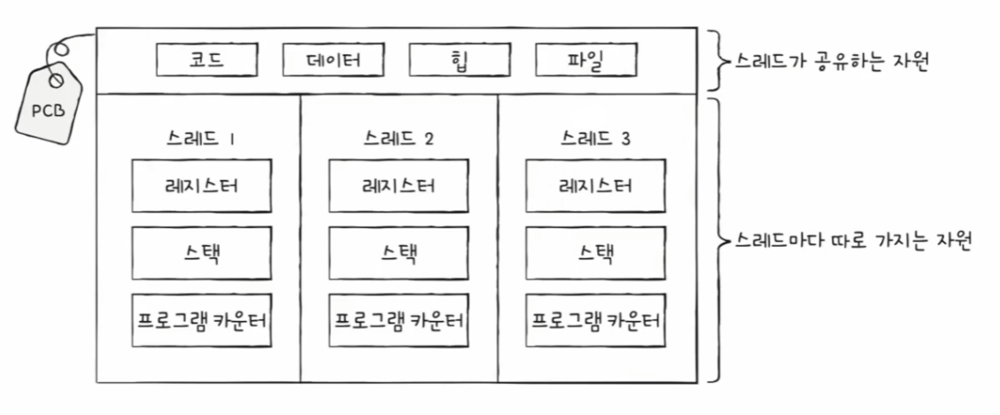

# 컴퓨터 구조와 운영체제

# 운영체제 - 스레드

- 스레드는 실행의 단위로, 정확히는 프로세스를 구성하는 실행의 흐름 단위이다.
- 하나의 프로세스는 여러 개의 스레드를 가질 수 있으며, 스레드를 이용하면 하나의 프로세스에서 여러 부분을 동시에 실행할 수 있다.

## 프로세스와 스레드

- 전통적인 관점에서는 하나의 프로세스는 한 번에 하나의 일만을 처리했다.
- 실행의 흐름 단위가 하나라는 점에서 이렇게 실행되는 프로세스들은 **단일 스레드 프로세스**라고 볼 수 있다.

- 하지만 스레드라는 개념이 도입되면서 하나의 프로세스가 한 번에 여러 일을 동시에 처리할 수 있게 되었다.
- 즉, 프로세스를 이루는 여러 명령어를 동시에 실행할 수 있게 된 것이다.

- 스레드는 프로세스를 구성하는 실행 단위이다.
- 스레드는 프로세스 내에서 각기 다른 스레드 ID, 프로그램 카운터 값을 비롯한 레지스터 값, 스택으로 구성된다.
- 각자 프로그램 카운터 값을 비롯한 레지스터 값, 스택을 가지고 있기에 스레드마다 각기 다른 코드를 실행할 수 있다.

- 여기서 중요한 점은 **프로세스의 스레드들은 실행에 필요한 최소한의 정보만을 유지한 채 프로세스 자원을 공유하며 실행**된다는 점이다.
- **프로세스의 자원을 공유**한다는 것이 스레드의 핵심이다.
- 프로세스가 실행되는 프로그램이라면 스레드는 프로세스를 구성하는 실행의 흐름 단위이다.
- 실제로 최근 많은 운영체제는 CPU에 처리할 작업을 전달할 때 프로세스가 아닌 스래드 단위로 전달하고, **스레드는 프로세스 자원을 공유한 채** 실행에 필요한 최소한의 정보만으로 실행된다.

---

## 멀티프로세스와 멀티스레드

- 컴퓨터는 실행 과정에서 여러 프로세스가 동시에 실행될 수 있고, 그 프로세스를 이루는 스레드는 여러 개 있을 수 있다.
- 여러 프로세스를 동시에 실행하는 것을 **멀티프로세스**, 여러 스레드로 프로세스를 동시에 실행하는 것을 **멀티스레드**라고 한다.

**동일한 작업을 수행하는 단일 스레드 프로세스 여러 개를 실행하는 것과 하나의 프로세스를 여러 스레드로 실행하는 것은 무엇이 다를까?**

- 가장 큰 차이는 프로세스끼리는 기본적으로 자원을 공유하지 않고, **스레드끼리는 같은 프로세스 내의 자원을 공유**한다는 점이다.
- 프로세스를 fork하면 코드, 데이터, 힙 영역 등 모든 자원이 복제되어 메모리에 적재된다.
- fork를 계속 하면 PID, 저장된 메모리 주소를 제외한 모든 것이 동일한 프로세스가 통째로 메모리에 적재되는 것인데, 같은 프로그램을 실행하기 위해 메모리에
    동일한 내용들이 중복해서 존재하는 것이기 때문에 낭비일 수 있다.

- 이에 반해 스레드들은 별도의 실행을 위해 꼭 필요한 정보만 가질 뿐 프로세스가 가지고 있는 자원을 공유한다.
- 즉, 같은 프로세스 내의 모든 스레드는 동일한 주소 공간의 코드, 데이터, 힙 영역을 공유하고, 열린 파일과 같은 프로세스 자원을 공유한다.
- 여러 프로세스를 병행 실행하는 것보다 메모리를 더 효율적으로 사용할 수 있다. 또한 서로 협력과 통신에 유리하다.

- 프로세스의 자원을 공유함으로 인한 단점은 멀티프로세스 환경에서는 하나의 프로세스에 문제가 생겨도 다른 프로세스에는 지장이 없거나 적지만,
    멀티 스레드 환경에서는 하나의 스레드에 문제가 생기면 프로세스 전체에 문제가 생길 수 있다.
- 모든 스레드는 프로세스의 자원을 공유하고, 하나의 스레드에 문제가 생기면 다른 스레드도 영향을 받기 때문이다.

> **프로세스 간 통신**
> 
> - 프로세스끼리는 기본적으로 자원을 공유하지 않지만, 프로세스끼리도 자원을 공유하고 데이터를 주고받을 수 있다.
> - 프로세스 간의 자원을 공유하고 데이터를 주고받는 것을 **프로세스 간 통신(IPC)** 라고 한다.
> - 파일, 공유 메모리, 소켓, 파이프 등을 통해 프로세스들은 서로 통신할 수 있다.
> - 즉, 프로세드들끼리 데이터를 교환한다는 것은 모든 자원을 처음부터 공유하고 있는 스레드에 비하면 까다로울 뿐 불가능한 것은 아니다.

---

[이전 ↩️ - 운영체제(프로세스와 스레드) - 프로세스 상태와 계층 구조]()

[메인 ⏫](https://github.com/genesis12345678/TIL/blob/main/cs/Main.md)

[다음 ↪️ - 운영체제(CPU 스케줄링) - CPU 스케줄링]()