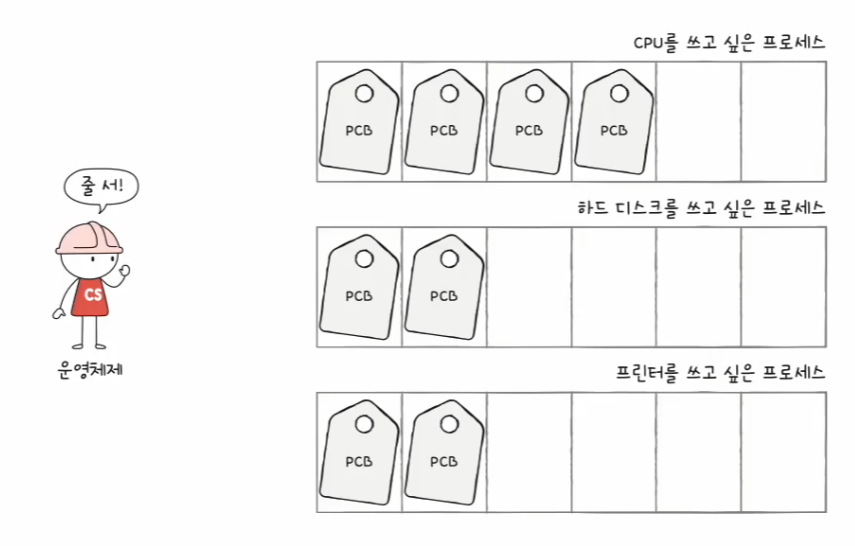
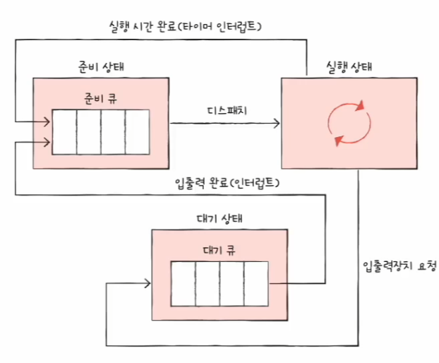
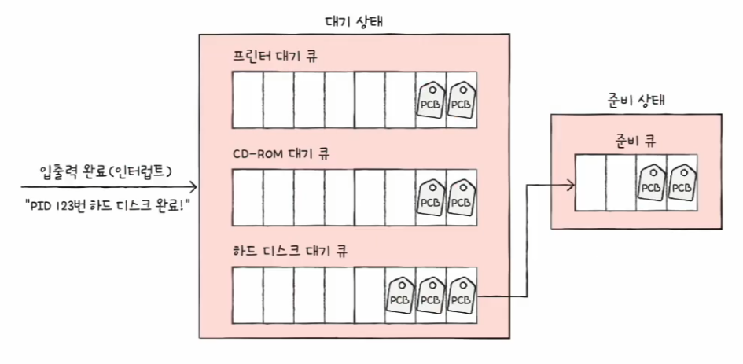
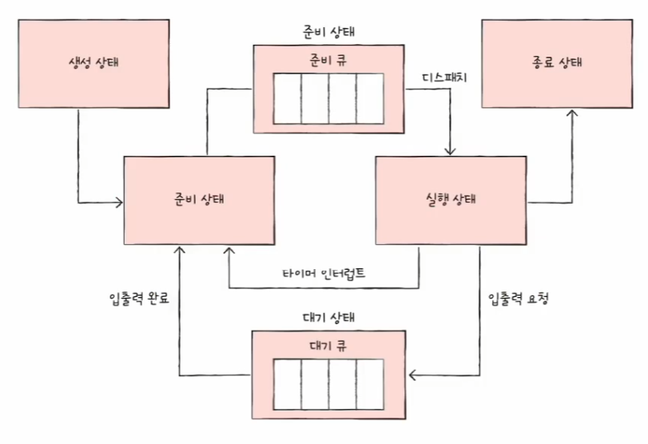

# 컴퓨터 구조와 운영체제

# 운영체제 - CPU 스케줄링

- 모든 프로세스는 CPU를 필요로 하고 먼저 CPU를 사용하고 싶어한다.
- 운영체제가 프로세스들에게 공정하고 합리적으로 CPU 자원을 배분하는 것을 **CPU 스케줄링**이라고 한다.

## 프로세스 우선순위

- 가장 단순한 방식은 먼저 요청한 프로세스 순서대로 CPU를 이용하게 하는 방법이다.
- 합리적인 방식인 것 같지만, 프로세스마다 **우선순위**가 다르기 때문에 좋은 방법은 아니다.
- 우선순위는 보통 I/O 바운드 프로세스가 CPU 바운드 프로세스보다 높다.
- 왜냐하면, **I/O 바운드 프로세스**를 빨리 실행시켜 입출력장치를 끊임없이 작동시키고, 그 다음 **CPU 바운드 프로세스**에 집중적으로 CPU를 할당하는 것이 더 효율적이기 때문이다.
- 입출력장치가 입출력 작업을 완료하기 전까지는 I/O 바운드 프로세스는 어차피 대기 상태가 될 예정이기 때문에 I/O 바운드 프로세스를
    먼저 처리해 버리면 다른 프로세스가 CPU를 사용할 수 있다.

- 이렇게 상황에 맞게, 그리고 프로세스의 중요도에 맞게 프로세스가 CPU를 이용할 수 있도록 하기 위해 운영체제는 프로세스마다 우선순위를 부여한다.
- 운영체제는 **각 프로세스의 PCB에 우선순위를 명시**하고, PCB에 적힌 우선순위를 기준으로 먼저 처리할 프로세스를 결정한다.

---

## 스케줄링 큐

- PCB에 우선순위가 적혀 있다고는 하지만, CPU를 사용할 다음 프로세스를 찾기 위해 운영체제가 모든 프로세스의 PCB를 찾는 것은 비효율적이다.
- 그래서 운영체제는 프로세스들에 줄을 서서 기다릴 것을 요구한다.
- CPU를 사용하고 싶은 프로세스들, 메모리에 적재되고 싶은 프로세스들, 특정 입출력장치를 사용하고 싶은 프로세스들을 모두 줄 세우는 것이고, 
    운영체제는 이 줄을 **스케줄링 큐**로 구현하고 관리한다.

- 운영체제가 관리하는 대부분의 자원은 위와 같이 큐로 관리된다. 그래서 운영체제가 관리하는 줄, 즉 큐에는 다양한 종류가 있다.
- **준비 큐**
  - CPU를 이용하고 싶은 프로세스들이 서는 줄
- **대기 큐**
  - 입출력장치를 이용하기 위해 대기 상태에 접어든 프로세스들이 서는 줄
- 준비 상태에 있는 프로세스들의 PCB는 준비 큐의 마지막에 삽입되어 CPU를 사용할 차례를 기다린다.
- 운영체제는 PCB들이 큐에 삽입된 순서대로 프로세스를 하나씩 꺼내어 실행하되, 그 중 우선순위가 높은 프로세스를 먼저 실행한다.
- 우선순위가 낮은 프로세스가 먼저 큐에 삽입되어도 우선순위가 높은 프로세스는 먼저 처리될 수 있다.

- 같은 장치를 요구한 프로세스들은 같은 대기 큐에서 기다린다.
- 입출력이 완료되어 완료 인터럽트가 발생하면 운영체제는 대기 큐에서 작업이 완료된 PCB를 찾고, 이 PCB를 준비 상태로 변경한 뒤 대기 큐에서 제거한 다음 해당 PCB는 준비 큐로 이동한다.

운영체제가 유지하는 여러 큐를 포함한 프로세스 상태 다이어그램은 다음과 같다.

---

## 선점형과 비선점형 스케줄링

### 선점형 스케줄링
- 프로세스가 CPU를 비롯한 자원을 사용하고 있더라도 운영체제가 프로세스로부터 자원을 강제로 빼앗아 다른 프로세스에 할당할 수 있는 스케줄링 방식
- 어느 하나의 프로세스가 자원 사용을 독점할 수 없는 스케줄링
- **장점**
  - 어느 한 프로세스의 자원 독점을 막고 프로세스들에 골고루 자원을 배분할 수 있다.
- **단점**
  - 그만큼 문맥 교환 과정에서 오버헤드가 발생할 수 있다.

### 비선점형 스케줄링
- 하나의 프로세스가 자원을 사용하고 있다면 그 프로세스가 종료되거나 스스로 대기 상태에 접어들기 전까진 다른 프로세스가 끼어들 수 없는 스케줄링 방식
- 하나의 프로세스가 자원 사용을 독점할 수 있는 스케줄링
- **장점**
  - 문맥 교환에서 발생하는 오버헤드가 선점형 스케줄링보다 적다.
- **단점**
  - 모든 프로세스가 골고루 자원을 사용할 수 없다.

---

[이전 ↩️ - 운영체제(프로세스와 스레드) - 스레드](https://github.com/genesis12345678/TIL/blob/main/cs/process/Thread.md)

[메인 ⏫](https://github.com/genesis12345678/TIL/blob/main/cs/Main.md)

[다음 ↪️ - 운영체제(CPU 스케줄링) - CPU 스케줄링 알고리즘](https://github.com/genesis12345678/TIL/blob/main/cs/scheduling/Algorithm.md)