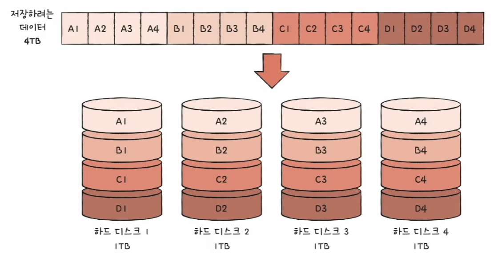
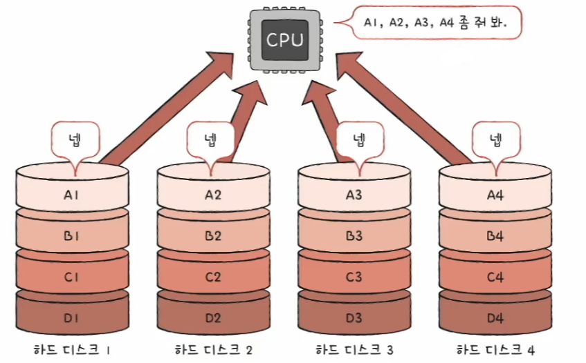
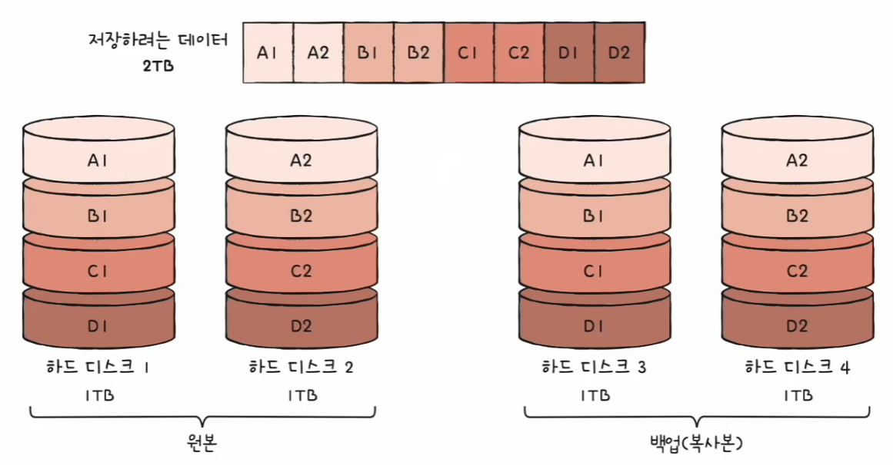
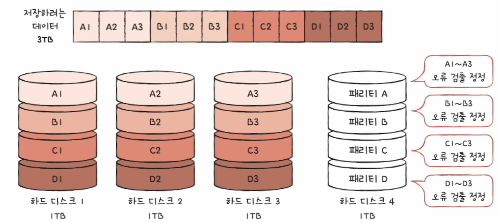
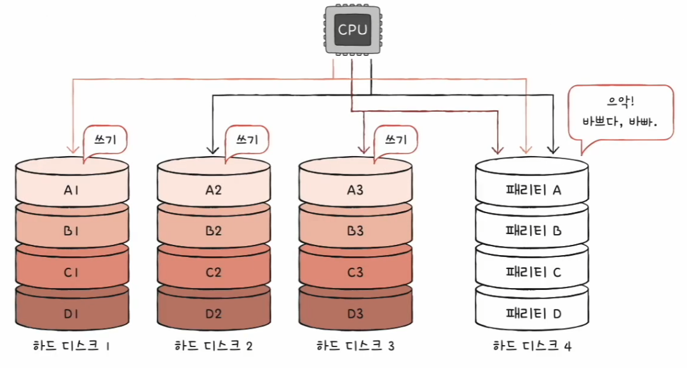
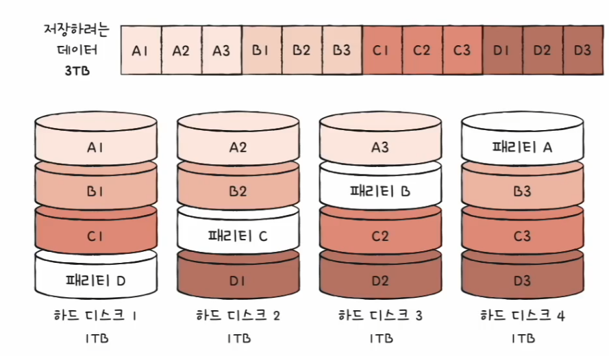
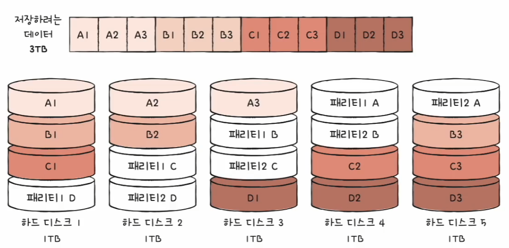

# 컴퓨터 구조와 운영체제

# 보조기억장치 - RAID

- 1TB 하드 디스크 4개로 RAID를 구성하면 4TB 하드 디스크 1개의 성능과 안전성을 능가할 수 있다.

## RAID

- `RAID`는 주로 하드 디스크와 SSD를 사용하는 기술로, 데이터의 안전성 또는 높은 성능을 위해 여러 개의 물리적 보조기억장치를 마치 하나의 논리적
    보조기억장치처럼 사용하는 기술을 의미한다.
- `RAID`를 구성하는 방법에는 여러 가지가 있고, `RAID` 구성 방법을 **RAID 레벨**이라고 표현한다.

---

## RAID 0

- **RAID 0**은 여러 개의 보조기억장치에 데이터를 단순히 나누어 저장하는 구성 방식이다.
- 어떤 데이터를 저장할 때 각 하드 디스크는 번갈아 가며 데이터를 저장한다. 즉, 저장되는 데이터가 하드 디스크 개수만큼 나뉘어 저장되는 것이다.

- 이때 줄무늬처럼 분산되어 저장된 데이터를 **스트라입**이라고 하고, 분산하여 저장하는 것을 **스트라이핑**이라고 한다.
- **RAID 0**의 장점은 입출력 속도의 향상이다. 하나의 대용량 저장 장치를 이용했더라면 여러 번에 걸쳐 읽고 썼을 데이터를 동시에 읽고 쓸 수 있기 때문이다.
- 그래서 4TB 한 개보다 RAID 0으로 구성된 1TB 4개의 속도가 이론상 4배 정도 빠르다.

- 하지만 단점은 저장된 정보가 안전하지 않다는 것이다.
- **RAID 0**으로 구성된 하드 디스크 중 하나에 문제가 생긴다면 다른 모든 하드 디스크의 정보를 읽는 데 문제가 생길 수 있다.
- 그래서 등장한 것이 RAID 1 이다.

---

## RAID 1

- **RAID 1**은 복사본을 만드는 방식이다. 거울처럼 완전한 복사본을 만드는 구성이기에 **미러링**이라고도 부른다.
- 데이터를 저장할 때 RAID 0 처럼 스트라이핑이 사용되긴 하지만, 원본과 복사본 두 군데에 쓴다. 때문에 쓰기 속도는 RAID 0보다 느리다.

- RAID 1 방식은 **복구가 매우 간단하다는 장점**이 있다. 똑같은 디스크가 두 개 있으므로, 하나에 문제가 발생해도 잃어버린 정보를 금방 되찾을 수 있다.
- 하지만 단점은 하드 디스크 개수가 한정되었을 때 사용 가능한 용량이 적어진다는 점이다. 
- RAID 1에서는 복사본이 만들어지는 용량만큼 사용자가 사용하지 못한다. 결국 많은 양의 하드 디스크가 필요하게 되고, 비용이 증가한다.

---

## RAID 4

- **RAID 4**는 RAID 1 처럼 완전한 복사본을 만드는 대신 **오류를 검출하고 복구하기 위한 정보**를 저장한 장치를 두는 구성 방식이다.
  - 오류를 검출하고 복구하기 위한 정보 : **패리티 비트**
- **RAID 4**에서는 패리티를 저장한 장치를 이용해 다른 장치들의 오류를 검출하고, 오류가 있다면 복구한다.
- RAID 4는 RAID 1보다 적은 하드 디스크로도 데이터를 안전하게 보관할 수 있다.

- 하지만 단점은 어떤 새로운 데이터가 저장될 때마다 패리티를 저장하는 디스크에도 데이터를 쓰게 되므로 **패리티를 저장하는 장치에 병목 현상**이 발생할 수 있다.

---

## RAID 5

- **RAID 5**는 패리티 정보를 분산하여 저장하는 방식으로 RAID 4의 병목 현상 문제를 해소한다.
- 즉, RAID 4는 패리티를 저장한 장치를 따로 두는 방식이고, RAID 5는 패리티를 분산하여 저장하는 방식이다.

---

## RAID 6

- 기본적으로 RAID 5와 같고, 서로 다른 두 개의 패리티를 두는 방식이다. 오류를 검출하고 복구할 수 있는 수단이 두 개가 생긴 셈이다.
- RAID 6는 RAID 4나 RAID 5보다 안전한 구성이라 볼 수 있다.
- 하지만 새로운 정보를 저장할 때마다 함께 저장할 패리티가 두 개이므로, 쓰기 속도는 RAID 5보다 느리다.
- RAID 6는 데이터 저장 속도를 조금 희생하더라도 데이터를 더욱 안전하게 보관하고 싶을 때 사용하는 방식이다.

---

[이전 ↩️ - 컴퓨터 구조(보조기억장치) - 다양한 보조기억장치](https://github.com/genesis12345678/TIL/blob/main/cs/ssd/SSD.md)

[메인 ⏫](https://github.com/genesis12345678/TIL/blob/main/cs/Main.md)

[다음 ↪️ - 컴퓨터 구조(입출력장치) - ]()