# 컴퓨터 구조와 운영체제

# 보고기억장치 - 다양한 보조기억장치

## 하드 디스크

- **하드 디스크**는 **자기적인 방식**으로 데이터를 저장하는 보조기억장치이다.
- 하드 디스크에서 실질적으로 데이터가 저장되는 곳은 **플래터**라고 하는 그림 속 동그란 원판이다.
- 플래터는 자기 물질로 덮여 있어 수많은 N극과 S극을 저장한다. 그리고 N극과 S극은 0과 1의 역할을 수행한다.
- 그 플래터를 회전시키는 구성 요소를 **스핀들**이라고 하며, 스핀들이 플래터를 돌리는 속도는 분당 회전수를 나타내는 **RPM** 이라는 단위로 표현된다.

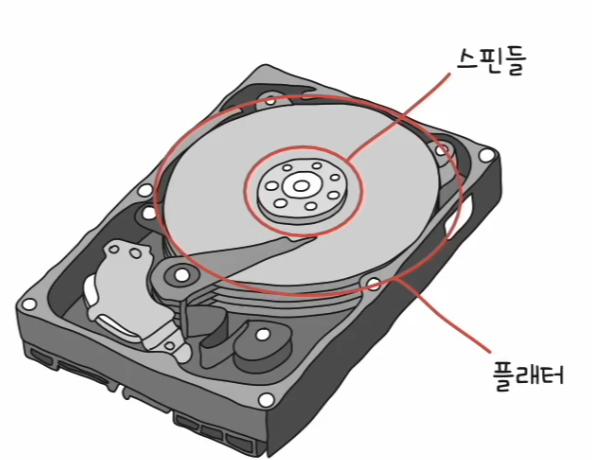

- 플래터를 대상으로 데이터를 읽고 쓰는 구성 요소는 **헤드**라고 한다. 
- 헤드는 플래터 위에서 미세하게 떠 있는 채로 데이터를 읽고 쓴다. 그리고 헤드는 원하는 위치로 헤드를 이동시키는 **디스크 암**에 부착되어 있다.
- 하드 디스크는 많은 양의 데이터를 저장해야 하므로 일반적으로 여러 겹의 플래터로 이루어져 있고 플래터 양면을 모두 사용할 수 있다.
- 양면 플래터를 사용하면 위아래로 플래터당 두 개의 헤드가 사용된다. 이때 일반적으로 모든 헤드는 디스크 암에 부착되어 다같이 이동한다.

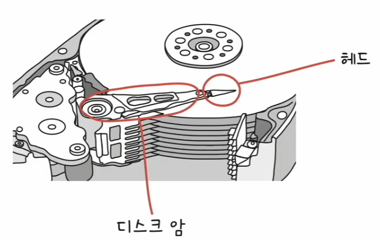

- 플래터는 **트랙**과 **섹터**라는 단위로 데이터를 저장한다.
- 플래터를 여러 동심원으로 나누었을 때 그 중 하나의 원을 트랙이라고 하고, 트랙에서 한 조각을 섹터라고 한다. 섹터는 하드 디스크의 가장 작은 전송 단위이다.

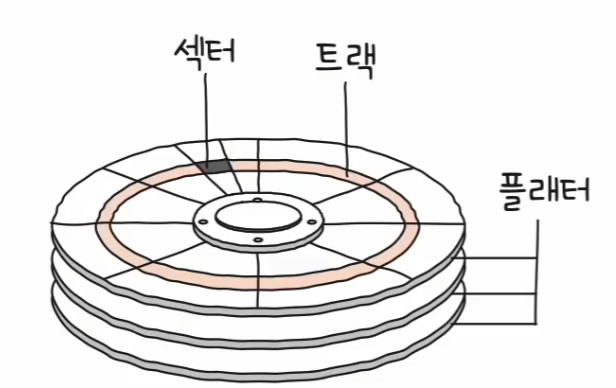

- 여러 겹의 플래터가 사용될 때, 여러 겹의 플래터 상에서 같은 트랙이 위치한 곳을 모아 연결한 논리적 단위를 **실린더**라고 한다.
- 연속된 정보는 보통 한 실린더에 기록된다. 디스크 암을 움직이지 않고도 바로 데이터에 접근할 수 있기 때문이다.

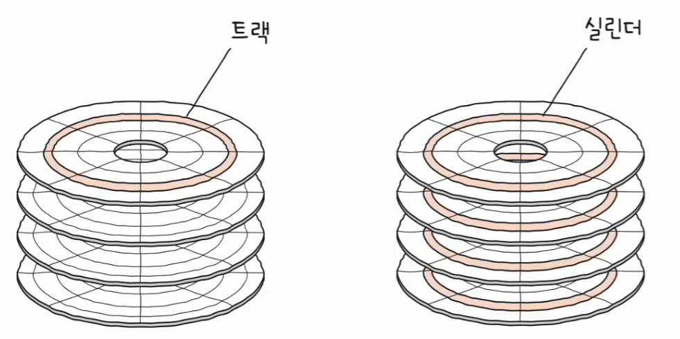

- 하드 디스크가 데이터에 접근하는 시간은 크게 탐색 시간, 회전 지연, 전송 시간으로 나뉜다.
- **탐색 시간**
  - 접근하려는 데이터가 저장된 트랙까지 헤드를 이동시키는 시간

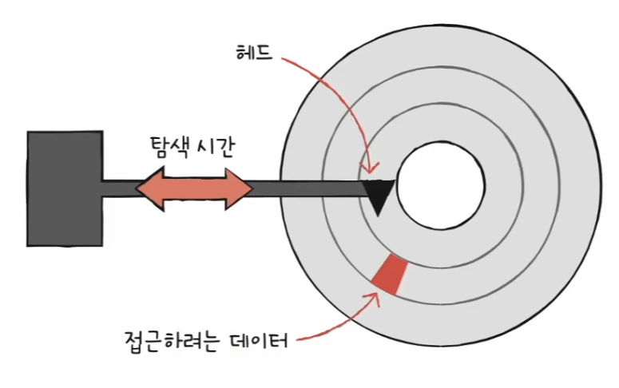

- **회전 지연**
  - 헤드가 있는 곳으로 플래터를 회전시키는 시간

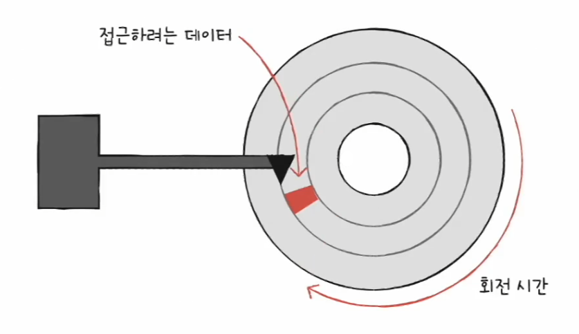

- **전송 시간**
  - 하드 디스크와 컴퓨터 간에 데이터를 전송하는 시간

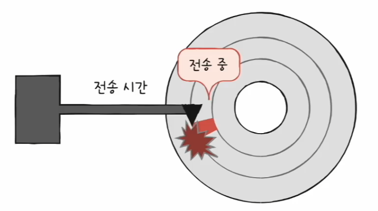

탐색 시간과 회전 지연을 단축시키기 위해서는 플래터를 빨리 돌려 RPM을 높이는 것도 중요하지만 참조 지역성, 즉 접근하려는 데이터가 플래터 또는 헤드를
조금만 옮겨도 접근할 수 있는 곳에 위치해 있는 것도 중요하다.

---

## 플래시 메모리

- **플래시 메모리**는 전기적으로 데이터를 읽고 쓸 수 있는 반도체 기반의 저장 장치이다.
  - 플래시 메모리는 보조기억장치에만 속한다기보다 다양한 곳에서 사용되는 저장 장치로 보는 것이 옳다.
- 플래시 메모리에는 **셀**이라는 단위가 있다. **셀**은 플래시 메모리에서 데이터를 저장하는 가장 작은 단위이다.
- 하나의 셀에 몇 비트를 저장하느냐에 따라 플래시 메모리 종류가 나뉜다.
  - 한 셀이 1비트 : `SLC`
  - 한 셀이 2비트 : `MLC`
  - 한 셀이 3비트 : `TLC`
  - ...

### SLC 타입

- **SLC 타입**은 한 셀로 두 개의 정보를 표현할 수 있다.
- 다른 타입들에 비해 비트의 빠른 입출력이 가능하고, 수명이 길다.
- 하지만 용량 대비 고가격이다.

### MLC 타입

- **MLC 타입**은 한 셀로 네 개의 정보를 표현할 수 있다.
- SLC 타입보다 일반적으로 속도와 수명은 떨어지지만, 대용량화하기 유리하다.
- SLC 타입보다 용량 대비 가격이 저럼하며, 시중에서 많이 사용된다.

### TLC 타입

- **TLC 타입**은 한 셀로 8개의 정보를 표현할 수 있다.
- 대용량화하기 유리하며, 일반적으로 SLC나 MLC 타입보다 수명과 속도가 떨어지지만 용량 대비 가격이 저렴하다.

### 정리

같은 용량의 플래시 메모리 저장 장치라도 셀의 타입에 따라 수명, 가격, 성능이 다르다.

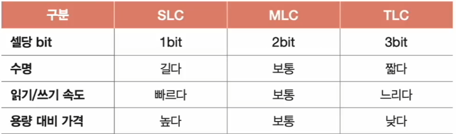

플래시 메모리의 가장 작은 단위인 셀보다 더 큰 단위를 알아보자.

- 셀들이 모여 **페이지**, 페이지가 모여 **블록**, 블록이 모여 **플레인**, 플레인이 모여 **다이**가 된다.

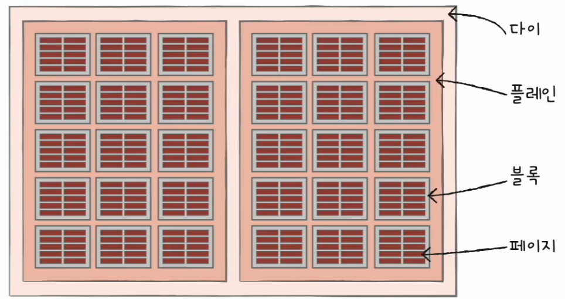

- 플래시 메모리에서 **읽기와 쓰기는 페이지 단위**로 이루어지지만, **삭제는 페이지보다 큰 블록 단위**로 이루어진다.
- 이떄 페이지는 세 개의 상태를 가질 수 있다.
  - **Free 상태**
    - 어떠한 데이터도 저장하고 있지 않아 새로운 데이터를 저장할 수 있는 상태
  - **Valid 상태**
    - 이미 유효한 데이터를 저장하고 있는 상태
  - **Invalid 상태**
    - 쓰레기값이라 부르는 유효하지 않은 데이터를 저장하고 있는 상태

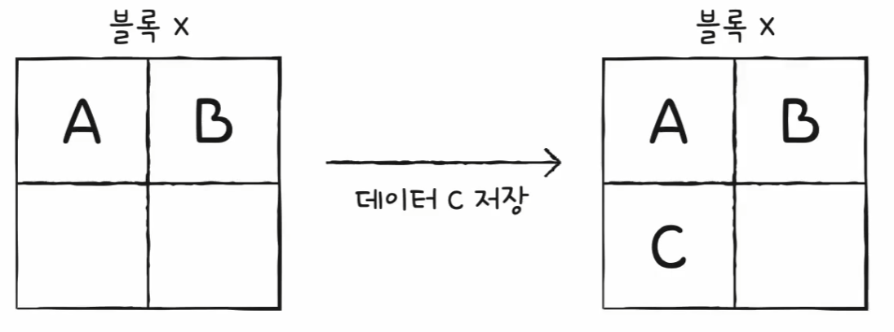

- 플래시 메모리의 읽기 쓰기 단위는 페이지 단위로 이루어지므로 위와 같이 저장된다.
- 그렇다면 여기서 A만 다른 값으로 수정하고 싶다면 어떻게 해야 할까? 플래시 메모리에서 덮어쓰기는 불가능하기 때문에 기존에 저장된 A는 Invalid 상태가 되어
    더 이상 값이 유효하지 않은 쓰레기값이 되고, 새로운 데이터가 저장된다.
- 이렇게 되면 A와 같이 쓰레기값을 저장하고 있는 공간은 용량 낭비로 이어진다. 그렇다고 A만 지울 순 없다. 플래시 메모리에서 삭제는 블록 단위로 수행되기 때문이다.
- 그래서 플래시 메모리는 이런 쓰레기값을 정리하기 위해 **가비지 컬렉션** 기능을 제공한다.
- 가비지 컬렉션은 유효한 페이지들만을 새로운 블록으로 복사한 뒤, 기존의 블록을 삭제하는 기능이다.

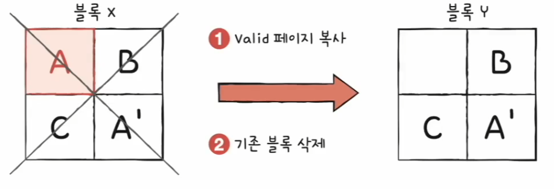

---

[이전 ↩️ - 컴퓨터 구조(메모리와 캐시 메모리) - 캐시 메모리](https://github.com/genesis12345678/TIL/blob/main/cs/memory/Cache.md)

[메인 ⏫](https://github.com/genesis12345678/TIL/blob/main/cs/Main.md)

[다음 ↪️ - 컴퓨터 구조(보조기억장치) - RAID]()