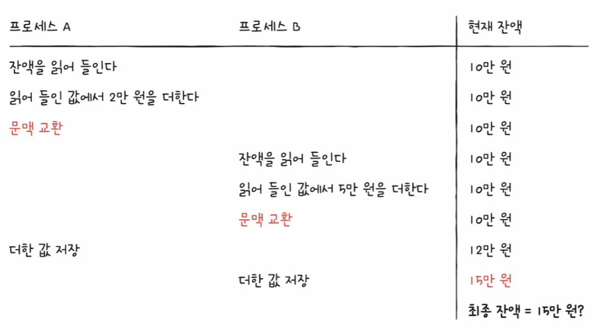
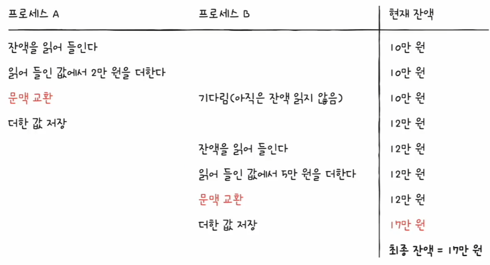
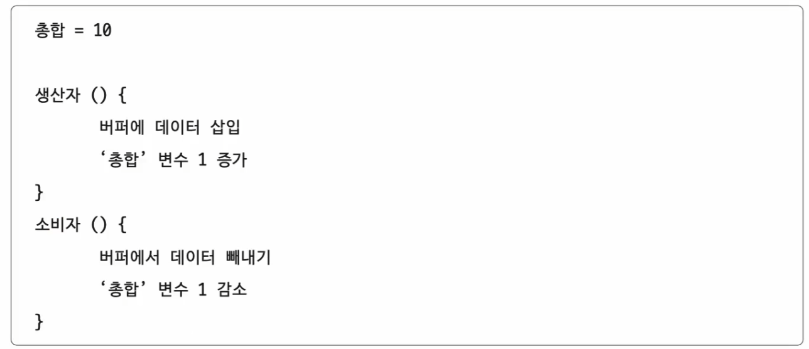
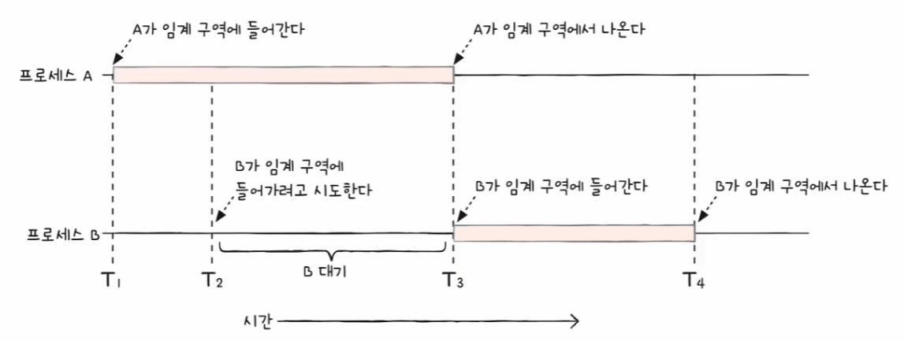
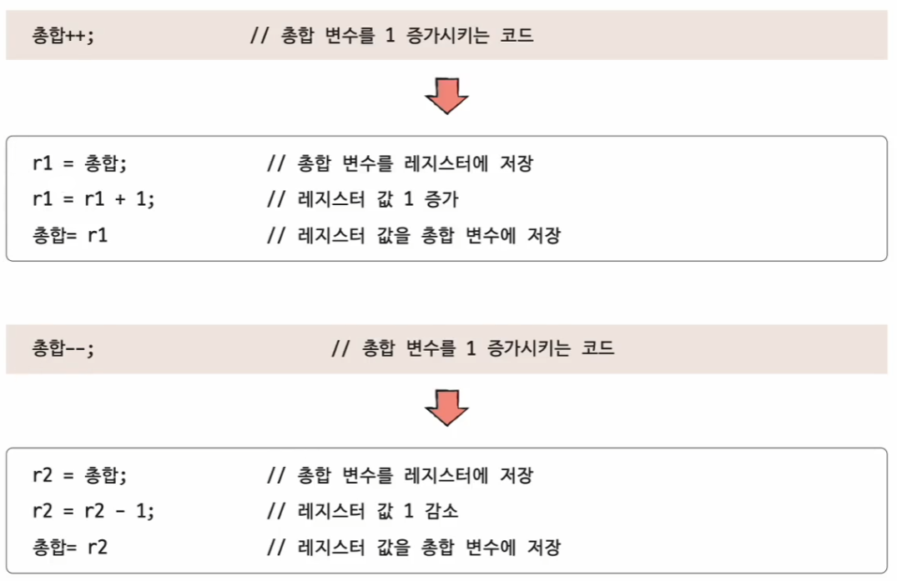
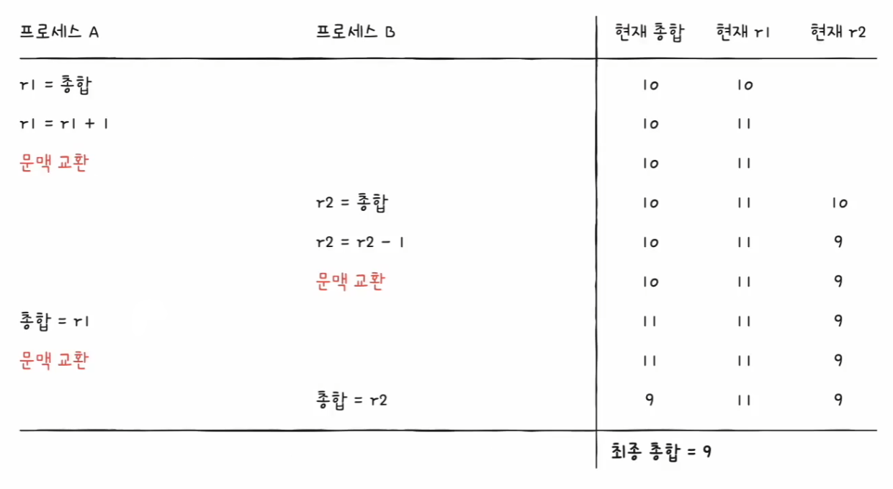

# 컴퓨터 구조와 운영체제

# 운영체제 - 프로세스 동기화

## 동기화란

- 동시다발적으로 실행되는 많은 프로세스는 서로 데이터를 주고받으며 협력하며 실행될 수 있는데, 이 과정에서 올바른 실행을 위해서는 **동기화**가 필수이다.
- **동기화**의 사전적 의미는 작업들 사이의 수행 시기를 맞추는 것으로 즉, **프로세스 동기화**란 프로세스들 사이의 수행 시기를 맞추는 것을 의미한다.
- 프로세스들 사이의 수행 시기를 맞추는 것(동기화)은 다음과 같은 동기화가 있다.

### 실행 순서 제어를 위한 동기화

- 예를 들어 어떤 파일로부터 값을 읽어들이는 `Reader` 프로세스와 값을 저장하는 `Writer` 프로세스가 있을 때, 이 두 프로세스는 아무 순서대로 실행되어서는 안 된다.
- `Reader` 프로세스는 파일 안에 값이 존재한다는 특정 조건이 만족되어야만 실행을 이어나갈 수 있기 때문에`Reader` 프로세스보다 `Writer` 프로세스 실행이 먼저 되어야 한다.
- 이렇게 동시에 실행되는 프로세스를 올바른 순서대로 실행하는 것을 **실행 순서 제어를 위한 동기화**라고 한다.

### 상호 배제를 위한 동기화

- 상호 배제는 공유가 불가능한 자원의 동시 사용을 피하기 위해 사용하는 알고리즘이다.
- 즉, 한 번에 하나의 프로세스만 접근해야 하는 자원에 동시 접근을 피하기 위한 동기화다.
- 예를 들어 현재 계좌에 10만원이 있고, 프로세스 A는 2만원, 프로세스 B는 5만원을 추가하는 프로세스가 있다고 해보자.
- 이 두 개의 프로세스를 동시에 실행하면 현재 계좌에는 17만원이 남게 될까? 동기화가 제대로 이루어지지 않은 경우 다음과 같이 기대하지 않은 결과가 나온다.

- 두 개의 프로세스는 잔액이라는 동시에 사용하는데, 프로세스 A가 끝나기도 전에 프로세스 B가 잔액을 읽어 버렸기 때문이다.
- 올바르게 실행되기 위해서는 한 프로세스가 잔액에 접근했을 때 다른 프로세스는 기다려야 한다.

- 이렇게 동시에 접근해서는 안 되는 자원에 동시에 접근하지 못하게 하는 것이 **상호 배제를 위한 동기화**이다.

---

## 생산자와 소비자 문제

- **생산자와 소비자 문제**는 상호 배제를 위한 동기화의 고전적이고 유명한 예이다.
- 물건을 계속해서 생산하는 프로세스인 생산자와 물건을 계속해서 소비하는 프로세스인 소비자로 이루어져 있다.
- 그리고 생산자와 소비자는 "총합"이라는 데이터를 공유하고 있다.
- 생산자는 버퍼에 물건을 넣은 후, 총합 변수를 1 증가시키고, 소비자는 버퍼에 물건을 빼낸 후 총합 변수를 1 감소시킨다.

- 생산자와 소비자를 동일한 횟수로 동시에 실행한다면, 총합 변수는 처음 그대로 있을 것 같지만 그렇지 않다. 심지어 실행할 때마다 값이 다르다.
- 이는 생산자 프로세스와 소비자 프로세스가 제대로 동기화되지 않았기 때문이다.
- 생산자와 소비자는 총합이라는 데이터를 동시에 사용하는데, 서로의 작업이 끝나기 전에 총합을 수정했기 때문이다.
- 즉, 동시에 접근해서는 안 되는 자원에 동시에 접근했기에 발생한 문제라고 볼 수 있다.

**그렇다면 동시에 접근해서는 안 되는 자원이란 무엇일까?**

---

## 공유 자원과 임계 구역

- 상호 배제를 위한 동기화에서 보았던 잔액, 생산자와 소비자 문제에서 보았던 총합이라는 공동의 자원을 **공유 자원**이라고 한다.
- 공유 자원은 전역 변수, 파일, 입출력장치, 보조기억장치가 될 수도 있다.
- 그리고 이 공유 자원 중에는 두 개 이상의 프로세스를 동시에 실행하면 문제가 발생하는 자원이 있다.(잔액, 총합)
- 이렇게 동시에 실행하면 문제가 발생하는 자원에 접근하는 코드 영역을 **임계 구역**이라고 한다.
- 두 개 이상의 프로세스가 임계 구역에 진입하고자 하면 둘 중 하나는 대기해야 한다. 

- 그러나 잘못된 실행으로 인해 여러 프로세스가 동시 다발적으로 임계 구역의 코드를 실행하면 문제가 발생하는 경우가 있는데, 이를 **레이스 컨디션**이라고 한다.
- 레이스 컨디션이 발생하면 데이터의 일관성이 깨지는 문제가 발생한다.
- 레이스 컨디션이 발생하는 근본적인 이유를 따져보면, 저급 언어와 관련이 있다.
- 예를 들어 "총합 1 증가", "총합 1 감소" 하는 코드는 고급 언어로 한 줄로 작성할 수 있지만, 컴퓨터 내부에서 여러 줄의 저급 언어로 변환되어 실행된다.

- 컴퓨터는 저급 언어를 실행하기 때문에 여러 줄의 저급 언어로 변환된 고급 언어 한 줄을 실행하는 과정에서 문맥 교환이 발생할 수 있다.

- 상호 배제를 위한 동기화는 이런 문제가 발생하지 않도록 두 개 이상의 프로세스가 임계 구역에 동시에 접근하지 못하도록 관리하는 것을 의미한다.
- 상호 배제를 위한 동기화를 위해서는 세 가지 원칙이 지켜져야 한다.
  - **상호 배제**
    - 한 프로세스가 임계 구역에 진입했다면 다른 프로세스는 임계 구역에 들어올 수 없다.
  - **진행**
    - 임계 구역에 어떤 프로세스도 진입하지 않았다면 진입하고자 하는 프로세스는 들어갈 수 있어야 한다.
  - **유한 대기**
    - 한 프로세스가 임계 구역에 진입하고 싶다면 그 프로세스는 언젠가는 임계 구역에 들어올 수 있어야 한다.
    - 임계 구역에 들어오기 위해 무한정 대기해서는 안 된다.

---

[이전 ↩️ - 운영체제(CPU 스케줄링) - CPU 스케줄링 알고리즘]()

[메인 ⏫](https://github.com/genesis12345678/TIL/blob/main/cs/Main.md)

[다음 ↪️ - 운영체제(프로세스 동기화) - 동기화 기법]()