# 컴퓨터 구조와 운영체제

# 운영체제 - 프로세스 동기화

## 동기화 기법

## 뮤텍스 락

- **뮤텍스 락**은 탈의실로 비유할 수 있다. 손님은 프로세스가 되고, 탈의실은 임계 구역이라고 할 수 있다.
- 탈의실이 이용 중인지 확인하려면 탈의실을 열어 보고 자물쇠가 걸려 있다면 현재 탈의실은 이용 중이라는 것을 알고 기다릴 것이다.
- 이 자물쇠 기능을 코드로 구현한 것이 **뮤텍스 락**이다. 동시에 접근해서는 안 되는 자원에 동시에 접근하지 않도록 만드는 도구, 즉 상호 배제를 위한 동기화 도구이다.
- 뮤텍스 락의 단순한 형태는 전역 변수 하나와 두 개의 함수로 구현할 수 있다.
  - 자물쇠 역할 : 프로세스들이 공유하는 전역 변수 `lock`
  - 임계 구역을 잠그는 `acquire` 함수
  - 임계 구역의 잠금을 해제하는 `release` 함수

**acquire 함수**는 프로세스가 임계 구역에 진입하기 전에 호출하는 함수로, 만약 임계 구역이 잠겨 있다면 임계 구역이 열릴 때까지 임계 구역을 반복적으로 확인하고,
임계 구역이 열려 있다면 임계 구역을 잠그는 함수다.

**release 함수**는 임계 구역에서의 작업이 끝나고 호출하는 함수로, 현재 잠긴 임계 구역을 열어주는 함수라고 보면 된다.

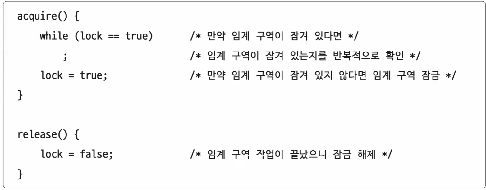

> 임계 구역이 잠겨 있는지 **반복적으로 확인**하는 것을 **바쁜 대기**라고 한다.

acquire 함수와 release 함수를 임계 구역 전후로 호출함으로써 하나의 프로세스만 임계 구역에 진입할 수 있다.

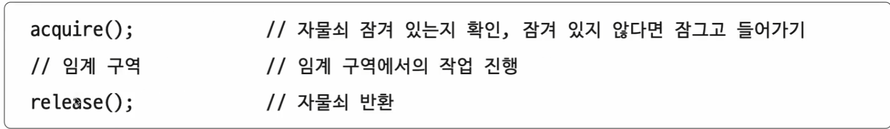

- 즉 프로세스는
  - 락을 획득할 수 없다면(임계 구역에 진입할 수 없다면) 무작정 기다리고,
  - 락을 획득할 수 있다면(임계 구역에 진입할 수 있다면) 임계 구역을 잠근 뒤 임계 구역에서의 작업을 진행하고,
  - 임계 구역에서 빠져나올 때 다시 임계 구역의 잠금을 해제함으로써
- 임계 구역을 보호할 수 있다.

---

## 세마포어

- 뮤텍스 락과 비슷하지만, 조금 더 일반화된 방식의 동기화 도구이다. 뮤텍스 락은 공유 자원이 하나 있는 경우를 가정하고 만든 동기화 도구라면,
    **세마포어**는 공유 자원이 여러 개 있는 상황에서도 적용이 가능한 동기화 도구이다.

> 세마포어는 **이진 세마포어**와 **카운팅 세마포어**가 있는데, 이진 세마포어는 뮤텍스 락과 비슷한 개념이다.

- **세마포어**는 멈춤 신호와 가도 좋다라는 신호로서 임계 구역을 관리한다.
- 즉, 프로세스는 임계 구역 앞에서 멈춤 신호를 받으면 잠시 기다리고, 가도 좋다는 신호를 받으면 그제서야 임계 구역에 들어가게 된다.
- 세마포어는 뮤텍스 락과 비슷하게 하나의 변수와 두 개의 함수로 단순하게 구현할 수 있다.
  - 임계 구역에 진입할 수 있는 프로세스의 개수(사용 가능한 공유 자원의 개수)를 나타내는 **전역 변수 S**
  - 임계 구역에 들어가도 좋은지, 기다려야 할지를 알려주는 **wait 함수**
  - 임계 구역 앞에서 기다리는 프로세스에 이제 가도 좋다고 신호를 주는 **signal 함수**

뮤텍스 락과 같이 세마포어도 임계 구역 전후로 **wait**과 **signal** 함수를 호출한다.

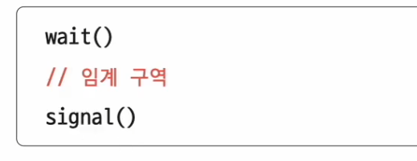

**wait** 함수는 다음과 같이 만든다.

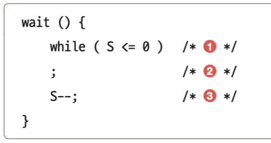

1. 임계 구역에 진입할 수 있는 프로세스 개수가 0 이하라면
2. 사용할 수 있는 자원이 있는지 반복적으로 확인하고,
3. 임계 구역에 진입할 수 있는 프로세스 개수가 하나 이상이면 S를 1 감소시키고 임계 구역 진입

**signal** 함수는 다음과 같이 만든다.

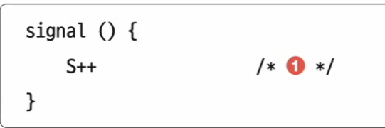

1. 임계 구역에서의 작업을 마친 뒤 S를 1 증가시킨다.

세 개의 프로세스 P1, P2, P3가 두 개의 공유 자원(S=2)에 P1, P2, P3 순서로 접근한다면 다음과 같을 것이다.

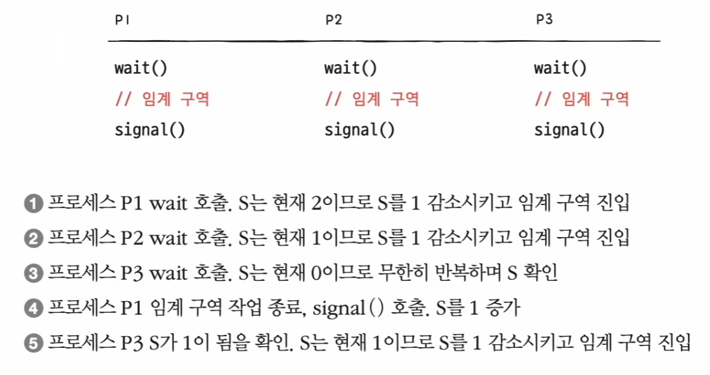

- 여기서 한 가지 문제가 있는데, 사용할 수 있는 공유 자원이 없는 경우 프로세스는 무작정 무한히 반복하며 S를 확인해야 한다.(바쁜 대기, 뮤텍스 락도 마찬가지)
- 바쁜 대기를 확인하는 시간이 CPU 사이클을 낭비하게 된다. 그래서 세마포어는 다음과 같은 방법으로 해결한다.
- 사용할 수 있는 자원이 없을 경우 해당 프로세스를 **대기 상태**로 만들고, 그 프로세스의 PCB를 세마포어를 위한 대기 큐에 삽입한다.
- 그리고 사용할 수 있는 자원이 생겼을 경우 대기 중인 프로세스를 대기 큐에서 제거하고, 프로세스 상태를 **준비 상태**로 변경한 뒤 준비 큐에 삽입한다.

이를 간단한 코드로 보면 다음과 같다.

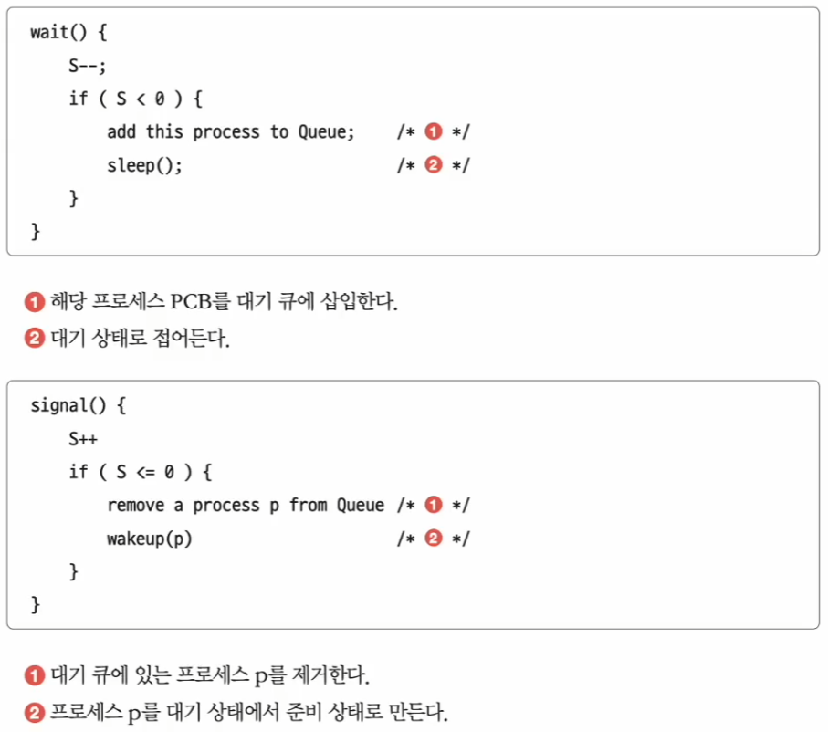

세 개의 프로세스 P1, P2, P3가 두 개의 공유 자원(S=2)에 P1, P2, P3 순서로 접근한다면 다음과 같을 것이다.

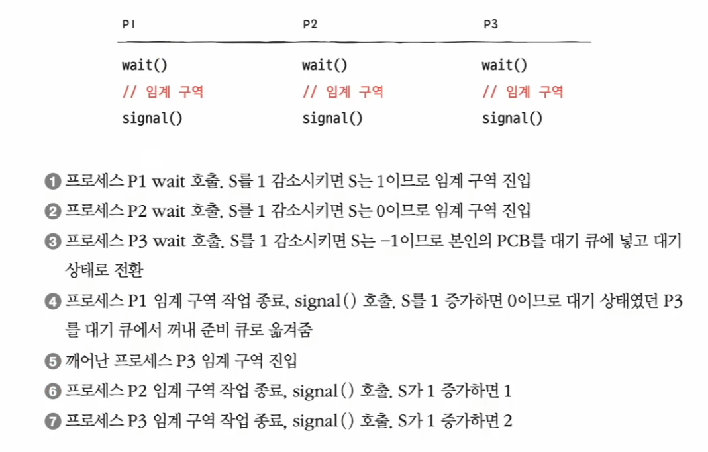

- **세마포어를 이용하면 동시에 실행되는 프로세스의 실행 순서도 원하는 대로 제어할 수 있다.**(실행 순서를 위한 동기화)
- 세마포어의 변수 S를 0으로 두고 먼저 실행할 프로세스 뒤에 signal 함수, 다음에 실행할 프로세스 앞에 wait 함수를 붙이면 된다.

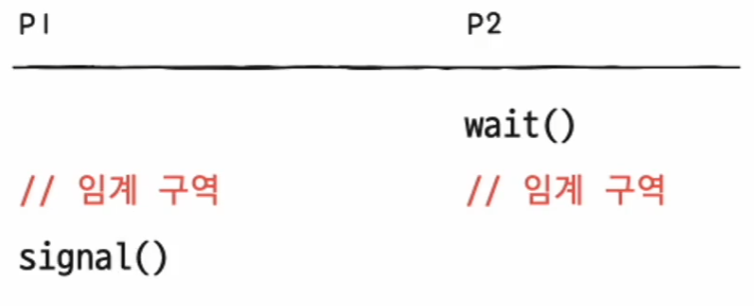

- P1이 먼저 실행되면 P1이 임계 구역에 진입하는 것은 자명한 일이고, P2가 먼저 실행되더라도 P2는 wait 함수를 만나므로 P1이 임계 구역에 진입한다.
- 그리고 P1이 임계 구역의 실행을 끝내고 signal을 호출하면 그제서야 P2가 임계 구역에 진입한다.
- 즉, P1과 P2 중에 실행 순서에 상관없이 P1, P2 순서대로 실행된다.

---

## 모니터

- 세마포어는 매번 임계 구역에 앞뒤로 wait과 signal 함수를 명시해야 하는 번거로움이 있으며, 실수할 여지도 있다.
- 이에 등장한 동기화 도구가 **모니터**이다. 모니터는 세마포어에 비하면 사용자가 사용하기에 훨씬 편리한 도구이다.
- 모니터는 다음과 같이 공유 자원과 공유 자원에 접근하기 위한 인터페이스(통로)를 묶어 관리한다. 그리고 프로세스는 반드시 인터페이스를 통해서만 공유 자원에 접근하도록 한다.

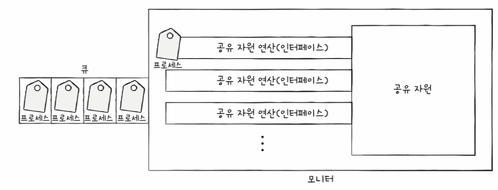

- 이를 위해 모니터를 통해 공유 자원에 접근하고자 하는 프로세스를 큐에 삽입하고, 큐에 삽입된 순서대로 하나씩 공유 자원을 이용하도록 한다.
- 즉, 모니터는 공유 자원을 다루는 인터페이스에 접근하기 위한 큐(모니터에 진입하기 위한 큐)를 만들고, 모니터 안에 항상 하나의 프로세스만 들어오도록 하여
    상호 배제를 위한 동기화를 제공한다.

이 밖에도 모니터는 **실행 순서 제어를 위한 동기화**도 제공한다. 특정 조건을 바탕으로 프로세스를 실행하고 일시 중단하기 위해 모니터는 **조건 변수**를 사용하는데,
조건 변수는 프로세스나 스레드의 실행 순서를 제어하기 위해 사용하는 특별한 변수이다.

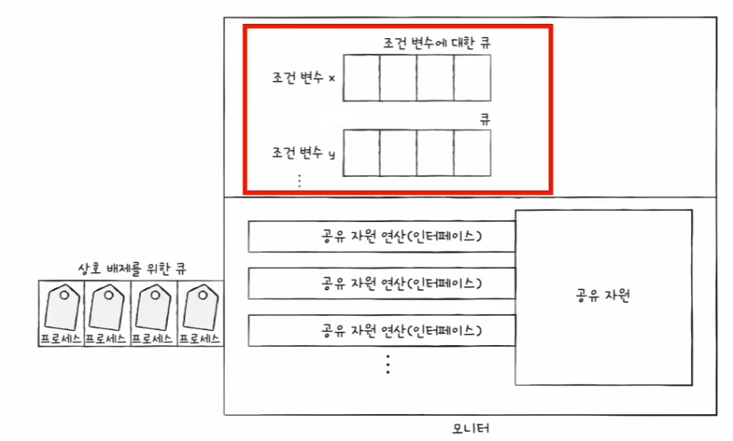

> - 여기서 모니터에 진입하기 위해 삽입되는 큐(상호 배제를 위한 큐)와 실행이 중단된 프로세스들이 삽입되는 큐(조건 변수에 대한 큐)는 다르다.
> - **상호 배제를 위한 큐**는 모니터에 한 번에 하나의 프로세스만 진입하도록 하기 위해 만들어진 큐이고,
> - **조건 변수에 대한 큐**는 모니터에 이미 진입한 프로세스의 실행 조건이 만족될 때까지 잠시 실행이 중단되어 기다리기 위해 만들어진 큐이다.

- 조건 변수로는 wait과 signal 연산을 수행할 수 있다.
- wait는 호출한 프로세스의 상태를 대기 상태로 전환하고 일시적으로 조건 변수에 대한 큐에 삽입하는 연산이다.

예를 들어 모니터에 진입한 어떤 프로세스가 `x.wait()`을 통해 조건 변수에 x에 대한 wait을 호출했다면, 그 프로세스는 조건 변수 x에 대한 큐에 삽입되므로
모니터는 다시 비게 되고, 다른 프로세스가 모니터안에 들어올 수 있게 된다.

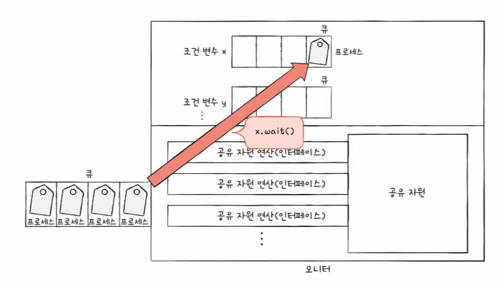

wait 연산으로 일시 중지된 프로세스는 다른 프로세스의 signal 연산을 통해 실행이 재개될 수 있다. 즉, signal은 wait을 호출하여 큐에 삽입된 프로세스의 실행을
재개하는 연산이다.

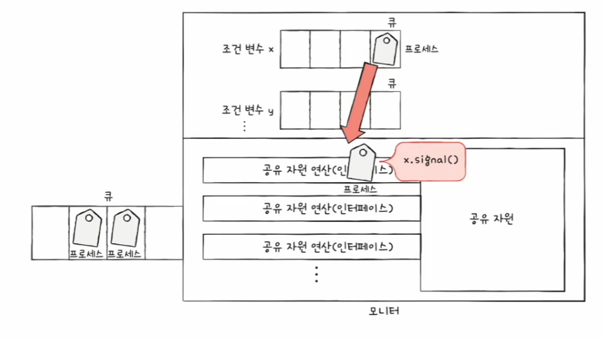

- 모니터 안에는 하나의 프로세스만이 있을 수 있다.
- wait을 호출했던 프로세스는 signal을 호출한 프로세스가 모니터를 떠난 뒤에 실행되거나,(signal and continue)
- signal을 호출한 프로세스의 실행을 일시 중단하고 자신이 실행된 뒤 다시 signal을 호출한 프로세스의 수행을 재개한다.(signal and wait)

중요한 점은 모니터는 조건 변수를 이용하여 프로세스 실행 순서 제어를 위한 동기화를 제공한다는 점이다.

1. 특정 프로세스가 아직 실행될 조건이 되지 않았을 때는 wait을 통해 실행을 중단한다.
2. 특정 프로세스가 실행될 조건이 충족되었을 때는 signal을 통해 실행을 재개한다.

---

[이전 ↩️ - 운영체제(프로세스 동기화) - 동기화란](https://github.com/genesis12345678/TIL/blob/main/cs/sync/Sync.md)

[메인 ⏫](https://github.com/genesis12345678/TIL/blob/main/cs/Main.md)

[다음 ↪️ - 운영체제(교착 상태) - 교착 상태란](https://github.com/genesis12345678/TIL/blob/main/cs/deadlock/Deadlock.md)