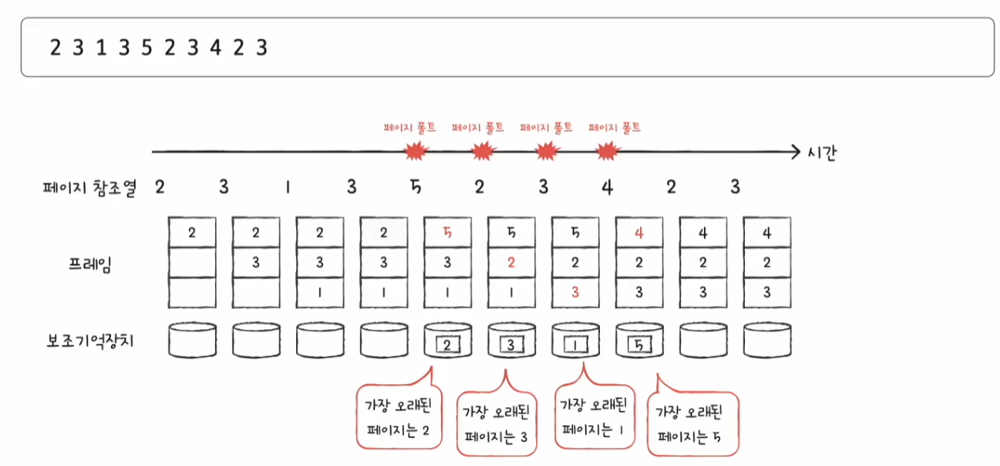
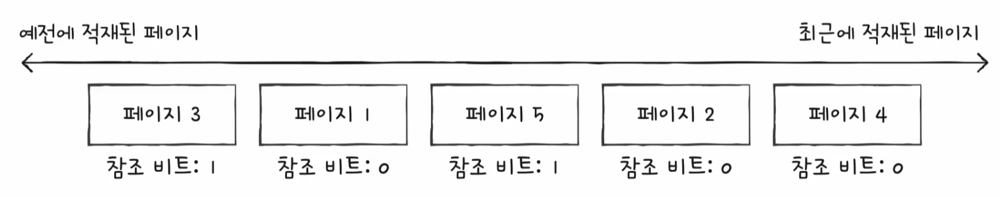
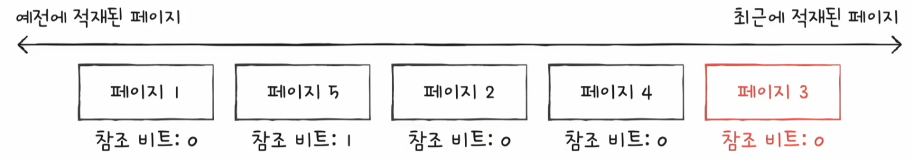
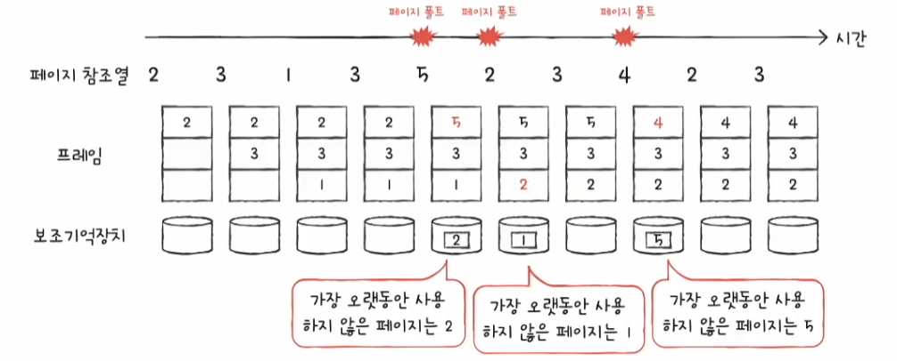
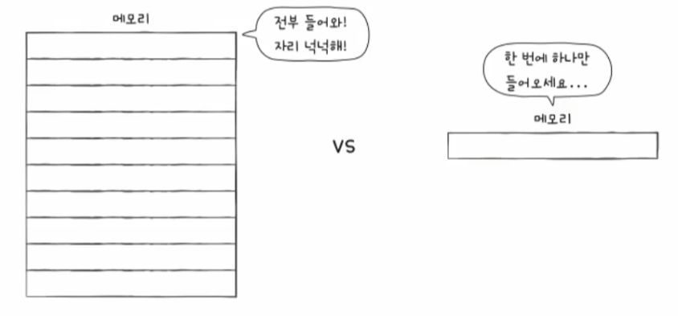
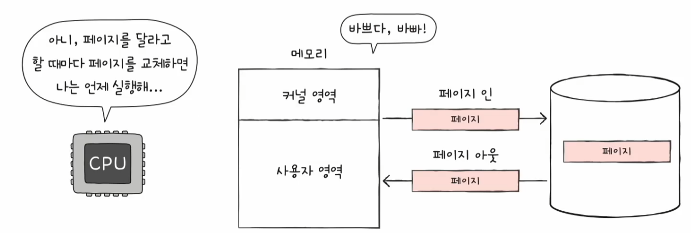
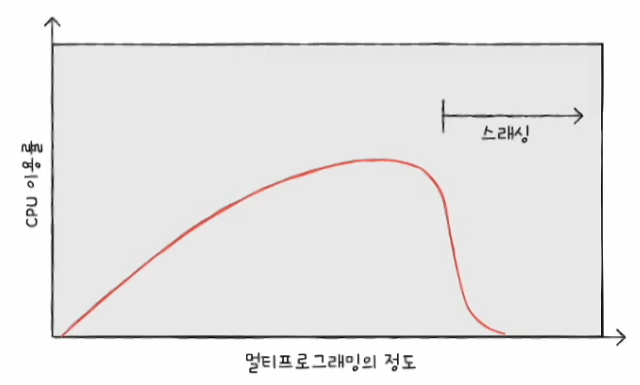
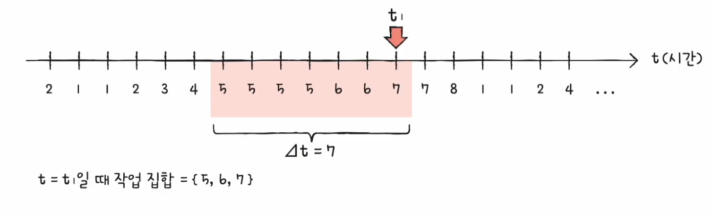
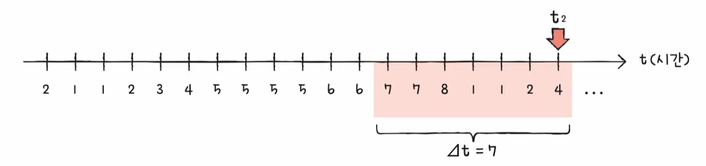
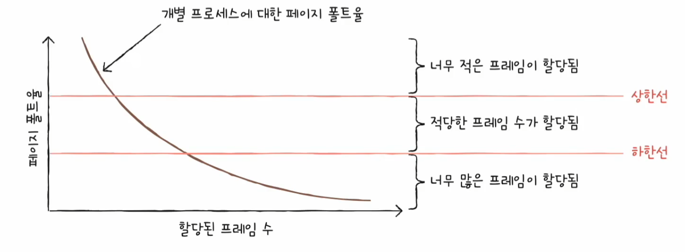

# 컴퓨터 구조와 운영체제

# 운영체제 - 가상 메모리

## 페이지 교체와 프레임 할당

- 가상 메모리를 통해 작은 물리 메모리부터 큰 프로세스도 실행할 수는 있지만, 여전히 물리 메모리의 크기는 한정되어 있다.
- 운영체제는 프로세스들이 한정된 메모리를 효율적으로 이용할 수 있도록 기존에 메모리에 적재된 불필요한 페이지를 선별하여 보조기억장치로 내보낼 수 있어야 하고,
    프로세스들에 적절한 수의 프레임을 할당하여 페이지를 할당할 수 있게 해야 한다.

---

## 요구 페이징

- 프로세스를 메모리에 적재할 때 처음부터 모든 페이지를 적재하지 않고 필요한 페이지 만을 메모리에 적재하는 기법을 **요구 페이징**이라고 한다.

1. CPU가 특정 페이지에 접근하는 명령어를 실행한다.
2. 해당 페이지가 현재 메모리에 있을 경우(유효 비트가 1일 경우) CPU는 페이지가 적재된 프레임에 접근한다.
3. 해당 페이지가 현재 메모리에 없을 경우(유효 비트가 0일 경우) 페이지 폴트가 발생한다.
4. 페이지 폴트 처리 루틴은 해당 페이지를 메모리로 적재하고 유효 비트를 1로 설정한다.
5. 다시 1번을 수행한다.

- 요구 페이징 시스템이 안정적으로 작동하려면 필연적으로 **페이지 교체**와 프레임 할당이라는 것을 해결해야 한다.
- 요구 페이징 기법으로 페이지들을 적재하다 보면 언젠가 메모리가 가득 차게 된다. 이때는 당장 실행에 필요한 페이지를 적재하기 위해 메모리에 적재된 페이지를 보조기억장치로 내보내야 한다.
- 이때 쫓아낼 페이지를 결정하는 방법을 **페이지 교체 알고리즘**이라고 한다.

---

## 페이지 교체 알고리즘

- 일반적으로 페이지 폴트를 가장 적게 일으키는 알고리즘이 좋은 알고리즘으로 평가한다.
- 페이지 폴트가 발생하면 보조기억장치에 접근해야 해서 성능 저하가 발생한다.
- **페이지 폴트 횟수**는 페이지 참조열을 통해 알 수 있다. **페이지 참조열**은 CPU가 참조하는 페이지들 중 연속된 페이지를 생략한 페이지열을 의미한다.
- 만약 CPU가 `2 2 2 3 5 5 5 3 3 7` 순서로 페이지에 접근할 때, 연속된 페이지를 생략한 페이지 참조열은 `2 3 5 3 7`이 된다.
- 연속된 페이지를 생략하는 이유는 중복된 페이지를 참조하는 행위는 페이지 폴트를 발생시키지 않기 때문이다.
- 페이지 교체 알고리즘을 평가할 때 관심있게 고려할 것은 오직 페이지 폴트의 발생 횟수이기 때문에 어차피 페이지 폴트가 일어나지 않을 연속된 페이지에 대한 참조는 고려하지 않는 것이다.

### FIFO 페이지 교체 알고리즘

- 메모리에 가장 먼저 올라온 페이지부터 내쫓는 방식이다.

- 구현이 간단하지만 단점이 있다.
- 프로그램 실행 초기에 잠깐 실행되는 페이지도 있고, 프로그램 실행 내내 사용될 페이지가 있는데 후자와 같은 페이지를 메모리에 먼저 적재되었다고 해서
    내쫓아서는 안된다.

> **2차 기회 페이지 교체 알고리즘**
> 
> - FIFO 페이지 교체 알고리즘의 변형으로, 한 번 더 기회를 주는 알고리즘이다.
> - 기본적으로 FIFO 알고리즘과 같이 메모리에서 가장 오래 머물렀던 페이지를 대상으로 내보낼 페이지를 선별한다.
> - 차이는 페이지의 참조 비트가 1일 경우, 당장 내쫓지 않고 참조 비트를 0으로 만든 뒤 현재 시간을 적재 시간으로 설정한다.
> - 메모리에 가장 오래 머물렀다 할지라도 참조 비트가 1이라는 의미는 CPU가 접근한 적이 있다는 의미이므로 한 번의 기회를 더 주는 셈이다.
> - 메모리에 가장 오래 머무른 페이지의 참조 비트가 0일 경우 가장 오래된 페이지이면서 동시에 사용되지 않은 페이지라고 볼 수 있으므로 보조기억장치로 내보내면 된다.
> 
> 
> 
> - 예를 들어 위와 같은 상황에서 페이지 6이 새롭게 적재되어야 한다고 했을 때, 기존 FIFO 알고리즘이라면 페이지 3을 내보냈을 것이다.
> - 하지만 2차 기회 페이지 교체 알고리즘은 페이지 3의 참조 비트가 1인 것을 확인하고 이를 0으로 변경한 뒤 최근에 적재된 페이지로 간주한다. 한 번의 기회를 더 주는 것이다.
> 
> 
> 
> - 페이지 1을 내보내고 페이지 1이 적재되었던 프레임에 페이지 6을 적재하면 된다.

### 최적 페이지 교체 알고리즘

- CPU에 의해 참조되는 횟수를 고려하는 페이지 교체 알고리즘
- 메모리에 오랫동안 남아야할 페이지는 자주 사용될 페이지고, 반대로 메모리에 없어도 될 페이지는 오랫동안 사용되지 않을 페이지이다.
- 앞으로의 사용 빈도가 가장 낮은 페이지를 교체하는 알고리즘을 **최적 페이지 교체 알고리즘**이라고 한다.

- 가장 낮은 페이지 폴트율을 보장하는 알고리즘이다.
- 하지만 앞으로 오랫동안 사용되지 않을 페이지를 예측해야 하는데, 이는 현실적으로 불가능에 가깝다.
- 따라서 최적 페이지 교체 알고리즘은 주로 다른 페이지 교체 알고리즘의 이론상 성능을 평가하기 위한 목적으로 사용된다.

### LRU 페이지 교체 알고리즘

- **LRU : Least Recently Used**
- 최적 페이지 교체 알고리즘은 가장 오랫동안 사용되지 **않을** 페이지를 교체한다면, **LRU**는 가장 오랫동안 사용되지 **않은** 페이지를 교체하는 알고리즘이다.
- 최근에 사용되지 않은 페이지는 앞으로도 사용되지 않을 것이라는 아이디어를 토대로 만들어진 알고리즘이다.
- 페이지마다 마지막으로 사용한 시간을 토대로 최근에 가장 사용이 적었던 페이지를 교체한다.

---

## 스래싱과 프레임 할당

- 페이지 폴트가 자주 발생하는 이유는 나쁜 페이지 교체 알고리즘 외에도 프로세스가 사용할 수 있는 프레임 수가 적다는 것도 있다.
- 반대로 프로세스가 사용할 수 있는 프레임 수가 많으면 일반적으로 페이지 폴트 빈도는 감소한다.

- 프레임이 부족하면 CPU는 페이지 폴트가 자주 발생할 수밖에 없다.
- CPU가 쉴새 없이 프로세스를 실행해야 좋은데, 프로세스가 실제 실행되는 시간보다 페이징에 더 많은 시간을 소요하여 성능이 저해되는 문제를 **스래싱**이라고 한다.
- 즉 스래싱이란 지나치게 빈번한 페이지 교체로 인해 CPU 이용률이 낮아지는 문제를 뜻한다.

- 스래싱을 그래프로 표현하면 다음과 같다.
- 세로축은 CPU 이용률, 가로축은 메모리에 올라와 있는 프로세스의 수를 의미한다.
- 메모리에서 동시 실행되는 프로세스의 수를 **멀티프로그래밍의 정도**라고 한다.

- 동시에 실행되는 프로세스의 수(멀티프로그래밍의 정도)를 늘린다고 해서 CPU 이용률이 비례해서 증가하지 않는다.
- 필요 이상으로 늘리면 각 프로세스들이 사용할 수 있는 프레임 수가 적어지기 때문에 페이지 폴트가 빈번히 발생하고, 이에 따라 CPU 이용률이 떨어지게 된다.

**스래싱이 발생하는 근본적인 원인은 각 프로세스가 필요로 하는 최소한의 프레임 수가 보장되지 않았기 때문이다.**

- 운영체제는 각 프로세스가 필요로 하는 최소한의 프레임 수를 파악하고 프로세스들에게 적절한 프레임을 할당해 줄 수 있어야 한다.

### 정적 할당 방식

> 프로세스의 실행 과정을 고려하지 않고 단순히 프로세스의 크기와 물리 메모리의 크기만을 고려한 방식

#### 균등 할당

- 가장 단순한 형태의 **프레임 할당 방식**은 모든 프로세스에 균등하게 프레임을 제공하는 방식인 **균등 할당**이 있다.
- 하지만 실행되는 프로세스들의 크기는 각기 다른데, 동일한 프레임 개수를 할당하는 것은 비합리적이다.

#### 비례 할당

- 프로세스의 크기가 크면 프레임을 많이 할당하고 프로세스 크기가 작으면 프레임을 적게 나눠주는 방식이다.
- 하나의 프로세스가 실제로 얼마나 많은 프레임이 필요할지는 결국 실행해 봐야 아는 경우가 많아 완벽한 방식은 아니다.

### 동적 할당 방식

> 프로세스의 실행을 보고 할당할 프레임 수를 결정하는 방식

#### 작업 집합 모델을 사용하는 방식

- 스래싱이 발생하는 이유는 빈번한 페이지 교체 때문이다. 그렇기에 프로세스가 일정 기간 동안 참조한 페이지 집합을 기억하여 빈번한 페이지 교체를 방지하는 방식이다.
- CPU가 메모리를 참조할 때에는 [참조 지역성의 원리](https://github.com/genesis12345678/TIL/blob/main/cs/memory/Cache.md#%EC%B0%B8%EC%A1%B0-%EC%A7%80%EC%97%AD%EC%84%B1-%EC%9B%90%EB%A6%AC)에 의해 주로 비슷한 구역을 집중적으로 참조한다.
- 한 프로세스가 100개의 페이지로 이루어졌다고 해서 100개를 모두 고르게 참조하는 것이 아니라, 특정 시간 동안 몇몇 개의 페이지(정확히는 몇 개의 페이지 내 주소들)만을
집중적으로 참조하게 된다.
- 그럼 CPU가 특정 시간 동안 주로 참조한 페이지 개수만큼만 프레임을 할당하면 페이지 교체는 빈번하게 발생하지 않을 것이다.
- 실행 중인 프로세스가 일정 시간 동안 참조한 페이지의 집합을 **작업 집합**이라고 한다.

> **작업 집합 구하기**
>
> 작업 집합을 구하려면 두 가지가 필요하다.
> 
> 1. 프로세스가 참조한 페이지
> 2. 일정 시간 간격
> 
> 예를 들어 참조한 페이지는 다음과 같고, 시간 간격이 7일 때를 보자.
> 
> 이 경우 시간 t1에서의 작업 집합은 (5, 6, 7)이 된다. 즉 이 프로세스는 시간 t1에 최소 3개의 프레임이 필요하다고 볼 수 있다.
> 
> 
> 
> 시간 t2에서는 최소 5개의 프레임이 필요하다고 볼 수 있다.
> 
> 

#### 페이지 폴트 빈도를 사용하는 방식

- 두 개의 가정에서 생겨난 아이디어이다.
  1. 페이지 폴트율이 너무 높으면 그 프로세스는 너무 적은 프레임을 갖고 있다.
  1. 페이지 폴트율이 너무 낮으면 그 프로세스는 너무 많은 프레임을 갖고 있다.

이를 그래프로 표현하여 상한선과 하한선을 그어 보면 다음과 같다.

- 만약 페이지 폴트율이 상한선보다 더 높아지면 그 프로세스는 너무 적은 프레임을 갖고 있다고 볼 수 있다. 이 경우 프레임을 더 할당해 주면 된다.
- 반대로 페이지 폴트율이 하한선보다 더 낮아지면 그 프로세스는 너무 많은 프레임을 갖고 있다고 볼 수 있다. 이 경우 다른 프로세스에 할당하기 위해 프레임을 회수한다.

즉, 페이지 폴트율에 상한선과 하한선을 정하고, 이 범위 안에서만 프레임을 할당하는 방식이다.

---

[이전 ↩️ - 운영체제(가상 메모리) - 페이징을 통한 가상 메모리 관리](https://github.com/genesis12345678/TIL/blob/main/cs/virtualmemory/paging.md)

[메인 ⏫](https://github.com/genesis12345678/TIL/blob/main/cs/Main.md)

[다음 ↪️ - 운영체제(파일 시스템) - 파일과 디렉터리]()