# 컴퓨터 구조와 운영체제

# 운영체제 - 가상 메모리

## 페이징을 통한 가상 메모리 관리

- 프로세스를 메모리에 연속적으로 할당하는 방식은 외부 단편화 문제와 물리 메모리보다 큰 프로세스를 실행할 수 없다는 문제가 있다.
- **가상 메모리**는 실행하고자 하는 프로그램을 일부만 메모리에 적재하여 실제 물리 메모리 크기보다 더 큰 프로세스를 실행할 수 있게 하는 기술이다.
- 이를 가능하게 하는 가상 메모리 관리 기법에는 크게 **페이징**과 **세그먼테이션**이 있다.

---

## 페이징이란

- 연속 메모리 할당 방식에서 외부 단편화가 생긴 근본적인 이유는 각기 다른 크기의 프로세스가 메모리에 연속적으로 할당되었기 때문이다.
- 만약 메모리와 프로세스를 일정한 단위로 자르고, 이를 메모리에 불연속적으로 할당할 수 있다면 외부 단편화는 발생하지 않는다.

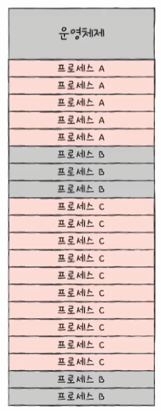

- 이를 **페이징**이라고 한다.
- **페이징**은 프로세스의 논리 주소 공간을 **페이지**라는 일정한 단위로 자르고, 메모리의 물리 주소 공간을 **프레임**이라는 **페이지와 동일한 크기**의 일정한 단위로 자른 뒤
    페이지를 프레임에 할당하는 가상 메모리 관리 기법이다.

- 페이징을 사용하는 시스템에서는 프로세스 전체가 아닌 페이지 단위로 스왑 아웃, 스왑 인 된다.
- 즉, 메모리에 적재될 필요가 없는 페이지들은 보조기억장치로 스왑 아웃(페이지 아웃)되고, 실행에 필요한 페이지들은 메모리로 스왑 인(페이지 인)되는 것이다.

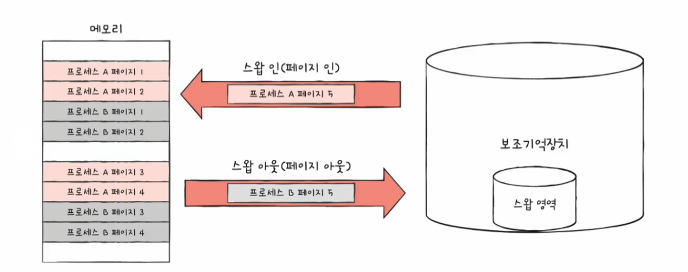

- 이는 다르게 말하면 **한 프로세스를 실행하기 위해 프로세스 전체가 메모리에 적재될 필요가 없다**는 말과 같다.
- 프로세스를 이루는 페이지 중 실행에 필요한 일부 페이지만을 메모리에 적재하고, 당장 실행에 필요하지 않은 페이지들은 보조기억장치에 남겨둘 수 있다.
- 이와 같은 방식을 통해 물리 메모리보다 더 큰 프로세스를 실행할 수 있다.

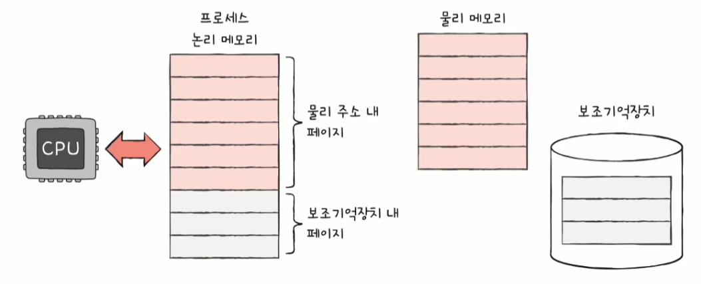

---

## 페이지 테이블

- 프로세스가 메모리에 불연속적으로 배치되어 있다면 CPU  입장에서 이를 순차적으로 실행할 수가 없다. 프로세스를 이루는 페이지가 어느 프레임에 적재되어 있는지
    CPU가 모두 알고 있기란 어렵다.
- 즉, 프로세스가 메모리에 불연속적으로 배치되면 CPU 입장에서 다음에 실행할 명령어 위치를 찾기가 어려워진다.
- 이를 해결하기 위해 페이징 시스템은 프로세스가 물리 주소(실제 메모리 내의 주소)에 불연속적으로 배치되더라도 논리 주소(CPU가 바라보는 주소)에는 연속적으로 배치되도록 **페이지 테이블**을 이용한다.
- 페이지 테이블은 페이지 번호와 프레임 번호를 짝지어 주는 일종의 이정표이다. CPU가 페이지 번호만 보고 해당 페이지가 적재된 프레임을 찾을 수 있게 한다.
- 프로세스마다 각자의 페이지 테이블이 있다.

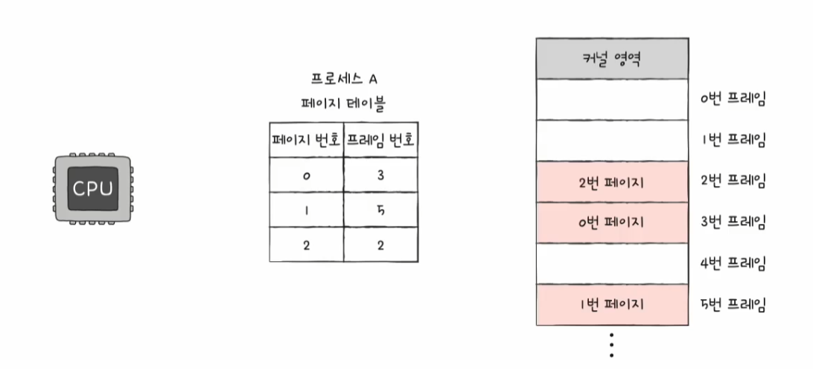

- 위와 같은 방식으로 물리 주소상에서는 프로세스들이 분산 저장되더라도 CPU 입장에서 바라본 논리 주소는 연속적으로 보인다.
- 즉 CPU는 논리 주소를 그저 순차적으로 실행하면 된다.

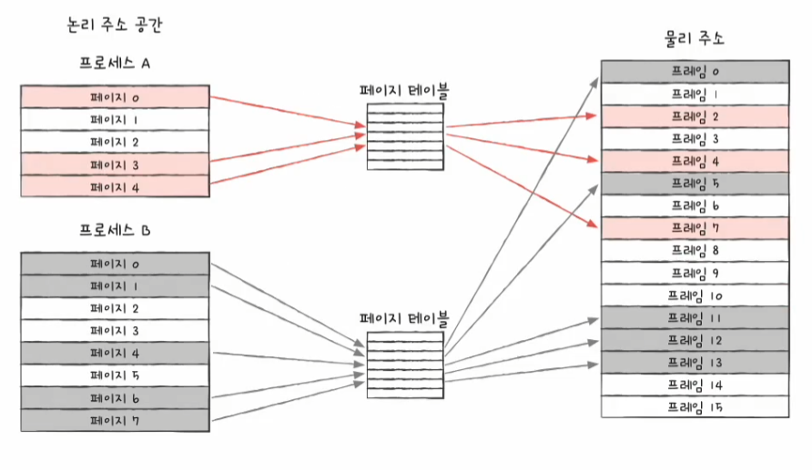

> **내부 단편화**
> 
> - 페이징은 외부 단편화 문제를 해결할 수 있지만, 내부 단편화 문제를 야기할 수 있다.
> - 모든 프로세스가 페이지 크기에 딱 맞게 잘리지 않을 수 있다. 즉 모든 프로세스 크기가 페이지의 배수가 아닐 수 있다.
> - 만약 페이지 크기가 10KB인데, 프로세스 크기가 108KB이면, 마지막 페이지는 2KB만큼의 크기가 남는다.
> - 이러한 메모리 낭비를 **내부 단편화**라고 한다.
> 
> 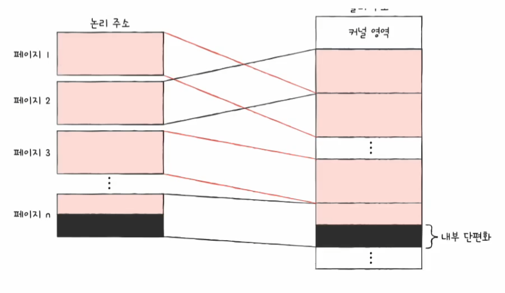
> 
> - 내부 단편화는 하나의 페이지 크기보다 작은 크기로 발생한다. 그래서 하나의 페이지 크기가 작다면 발생하는 내부 단편화의 크기는 작아질 것으로 기대할 수 있다.
> - 하지만 하나의 페이지 크기를 너무 작게 설정하면 그만큼 페이지 테이블의 크기도 커지기 때문에 페이지 테이블이 차지하는 공간이 낭비된다.
> - 그렇기에 내부 단편화를 적당히 방지하면서 너무 크지 않은 페이지 테이블이 만들어지도록 페이지의 크기를 조정하는 것이 중요하다.

### PTBR

- 프로세스마다 각자의 페이지 테이블을 가지고 있고, 각 프로세스의 페이지 테이블들은 메모리에 적재되어 있다.
- 그리고 CPU 내의 **프로세스 테이블 베이스 레지스터(PTBR)** 는 각 프로세스의 페이지 테이블이 적재된 주소를 가리키고 있다.

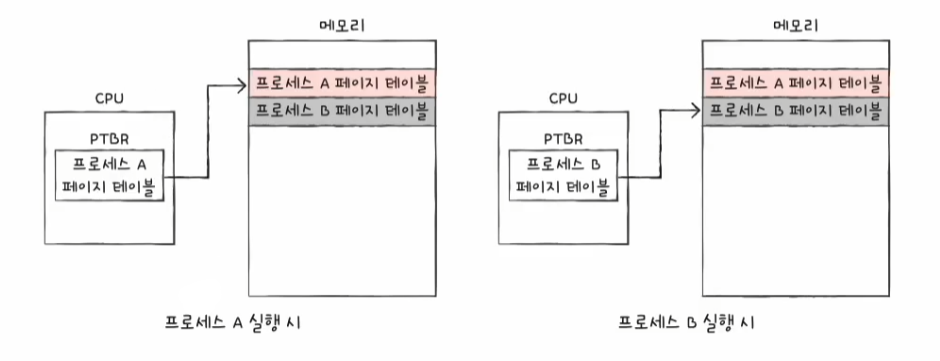

- 여기서 페이지 테이블을 메모리에 두면 메모리 접근 시간이 두 배로 늘어난다는 문제가 있다.
- 메모리에 있는 페이지 테이블을 보기 위해 한 번, 그렇게 알게된 프레임에 접근하기 위해 한 번 메모리 접근이 필요하다.

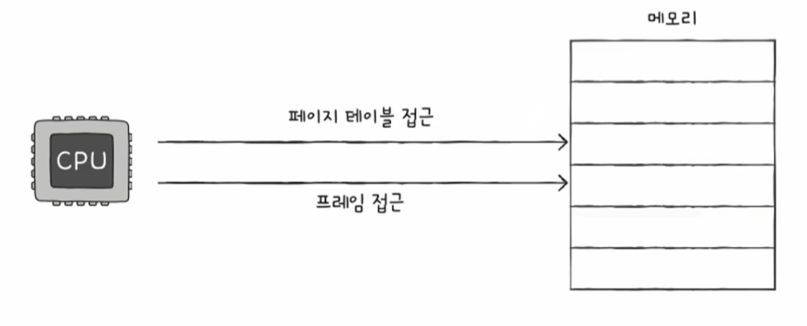

- 이와 같은 문제를 해결하기 위해 CPU 곁에 **TLB**라는 페이지 테이블이 캐시 메모리를 둔다.
- TLB는 페이지 테이블의 캐시이기 때문에 참조 지역성에 근거해 주로 최근에 사용된 페이지 위주로 가져와 페이지 테이블의 일부 내용을 저장한다.

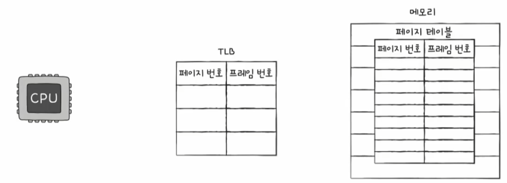

- CPU가 접근하려는 논리 주소가 TLB에 있다면 **TLB 히트**가 발생하고, 메모리에 접근할 필요 없다.
- CPU가 접근하려는 논리 주소가 TLB에 없다면 **TLB 미스**가 발생하고, 페이지가 적재된 프레임을 알기 위해 메모리 접근이 필요하다.

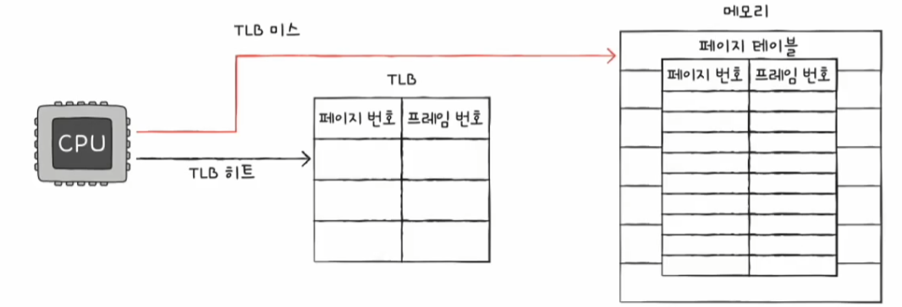

---

## 페이징에서의 주소 변환

- 하나의 페이지 또는 프레임은 여러 주소를 포괄하고 있기 때문에 특정 주소에 접근하려면 두 가지 정보가 필요하다.
  - 어떤 페이지 또는 프레임에 접근하고 싶은지
  - 접근하려는 주소가 그 페이지 또는 프레임으로부터 얼마나 떨어져 있는지

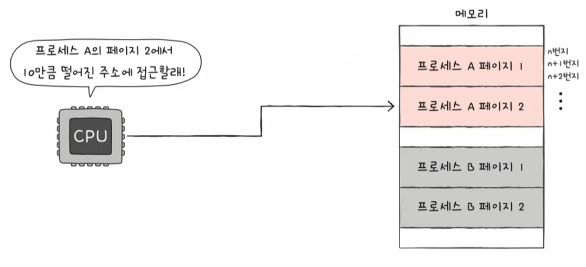

- 페이징 시스템에서는 모든 논리 주소가 기본적으로 **페이지 번호**와 **변위**로 이루어져 있다.
- 페이지 번호는 말그대로 접근하고자 하는 페이지 번호이다. 변위는 접근하려는 주소가 프레임의 시작 번지로부터 얼만큼 떨어져 있는지를 알기 위한 정보이다.
- 즉, 논리 주소 `(페이지 번호, 변위)`는 페이지 테이블을 통해 물리 주소 `(프레임 번호, 변위)`로 변환된다. 

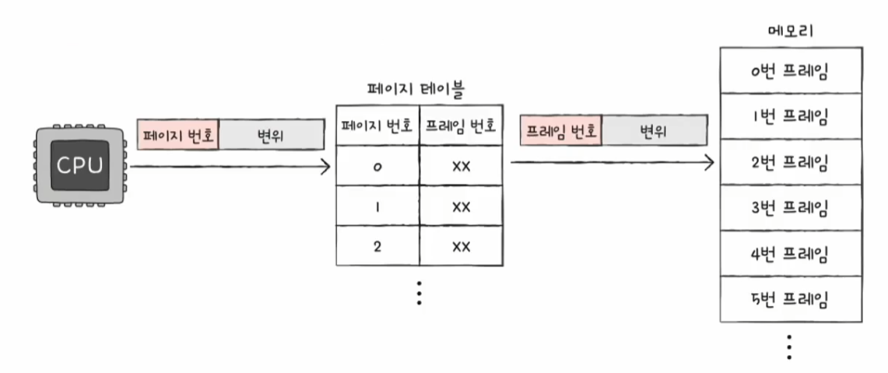

- 만약 다음과 같은 상황에서 CPU가 5번 페이지, 변위 2라는 논리 주소(`(5, 2)`)에 접근한다면 CPU가 접근하게 될 물리 주소는 10번지가 된다.

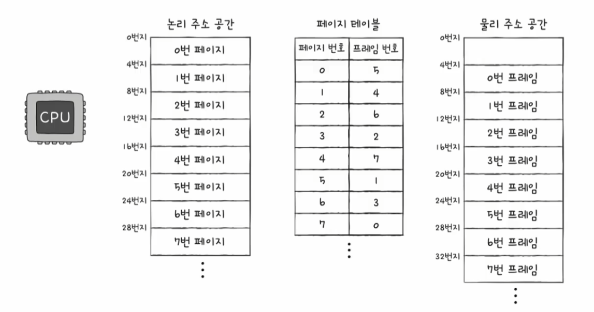

---

## 페이지 테이블 엔트리

- 페이지 테이블의 각 행들을 **페이지 테이블 엔트리**라고 한다.
- 페이지 테이블 엔트리에는 페이지 번호, 프레임 번호 외에 유효 비트, 보호 비트, 참조 비트, 수정 비트 등의 중요한 정보들이 담긴다.

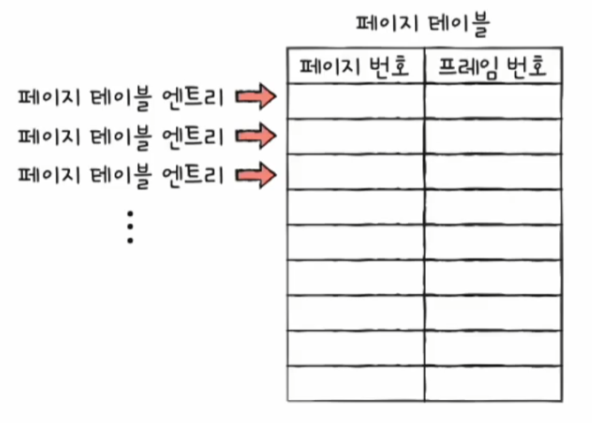

### 유효 비트

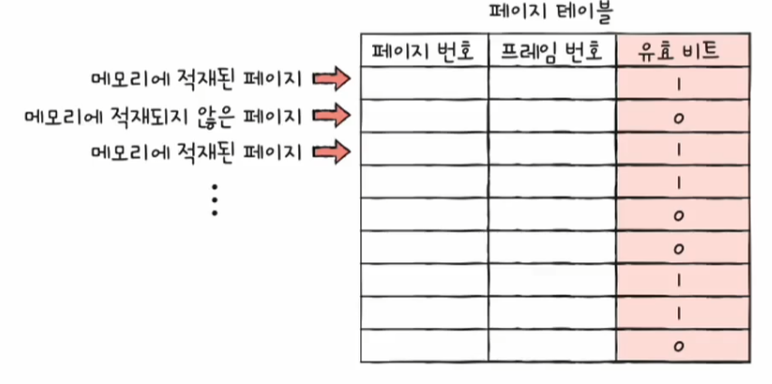

- 현재 해당 페이지에 접근 가능한지 여부를 알려준다.
- 유효 비트는 현재 페이지가 메모리에 적재되어 있는지 아니면 보조기억장치에 있는지를 알려주는 비트다.
- 만약 CPU가 유효 비트가 0인 메모리에 적재되어 있지 않은 페이지로 접근하려고 하면 **페이지 폴트**라는 예외(인터럽트)가 발생한다.
- CPU가 페이지 폴트를 처리하는 과정은 하드웨어 인터럽트를 처리하는 과정과 유사하다.
  1. CPU는 기존의 작업 내역을 백업한다.
  2. 페이지 폴트 처리 루틴을 실행한다.
  3. 페이지 처리 루틴은 원하는 페이지를 메모리로 가져온 뒤 유효 비트를 1로 변경한다.
  4. 페이지 폴트를 처리했다면 이제 CPU는 해당 페이지에 접근할 수 있게 된다.

### 보호 비트

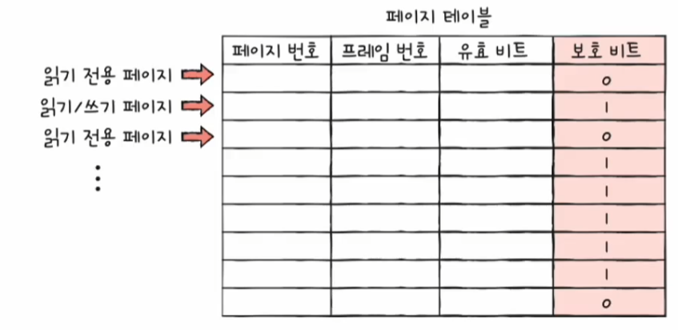

- 페이지 보호 기능을 위해 존재하는 비트이다.
- 보호 비트를 통해 해당 페이지가 읽고 쓰기가 모두 가능한 페이지인지, 읽기만 가능한 페이지인지를 나타낼 수 있다.
- 예를 들어 코드 영역은 읽기 전용이다.
- 다음과 같이 세 개의 비트로 더 복잡하게 구현할 수도 있다.

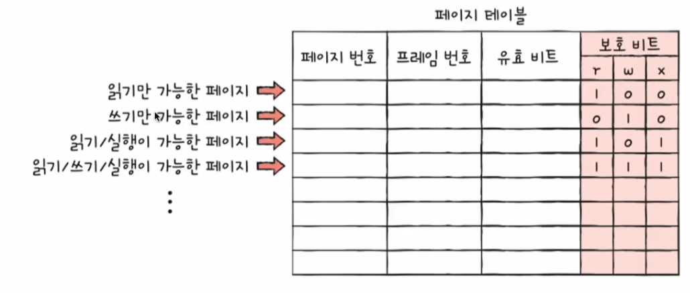

### 참조 비트

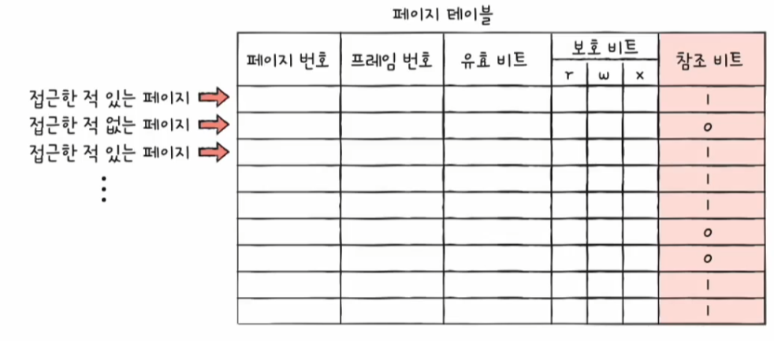

- CPU가 이 페이지에 접근한 적이 있는지 여부를 나타낸다.

### 수정 비트

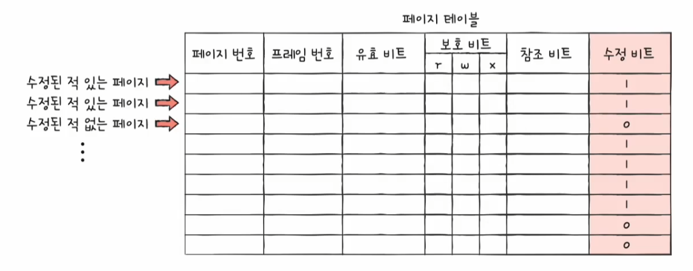

- CPU가 해당 페이지에 데이터를 쓴 적이 있는지 수정 여부를 알려준다.(더티 비트라고도 부른다.)
- 수정 비트는 페이지가 메모리에서 사라질 때 보조기억장치에 쓰기 작업을 해야 하는지, 할 필요가 없는지를 판단하기 위해 존재한다.
- CPU는 메모리를 읽기도 하지만 메모리에 값을 쓰기도 한다.
- 한 번도 수정된 적이 없는 페이지가 스왑 아웃될 경우 추가 작업 없이 새로 적재된 페이지로 덮어쓰기만 하면 된다. 어차피 똑같은 페이지가 보조기억장치에 저장되어 있다.

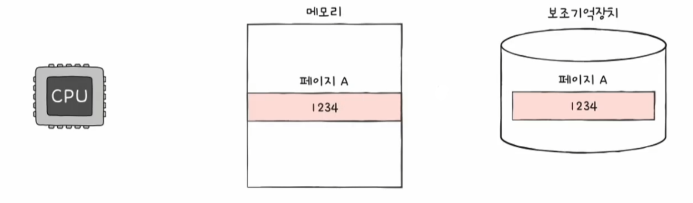

- 하지만 CPU가 쓰기 작업을 수행한 페이지(수정 비트가 1인 페이지)가 스왑 아웃될 경우 변경된 값을 보조기억장치에 기록하는 작업이 추가되어야 한다.

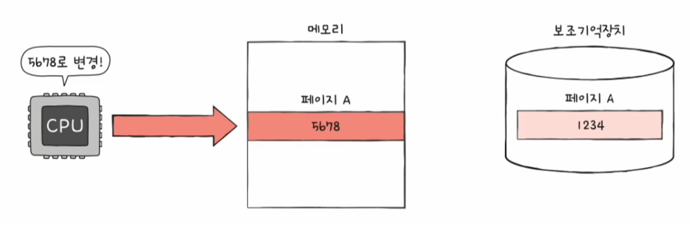

---

## 페이징의 이점

### 쓰기 시 복사

- 페이징은 외부 단편화 문제를 해결한다는 점 외에도 프로세스 간에 페이지를 공유할 수 있다는 이점이 있다.
- 프로세스 간 페이지를 공유하는 사례로는 대표적으로 **쓰기 시 복사**가 있다.
- 운영체제에서 fork 시스템 호출을 하면 부모 프로세스의 복사본이 자식 프로세스로서 만들어진다.
- 프로세스 간에는 기본적으로 자원을 공유하지 않기 때문에 새롭게 생성된 자식 프로세스의 코드 및 데이터 영역은 부모 프로세스가 적재된 메모리 공간과는
    전혀 다른 메모리 공간에 생성된다.
- 즉 부모 프로세스의 메모리 영역이 다른 영역에 자식 프로세스로서 복제되고, 각 프로세스의 페이지 테이블은 자신의 고유한 페이지가 할당된 프레임을 가리킨다.
- 이 복사 작업은 프로세스 생성 시간을 늦출 뿐만 아니라 불필요한 메모리 낭비를 야기한다.

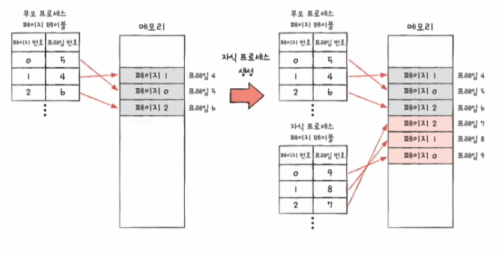

- 반면 쓰기 시 복사에서는 부모 프로세스와 동일한 자식 프로세스가 생성되면 자식 프로세스는 부모 프로세스와 동일한 프레임을 가리킨다.
- 굳이 부모 프로세스의 메모리 공간을 복사하지 않고도 동일한 코드 및 데이터 영역을 가리킬 수 있다.
- 만약 부모 프로세스와 자식 프로세스가 메모리에 읽기 작업만 이어 나간다면 이 상태가 지속된다.

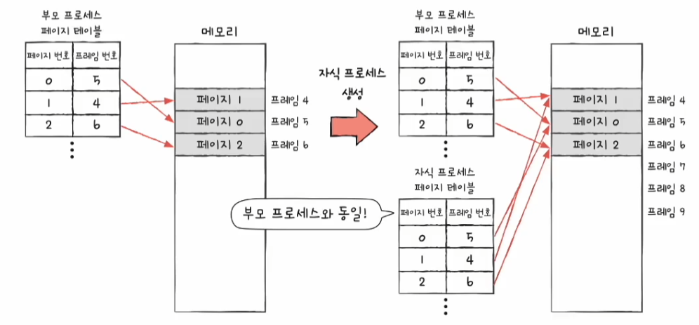

- 하지만 프로세스 간에는 자원을 공유하지 않기 때문에 부모 프로세스와 자식 프로세스 둘 중 하나가 페이지에 쓰기 작업을 하는 순간 해당 페이지가 별도의 공간으로 복제된다.
- 이렇게 **쓰기 시 복사**를 통해 각 프로세스는 자신의 고유한 페이지가 할당된 프레임을 가리킨다.
- 프로세스 생성 시간과 메모리 공간 절약이 가능하다.

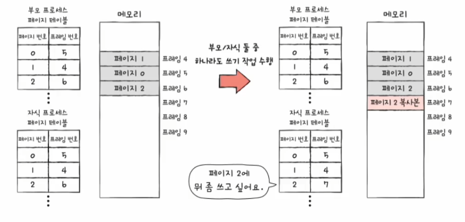

### 계층적 페이징

- 페이지 테이블의 크기는 작지 않다. 프로세스의 크기가 커지면 페이지 테이블의 크기도 커지기 때문에 프로세스를 이루는 모든 페이지 테이블 엔트리를 메모리에 두는 것은
    큰 메모리 낭비이다.
- 프로세스를 이루는 모든 페이지 테이블 엔트리를 항상 메모리에 유지하지 않을 수 있는 방법이 등장했는데, 이를 **계층적 페이징**이라고 한다.
- 계층적 페이징은 페이지 테이블을 페이징하여 여러 단계의 페이지를 두는 방식이다.
- 한 프로세스의 페이지 테이블이 다음과 같을때, 일반적으로는 이 페이지 테이블 전체가 메모리에 있어야 한다.

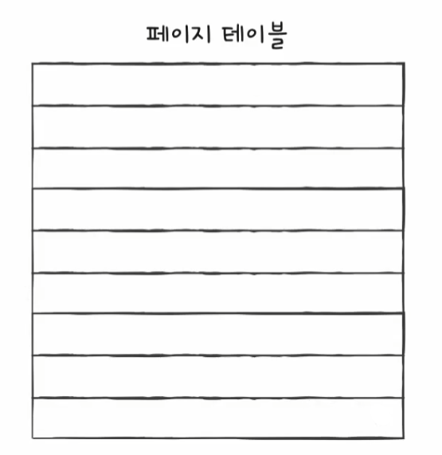

- 이 페이지 테이블을 여러 개의 페이지로 쪼개고, 이 페이지들을 가리키는 페이지 테이블(Outer 페이지 테이블)을 두는 방식이 계층적 페이징이다.

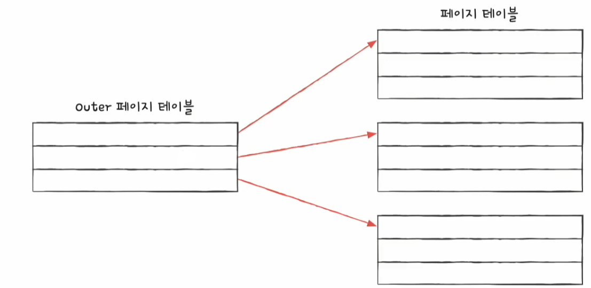

- 페이지 테이블을 이렇게 계층적으로 구성하면 모든 페이지 테이블을 항상 메모리에 유지할 필요가 없다.
- 페이지 테이블들 중 몇 개는 보조기억장치에 있고, 해당 페이지 테이블을 참조해야 할 때가 있으면 그때 메모리에 적재하면 된다.
  - CPU와 가장 가까이 위치한 페이지 테이블(Outer 페이지 테이블)은 항상 메모리에 유지해야 한다.
- 계층적 페이징을 사용하는 경우 CPU가 발생하는 논리 주소도 달라진다.
- 기존에는 페이지 번호와 변위로 이루어지지만, 계층적 페이징을 이용하는 환경에서는 다음과 같다.

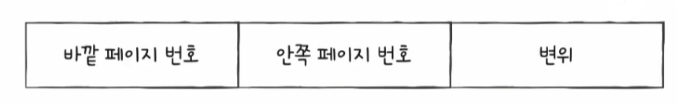

- **바깥 페이지 번호**는 CPU가 근접한 곳에 위치한(바깥에 위치한) 페이지 테이블을 가리키고,
- **안쪽 페이지 번호**는 첫 번째 페이지 테이블 바깥에 위치한 두 번째 페이지 테이블, 즉 페이지 테이블의 페이지 번호를 가리킨다.
- 주소 변환은 다음과 같이 이루어진다.
  1. 바깥 페이지 번호를 통해 **페이지 테이블의 페이지**를 찾기
  2. **페이지 테이블의 페이지**를 통해 **프레임 번호**를 찾고 변위를 더해 물리 주소 얻기

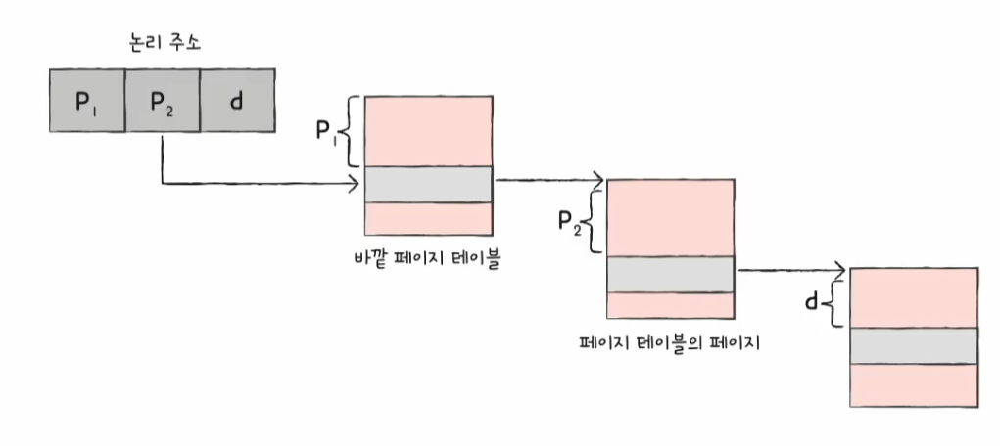

페이지 테이블의 계층이 늘어날수록 페이지 폴트가 발생했을 경우 메모리 참조 횟수가 많아지므로 계층이 많다고 해서 반드시 좋다고 볼 수는 없다.

---

[이전 ↩️ - 운영체제(가상 메모리) - 연속 메모리 할당](https://github.com/genesis12345678/TIL/blob/main/cs/virtualmemory/memory.md)

[메인 ⏫](https://github.com/genesis12345678/TIL/blob/main/cs/Main.md)

[다음 ↪️ - 운영체제(가상 메모리) - 페이지 교체와 프레임 할당](https://github.com/genesis12345678/TIL/blob/main/cs/virtualmemory/pageReplace.md)