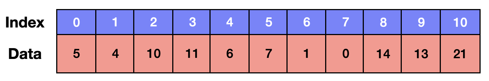

# Array - 배열

> 정의 : **순서대로 번호가 붙은 원소들이 연속적인 형태로 구성된 구조**

이 때 각 원소에 붙은 번호를 인덱스(index)라고 부르는데, 배열은 순서가 정해져 있기 때문에 
이 인덱스를 사용해서 각 원소에 접근할 수 있다. 



<br>
<br>

## 특징
1. **같은 타입의 데이터**를 여러개 나열한 ``선형 자료구조``이다.
2. 데이터에 순서가 있기 때문에 indexing 및 slicing이 가능하다.
   
    - indexing : index를 사용해 특정 요소를 리스트로부터 읽어들이는 것
    - slicing : 요소에 특정 부분을 따로 분리해 조작하는 것
3. **연속적인** 메모리 공간에 순차적으로 데이터를 저장한다.
4. 처음 선언할 때 크기를 정하면, 크기를 바꿀 수 없다.
5. 크기를 바꾸고 싶다면 새로운 배열을 생성 후 복사를 해야 한다.(비효율)

<br>
<br>

## 시간복잡도

- 탐색 : 순서가 존재하고 인덱스를 알고 있다면 ``O(1)``
- 삽입 : 한 칸씩 뒤로 밀어야 하는 연산 'O(1)'을 N번 반복해야 하기 때문에 ``O(N)``
- 삭제 : 삽입과 마찬가지로 한 칸씩 앞으로 당겨와야 하기 때문에 ``O(N)``

<br>
<br>

## 배열을 사용하기 좋은 경우
배열은 장점과 단점이 명확하게 갈리는 것 같다.

장점 : 빠른 탐색, 구현이 간단하다, 공간낭비가 적다 등<br>
단점 : 크기 변경이 불가능하다, 삽입과 삭제 비용이 많다 등

**그렇다면 언제 배열(Array)을 쓰는 것이 좋을까?**

- *데이터가 수가 확실한 경우*
- *값보다는 순서가 중요할 때*
- *데이터의 탐색이 많이 이루어지는 경우*
- *데이터의 삽입/삭제가 적은 경우*

<br>
<br>

## Array 예시

```java
public class Main{
    public static void main(String[] args) {
        // 크기가 5인 배열 생성
        int[] intArrays = new int[5];
        
        // 인덱스 0부터 직접 값을 할당하기
        intArrays[0] = 1;
        intArrays[1] = 2;
            .
            .

        // for loop로 인덱스 값 할당하기
        for (int i = 0; i < intArrays.length; i++) {
            intArrays[i] = i + 1;
        }
        // loop가 끝나면 intArrays = [1, 2, 3, 4, 5]
        
        // 배열 생성과 동시에 값 할당하기
        int[] arr = new int[]{1, 2, 3, 4, 5};
         
        // 배열의 값 참조
        System.out.println(intArrays[1]); // 2
        
        // 배열의 길이
        System.out.println(intArrays.length); // 5
        
        // for loop로 배열 출력
        for (int i = 0; i < intArrays.length; i++) {
            System.out.println(intArrays[i]);
            // [1, 2, 3, 4, 5]
        }
    }
}
```

<br>
<br>

## ArrayList
>크기가 정적인 Array를 보완한 List라고 볼 수 있다.<br>
 Array와 똑같은 기능에 크기가 동적인 것만 바뀐 점이다.

<br>

### 특징
1. **동적 크기 조정** : 원소를 추가하거나 삭제할 때 크기가 자동으로 조정되기 때문에
크기 제한이 없고 유연한 관리가 가능하다.
2. **제네릭 타입** : 제네릭으로 ArrayList를 생성하기 때문에 잘못된 타입의 요소를
추가하는 것을 방지할 수 있다.
3. **삽입, 삭제 메소드** : 동적인 크기가 가능하기 때문에 ArrayList가 지원하는 add()와 remove()
메소드로 삽입과 삭제가 가능하다.
4. **메모리 재할당** : 크기가 변경되면 메모리를 재할당하여 Array보단 속도가 느리다.

### ArrayList 예시

```java
import java.util.ArrayList;

public class Main {
    public static void main(String[] args) {
        // Generic(Integer)으로 ArrayList 생성
        // Array와 달리 크기는 지정해주지 않음.
        ArrayList<Integer> arrayList = new ArrayList<>();

        // for loop와 add메소드를 이용해 인덱스 값 할당
        for (int i = 0; i < 5; i++) {
            arrayList.add(i+1);
        } // arrayList = [1, 2, 3, 4, 5]
        
        // 인덱스 접근
        System.out.println(arrayList.get(0)); // 1
        
        // 인덱스 수정
        // 1번째 인덱스 value를 3으로 수정
        arrayList.set(1, 3);
        // arrayList = [1, 3, 3, 4, 5]
        
        // 인덱스 삭제
        // 1번째 인덱스 삭제
        arrayList.remove(1);
        // arrayList = [1, 3, 4, 5]

        // arrayList 크기 
        System.out.println(arrayList.size()); // 4

        // Iterator로 출력하기
        for (int i : arrayList) {
            System.out.print(i + " ");
        }// 1 3 4 5
    }
}
```

ArrayList도 결국 크기가 동적인 점만 Array에 비해 장점이고 나머지 특징은 Array와 같다.<br>
- ArrayList 탐색 시간복잡도 : ``O(1)``<br>
- ArrayList 삽입/삭제 시간복잡도 : ``O(N)``

원소의 삽입/삭제 작업이 빈번한 경우에는 성능이 저하될 수 있고, 특정 원소에 접근할 때는
배열보다 느릴 수도 있다.<br>
**따라서 배열과 마찬가지로 원소의 삽입/삭제 작업이 빈번하지 않고 순차적인 접근이 주로 필요할 때
ArrayList를 활용하는 것이 좋겠다.**

원소의 삽입/삭제가 빈번한 상황에서는 ``LinkedList`` 자료구조가 더 적합할 수 있다.

