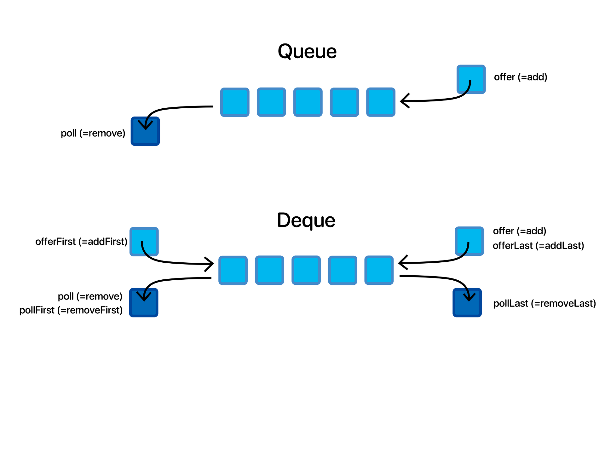

# Deque 데크

## 데크란?
- Double-Ended Queue의 약자로, **양쪽 끝에서 삽입과 삭제가 모두 가능한 자료구조이다.**
- **스택과 큐를 합친 형태**로 생각할 수 있다.
- 데크는 스택과 큐의 장점만 가지고 있고, 단점은 가지고 있지 않다.
- 데크는 스택처럼 한 쪽 끝에서만 자료를 넣고 뺄 수 있고, 큐처럼 양쪽 끝에서 모두 넣고 뺄 수 있다.
- 데크는 스택과 큐를 동시에 구현할 수 있다.
- 데크는 스택과 큐의 모든 연산을 지원한다.
- 데크는 스택과 큐의 연산을 모두 지원하기 때문에 더욱 효율적이다.

 

## 데크의 종류
- **스크롤** : 입력이 한쪽 끝으로만 가능하도록 설정한 데크(입력 제한 데크)
- **셸프** : 출력이 한쪽 끝으로만 가능하도록 설정한 데크(출력 제한 데크)

 

## 데크의 주요 연산

### 삽입 연산
- ``addFirst()`` , ``offerFirst()`` : 앞 부분에 값을 추가
- ``addLast()`` , ``offerLast()`` : 뒷 부분에 값을 추가
- ``addLast()`` , ``add()`` , ``offerLast()`` , ``offer()`` : 뒷 부분에 값을 추가

add는 예외를 발생시키고, offer는 false를 반환한다.

### 삭제 연산
- ``remove()``  , ``removeFirst()`` , ``poll()`` , ``pollFirst()`` : 앞 부분의 값을 삭제
- ``removeLast()`` , ``pollLast()`` : 뒷 부분의 값을 삭제

remove는 예외를 발생시키고, poll은 null을 반환한다.

### 검색 연산
- ``getFirst()`` , ``peek()`` , ``peekFirst()`` : 앞 부분의 값을 반환
- ``getLast()`` , ``peekLast()`` : 뒷 부분의 값을 반환

get은 예외를 발생시키고, peek은 null을 반환한다.

 

## 데크의 시간복잡도

⁕ ``양쪽 끝 위치에서``

| 연산 | 시간복잡도 |
|----|:-----:|
| 삽입 | O(1)  |
| 삭제 | O(1)  |
| 검색 | O(1)  |

