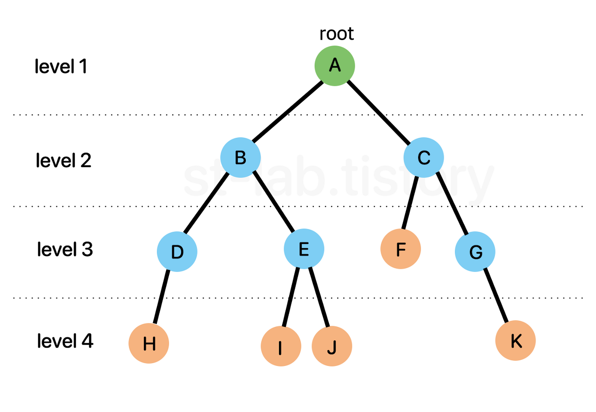
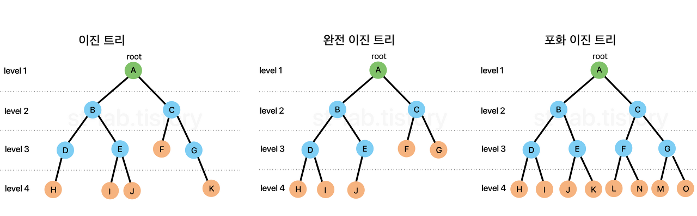
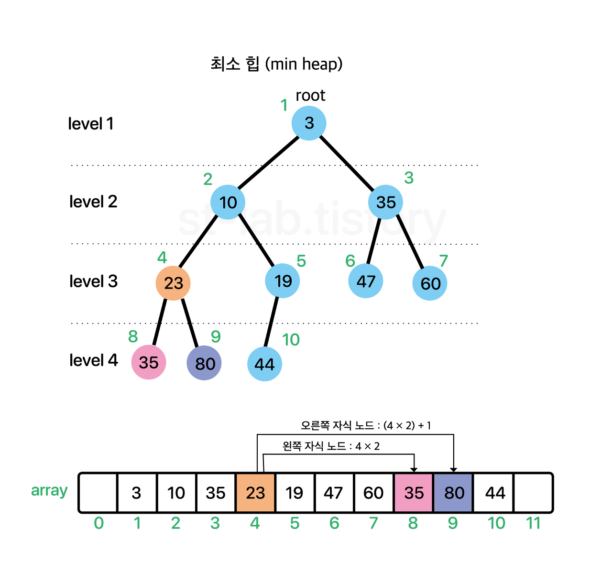

# Heap - 힙

 

## 힙이란
> **힙(Heap)** : **``최솟값 또는 최댓값``을 ``빠르게`` 찾아내기 위해 ``완전이진트리`` 형태로 만들어진 자료구조** 
> ``우선순위 큐`` 를 구현하는데 사용된다. 

 

## 완전이진트리
[트리란?](https://github.com/genesis12345678/TIL/blob/main/dataStructure/graph/graph.md#%ED%8A%B8%EB%A6%AC) 
 
### 이진트리
모든 노드의 자식이 최대 2개인 트리 

 

### 완전이진트리
마지막 레벨을 제외하고 모든 노드가 완전히 채워져 있는 이진트리 
  - 마지막 레벨의 노드들은 왼쪽부터 채워져 있다. 
  - 마지막 레벨의 노드들은 연속적으로 채워져 있다. 
  - 마지막 레벨의 노드들은 1개 또는 2개이다. 
  - 마지막 레벨의 노드들은 2개일 경우, 오른쪽 노드가 없을 수 있다. 
  - 마지막 레벨의 노드들은 왼쪽 노드가 없을 경우, 오른쪽 노드도 없다. 

### 포화이진트리
마지막 레벨을 제외한 모든 노드가 2개의 자식을 가지고 있는 이진트리 

 

## 힙의 종류

### 최대힙
부모 노드의 값이 자식 노드의 값보다 큰 힙 
- 루트 노드가 가장 큰 값이다. 
- 부모 노드의 값이 자식 노드의 값보다 크다. 

### 최소힙
부모 노드의 값이 자식 노드의 값보다 작은 힙 
- 루트 노드가 가장 작은 값이다. 
- 부모 노드의 값이 자식 노드의 값보다 작다. 

 

## 힙의 구현
- 힙은 **배열**을 이용하여 구현한다. 
- 힙은 **완전이진트리**이기 때문에 **배열**을 이용하여 구현할 수 있다. 
- **배열**의 인덱스를 이용하여 **완전이진트리**의 노드들을 관리한다. 
- **배열**의 인덱스를 이용하여 **완전이진트리**의 부모 노드와 자식 노드를 찾을 수 있다. 

 

### 특징
- 배열의 인덱스는 1부터 시작한다.
- 부모 노드의 인덱스는 ``자식 노드의 인덱스를 2로 나눈 몫``이다.
- 왼쪽 자식 노드의 인덱스는 ``부모 노드의 인덱스를 2로 나눈 몫에 2를 곱한 값``이다.
- 오른쪽 자식 노드의 인덱스는 ``부모 노드의 인덱스를 2로 나눈 몫에 2를 곱한 값에 1을 더한 값``이다.

 

## 힙의 삽입

### 최대힙
1. 새로운 노드를 힙의 마지막 노드에 이어서 삽입한다.
2. 새로운 노드를 부모 노드와 비교한다.
3. 부모 노드보다 새로운 노드가 크면 부모 노드와 위치를 바꾼다.
4. 부모 노드보다 새로운 노드가 작거나 같으면 삽입을 종료한다.
5. 루트 노드까지 2~4번 과정을 반복한다.

 

### 최소힙
1. 새로운 노드를 힙의 마지막 노드에 이어서 삽입한다.
2. 새로운 노드를 부모 노드와 비교한다.
3. 부모 노드보다 새로운 노드가 작으면 부모 노드와 위치를 바꾼다.
4. 부모 노드보다 새로운 노드가 크거나 같으면 삽입을 종료한다.
5. 루트 노드까지 2~4번 과정을 반복한다.

 

## 힙의 삭제

### 최대힙
1. 루트 노드를 삭제한다.
2. 힙의 마지막 노드를 루트 노드로 이동시킨다.
3. 루트 노드의 자식 노드 중 큰 값을 가진 노드와 위치를 바꾼다.
4. 자식 노드보다 루트 노드가 크면 위치를 바꾼다.
5. 자식 노드보다 루트 노드가 작거나 같으면 삭제를 종료한다.
6. 마지막 노드까지 3~5번 과정을 반복한다.
7. 삭제한 루트 노드를 반환한다.

 

### 최소힙
1. 루트 노드를 삭제한다.
2. 힙의 마지막 노드를 루트 노드로 이동시킨다.
3. 루트 노드의 자식 노드 중 작은 값을 가진 노드와 위치를 바꾼다.
4. 자식 노드보다 루트 노드가 작으면 위치를 바꾼다.
5. 자식 노드보다 루트 노드가 크거나 같으면 삭제를 종료한다.
6. 마지막 노드까지 3~5번 과정을 반복한다.
7. 삭제한 루트 노드를 반환한다.

 

> **힙의 삽입과 삭제는 O(logN)의 시간복잡도를 가진다.** 
