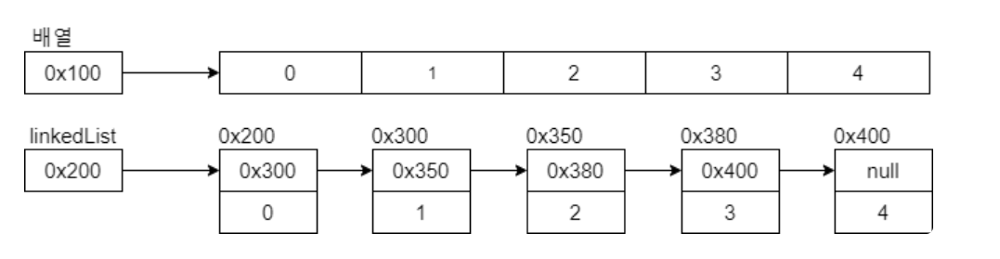

# LinkedList

## LinkedList

> ArrayList 자료구조와 같이 인덱스를 이용해 탐색과 삽입이 가능하지만 내부 구조는
> 완전히 다르게 구성되어 있는 자료구조이다.<br>
> ArrayList는 내부적으로 배열을 이용하여 메소드로 조작이 가능하다면, LinkedList는
> ``노드(객체)``끼리의 **주소 포인터**를 서로 가리키며 ``링크(참조)``으로써 이어지는 구조다.
> **시작(head)과 끝(tail)이 존재한다.**



그림처럼 LinkedList는 각 노드(객체)마다 화살표로 연결되어 리스트 형태로 나열된다.
객체를 만들면 객체의 주소가 생기게 되는데 노드마다 각 객체의 주소를 서로 참조함으로써
연결 형태를 구성하는 것이다.


```java
class Node {
    int data;
    Node next;
}
```

<br>
<br>

## LinkedList 종류

### 단방향 연결 리스트(singly linked list)


그림처럼 다음 노드를 가리키기 위한 포인트 빌드 next 만을 가지고 있는 링크드리스트이다.<br>
단방향 연결 리스트는 현재 원소에서 이전 원소로 접근할 때 매우 효율이 안 좋다.
N번째 데이터에 접근하려면 N번 이동해야 한다.<br>
이를 극복한 것이 **양방향 연결 리스트**다.

<br>

### 양방향 연결 리스트(doubly linked list)


```java
class Node {
    Node next; // 다음 노드 주소
    Node prev; // 이전 노드 주소
    int data; 
}
```

단방향 연결 리스트에 비해 이전 노드 주소고 갖고 있어 역순으로도 검색이 가능하다.<br>
각 원소에 대한 접근과 이동이 쉬워 기본적으로 많이 사용된다.

<br>
<br>

## LinkedList 예시

```java
import java.util.Arrays;
import java.util.LinkedList;

public class Main {
    public static void main(String[] args) {
        // Generic 가능
        LinkedList<Integer> linkedList = new LinkedList<>();
        
        // 생성과 동시에 값 할당하기
        LinkedList<String> linkedList1 = new LinkedList<>(Arrays.asList("A", "B", "C"));
        
        // 맨 앞에 객체 추가
        linkedList1.addFirst("first"); // linkedList1 = [first, A, B, C]
        
        // 맨 뒤에 객체 추가
        linkedList1.addLast("last"); // linkedList1 = [first, A, B, C, last]
        
        // index 1 위치에 데이터 추가
        linkedList1.add(1, "new"); // linkedList1 = [first, new, A, B, C, last]

    }
}
```
<br>

- 맨 앞에 객체 추가 (시간 복잡도 : ``O(1)``)


- 맨 뒤에 객체 추가 (시간 복잡도 : ``O(1)``)


- 중간에 객체 추가 (시간 복잡도 : ``O(N)``)


<br>

```java
import java.util.Arrays;
import java.util.LinkedList;

public class Main{
    public static void main(String[] args) {
        // 생성과 동시에 값 할당하기
        LinkedList<String> linkedList = new LinkedList<>(Arrays.asList("A", "B", "C"));
        
        // 첫 번째 노드 제거
        linkedList.removeFirst(); // linkedList = [B, C]
        
        // 마지막 노드 제거
        linkedList.removeLast(); // linkedList = [A, B]
        
        // 중간 노드(1) 제거
        linkedList.remove(1); // linkedList = [A, C]
        
        // 모든 노드 제거
        linkedList.clear(); // linkedList = []
    }
}
```

<br>

- 첫 번째 노드 제거


- 마지막 노드 제거


- 중간 노드 제거


> 참고로 clear()를 통해 모든 노드 제거를 한다고 해서 한번에 노드들이 제거되는 것이 아니라
> 참조 체인을 따라가면서 일일이 해주기 때문에 ``O(N)`` 시간이 걸린다.

<br>

```java
import java.util.Arrays;
import java.util.LinkedList;

public class Main {
    public static void main(String[] args) {
        LinkedList<String> list = new LinkedList<>(Arrays.asList("A", "B", "C"));

        // 앞에서부터 검색해 해당 값을 갖고 있는 위치 반환
        list.indexOf("B"); // 1

        // 뒤에서부터 검색해 해당 값을 갖고 있는 위치 반환
        list.lastIndexOf("D"); // 값이 없기 때문에 -1

        // 값이 있는지 확인
        list.contains("A"); // true
        
        LinkedList<String> list1 = new LinkedList<>(Arrays.asList("A", "B", "C"));

        // list에 list1의 모든 노드가 포함되어 있는지 확인
        list.containsAll(list1); // true
        
        // 0번째 index 값 출력
        // LinkedList의 탐색 시간복잡도 : O(N)
        list.get(0); // A

        // 1번째 index 값을 "1"로 변경
        list.set(1, "1"); // list = [A, 1, C]
    }
}
```
<br>

