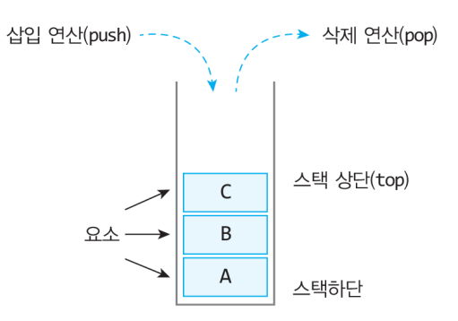

# Stack - 스택

<br>

## 스택(Stack)이란

> **스택**은 한쪽 끝에서만 데이터를 넣거나 뺄 수 있는 선형 구조로 되어 있다.<br>
> 'stack' , 말 그대로 쌓는다는 뜻이다. 마치 프링글스와 같다. 힌쪽에서만 빼서 먹을 수 있다.

- **후입선출 ( LIFO : Last In First Out)**

스택의 가장 큰 특징으로 가장 최근에 들어온 데이터가 가장 먼저 나간다는 의미이다.


## 스택의 구조


``후입선출`` 특징을 가진 스택은 출력 순서가 입력 순서의 역순으로 이루어진다. 우리가 평소에
인터넷을 하면서 '뒤로 돌아가기'나 'Ctrl + z'로 되돌리는 것도 스택 자료구조를 사용한다.

- **상단** : 스택에서 입출력이 이루어지는 부분
- **하단** : 상단 반대쪽 바닥 부분
- **요소** : 스택에 저장되는 데이터
- **공백 스택** : 비어있는 상태의 스택
- **포화 스택** : 포화 상태의 스택

### 콜 스택 (Call Stack)

- **호출 스택**이라고도 하며, 여러 함수들을 호출하는 스크립트에서 해당 위치를 추적하는 인터프리터를 위한 메커니즘이다. 현재 어떤 함수가 실행중인지, 그 함수 내에서 어떤 함수가 호출되어야 하는지 등을 제어한다.

- **콜 스택 원리**

    1. 스크립트가 함수를 호출하면, 이를 호출 스택에 추가한 다음 함수를 실행하기 시작한다.
    2. 해당 함수에 의해 호출되는 모든 함수는 호출 스택에 추가되고 호출이 도달하는 위치에서 실행한다.
    3. 현재 함수가 끝나면, 인터프리터는 스택을 제거하고 호출 스택 마지막 코드 목록에서 중단된 실행을 다시 시작한다.
    4. 스택이 할당된 공간보다 많은 공간을 차지하면, ``stack overflow`` 에러가 발생한다.

### 콜 스택 예


```
   function greeting() {

   sayHi();
   }

   function sayHi() {

   return "Hi!";
   }

   greeting();
   // 그 외 코드들
```

1. greeting() 함수에 도달할 때까지 모든 함수를 무시한다.


2. greeting() 함수를 호출 스택 리스트에 추가한다.

   ‣ 호출 스택 리스트 : greeting

3. greeting 함수 내부의 모든 코드를 실행한다.


4. sayHi() 함수를 호출한다.


5. sayHi() 함수를 호출 스택 리스트에 추가한다.

   ‣ 호출 스택 리스트 : sayHi - greeting


6. sayHi() 함수의 끝에 도달할 때까지, 함수 내부의 모든 코드를 실행한다.


7. sayHi()가 호출된 라인으로 돌아와 greeting() 함수의 나머지를 계속 실행한다.


8. 호출 스택 리스트에서 sayHi() 함수를 제거한다.

   ‣ 호출 스택 리스트 : greeting


9. greeting() 함수 내부의 모든 코드가 실행되었을 때, 이를 호출한 라인으로 돌아와 그 외 코드들이 계속 실행한다.


10. 호출 스택 리스트에서 greeting() 함수를 제거한다.

    ‣ 호출 스택 리스트 : EMPTY


<br>
<br>

## 스택 연산

| 연산        | 기능                                        |
|-----------|-------------------------------------------|
| top()     | 스택 맨 위에 있는 데이터 반환<br>(가장 최근에 push()한 데이터) |
| push()    | 스택에 데이터 추가                                |
| pop()     | 스택에서 데이터 삭제하여 반환                          |
| isEmpty() | 스택이 비어있으면 'true', 아니면 'false'             |
| isFull()  | 스택이 가득 찼으면 'true', 아니면 'false'            |


<br>
<br>

## 스택 구현

```java
import java.util.Stack;

public class Main {
    public static void main(String[] args) {
        // Generic 생성
        Stack<Integer> stack = new Stack<>();

        for (int i = 1; i <= 5; i++) {
            stack.push(i);
            System.out.print(stack.peek() + " "); // 1 2 3 4 5
        }
        System.out.println();
        
        System.out.println(stack.pop()); // 5

        System.out.println(stack.peek()); // 4

        System.out.println(stack.search(1)); // 4
        System.out.println(stack.search(2)); // 3
        System.out.println(stack.search(3)); // 2
        System.out.println(stack.search(4)); // 1
        System.out.println(stack.search(5)); // -1

        System.out.println(stack.empty()); // false
    }
}
```

자바에서 기본적으로 지원하는 Stack 클래스이다. ``push(), pop(), peek(), empty(), serach()``기능을 지원해 준다.<br>

1. For문으로 1에서 5까지 **push**
2. **peek**로 가장 최근에 들어간 데이터 출력
3. **pop**으로 가장 최근에 들어간 데이터 제거
4. 그 후 **peek**를 하면 다음 데이터 4 출력
5. **search**로 인덱스 값 출력
   - stack.search(n) = n번째 인덱스 데이터 출력
   - stack.push()로 데이터를 넣으면 그 데이터의 인덱스가 1이 되고 나머지 데이터들 인덱스 +1
6. 데이터가 존재하기 때문에 **empty**는 false