# 이진 탐색 트리 (Binary Search Tree)

## 기본 개념

이진 탐색 트리는 부모 노드 기준 **작은 키는 왼쪽 자식 노드**로, **큰 키는 오른쪽
자식 노드**로 유지하는 트리이다. 이러한 구조는 데이터 탐색 시 노드를 이동하면서
재귀적으로 탐색 가짓수를 **1/2**로 줄여나가며 찾는다.


---

## 최솟값, 최댓값 구하기

- **이진 탐색 트리의 최솟값**은 부모 노드 기준 **가장 왼쪽 끝**에 있는 노드가 된다.
- **이진 탐색 트리의 최댓값**은 부모 노드 기준 **가장 오른쪽 끝**에 있는 노드가 된다.

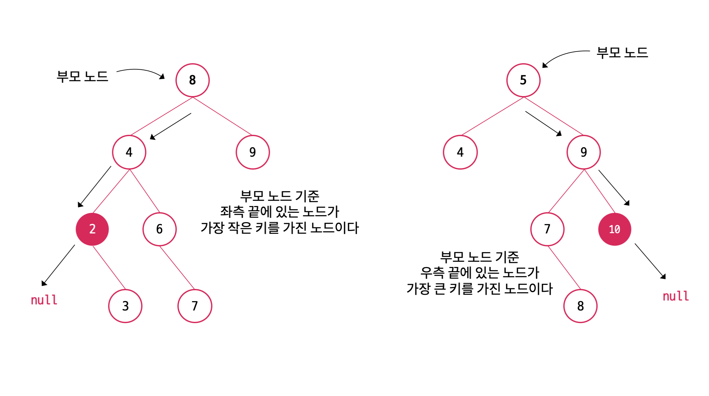

---

## 중위 순회

이진 탐색 트리의 특성상 **중위 순회(inorder)** 로 순회할 시, 자연스럽게 오름차순으로
순회하게 된다.

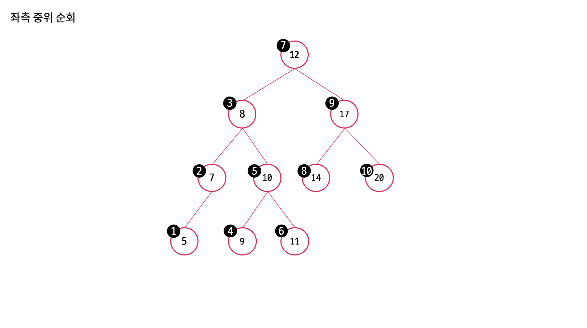

```java
void inOrder(Node node) {
    if(node == null) {
        return;
    }
    inOrder(node.left);
    print(node);
    inOrder(node.right);
}
```

---

## 후임자와 선임자

해당 노드보다 값이 큰 노드들 중에서 **가장 값이 작은 노드**를 **노드의 후임자(successor)** 라고 한다.

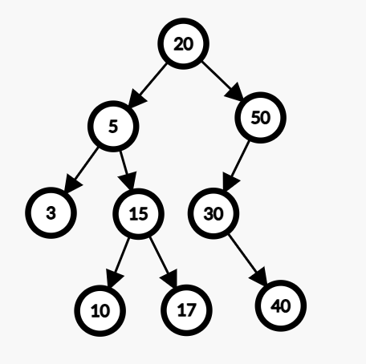

- 20의 `successor`는 30이다.
- 17의 `successor`는 20이다.
- 10의 `successor`는 15이다.

해당 노드보다 값이 작은 노드들 중에서 **가장 값이 큰 노드**를 **노드의 선임자(predecessor)** 라고 한다.

- 20의 `predecessor`는 17이다.
- 10의 `predecessor`는 5이다.
- 40의 `predecessor`는 30이다.

---

## 이진 탐색 트리의 삽입

예를 들어 7, 4, 8, 6, 2, 3 키를 순서대로 삽입하는 과정은 다음과 같다.

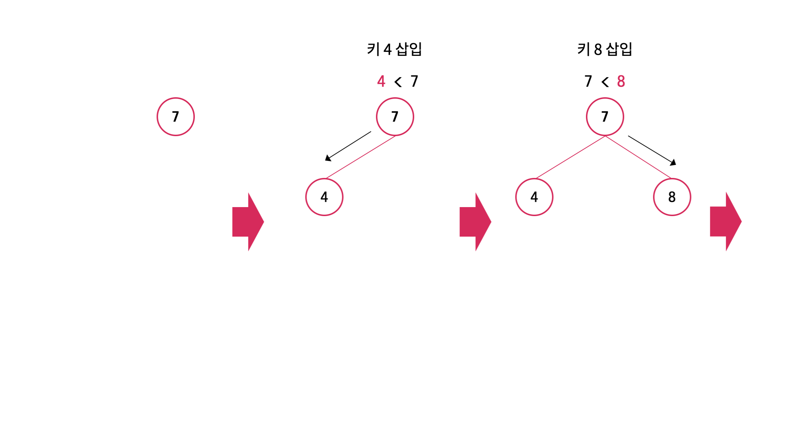

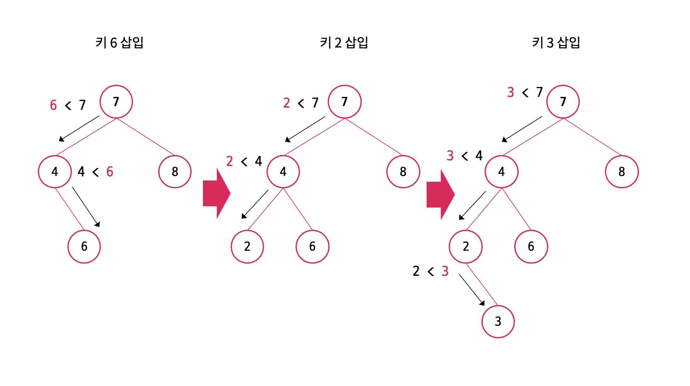

루트 노드를 시작으로 부모 노드보다 작으면 왼쪽 자식 노드로 배치하고, 
부모 노드보다 크면 오른쪽 자식 노드로 배치한다.

재귀적으로 왼쪽 또는 오른쪽 서브 트리를 타고 내려가면서 노드를 배치한다.

---

## 이진 탐색 트리의 삭제

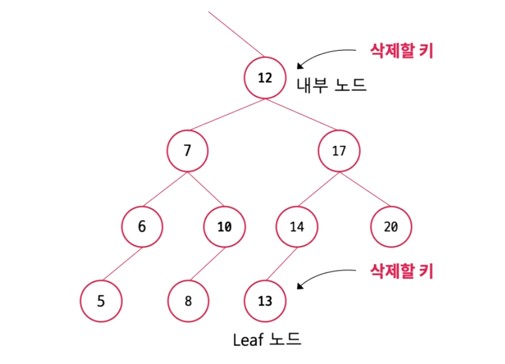

삭제할 키가 리프 노드라면 삭제될 노드를 가리키던 참조를 가리키는 것이 없도록 하는
것만으로 처리가 끝난다.

**그러나 삭제할 키가 내부 노드인 경우 이진 탐색 트리의 구조를 유지하기 위해
추가적인 처리가 필요하고, 이는 특정한 규칙에 의해 이루어진다.**

예를 들어 키 12를 삭제할 경우, 삭제되는 키 대신 그 자리를 채워줄 키가 필요하다.
그 키는 삭제할 키 기준 좌측 서브 트리에서 가장 큰 키(`predecessor`, 10)이거나,
우측 서브 트리에서 가장 작은 키(`successor`, 13)를 가진 노드만이 삭제할 키(12)의 위치를 대신할 수 있다.

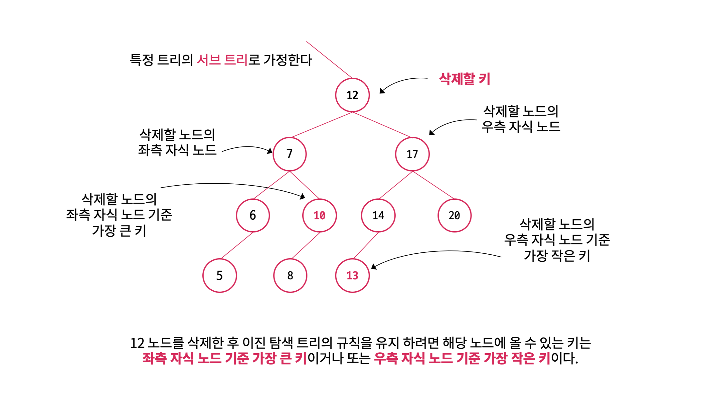

그리고 이진 탐색 트리의 삭제 과정은 다음과 같다.

**1. 삭제할 키를 찾는다.**

삭제할 키가 없을 수도 있기 때문에 예외 처리가 필요하다.

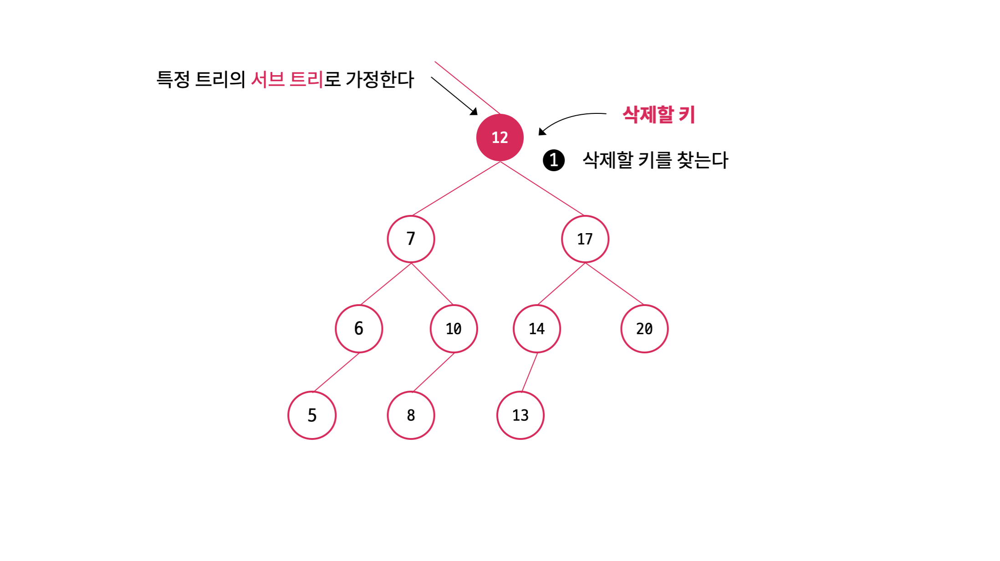

**2.삭제할 키를 찾았으면 삭제할 노드의 왼/오른쪽 자식을 확인한다.**

- 삭제할 키(12)를 기준으로 왼쪽 서브 트리에서 가장 큰 키를 가진 노드를 찾는다.
  - (또는 오른쪽 서브 트리에서 가장 작은 키를 가진 노드)
  - 찾는 방법은 왼쪽 자식 노드(7) 기준 가장 오른쪽에 있는 노드(10)가 가장 큰 키를 가진 노드이다.
- 삭제할 키와 가장 큰 키(또는 가장 작은 키)를 swap 한다.

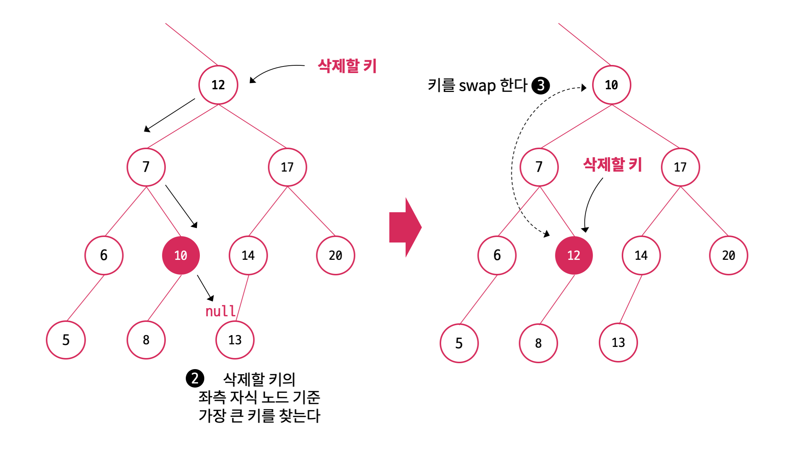

**3. 삭제할 노드의 왼쪽(또는 오른쪽) 자식부터 다시 탐색한다.**

삭제할 키가 리프 노드가 될 때까지 밑으로 swap 하는 과정을 반복한다.

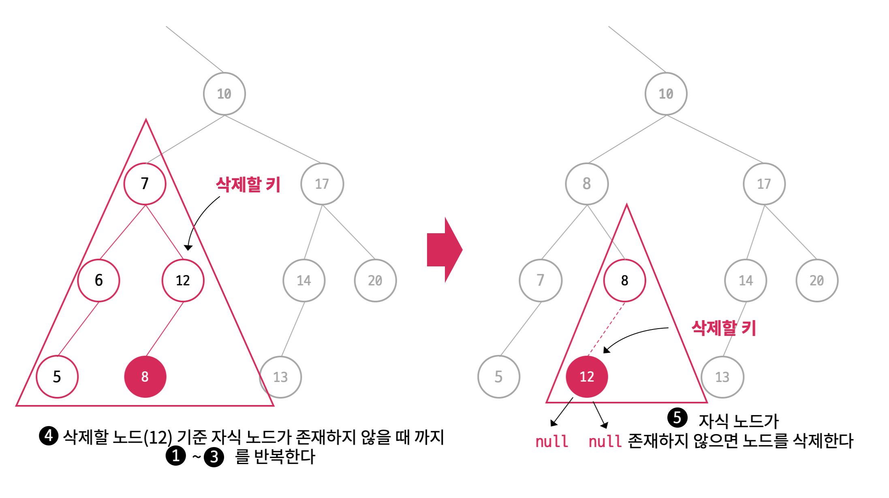

---

## 시간복잡도

- 트리의 노드 수: `N`

|    | 평균      | 최악   |
|----|---------|------|
| 검색 | O(logN) | O(N) |
| 삽입 | O(logN) | O(N) |
| 삭제 | O(logN) | O(N) |

---

## 장점

- 삽입, 삭제가 유연하다.
  - 기존 노드와 새로운 노드를 연결하거나, 기존 노드와의 연결을 끊어주기만 하면 된다.
- 값의 크기에 따라 좌우 서브 트리가 나눠지기 때문에 삽입/삭제/검색이 **일반적으로** 빠르다.
- 값의 순서대로 순회 가능하다.

## 단점

- 키의 삽입 순서에 따라 트리가 한쪽으로 편향될 수 있다.

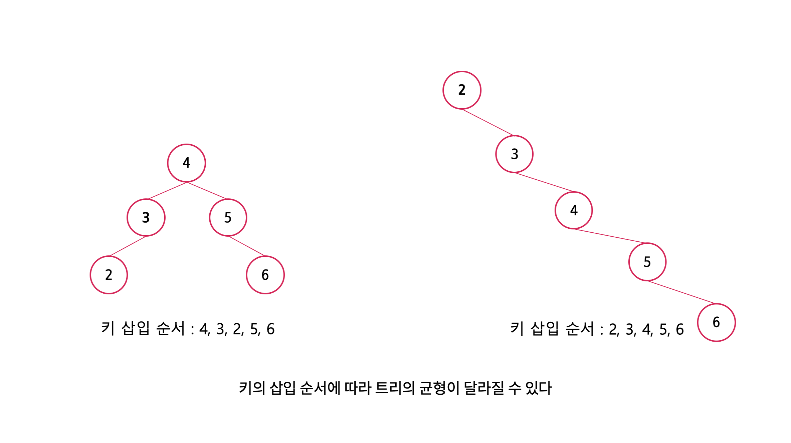

- 키의 삽입 순서에 따라 트리의 균형이 달라지기 때문에 트리의 균형을 예측하기가 어렵다.
- 트리가 구조적으로 한쪽으로 편향되면 삽입/삭제/검색 동작의 수행 시간이 악화된다.

---

# 이진 탐색 트리 구현

```java
public class Node<E extends Comparable<E>> {
    E key;
    Node<E> left;
    Node<E> right;

    public Node(E key) {
        this.key = key;
    }

    public void insert(Node<E> node) {
        int compare = node.key.compareTo(this.key);

        if (compare < 0) {
            if (this.left == null) {
                this.left = node;
            } else {
                this.left.insert(node);
            }
        } else if (compare > 0) {
            if (this.right == null) {
                this.right = node;
            } else {
                this.right.insert(node);
            }
        }
    }
}
```

이진 탐색 트리 구현에 사용될 노드 객체로, 유연하게 다양한 형태의 객체들을
저장할 수 있도록 `Comparable`을 구현한 객체들이 저장될 수 있도록 한다.

이진 탐색 트리의 원소를 삽입할 때 `insert()` 메서드를 호출한다. 값을 비교하여
왼쪽 또는 오른쪽 자식 노드에 배치한다. 이때 `compare == 0` 조건은 보지 않는다. 즉
중복된 값은 허용하지 않는다.

```java
public interface BinarySearch<E extends Comparable<E>> {
    void add(E key);
    void remove(E key);
    E search(E key);
}
```

이진 탐색 트리의 기본 행위를 정의한 인터페이스이다.

> 이진 탐색 트리의 단점을 보완한 **AVL 트리, Red-Black 트리** 역시
> 이 인터페이스를 상속받는 구조가 될 것이다.

### 키를 추가

```java
public class BinarySearchTree<E extends Comparable<E>> implements BinarySearch<E> {

    private Node<E> root;

    @Override
    public void add(E key) {
        Node<E> newNode = new Node<>(key);

        //루트 노드가 없는 경우(처음 삽입)
        if (root == null) {
            root = newNode;
            return;
        }

        //루트 노드가 있는 경우
        root.insert(newNode);
    }
    
    //...
}
```

- `root == null`인 경우, 즉 처음 키를 삽입한 경우 바로 루트 노드가 된다.
- 그렇지 않으면 루트 노드를 시작으로 값을 비교하여 적절한 위치에 배치가 된다.

### 키를 삭제한다.

```java
public class BinarySearchTree<E extends Comparable<E>> implements BinarySearch<E> {

    @Override
    public void remove(E key) {
        this.root = removeNode(root, key);
    }

    private Node<E> removeNode(Node<E> node, E key) {
        if (node == null) {
            throw new RuntimeException("Not exists node");
        }

        /*삭제할 키를 찾는 과정*/
        int compare = node.key.compareTo(key);

        if (compare > 0) {
            node.left = removeNode(node.left, key);
        } else if (compare < 0) {
            node.right = removeNode(node.right, key);
        }
        /*삭제할 키를 찾는 과정*/

        else {
            /*삭제할 키를 찾으면 swap 가능한 선임자 또는 후임자 값을 찾는 과정*/
            if (node.left != null) {
                Node<E> predecessor = getLargestNode(node.left); //왼쪽 서브 트리 중 가장 큰 값
                swap(node, predecessor); //swap
                node.left = removeNode(node.left, key);
            } else if (node.right != null) {
                Node<E> successor = getSmallestNode(node.right); //오른쪽 서브 트리 중 가장 큰 값
                swap(node, successor); //swap
                node.right = removeNode(node.right, key);
            }
            /*삭제할 키를 찾으면 swap 가능한 선임자 또는 후임자 값을 찾는 과정*/

            else {
                return null; //리프 노드의 경우 연결을 끊는다.
            }
        }

        return node;
    }

    private void swap(Node<E> node, Node<E> alterNode) {
        E temp = node.key;
        node.key = alterNode.key;
        alterNode.key = temp;
    }

    private Node<E> getLargestNode(Node<E> node) {
        if (node.right == null) {
            return node;
        }
        return getLargestNode(node.right);
    }

    private Node<E> getSmallestNode(Node<E> node) {
        if (node.left == null) {
            return node;
        }
        return getSmallestNode(node.left);
    }
}
```

- 이진 탐색 트리의 삭제의 경우 추가적인 처리가 필요하다.
- 먼저 키를 비교하여 삭제할 키를 찾을 때까지 내려간다.
- 삭제할 키를 찾았으면 해당 노드를 기준으로 `predecessor` 또는 `successor`를 찾는다.
- 해당 노드와 `predecessor` 또는 `successor`의 키를 `swap`한다.
- 삭제할 키가 리프 노드가 될 때까지 재귀 호출을 반복한다.
  - 리프 노드가 되면 `return null`을 수행하여 해당 노드는 GC 되고, 해당 노드를
  참조하던 노드와의 연결을 끊게 된다.

### 키를 찾는다.

```java
public class BinarySearchTree<E extends Comparable<E>> implements BinarySearch<E> {

    private Node<E> root;

    @Override
    public E search(E key) {
        return searchNode(root, key).key;
    }

    private Node<E> searchNode(Node<E> node, E key) {
        if (node == null) throw new RuntimeException("Not exists node");

        int compare = node.key.compareTo(key);

        if (compare > 0) {
            return searchNode(node.left, key);
        } else if (compare < 0) {
            return searchNode(node.right, key);
        }

        //키가 같은 노드를 찾은 경우
        return node;
    }
}
```

- 루트 노드를 시작으로 값을 비교하여 재귀 호출을 반복한다.

## 전체 구현 및 사용 코드

```java
import java.util.ArrayList;
import java.util.List;
import java.util.stream.Collectors;

public class BinarySearchTree<E extends Comparable<E>> implements BinarySearch<E> {

    private Node<E> root;

    @Override
    public void add(E key) {
        Node<E> newNode = new Node<>(key);

        //루트 노드가 없는 경우(처음 삽입)
        if (root == null) {
            root = newNode;
            return;
        }

        //루트 노드가 있는 경우
        root.insert(newNode);
    }

    @Override
    public void remove(E key) {
        this.root = removeNode(root, key);
    }

    private Node<E> removeNode(Node<E> node, E key) {
        if (node == null) {
            throw new RuntimeException("Not exists node");
        }

        /*삭제할 키를 찾는 과정*/
        int compare = node.key.compareTo(key);

        if (compare > 0) {
            node.left = removeNode(node.left, key);
        } else if (compare < 0) {
            node.right = removeNode(node.right, key);
        }
        /*삭제할 키를 찾는 과정*/

        else {
            /*삭제할 키를 찾으면 swap 가능한 선임자 또는 후임자 값을 찾는 과정*/
            if (node.left != null) {
                Node<E> predecessor = getLargestNode(node.left); //왼쪽 서브 트리 중 가장 큰 값
                swap(node, predecessor); //swap
                node.left = removeNode(node.left, key);
            }
            else if (node.right != null) {
                Node<E> successor = getSmallestNode(node.right); //오른쪽 서브 트리 중 가장 큰 값
                swap(node, successor); //swap
                node.right = removeNode(node.right, key);
            }
            /*삭제할 키를 찾으면 swap 가능한 선임자 또는 후임자 값을 찾는 과정*/

            else {
                return null; //리프 노드의 경우 연결을 끊는다.
            }
        }

        return node;
    }

    private void swap(Node<E> node, Node<E> alterNode) {
        E temp = node.key;
        node.key = alterNode.key;
        alterNode.key = temp;
    }

    private Node<E> getLargestNode(Node<E> node) {
        if (node.right == null) {
            return node;
        }
        return getLargestNode(node.right);
    }

    private Node<E> getSmallestNode(Node<E> node) {
        if (node.left == null) {
            return node;
        }
        return getSmallestNode(node.left);
    }

    @Override
    public E search(E key) {
        return searchNode(root, key).key;
    }

    private Node<E> searchNode(Node<E> node, E key) {
        if (node == null) throw new RuntimeException("Not exists node");

        int compare = node.key.compareTo(key);

        if (compare > 0) {
            return searchNode(node.left, key);
        }
        else if (compare < 0) {
            return searchNode(node.right, key);
        }

        return node;
    }

    //오름차순 순회(중위 순회)
    public void traversal() {
        List<E> result = new ArrayList<>();
        inOrder(this.root, result);

        System.out.println(
            result.stream()
                  .map(E::toString)
                  .collect(Collectors.joining(" => "))
        );
    }

    private void inOrder(Node<E> node, List<E> result) {
        if (node == null) {
            return;
        }
        inOrder(node.left, result);
        result.add(node.key);
        inOrder(node.right, result);
    }
}
```

```java
package dataStructure.non_linear.bst;

import java.util.Objects;

public class Main {
    public static void main(String[] args) {
        BinarySearchTree<Integer> bst = new BinarySearchTree<>();
        bst.add(5); //루트 노드
        bst.add(2);
        bst.add(9);
        bst.add(3);
        bst.add(7);
        bst.add(4);
        bst.add(8);
        bst.add(1);
        bst.add(6);
        bst.add(5);

        bst.traversal();
        bst.remove(2);
//        bst.remove(10); //Not exists node
        bst.traversal();

        BinarySearchTree<Student> students = new BinarySearchTree<>();
        students.add(new Student(10, "Student1")); //루트 노드
        students.add(new Student(50, "Student2"));
        students.add(new Student(30, "Student3"));
        students.add(new Student(60, "Student4"));
        students.add(new Student(20, "Student5"));
        students.add(new Student(40, "Student6"));

        students.traversal();

        Student student = students.search(new Student(10, "Student1"));
        System.out.println("found student = " + student);
    }

    static class Student implements Comparable<Student> {
        int age;
        String name;

        public Student(int age, String name) {
            this.age = age;
            this.name = name;
        }

        @Override
        public int compareTo(Student o) {
            return this.age - o.age;
        }

        //equals()
        //toString()
    }
}
```

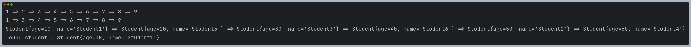

---

### 참고

- [자료구조 시각화 사이트](https://www.cs.usfca.edu/~galles/visualization/BST.html)
- [유튜브](https://www.youtube.com/watch?v=i57ZGhOVPcI&list=PLcXyemr8ZeoR82N8uZuG9xVrFIfdnLd72&index=8)
- [사이트](https://www.codelatte.io/courses/java_data_structure/1X1ADBUNBULA0ZA5)