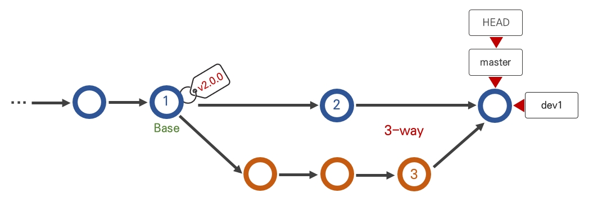
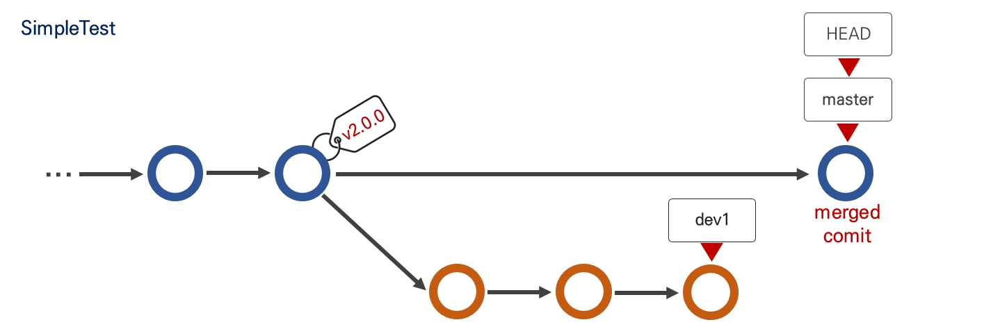

# branch

- 새로운 브랜치 생성
```text
git branch (브랜치 이름)
```
- 브랜치 목록 확인
```text
git branch
```
- 브랜치 이동
```text
git switch (브랜치 이름)
```
- 브랜치 생성과 동시에 이동
```text
git switch -c (브랜치 이름)
```
- 브랜치 삭제
```text
git branch -d (브랜치 이름)
```
만약 아직 다른 브랜치로 가져오지 않은 내용의 커밋이 있는 브랜치를 지울 때는 `-d`대신 `-D`로 강제 삭제할 수 있다.

- 브랜치 이름 바꾸기
```text
git branch -m (기존 브랜치명) (새 브랜치명)
```

- 여러 브랜치의 내역 확인(`git log`는 위치한 브랜치에서의 내역만 볼 수 있다.)
```text
git log --all --decorate --oneline --graph
```
이렇게 하면 터미널에서 보기 좋게 표현해 주기는 하지만 `소스트리`같은 프로그램으로 보는게 훨씬 좋다.

## 브랜치 합치기

**merge**
- 두 브랜치를 한 커밋에 이어붙인다.(`merge`한 새로운 커밋 생성)
- `main` 브랜치에서 다른 브랜치를 합칠 때(`main`브랜치에서 실행)
```text
git merge (브랜치 이름)
```
`merge`한 것도 하나의 커밋이기 때문에 `reset`이나 `revert`로 되돌릴 수 있다.(예를 들면 `merge`하기 전 해당 브랜치의 마지막 시점으로 갈 수 있다.)

**rebase**
- 브랜치의 커밋들을 다른 브랜치에 이어 붙인다.
- `merge`와는 반대로 대상이 될 브랜치에서 실행한다.(서브 브랜치에서 실행)
```text
git rebase main
```
그리고 `rebase`를 하면 `main`브랜치가 뒤쳐지게 되기 때문에 `merge`를 통해 `rebase`한 브랜치의 시점으로 옮겨주어야 한다.

**`merge`와 `rebase`차이**
- `merge` : 브랜치 사용내역을 남긴다.(히스토리가 남는다.)
- `rebase` : 브랜치를 그대로 이어붙이는 것이기 때문에 히스토리가 남지 않고 한 줄로 유지할 수 있다.
  - 협업 시 사용하지 않는 것이 좋음.

만약 브랜치를 합칠 때 충돌이 발생하면 충돌을 해결하고 `git add .`, `git commit`으로 마무리 하면 된다.<br>
그런데 당장 충돌 해결이 어려울 거 같으면 다음 명령어로 중단할 수 있다.
```text
git merge --abort
또는
git rebase --abort
```
또한 `merge`는 하나의 커밋으로 충돌 해결을 할 수 있지만, `rebase`는 커밋마다 충돌 해결을 해주어야 하기 때문에 `git rebase --continue`로 충돌이
모두 해결될 때까지 반복할 수 있다.

## Git의 merge 전략

**[Fast-forward](https://wikidocs.net/153693)**


- `main` 브랜치에서 `dev1`이 분기해 나가는 지점, 즉 두 브랜치가 공통으로 가지고 있는 커밋을 `base`라고 한다.
- `main`과 `dev1`이 각각 참조하는 커밋은 동일 선상에 위치하고 있다. 이 때 두 브랜치는 `Fast-forward` 상태에 있다고 한다.
- `Fast-forward` 관계에 있는 브랜치를 관계에서 `git merge` 를 하면 새로운 커밋이 생기지 않고, 뒤에 쳐진 브랜치(`main`)의 참조 개체가 앞서 있는
  브랜치가 가리키는 개체를 참조하도록 이동을 한다.
- 마치 브랜치가 점프 하듯 상대 브랜치 참조 값으로 이동한다고 해서 `Fast-forward(빨리 감기)`라고 불린다.


**[3-way merge](https://wikidocs.net/153693)**


- 두 브랜치 모두 `base`에서 커밋을 진행해서 분기한 나간 상태다. 두 브랜치 중 어느 것도 `base`에 위치하지 않는다.
- 이렇게 두 브랜치가 `base`에서 분리된 커밋을 참조할 때 `git merge`를 하면 새로운 커밋이 생성된다. 이것을 `3-way merge`라고 한다.
- `3-way`인 이유는 `base`와 각 브랜치 2개가 참조하는 커밋을 기준으로 병합을 진행하기 때문이다.



**`git merge` 옵션들**

```text
git merge -ff (브랜치명)
```
- `-ff`(fast-forward) 옵션은 현 브랜치와 `merge`대상 브랜치가 `fast-forward` 관계에 있는 경우 새로운 커밋을 생성하지 않고 브랜치의 참조 값만 변경되도록 한다.
- `fast-forward` 관계가 아니면 `merge` 커밋을 생성한다.

```text
git merge --no-ff (브랜치명)
```
- `--no-ff`(non fast-forward) 옵션은 `merge` 대상과 `fast-forward` 관계여도 강제로 `merge` 커밋을 생성하고 병합한다.
- 이 명령은 새롭게 생기는 커밋 메시지를 입력하는 편집기가 작동한다.
- 이 옵션 `merging`으로 `main` 브랜치를 관리했을 때 얻을 수 있는 두 가지 효과
  - 브랜치 관계에 상관없이 필요한 커밋만 가져올 수 있다.
  - 어떤 브랜치에서 `merge`를 했는지 기록을 남길 수 있다.

```text
git merge --squash
```
- `--no-ff` 옵션으로 `merging`을 하면 상대 브랜치의 커밋 이력을 남기지 않는다. 명령어나 `소스트리`로 어떤 브랜치로부터 `merging`되었는지는 확인할 수 있다.
- `--squash` 옵션은 뜻(짓누르다)처럼 다소 강압적인 병합 방법이다. 커밋 이력과 `merge`된 브랜치 이력도 남기지 않는다.
- 새로운 커밋에 상대 브랜치의 내용을 모두 뭉쳐 놓는 그림이 된다.


- **`--squash` 옵션은 브랜치가 삭제되는 것은 아니다.**
- 상대 브랜치의 최신 커밋이 `merged commit`을 참조하지 않아서 `merging`정보가 표시되지 않고, `main` 브랜치 관점에서는 병합에 대한 이력이 남지 않는다.



## 다른 브랜치에서 원하는 커밋 가져오기

```text
git cherry-pick (커밋 해시)
```
- 해당 커밋의 내용을 현재 브랜치에 추가한다. 뒤에 커밋 해시를 연속 입력해서 복수 추가할 수 있다.
  - 커밋 해시를 복수로 입력할 때 사이에 `..`을 입력하면 해당 구간의 커밋을 한번에 추가한다.
  - 예) 커밋1..커밋3 : 커밋1에서 커밋3까지의 내용을 모두 적용한다.
- `git cherry-pick --abort` : 충돌같은 상황으로 `cherry-pick`취소
- `git cherry-pick --continue` : 충돌같은 상황 해결 후 `cherry-pick` 진행

## 다른 브랜치에서 파생된 브랜치 옮겨붙이기

```text
git rebase --onto (도착 브랜치) (출발 브랜치) (이동할 브랜치)
```
- `도착 브랜치`에다가 `출발 브랜치`에서 파생된 `이동할 브랜치`를 이어 붙이겠다.
- 이후 `이동할 브랜치`의 헤드로 `fast-forward` 해주면 된다.(`merge` 등)

## 다른 브랜치의 커밋들을 하나로 묶어 가져오기

```text
git merge --squash (대상 브랜치)
```
- 대상 브랜치의 커밋들을 한번에 가져온다.
- 변경사항들이 스테이징 되어 있다.

## Gitflow

협업을 위한 브랜칭 전략

**자주 사용되는 브랜치들**

| 브랜치     | 용도                 |
|---------|--------------------|
| main    | 제품 출시/배포           |
| develop | 다음 출시/배포를 위한 개발 진행 |
| release | 출시/배포 전 테스트 진행(QA) |
| feature | 기능 개발              |
| hotfix  | 긴급한 버그 수정          |


[출처](https://nvie.com/posts/a-successful-git-branching-model/)