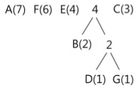
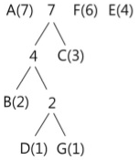
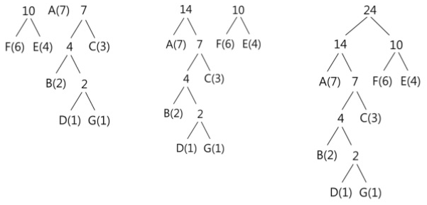
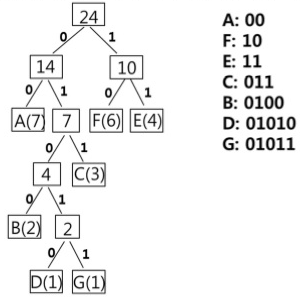

# 허프만 코딩에 대해 설명해 주세요.

- 허프만 코딩(Huffman Coding)은 문자의 빈도 수를 가지고 압축하는 과정을 말하며, 접두부 코드와 최적 코드를 사용한다.
- 접두부 코드 : 각 문자에 부여된 이진 코드가 다른 이진 코드의 접두부가 되지 않는 코드(즉, 겹치지 않도록 이진 코드를 만드는 것)
- 최적 코드 : 인코딩된 메시지의 길이가 가장 짧은 코드

허프만 코딩은 **텍스트 압축을 위해** 널리 사용되는 방법으로, 원본 데이터에서 **자주 출현하는 문자는 적은 비트의 코드로 변환하여 표현**하고 **출현 빈도가 낮은 문자는 많은
비트의 코드로 변환하여 표현**함으로써 전체 데이터를 표현하는 데 필요한 비트 수를 줄이는 방식이다.


다음 텍스트를 허프만 코딩을 통해 압축하는 과정
```text
AAAAAAABBCCCDEEEEFFFFFFG
```

1. 원본 데이터에 포함된 각 문자에 대한 출현 빈도수를 구하여 내림차순으로 정렬
```text
A(7개) F(6개) E(4개) C(3개) B(2개) D(1개) G(1개)
```

2. 출현 빈도가 가장 작은 `D`와 `G`를 묶어 이진트리를 구성하고, 이 둘의 루트 노드에 두 문자 빈도수의 합인 2를 적는다. 


이후 빈도수의 합인 2를 기준으로 내림차순 재정렬이 필요한 경우 재배열한다.

3. 마찬가지로 값이 가장 작은 두 개의 노드를 묶어 이진 트리를 구성하고, 루트 노드에는 두 빈도수의 합을 적는다.



`B`와 `2(D, G)`가 묶이게 되어 빈도수 합은 4가 된다. 이후 합쳐진 빈도수 4를 기준으로 내림차순 재배열을 수행한다.

4. 동일한 방법으로 다음 단계를 수행하면 `4(B, D, G)`와 `C`가 묶이게 되고, 빈도수 합은 7이 된다.



빈도수 합 7을 기준으로 내림차순 재배열을 수행한다.

5. 모든 노드(문자)가 트리에 포함될 때까지 반복한다.



**마지막으로 전체 트리에 대해 각 가지의 왼쪽에는 0, 오른쪽에는 1을 기입하여 허프만 트리를 완성시킨다.**



루트로부터 가지로 숫자를 읽어 내려가면서 각 문자에 대한 이진코드를 기록한다.<br>
이렇게 만들어진 코드를 이용해 원본 텍스트를 표현하면 다음과 같다.
```text
AAAAAAABBCCCDEEEEFFFFFFG
0000000000000001000100011011011010101111111110101010101001011
```

<br>

### 참고
- [참고 블로그](https://lipcoder.tistory.com/187)