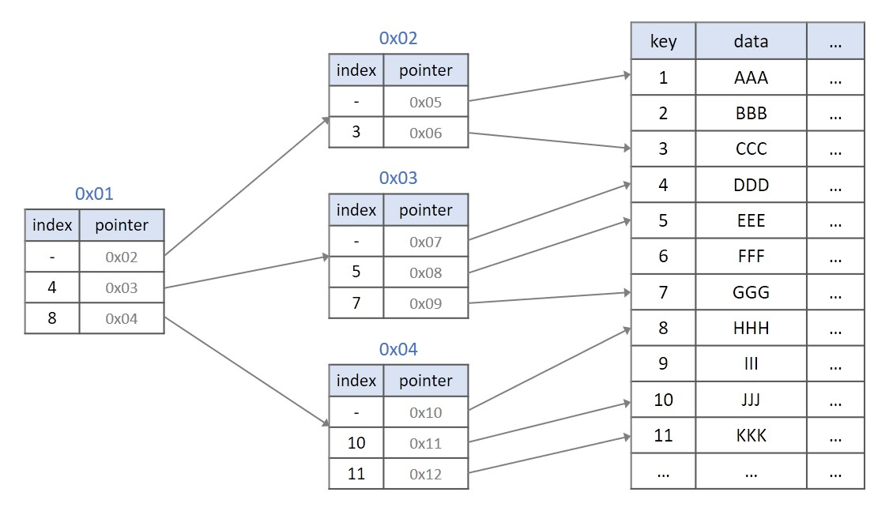
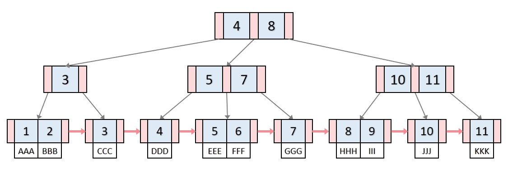

# B+ Tree가 무엇인지 설명해 주세요.

**B+ Tree는 데이터베이스 처리 및 파일 시스템에서 사용되는 데이터 구조**로, `B Tree`와 비슷하지만, 리프 노드에 모든 데이터 값을 저장하여 검색 속도를 높여준다.

위 인덱싱을 **B+ Tree**로 나타내면 아래와 같다.

- **모든 key, data가 리프노드에 모여 있다.**
  - `B Tree`는 리프 노드가 아닌 각자 `key`마다 `data`를 가진다면, **B+ Tree**는 리프 노드에 모든 `data`를 가진다.
- **모든 리프 노드가 연결 리스트의 형태를 띄고 있다.**
  - `B Tree`는 옆에 있는 리프 노드를 검사할 때, 다시 루트 노드부터 검사해야 한다면, **B+ Tree**는 리프 노드에서 선형 검사를 수행할 수 있어 시간 복잡도가 굉장히 줄어든다.
- **리프 노드의 부모 key는 리프 노드의 첫 번째 key보다 작거나 같다.**

**B+ Tree 장점**
- 블럭 사이즈를 더 많이 이용할 수 있다.
- 리프 노드끼리 연결 리스트로 연결되어 있어서 범위 탐색에 매우 유리하다.

**B+ Tree 단점**
- `B Tree`의 경우 최상 케이스에서 루트 노드에서 끝날 수 있지만, **B+ Tree**는 무조건 리프 노드까지 내려가봐야 한다.

`B Tree` & **B+ Tree**
- `B Tree`는 각 노드에 데이터가 저장된다.
- **B+ Tree**는 index 노드와 리프 노드로 분리되어 저장된다.
  - 리프 노드는 서로 연결 되어 있어서 임의 접근이나 순차접근 모두 성능이 우수하다.
- `B Tree`는 각 노드에서 key와 data 모두 들어갈 수 있고, data는 disk block으로 포인터가 될 수 있다.
- **B+ Tree**는 각 노드에서 key만 들어간다. 따라서 data는 모두 리프 노드에만 존재한다.
- **B+ Tree**에서 `add`와 `delete`는 모두 리프 노드에서만 이루어진다.

 

### 참고
- [참고 블로그](https://gyoogle.dev/blog/computer-science/data-structure/B%20Tree%20&%20B+%20Tree.html)
- [참고 블로그](https://velog.io/@emplam27/%EC%9E%90%EB%A3%8C%EA%B5%AC%EC%A1%B0-%EA%B7%B8%EB%A6%BC%EC%9C%BC%EB%A1%9C-%EC%95%8C%EC%95%84%EB%B3%B4%EB%8A%94-B-Plus-Tree)