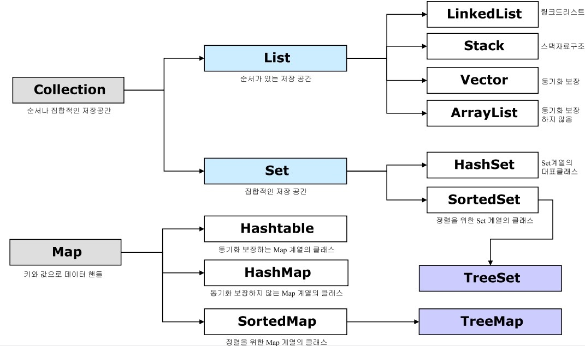

# 컬렉션 프레임워크에 대해서 설명해 주세요.

- 자바는 널리 알려져 있는 자료구조를 바탕으로 객체들을 효율적으로 추가, 삭제, 검색할 수 있도록 관련된 인터페이스와 클래스들을 `java.util` 패키지에 포함시켜 놓았는데,
    이들을 **컬렉션 프레임워크**라고 부른다.
- 컬렉션 프레임워크는 몇 가지 인터페이스를 통해서 다양한 컬렉션 클래스를 이용할 수 있도록 설계 되어 있다.
- 주요 인터페이스로는 `List`, `Set`, `Map`이 있다.

- `List`와 `Set`은 객체를 추가, 삭제, 검색하는 방법에 있어서 공통점이 있기 때문에 공통된 메서드만 따로 모아 `Collection` 인터페이스로 정의해 두고 이것을 상속하고 있다.
- `Map`은 키와 값을 하나의 쌍으로 묶어서 관리하는 구조로 되어 있어서 `List` 및 `Set`과는 사용 방법이 다르다.

| 인터페이스 분류          | 특징                                   | 구현 클래스                                              |
|-------------------|--------------------------------------|-----------------------------------------------------|
| Collection - List | - 순서를 유지하고 저장  - 중복 저장 가능        | ArrayList  Vector  LinkedList               |
| Collection - Set  | - 순서를 유지하지 않고 저장  - 중복 저장 불가능    | HashSet  TreeSet                                |
| Map               | - 키와 값으로 구성된 엔트리 저장  - 키는 중복 불가능 | HashMap  HashTable  TreeMap  Properties |

**언제 쓰는지에 따라 다르지만 기본적으로 데이터의 수집, 관리, 검색 등의 목적으로 컬렉션을 사용할 수 있다. 구현하려는 기능에 따라 적절한 컬렉션을 선택하여 사용하면 된다.**