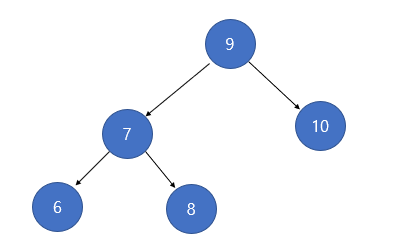

# AVL 트리에 대해 설명해 주세요.

- **AVL 트리란 한 쪽으로 값이 치우쳐질 수 있는 이진 탐색 트리(편향 트리)의 한계점을 보완하기 위해 만들어진 균형 잡힙 이진 트리이다.**
- **AVL 트리는 항상 좌/우로 데이터를 균형잡힌 상태로 유지하기 위해 추가적인 연산을 수행해야 한다.**

- 위와 같이 편향 트리 구조가 되면 한쪽으로 노드가 쏠리게 된다.
- 여기서 특정 값을 찾으려면 최대 `O(N)`의 시간이 필요할 것이다.

- 이렇게 편향 트리를 AVL 트리로 재구성하면 어떤 노드를 탐색하든 `O(logN)`에 탐색할 수 있다.

**AVL 트리의 특징**
- **이진 탐색 트리의 속성**을 가진다.
- 왼쪽, 오른쪽 서브 트리의 **높이 차이가 최대 1**이다.
- 높이 차이가 1보다 커지면 **회전(Rotation)을 통해 균형을 맞춰 높이 차이를 맞춘다.**
- 검색, 삽입, 삭제의 시간 복잡도가 `O(logN)`이다.

 

### 참고
- [참고 블로그](https://code-lab1.tistory.com/61)
- [AVL Tree 시뮬레이터](https://www.cs.usfca.edu/~galles/visualization/AVLtree.html)