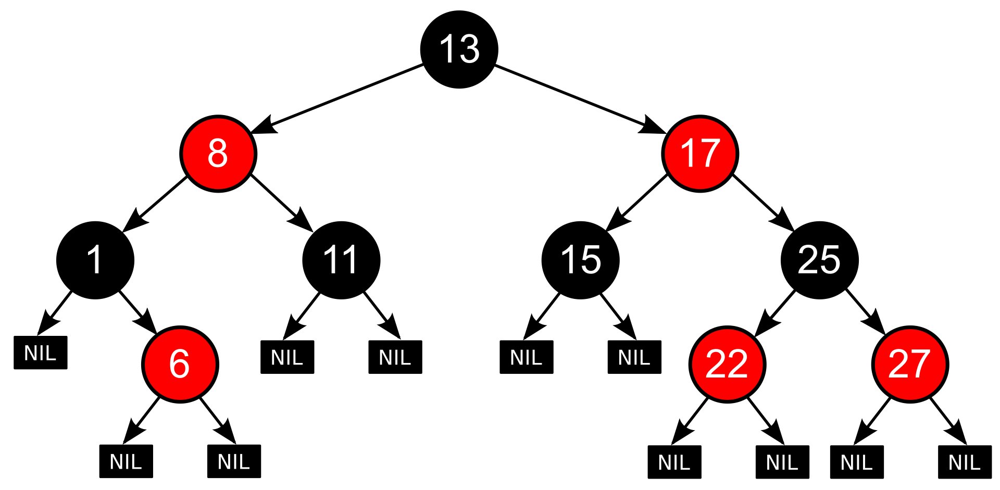

# 레드-블랙 트리에 대해 설명해 주세요.

- **레드-블랙 트리는 자가 군형 이진 탐색 트리로서, 모든 노드를 빨간색 또는 검은색인 속성을 가지고 있다.**
- **레드-블랙 트리는 자료의 삽입과, 삭제, 검색에서 최악의 경우에도 일정한 실행 시간을 보장한다.**
- 이것은 실시간 처리와 같은 실행 시간이 중요한 경우에 유용하게 쓰일 수도 있고, 일정한 실행 시간을 보장하는 또 다른
    자료구조를 만드는 데에도 쓸모 있다.
- **AVL 트리**는 레드-블랙 트리보다 더 엄격하게 균형이 잡혀 있기 때문에 삽입과 삭제를 할 때 최악의 경우에는 더 많은 회전이 필요하다.

- 레드-블랙 트리는 이진 탐색 트리가 가지고 있는 일반적인 조건에 다음과 같은 추가적인 조건을 만족해야 유효한 레드-블랙 트리가 된다.
  1. 노드는 레드 혹은 블랙 중의 하나이다.
  2. 루트 노드는 블랙이다.
  3. 모든 리프 노드들(`NIL`)은 블랙이다.
  4. 레드 노드의 자식노드 양쪽은 언제나 모두 블랙이다.
     - 즉, 레도 노드는 연달아 나타날 수 없으며, 블랙 노드만이 레드 노드의 부모 노드가 될 수 있다.
  5. 어떤 노드로부터 시작되어 그에 속한 하위 리프 노드에 도달하는 모든 경로에는 리프 노드를 제외하면 모두 같은 개수의 블랙 노드가 있다.