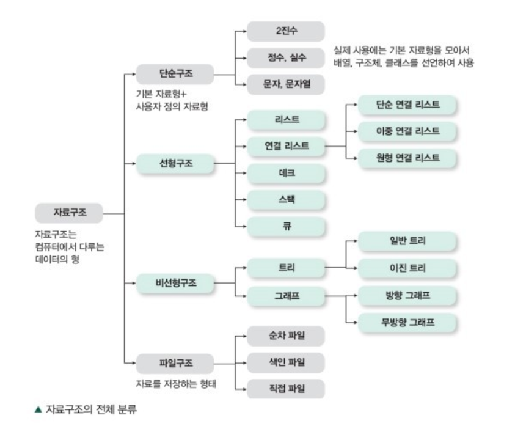

# 자료구조와 알고리즘에 개념에 대해서 설명해 주세요.

- **자료구조란 데이터를 원하는 규칙 또는 목적에 맞게 저장하기 위한 구조이다.** 신중히 선택한 자료구조는 보다 효율적인 알고리즘을 사용할 수 있게 한다.
- **알고리즘이란 자료구조에 쌓인 데이터를 활용해 어떠한 문제를 해결하기 위한 여러 동작들의 모임이다.**

**좋은 알고리즘을 만들기 위한 다음과 같은 조건들이 있다.**
- **입력** - 0개 이상의 입력이 존재해야 한다.
- **출력** - 1개 이상의 출력이 존재해야 한다.
- **명확성** - 각 명령어의 의미는 모호하지 않고 명확해야 한다.
- **유한성** - 한정된 수의 단계 후에는 반드시 종료되어야 한다.
- **유효성** - 각 명령어들은 실행 가능한 연산이어야 한다.

[자료구조 자세한 내용](https://github.com/genesis12345678/TIL/blob/main/dataStructure/dataStructure/dataStructure.md#%EC%9E%90%EB%A3%8C-%EA%B5%AC%EC%A1%B0)