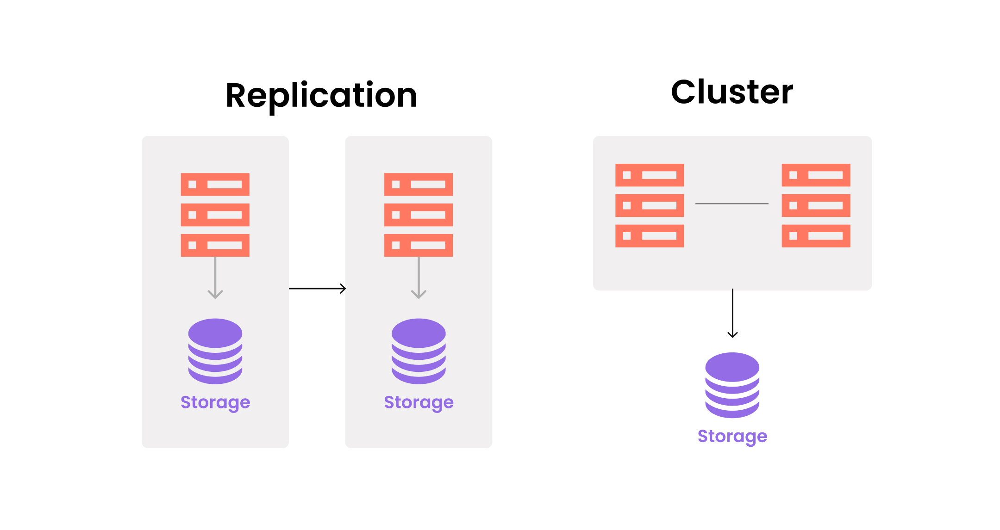
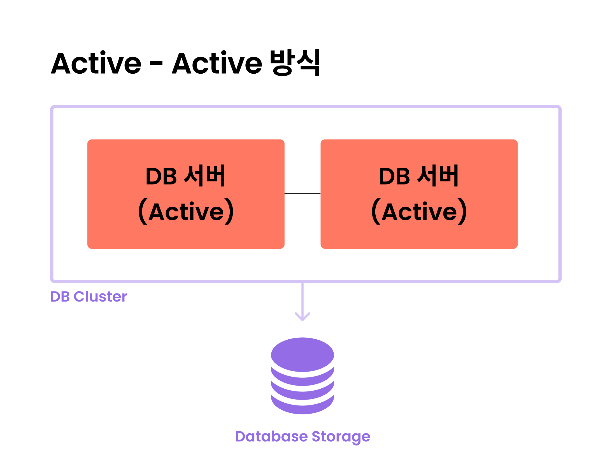
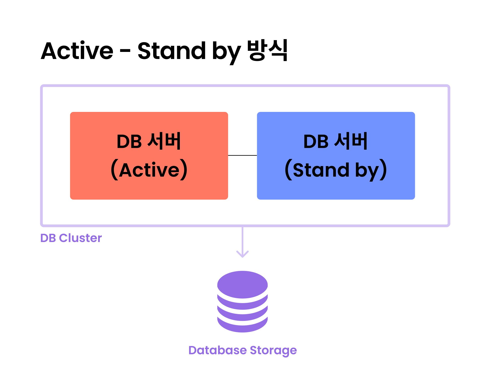
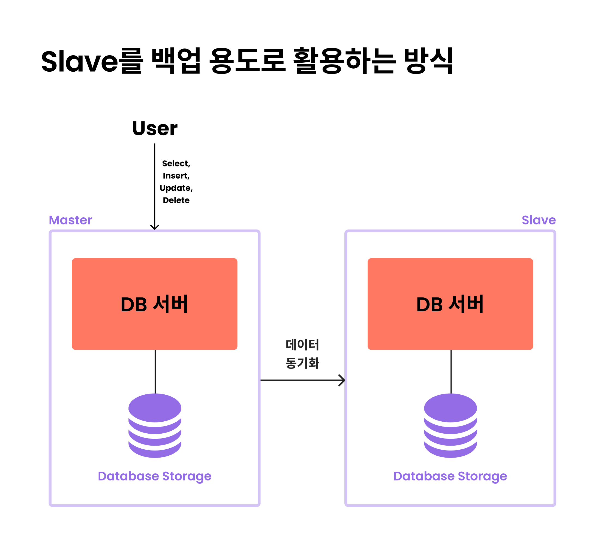
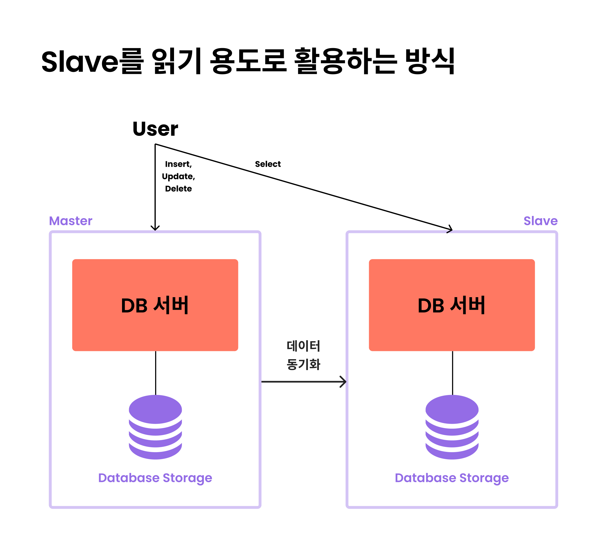

# DB 클러스터링과 리플리케이션의 차이를 설명해 주세요.

## 클러스터링

- **데이터베이스에서 `클러스터링`은 여러 개의 DB 서버가 하나의 스토리지를 나눠서 처리하는 방식이다.**
- 클러스터링은 **Active - Active**와 **Active - Stand by** 방식으로 나뉜다.

- **Active - Active 방식의 장점**
  - 하나의 DB 서버가 중단되더라도 다른 DB 서버가 작동할 수 있다.
  - 서버가 두개이기 때문에 DB 서버의 CPU, 메모리 등이 두 배가 되어 가용성 측면에서도 두 배 이상의 성능을 발휘할 수 있다.
- **Active - Active 방식의 단점**
  - 스토리지 하나를 공유하기 때문에 병목이 생길 수 있다.
  - 두 서버를 동시에 운영하기 때문에 비용 부담이 생길 수 있다.

- **Active - Stand by 방식의 장점**
  - `Active` 된 DB 서버에 문제가 생길 경우, `Stand by` 서버를 `Active` 서버로 작동하는 방식으로, 운영 비용이 절감된다.
  - `Stand by` 서버는 평소에 작동하지 않기 때문에 `Active` 상태의 DB 서버 비용만 지출하면 된다.
- **Active - Stand by 방식의 단점**
  - 실제로 `Stand by` 서버는 평소에 작동하지 않기 때문에 `Active` 서버로 전환하기까지 시간이 오래 걸릴 수 있다.

## 리플리케이션

- **다양한 이슈로 데이터 유실이 생길 경우를 대비해서 스토리지까지 복제함으로써 데이터의 유실을 최소화한다.**
- 리플리케이션은 **Source(`Master`)** 와 **Replica(`Slave`)** 라는 수직 구조로 구축한다.
- **리플리케이션을 구축하는 목적**
  - **스케일 아웃**
    - 갑자기 늘어나는 트래픽에 대해 부하를 줄이기 위해 서버를 늘려 성능을 개선
  - **백업**
    - 백업 과정에서 쿼리 손상을 입을 가능성이 있어 **Source** 데이터에 영향을 미치지 않고, **Replica** 에서 데이터 백업을 진행할 수 있다.
  - **데이터 분석**
    - `Master` 서버 성능에 영향을 주지 않고 `Slave`에서 데이터 분석을 수행할 수 있다.
  - **데이터의 지리적 분산**
    - **Source** 서버와 물리적인 거리가 있더라도 **Replica** 서버를 통해 응답을 받을 수 있고, 속도도 높일 수 있다.

**단순 백업**
- `Slave`를 백업 용도로 활용하는 방식은 두 개 이상의 데이터베이스 서버와 스토리지를 **Source(`Master`)** 와 **Replica(`Slave`)** 로 나눠서 동일한 데이터를 동기화 및 저장하는 방식

**분산 방식**
- `Slave`를 읽기 용도로 활용하는 방식은 `Slave` DB를 백업용으로 활용하기 아까워 `Master`의 부하를 줄이기 위해 `SELECT` 작업을 `Slave`에서 하도록 구성하는 방식이다.
- `SELECT` 작업에 시간이 걸려 다른 작업을 하기 어렵기 때문에 `Slave`를 통해 분산 처리할 수 있어 성능 향상에 도움을 줄 수 있다.

**리플리케이션 단점**
- `Master`, `Slave`는 서로 다른 서버를 운영하기 때문에 별도의 버전 관리를 해야 한다.
- `Master`와 `Slave`의 데이터베이스도 동일하게 맞춰줘야 하며, 데이터의 정확도를 보장할 수 없다.
- `Slave`가 `Master`의 데이터 처리 속도를 따라가지 못한다면 두 개의 데이터는 일치하지 않을 수 있다.
- 리플리케이션 방식으로 구성해도 성능 향상을 체감하지 못할 수 있다.

 

### 참고
- [참고 블로그](https://mangkyu.tistory.com/97)
- [참고 사이트](https://www.whatap.io/ko/blog/172/)
 