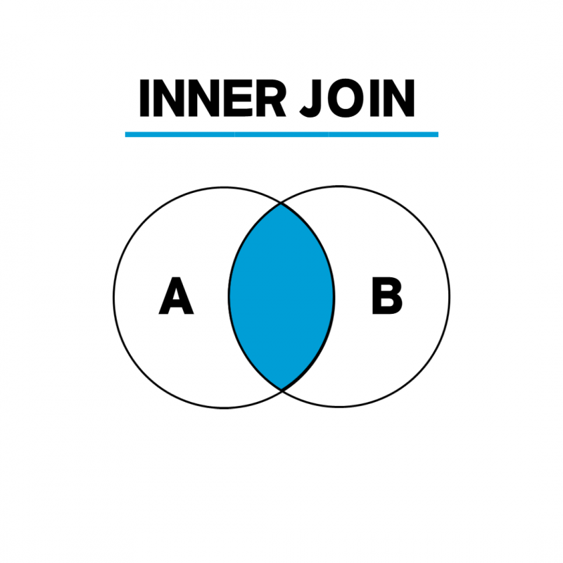
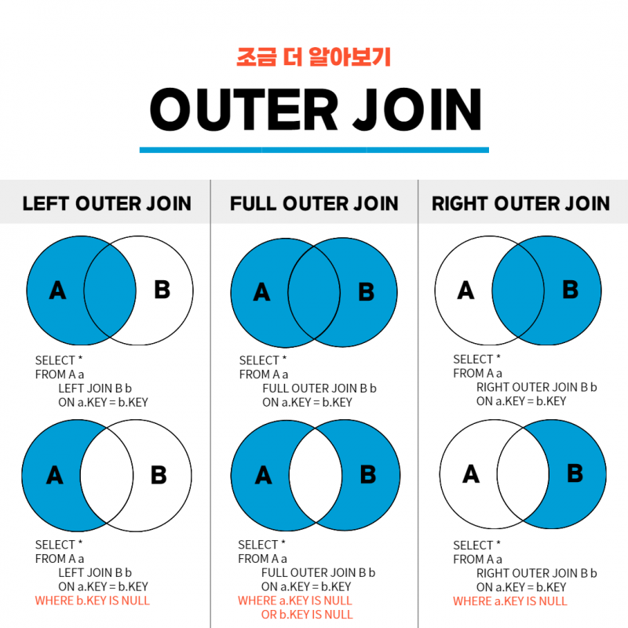

# JOIN에 대해서 설명해 주세요.

- **조인(JOIN)** 이란, 두 개 이상의 테이블을 서로 묶어서 하나의 결과를 만들어 내는 것을 말한다.
- 실무에서는 테이블 한 개보다 여러 개로 데이터를 가져오는 경우가 훨씬 많다.
- 조인은 크게 **외부 조인**과 **내부 조인**으로 나뉜다.
- **내부 조인(INNER JOIN)**
  - 공통 컬럼명 기반으로 결과 집합을 생성한다.
  - `CROSS JOIN`, `EQUI JOIN`, `NON-EQUI JOIN`, `NATURAL JOIN`
- **외부 조인(OUTER JOIN)**
  - 조건문에 만족하지 않는 행도 표시해준다.
  - `FULL OUTER JOIN`, `LEFT OUTER JOIN`, `RIGHT OUTER JOIN`

 

# 내부 조인과 외부 조인의 차이는 무엇인가요?

- `INNTE JOIN`, 내부 조인은 키 값이 있는 테이블의 컬럼 값을 비교해서 맞는 값을 가져온다.
- 즉 서로 관련된 내용을 검색해 가져오는 방법이며, 두 테이블의 교집합이라고 할 수 있다.
- `OUTER JOIN`, 외부 조인은 여러 테이블 중 한 테이블에만 데이터가 있고 다른 테이블에는 없는 경우, 데이터가 있는 테이블의 내용을 전부 출력한다.

- **LEFT** OUTER JOIN : 왼쪽 테이블의 모든 값이 출력되는 조인, 오른쪽 테이블에 데이터가 없는 경우 `NULL`
- **RIGHT** OUTER JOIN : 오른쪽 테이블의 모든 값이 출력되는 조인, 왼쪽 테이블에 데이터가 없는 경우 `NULL`
- **FULL** OUTER JOIN : 왼쪽 또는 오른쪽 테이블의 모든 값이 출력되는 조인, 양쪽 모두 조건이 일치하지 않은 것까지 모두 결합해서 출력

 

### 참고
- [참고 사이트](https://hongong.hanbit.co.kr/sql-%EA%B8%B0%EB%B3%B8-%EB%AC%B8%EB%B2%95-joininner-outer-cross-self-join/)