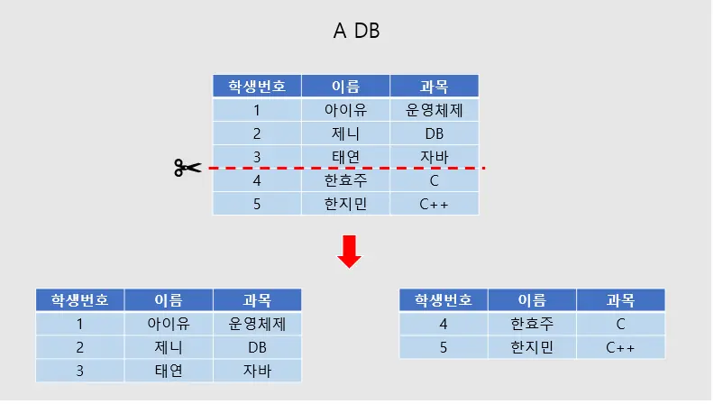
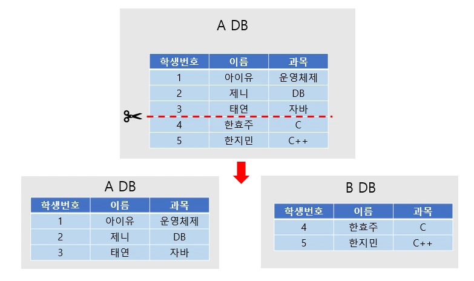

# 파티셔닝과 샤딩에 대해서 설명해 주세요.

- 데이터베이스 볼륨이 커질수록 데이터베이스 **읽기 및 쓰기 성능은 감소할 것**이고, **데이터베이스가 병목 지점**이 될 것이다.
- 때문에 이를 적절히 분할할 필요가 있는데, 데이터베이스를 분할하는 방법으로 크게 **파티셔닝(Partitioning)** 과 **샤딩(Sharding)** 이 있다.

## 파티셔닝

- 파티셔닝은 매우 큰 테이블을 여러 개의 테이블로 분할하는 작업이다.
- 큰 데이터를 여러 테이블로 나눠 저장하기 때문에 쿼리 성능이 개선될 수 있다.
- 데이터는 물리적으로 여러 테이블로 분산하여 저장되지만, 사용자는 마치 하나의 테이블에 접근하는 것과 같이 사용할 수 있다.

**파티셔닝을 이용하여 얻을 수 있는 이점**
- **성능**
  - 특정 쿼리의 성능을 향상시킬 수 있다.
  - 대용량 `Data Write` 환경에서 효율적이다.
  - 필요한 데이터만 빠르게 조회할 수 있으므로 쿼리가 가벼워진다.
  - `Full Scan`에서 데이터 접근의 범위를 줄여 성능을 향상시킬 수 있다.
- **가용성**
  - 물리적인 파티셔닝으로 전체 데이터의 훼손 가능성이 줄어들고 데이터 가용성이 향상된다.
  - 파티션별로 독립적으로 백업하고 복구할 수 있다.
- **관리용이**
  - 큰 테이블들을 제거하여 관리를 쉽게 할 수 있다.

**파티셔닝 단점**
- 테이블을 여러 파티션으로 쪼개기 때문에 테이블 간의 `JOIN` 비용이 증가한다.
- 테이블과 인덱스를 별도로 파티셔닝 할 수 없기 때문에 테이블과 인덱스를 같이 파티셔닝 해야 한다.

파티셔닝의 종류로는 **수평 파티셔닝**과 **수직 파티셔닝**이 있다.

## 샤딩

- 샤딩은 동일한 스키마를 가지고 있는 여러 대의 데이터베이스 서버들에 데이터들 **작은 단위로 나누어 분산 저장하는 기법**이다.
- 작은 단위를 샤드(`shard`)라고 부른다.
- 어떻게 보면 **샤딩은 수평 파티셔닝의 일종**이다.
- 차이점은 파티셔닝은 **모든 데이터를 동일한 컴퓨터에 저장**하지만, 샤딩은 데이터를 **서로 다른 컴퓨터에 분산한다는 점이다.**

**수평 파티셔닝**

**샤딩**

- 물리적으로 서로 다른 컴퓨터에 저장하므로, 쿼리 성능 향상과 더불어 부하가 분산되는 효과까지 얻을 수 있다.
- 즉, 샤딩은 데이터베이스 차원의 수평 확장(`scale-out`)인 셈이다.
- 하지만 샤딩은 데이터베이스 서버 간의 연결 과정이 많아져 비용이 증가할 수 있으며, 하나의 서버가 고장나면 데이터의 무결성이 깨질 수 있다는 단점이 있다.

 

### 참고
- [참고 블로그](https://code-lab1.tistory.com/202)