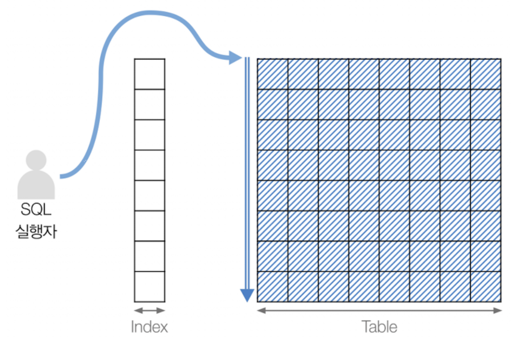
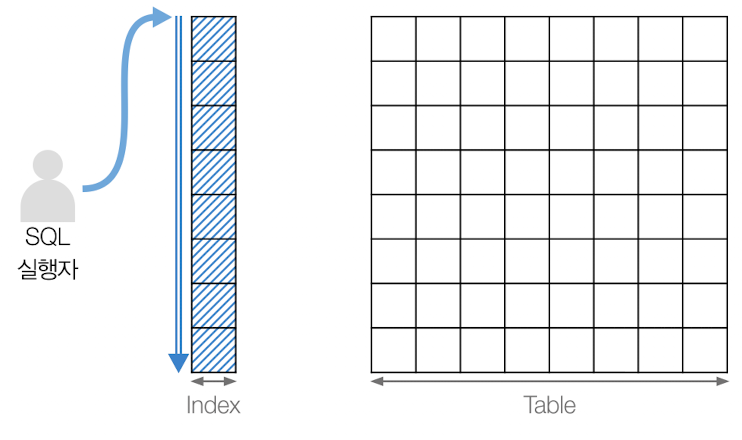
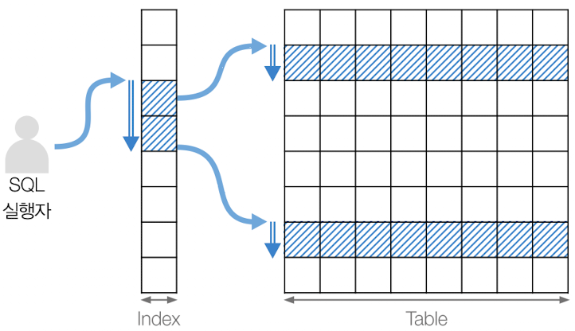
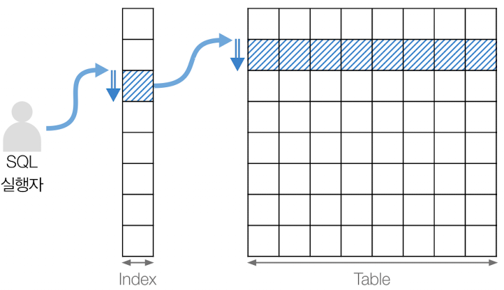
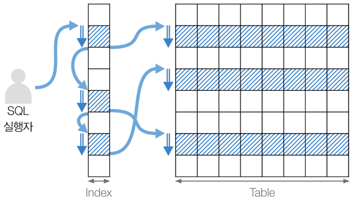
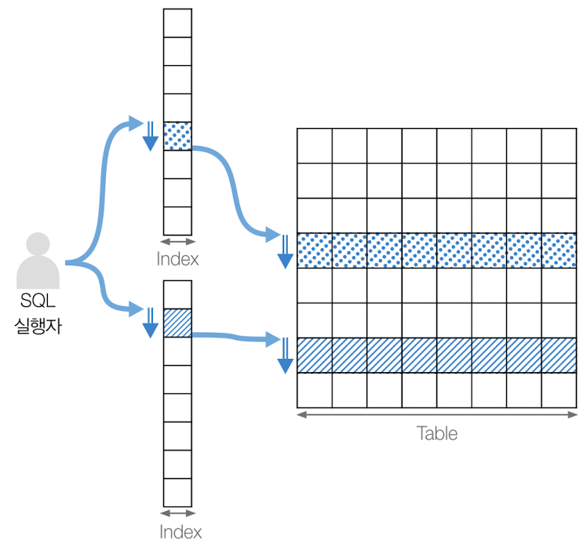

# 테이블 스캔에 대해서 설명해 주세요. 

| 검색                                    | 방법                   | 장점                     | 단점                    |
|---------------------------------------|----------------------|------------------------|-----------------------|
| **테이블 전체 스캔 (Full Table Scan)**   | 테이블의 모든 데이터를 읽어온다.   | 어떤 검색 조건을 사용하더라도 검색 가능 | 검색 속도가 느릴 수 있다.       |
| **테이블 인덱스 스캔 (Table Index Scan)** | 인덱스를 이용하여 데이터를 읽어온다. | 빠른 검색                  | 인덱스 크기가 클 경우 느릴 수 있다. |

## 테이블 전체 스캔

- **인덱스(`Index`)를 사용하지 않고 데이터를 검색하는 방식**이다.
- 데이터베이스는 해당 테이블의 **모든 레코드**를 순차적으로 조회한다.
- 디스크 I/O의 비용이 많이 발생하며, 대량의 데이터를 처리할 때는 성능이 나빠질 수 있다.

### 테이블 전체 스캔의 대안

- 인덱스를 사용하는 쿼리를 실행한다. 인덱스를 사용하면 특정 조건에 해당하는 레코드만 읽어오기 때문에 데이터베이스의 성능을 향상시킬 수 있다.
- 데이터베이스 서버의 스펙을 높여서 데이터베이스의 성능을 향상시킨다.
- 데이터베이스의 [파티셔닝](https://github.com/genesis12345678/TIL/blob/main/interview/database/1_10/Partitioning.md) 기능을 사용한다.

### 테이블 전체 스캔을 사용하는 경우

- 대량의 데이터를 한 번에 처리 해야 할 때
- 인덱스를 사용하여 데이터를 가져오는 것보다 테이블 전체를 스캔하는 것이 빠른 경우
- 테이블의 모든 데이터를 가져와야 하는 경우

 

## 테이블 인덱스 스캔

- **인덱스(`Index`)를 사용하여 데이터를 검색하는 방식**이다.
- 인덱스는 데이터베이스 테이블에서 특정 열에 대한 정보를 가지고 있기 때문에 해당 열을 사용하여 검색할 경우 인덱스 스캔을 사용할 수 있다.

### 인덱스 스캔 종류

| 검색                                    | 방법                                                 | 장점                              | 단점                                      |
|---------------------------------------|----------------------------------------------------|---------------------------------|-----------------------------------------|
| **인덱스 전체 스캔 (Index Table Scan)**  | 인덱스의 모든 데이터를 읽어오는 방법.                              | 인덱스 크기가 작은 경우 빠른 검색 가능          | 테이블의 크기가 큰 경우 전체 테이블 스캔보다 느릴 수 있다.      |
| **인덱스 범위 스캔 (Index Range Scan)**  | 인덱스의 일부 데이터만 읽어오는 방법으로, 인덱스의 범위를 지정하여 빠른 검색이 가능하다. | 인덱스의 크기와 테이블의 크기에 관계없이 빠른 검색 가능 | 검색 범위가 넓을 경우 느릴 수 있다.                   |
| **인덱스 고유 스캔 (Index Unique Scan)** | 인덱스의 유일한 값을 검색하는 방법                                | 인덱스의 크기와 테이블의 크기에 관계없이 빠른 검색 가능 | 인덱스 컬럼이 유일한 값을 가지고 있을 때만 사용 가능하다.       |
| **인덱스 루스 스캔 (Index Loose Scan)**  | 인덱스의 일부 데이터만 읽어오는 방법으로, 인덱스의 범위를 지정하지 않고 검색을 수행한다. | 인덱스의 크기와 테이블의 크기에 관계없이 빠른 검색 가능 | 정확도가 떨어질 수 있다.                          |
| **인덱스 병합 스캔 (Index Merge Scan)**  | 여러 개의 인덱스를 병합하여 검색하는 방법                            | 복잡한 검색 조건을 처리할 수 있다.            | 인덱스의 크기가 작은 경우에만 유용하며, 병합에 시간이 걸릴 수 있다. |

### 인덱스 전체 스캔

- **인덱스를 사용하지 않고 전체 인덱스를 읽어서 검색한다.**
- 데이터가 적을 때는 빠르게 처리 될 수 있지만, 데이터가 많을 때는 많은 시간이 걸릴 수 있다.
- 데이터베이스의 성능에 영향을 미칠 수 있으며 인덱스를 효율적으로 사용하여 인덱스 전체 스캔이 발생하지 않도록 해야 한다.

**인덱스 전체 스캔 발생 시기**
- **인덱스를 사용하지 않고** 전체 테이블을 검색해야 할 때 발생된다.
- 인덱스의 **선택성이** 매우 낮아서 일부 레코드만 가져올 때 발생된다.
  - 선택성이란 인덱스 컬럼의 값이 얼마나 유일한지에 대한 지표이다.
  - 성별인 경우 선택성이 낮다.(두 가지 값만 있으므로)
  - 이메일인 경우 선택성이 높다.
  - **인덱스 컬럼을 지정할 때에는 선택성이 높은 열을 지정하는 것이 효과적이다.**

### 인덱스 범위 스캔

- **인덱스의 일부만 스캔하는 방법**이다. 
- 데이터가 많은 경우 전체 스캔보다 효율적일 수 있다.
- 특정 범위 내의 레코드만 읽어들이기 때문에 비용이 적게 든다.

**인덱스 범위 스캔 발생 시기**
- `WHERE` 절에서 **범위 검색**을 수행할 때 발생된다.
- `ORDER BY` 절에서 정렬할 때 발생된다.
- `JOIN` 연산을 수행할 때 발생된다.
 
**인덱스의 선택성이 낮은 경우 전체 스캔이 발생할 수 있기 때문에 선택성을 고려하여 인덱스를 설계해야 한다.**

### 인덱스 고유 스캔

- **인덱스에서 중복되지 않는 유일한 값을 검색하는 방법**이다.
- 하나의 값만 읽어 들이기 때문에 비용이 가장 적게 든다.
- 유일성을 보장하기 때문에 인덱스 전채 스캔보다 빠를 수 있지만, 단일 값을 검색할 때에만 사용할 수 있기 때문에 제한적이다.

**인덱스 고유 스캔 발생 시기**
- `PRIMARY KEY` 또는 `UNIQUE` 인덱스를 사용하여 검색할 때 발생된다.
- 인덱스에서 단일 값을 검색할 때 발생된다.

### 인덱스 루스 스캔
- 인덱스 범위 스캔과 비슷하게 `특정 인덱스 범위`만 스캔하는 방식과 비슷하지만, **중간중간 필요 없는 인덱스 키 값은 건너뛰고 다음으로 넘어가서 검색하는 방식이다.**

**인덱스 루스 스캔 발생 시기**
- `WHERE` 절에 `LIKE` 키워드를 사용할 때 발생된다.

### 인덱스 병합 스캔

- **두 개 이상의 인덱스를 병합하여 검색하는 방법**이다.
- 각 인덱스를 병합하는 데 시간이 걸리기 때문에 전체적인 속도가 느릴 수 있지만, 각각의 인덱스를 사용하는 것보다 효율적이다.

**인덱스 병합 스캔 발생 시기**
- `OR` 조건이 포함된 쿼리에서 각각의 조건에 해당하는 인덱스를 사용하는 경우에 발생된다.
- `UNION ALL` 연산자를 수행하는 경우에 발생된다.

 

 

### 참고
- [참고 블로그](https://adjh54.tistory.com/163#hELLO)