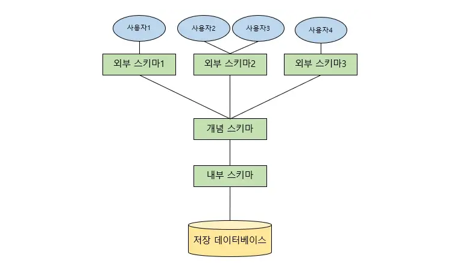

# 스키마에 대해 설명해 주세요.

- **스키마(Schema)** 란, 데이터베이스의 구조와 제약조건에 관한 전반적인 명세를 기술한 것이다.
- 개체의 특성을 나타내는 **속성(`Attribute`)** 과 속성들의 집합으로 이루어진 **개체(`Entity`)**, 개체 사이에 존재하는 **관계(`Relation`)** 에 대한 정의와
    이들이 유지해야 할 제약조건들을 기술한 것이다.
- 스키마는 사용자의 관점에 따라 **외부 스키마, 개념 스키마, 내부 스키마**로 나눠진다.

## 외부 스키마

- **사용자 뷰**로, 사용자나 프로그래머가 각 개인의 입장에서 필요로 하는 데이터베이스의 논리적 구조를 정의한 것이다.
- 즉, **실세계에 존재하는 데이터들을 어떤 형식, 구조, 배치 화면을 통해 사용자에게 보여줄 것인가를 정의한다.**
- 하나의 DB 시스템에는 여러 개의 외부 스키마가 존재할 수 있으며, 하나의 외부 스키마를 여러 개의 응용 프로그램이나 사용자가 공유할 수도 있다.
- SQL이나 프로그래밍 언어를 사용하여 DB에 접근할 수 있다.

## 개념 스키마
- **전체적인 뷰**로, **데이터베이스의 전체적인 논리적 구조이다.**
- DBA에 의해 구성되며, 데이터베이스당 하나만 존재한다.

## 내부 스키마
- 물리적 저장장치의 입장에서 본 데이터베이스의 구조로, **데이터베이스의 물리적 저장구조를 정의한 것**이다.
- 구체적으로 개념 스키마를 디스크 기억장치에 물리적으로 구현하기 위한 방법을 기술한 것이다.

 

### 참고
- [참고 블로그](https://velog.io/@msung99/%EB%8D%B0%EC%9D%B4%ED%84%B0%EB%B2%A0%EC%9D%B4%EC%8A%A4%EC%99%80-%EC%8A%A4%ED%82%A4%EB%A7%88Schema)