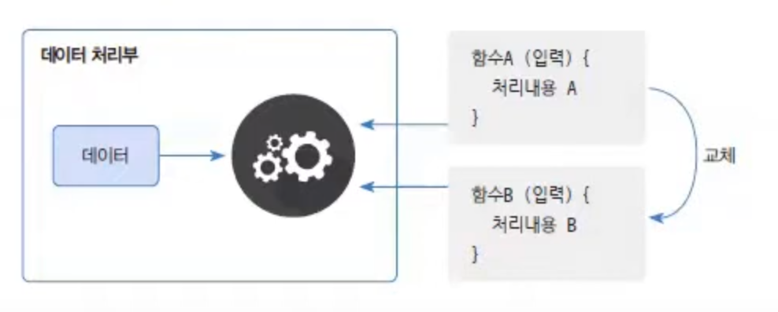

# 람다식에 대해서 설명해 주세요.

- 먼저 [함수형 프로그래밍](https://github.com/genesis12345678/TIL/blob/main/interview/programming/%ED%95%A8%EC%88%98%ED%98%95%ED%94%84%EB%A1%9C%EA%B7%B8%EB%9E%98%EB%B0%8D.md#%ED%95%A8%EC%88%98%ED%98%95-%ED%94%84%EB%A1%9C%EA%B7%B8%EB%9E%98%EB%B0%8D%EC%97%90-%EB%8C%80%ED%95%B4-%EC%84%A4%EB%AA%85%ED%95%B4-%EC%A3%BC%EC%84%B8%EC%9A%94)이란, 함수를 정의하고 이 함수를 데이터 처리부로 보내 데이터를 처리하는 기법을 말한다. 데이터 처리부는 데이터만 가지고 있을 뿐,
    처리 방법이 정해져 있지 않아 외부에서 제공된 함수에 의존하게 된다.



- 데이터 처리부는 제공된 함수의 입력값으로 데이터를 넣고 함수에 정의된 처리 내용을 실행한다.
- 동일한 데이터라도 함수A와 함수B는 서로 처리내용이 다르기 때문에 결과가 다를 수 있다.
- 이것이 **함수형 프로그래밍**의 특징으로, 데이터 처리의 다형성이라고도 볼 수 있다.

**자바는 함수형 프로그래밍을 위해 Java 8부터 람다식을 지원한다.**
- 람다식은 위 그림처럼 데이터 처리부에 제공되는 함수 역할을 하는 매개변수를 가진 중괄호 블록이다.
- 데이터 처리부는 람다식을 받아 매개변수에 데이터를 대입하고 중괄호를 실행시켜 처리한다.

람다식을 잘 이해하려면 **함수**와 **메서드**의 차이에 대해서 알아야 한다.

**함수는** 클래스로부터 독립적일 수 있다. 즉, 클래스 없이 함수 자기 자신만 존재할 수 있는 것이다.<br>
반면 **메서드는** 클래스에 종속적이다. 즉, 클래스가 없으면 메서드도 존재할 수 없는 것이다.

**정리하면**
- **람다 표현식이란, 함수형 프로그래밍을 구성하기 위한 함수식이며, 간단히 말해 자바의 메서드를 간결함 함수식으로 표현한 것이다.**

## 람다 표현식의 특징

1. 매개변수의 타입을 추론할 수 있는 경우 타입을 생략할 수 있다.(보통의 경우 컴파일러가 추론해주므로 생략 가능)
2. 매개변수가 하나인 경우 괄호(`()`)를 생략할 수 있다.
3. 함수의 몸체가 하나의 명령문만으로 이루어진 경우 중괄호(`{}`)를 생략할 수 있다.(이때 세미콜론(`;`)은 붙이지 않음)
4. 함수의 몸체가 하나의 `return` 문으로만 이루어진 경우에는 중괄호(`{}`)를 생략할 수 없다.
5. `return` 문 대신 표현식을 사용할 수 있으며, 이때 반환값은 표현식의 결괏값이 된다.(이대 세미콜론(`;`)은 붙이지 않음)

```java
int add(int x, int y) {
    return x + y;
}

// 위의 메서드를 람다 표현식을 이용해 아래와 같이 단축 시킬수 있다. (메서드 반환 타입, 메서드 이름 생략)
(int x, int y) -> {
	return x + y;
};

// 매개변수 타입도 생략 할 수 있다.
(x, y) -> {
	return x + y;
};

// 함수에 리턴문 한줄만 있을 경우 더욱 더 단축 시킬 수 있다. (중괄호, return 생략)
(x, y) -> x + y;
```

6. **자바는 객체지향이다. 그래서 람다식도 결국은 객체인데, 정확히는 인터페이스를 내부 익명 클래스로 구현한 것이다.** 
   - **여기서 중요한 것은, 람다식은 외부에서 전달된 값은 사용은 할 수 있지만, 그 변수의 값을 변경할 수는 없다.**
   - 따라서 람다식에서는 일반 변수는 사용할 수 없고, `final`로 선언된 변수만을 사용할 수 있다.

### 람다 표현식의 장점

- **간결하고 읽기 쉬운 코드**
  - 람다 표현식을 사용하면 익명 함수를 간결하게 표현할 수 있어 불필요한 부가 코드를 줄일 수 있다.
  - 이는 코드의 가독성을 향상시키고 유지보수를 용이하게 만든다.
- **함수형 프로그래밍 지원**
  - 람다 표현식은 함수형 프로그래밍 개념을 자바에 도입한 것이다.
  - 함수를 값으로 취급하고, 함수를 인자로 전달하거나 반환값으로 사용할 수 있다.
  - 이는 함수 조합, 필터링, 매핑 등 함수형 프로그래밍의 특징을 자바에서 쉽게 적용할 수 있도록 한다.
- **코드 재사용성**
  - 람다 표현식을 사용하면 익명 함수를 정의하여 재사용 가능한 코드 블록으로 만들 수 있다.
  - 이를 다른 곳에서 호출하거나 다른 함수의 인자로 전달하여 사용할 수 있다.
- **다중 쓰레드 환경에서의 활용성**
  - 람다 표현식은 함수형 프로그래밍의 특성으로 인해 상태 변경이 없고 쓰레드에 안전하다.
- **컬렉션 처리 용이성**
  - 스트림 API와 함께 람다 표현식을 사용하면 컬렉션 데이터를 쉽게 처리할 수 있다.
  - 다양한 연산을 간결한 코드로 표현할 수 있으며, 데이터를 병렬로 처리하여 성능을 향상시킬 수 있다.

### 람다 표현식의 단점

- **문서화를 할 수 없다.**
  - 람다 자체는 이름이 없는 함수이기 때문에 메서드나 클래스와 다르게 문서화를 할 수 없다.
- **가독성 저하**
  - 람다 표현식은 동작 행위(메서드)를 실행부에서 지정하는 방식이다.
  - 그래서 람다식을 너무 남발하면 비슷하게 생긴 함수를 계속해서 중복 생성할 수도 있다.
- **디버깅의 어려움**
  - 람다 표현식은 익명 함수이기 때문에 익명 객체 특성상 디버깅할 때 콜 스택 추적이 어렵다.
  - 람다 표현식 내에서 예외가 발생하면 해당 예외를 처리하기 위해 추가적인 작업이 필요하다.
- **제한된 기능**
  - 람다 표현식은 간단한 함수형 작업에 적합하지만, 일부 복잡한 작업에는 제한적일 수 있다.
  - 예를 들어 람다 표현식은 상태를 갖지 않으므로 멤버 변수에 접근할 수 없다.
  - 람다 표현식은 단일 메서드 인터페이스에만 사용할 수 있다.

<br>

## 함수형 인터페이스

- **함수형 인터페이스란 딱 하나의 추상 메서드가 선언된 인터페이스를 말한다.**
- 람다 표현식은 함수형 인터페이스 안에 정의된 하나의 추상 메서드 선언을 짧게 표현한 것이다.
- 람다 표현식을 사용할 때는 람다 표현식을 저장하기 위한 참조 변수의 타입을 결정해야만 한다.
```text
참조변수타입 참조변수이름 = 람다 표현식
```
- 위 문법처럼 람다 표현식을 하나의 변수에 대입할 때 사용되는 참조 변수의 타입을 **함수형 인터페이스**라고 부른다.

**@FunctionalInterface**

- `@FunctionalInterface`를 사용하여 함수형 인터페이스임을 명시할 수 있다.
- 이 어노테이션을 직접 정의한 함수형 인터페이스에 명시하면 컴파일러는 해당 인터페이스를 함수형 인터페이스로 인식한다.
- 자바 컴파일러는 이렇게 명시된 함수형 인터페이스의 두 개 이상의 메서드가 선언하면 오류를 발생시킨다.
- 필수로 선언할 필요는 없지만, 개발자의 실수를 줄여주는 역할을 해줄 수 있다.

<br>

## 함수형 인터페이스 표준 API

- 자바에서 자료구조를 [컬렉션 프레임워크](https://github.com/genesis12345678/TIL/blob/main/interview/dataStructure/11_20/JCF.md)로 미리 만들어 제공하듯이, 자주 사용할 것 같은 람다 함수 형태를 **함수형 인터페이스 표준 API**로 미리 만들어 제공해준다.
- 함수형 인터페이스 표준 API는 `java.util.function` 패키지로 제공된다.
- 이 패키지 안에 있는 함수형 인터페이스 종류로는 `Consumer`, `Supplier`, `Function`, `Operator`, `Predicate` 가 있다.

| 함수형 인터페이스        | 메서드 형태(`T` : 데이터 타입, `R` : 리턴 타입) | API 활용                                                  | 매개 변수 | 반환 값 |
|------------------|-----------------------------------|---------------------------------------------------------|-------|------|
| `Runnable`       | `void run()`                      | 매개 변수를 사용 안하고 리턴을 하지 않는 함수 형태로 이용(대표적으로 쓰레드의 매개 변수로 이용) | X     | X    |
| `Consumer<T>`    | `void accept(T t)`                | 매개 변수를 사용만 하고 리턴을 하지 않는 함수 형태                           | O     | X    |
| `Supplier<T>`    | `T get()`                         | 매개 변수를 사용 안하고 리턴만 하는 함수 형태                              | X     | O    |
| `Function<T, R>` | `R apply(T t)`                    | 매개 변수 값을 매핑(타입변환)해서 리턴하기                                | O     | O    |
| `Predicate<T>`   | `boolean test(T t)`               | 매개 변수 값이 조건에 맞는지 단정해서 `boolean` 리턴                      | O     | O    |
| `Operator`       | `R applyAs(T t)`                  | 매개 변수 값을 연산해서 결과 리턴하기                                   | O     | O    |


### Consumer 인터페이스

- **역할** : 매개 변수만 받고 처리, 리턴값 없음
- **실행 메서드** : `accept()`
- `consume` 뜻 그대로(소모하다) 사용만 할 뿐 리턴값이 없다는 뜻이다.

| 인터페이스 형태              | 내용                          |
|-----------------------|-----------------------------|
| `Consumer<T>`         | `T` 형태의 인자값을 받는다.           |
| `BiConsumer<T, U>`    | `T`와 `U` 형태의 인자값 2개를 받는다.   |
| `(Xxx)Consumer`       | `Xxx` 형태의 인자값을 받는다.         |
| `Obj(Xxx)Consumer<T>` | `T`와 `Xxx` 형태의 인자값 2개를 받는다. |


### Supplier 인터페이스

- **역할** : 아무 매개 변수 없이 리턴값만을 반환
- **실행 메서드** : `get()`, `getAsXxx()`
- `supply` 뜻 그대로(생산하다) 데이터를 반환(공급) 한다는 뜻이다.

| 인터페이스 형태        | 내용        |
|-----------------|-----------|
| `Supplier<T>`   | `T`형 반환   |
| `(Xxx)Supplier` | `Xxx`형 반환 |

### Function 인터페이스

- **역할** : 매핑(타입 변환)하기
- **실행 메서드** : `applyXxx()`
- 매핑 한다는 것은, 특정 타입 값을 추출하거나 다른 타입으로 변환하는 작업에 사용한다고 보면 된다.

| 인터페이스 형태                  | 내용                    |
|---------------------------|-----------------------|
| `Function<T, R>`          | `T` 받아서 `R` 리턴        |
| `BiFunction<T, U, R>`     | `T`와 `U`  받아서 `R` 리턴  |
| `(Xxx)Function<T>`        | `Xxx`  받아서 `T` 리턴     |
| `(Xxx)to(Yyy)Function`    | `Xxx`  받아서 `Yyy` 리턴   |
| `to(Xxx)Function<T>`      | `T`  받아서 `Xxx` 리턴     |
| `to(Xxx)BiFunction<T, U>` | `T`와 `U`  받아서 `Xxx` 리턴 |


### Operator 인터페이스

- **역할** : 매개 변수 계산해서 동일한 타입으로 리턴하기
- **실행 메서드** : `applyXxx()`
- `Function`과 비슷한데, 매개 변수를 리턴값으로 매핑(타입 변환)하는 역할보다는 매개 변수를 이용해서 연산을 수행한 후 동일한 타입으로 리턴값을 제공하는 역할에 초점이 있다.

| 인터페이스 형태                 | 내용                 |
|--------------------------|--------------------|
| `UnaryOperator<T>`       | `T`타입 연산하고 리턴      |
| `BinaryOperator<T>`      | `T`타입 연산하고 리턴      |
| `(Xxx)UnaryOperator<T>`  | `Xxx`타입 1개 연산하고 리턴 |
| `(Xxx)BinaryOperator<T>` | `Xxx`타입 2개 연산하고 리턴 |


### Predicate 인터페이스

- **역할** : 매개 변수를 받고 `true` 또는 `false` 리턴
- **실행 메서드** : `test()`
- 매개 변수를 받아 참/거짓을 단정(`predicate`) 한다고 보면 된다.

| 인터페이스 형태               | 내용                        |
|------------------------|---------------------------|
| `Predicate<T>`         | `T`를 받아 `boolean` 리턴      |
| `BiPredicate<T, U>`    | `T`와 `U`를 받아 `boolean` 리턴 |
| `(Xxx)Predicate` | `Xxx`를 받아 `boolean` 리턴     |


## 함수형 인터페이스 API 정리


- 왼쪽 세로는 **매개 변수 타입**, 각 표의 위쪽 부분은 **함수 반환 타입**을 나타낸다.
- 예를 들어, `int` 형 매개 변수를 받아 `boolean`을 반환하는 함수형 인터페이스는 `IntPredicate`인 것이다.

<br>

### 참고
- [참고 블로그](https://inpa.tistory.com/entry/%E2%98%95-Lambda-Expression)
- [참고 사이트](https://www.tcpschool.com/java/java_lambda_concept)
- [참고 동영상](https://www.youtube.com/watch?v=T5voBYkhJ34)
- [참고 동영상](https://www.youtube.com/watch?v=3wnmgM4qK30&t=806s)
- [참고 동영상](https://www.youtube.com/watch?v=4ZtKiSvZNu4)
