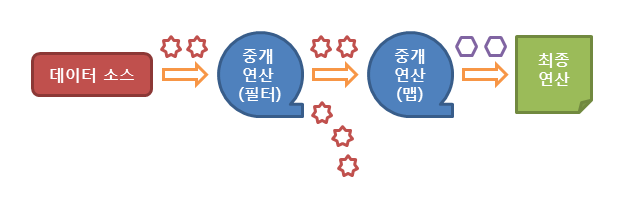
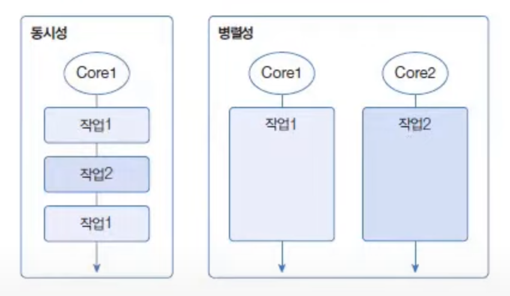

# 스트림(Stream)에 대해서 설명해 주세요.

- 자바에서는 많은 양의 데이터를 저장하기 위해서 배열이나 컬렉션 자료구조를 이용한다.
- 이렇게 저장된 데이터에 접근하기 위해서는 반복문이나 반복자(`iterator`)를 사용하여 매번 새로운 코드를 작성해야 한다.
- 이러한 문제점을 극복하기 위해 Java 8 부터 **스트림 API**를 도입한다.
- 스트림 API는 **데이터를 추상화하여** 다루므로, 다양한 방식으로 저장된 데이터를 읽고 쓰기 위한 공통된 방법을 제공한다.
- 따라서 스트림 API를 사용하면 배열이나 컬렉션뿐만 아니라 파일에 저장된 데이터도 모두 같은 방법으로 다룰 수 있게 된다.

## 스트림 API 특징

- 스트림은 외부 반복을 통해 작업하는 컬렉션과는 달리 **내부 반복**을 통해 작업을 수행한다.
- 스트림은 재사용이 가능한 컬렉션과는 달리 **단 한 번만 사용할 수 있다.**
- 스트림은 **원본 데이터를 변경하지 않는다.**
- 스트림의 연산은 필터-맵(`filter-map`) 기반의 API를 사용하여 지연(`lazy`) 연산을 통해 성능을 최적화한다.
- 스트림은 `parallelStream()` 메서드를 통해 손쉬운 병렬 처리를 지원한다.
- 오토방식 & 언박싱의 비효율을 제거할 수 있는 기본형 스트림을 제공한다.(`IntStream`, `LongStream` 등)

## 스트림 API 동작 흐름

1. **스트림 생성**
   - `Collections.stream()`, `Arrays.stream()`, `Stream.of()`, `Stream.iterate()`, `Stream.generate()` 등으로 생성 가능
2. **스트림 중간 연산(스트림의 변환)**
   - 연산결과가 스트림이기 때문에 **메서드 체인**으로 연결하여 만들 수 있다.(여러 번 사용 가능)
   - 스트림은 중간 연산을 누적하고, **최종 연산이 호출될 때 한꺼번에 처리**되기 때문에(`lazy`) 성능 및 메모리 효율을 향상시킬 수 있다.
   - `filter()`, `distinct()`, `map()`, `limit(),` `skip()`, `sorted()`, `peek()` 등이 있다.
3. **스트림 최종 연산(스트림의 사용)**
   - 중간 연산을 통해 변환된 스트림은 마지막으로 최종 연산을 통해 **각 요소를 소모하여** 결과를 표시한다.(1번만 실행 가능)
   - 즉, 지연(`lazy`) 되었던 모든 중간 연산들이 최종 연산 시에 모두 수행되는 것이다.
   - **이렇게 최종 연산 시에 모든 요소를 소모한 해당 스트림은 더 이상 사용할 수 없게 된다.(일회용)**
   - `forEach()`, `reduce()`, `findFirst()`, `anyMatch()`, `count()`, `max()`, `sum()`, `collect()` 등이 있다.




## 스트림 API 장단점

**[장점]**
- **간결한 코드**
  - 반복문을 사용하는 것보다 간결하게 코드를 작성해 가독성도 높일 수 있다.
- **병렬 처리 지원**
  - 내부적으로 병렬 처리를 지원하므로 멀티코어 시스템에서 성능을 향상시킬 수 있다.
- **추상화**
  - 스트림은 다양한 데이터 소스와 동작을 처리할 수 있는 공통 인터페이스를 제공하여 개발자는 세부 사항을 몰라도 같은 방법으로 데이터 처리 작업을 효율적으로 수행할 수 있다.
- **성능 최적화**
  - 스트림은 지연 연산을 통해 필요한 시점에만 데이터 처리를 수행한다.

**[단점]**
- **메모리 부족 & 느린 처리 속도**
  - 대용량의 데이터를 처리할 때 메모리 부족 문제와 처리 속도가 느린 상황이 발생할 수 있다.
  - 성능이 중요한 상황에선 반복문을 사용하는 것이 더 나을 수 있다.
- **어려운 디버깅**
  - 스트림은 메서드 체인을 통해 연산을 하기 때문에 중간 연산 또는 최종 연산에 문제가 생길 경우 전체 메서드 체인을 따라가면서 디버깅 해야 한다.
- **상태 변경 불가**
  - 스트림은 사용 후에는 상태를 변경할 수 없다. 따라서 스트림에서 얻은 결과를 재사용하려면 스트림을 새로 생성해야 한다.

<br>

### 스트림 예시
```java
import java.util.ArrayList;
import java.util.List;

public class StreamMain3 {
    public static void main(String[] args) {
        List<Student> students = new ArrayList<>();

        students.add(new Student("아이유", "여자", 95));
        students.add(new Student("카리나", "여자", 100));
        students.add(new Student("박보검", "남자", 92));
        students.add(new Student("송중기", "남자", 90));
        students.add(new Student("김태리", "여자", 85));
        students.add(new Student("전정국", "남자", 88));
        students.add(new Student("방탄소년단", "남자", 70));
        students.add(new Student("이지은", "여자", 63));
        students.add(new Student("윤아", "여자", 68));
        students.add(new Student("하정우", "남자", 75));
        students.add(new Student("공유", "남자", 80));


        //90점 이상 사람의 이름 출력하기
        students.stream()
                .filter(student -> student.getScore()>=90)
                .map(Student::getName)
                .forEach(System.out::println);

        //중위값 구하기
        long size = students.stream().count();
        Integer medium = students.stream()
                                 .map(Student::getScore)
                                 .sorted()
                                 .skip(size / 2)
                                 .findFirst()
                                 .orElse(0);

        System.out.println("medium = " + medium);

    }
}
```

# 병렬 스트림이란?

- **요소 병렬 처리(`Parallel Operation`)** 란 멀티 코어 CPU 환경에서 전체 요소를 분할해서 각각의 코어가 병렬적으로 처리하는 것을 말한다.
- 요서 병렬 처리의 목적은 작업 처리 시간을 줄이는 것에 있고, 자바는 요소 병렬 처리를 위해 **병렬 스트림**을 제공한다.

### 동시성과 병렬성

- **동시성**은 멀티 작업을 위해 멀티 쓰레드가 하나의 코어에서 번갈아 가며 실행하는 것을 말한다.
- **병렬성**은 멀티 작업을 위해 멀티 코어를 각각 이용해서 병렬로 실행하는 것을 말한다.



- 동시성은 한 시점에 하나의 작업만 실행한다. 번갈아 작업을 실행하는 것이 매우 빨라 동시에 처리되는 것처럼 보일 뿐이다.
- 병렬성은 한 시점에 여러 개의 작업을 병렬로 실행하기 때문에 동시성보다는 좋은 성능을 낸다.

병렬성은 **데이터 병렬성**과 **작업 병렬성**으로 구분할 수 있다.

**데이터 병렬성**
- 전체 데이터를 분할해서 서브 데이터셋으로 만들고 이 서브 데이터셋들을 병렬 처리해서 작업을 빨리 끝내는 것을 말한다.
- 자바 병렬 스트림은 데이터 벙렬성을 구현한 것이다.

**작업 병렬성**
- 서로 다른 작업을 병렬 처리하는 것을 말하며, 작업 병렬성의 대표적인 예로 서버 프로그램이 있다.
- 서버는 각각의 클라이언트에서 요청한 내용을 개별 쓰레드에서 병렬로 처리한다.

## 포크조인 프레임워크

- 자바 병렬 스트림은 요소들을 병렬 처리하기 위해 **포크조인 프레임워크(`ForkJoin Framework`)** 를 사용한다.
- **포크 단계**에서 전체 요소들을 서브 요소셋으로 분할하고, 각각의 서브 요소셋을 멀티 코어에서 병렬로 처리한다.
- **조인 단계**에서는 서브 결과를 결합해서 최종 결과를 만들어낸다.


- **병렬 처리 스트림은 포크 단계에서 요소를 순서대로 분할하지 않는다.** 내부적으로 요소들을 나누는 알고리즘이 이미 구현되어 있고, 개발자는 신경 쓸 필요 없다.
- 포크조인 프레임워크는 병렬 처리를 위해 **쓰레드풀을** 사용한다. 각각의 코어에서 서브 요소셋을 처리하는 것은 작업 쓰레드가 해야 하므로 쓰레드 관리가 필요하다.


## 병렬 스트림 사용 예제

- `parallelStream()` : 컬렉션(`List, Set`)으로 부터 병렬 스트림을 바로 리턴
- `parallel()` : 기존 스트림을 병렬 처리 스트림으로 변환

```java
import java.util.ArrayList;
import java.util.List;
import java.util.Random;
import java.util.stream.Stream;

public class Main {
    public static void main(String[] args) {

        Random random = new Random();

        List<Integer> list = new ArrayList<>();
        for (int i = 0; i < 100_000_000; i++) {
            list.add(random.nextInt(101)); // 0~100 사이의 정수 1억 개 저장
        }

        double avg = 0.0;
        long startTime = 0;
        long endTime = 0;
        long time = 0;

        /**
         * 일반 스트림 처리
         */
        Stream<Integer> stream = list.stream();
        startTime = System.nanoTime();

        avg = stream
                .mapToInt(Integer::intValue)
                .average()
                .getAsDouble();

        endTime = System.nanoTime();
        time = endTime - startTime;
        System.out.println("avg: " + avg + ", 일반 스트림 처리 시간: " + time + "ns");


        /**
         * 병렬 스트림 처리
         */
        Stream<Integer> parallelStream = list.parallelStream();
        startTime = System.nanoTime();

        avg = parallelStream
                .mapToInt(Integer::intValue)
                .average()
                .getAsDouble();

        endTime = System.nanoTime();
        time = endTime - startTime;
        System.out.println("avg: " + avg + ", 병렬 스트림 처리 시간: " + time + "ns");
    }
}
```
```text
avg: 50.00432972, 일반 스트림 처리 시간: 112810800ns
avg: 50.00432972, 병렬 스트림 처리 시간: 42708400ns
```

- 0~100 사이에 1억 개의 숫자의 평균을 각각 일반 스트림과 병렬 스트림으로 처리했다.
- 확실히 병렬 스트림 처리가 더 빠른 것을 볼 수 있다.

## 병렬 스트림 성능 문제

**그렇다면 일반 스트림보다 병렬 스트림이 좋은 것일까?**

`parallelStream()`은 여러가지 제약사항이 있기 때문에 이를 고려하지 않고 사용하면 여러 문제점들이 발생할 수 있다.

### 병렬 처리에 미치는 3가지 요인

1. **요소의 수와 요소당 처리 시간**
   - 컬렉션에 전체 요소의 수가 적고 요소당 처리 시간이 짧으면 일반 스트림이 병렬 스트림보다 빠를 수 있다.
   - 병렬 처리는 **포크 및 조인** 단계가 있고, 쓰레드 풀을 생성하는 추가적인 비용이 발생하기 때문이다.
2. **스트림 소스의 종류**
   - `ArrayList`나 배열 같은 경우 인덱스로 요소를 관리하기 때문에 포크 단계에서 요소를 쉽게 분리할 수 있어 병렬 처리 시간이 절약된다.
   - 반면 `Set`이나 `LinkedList` 같은 경우 요소 분리가 쉽지 않기 때문에 상대적으로 병렬 처리가 늦다.
3. **코어의 수**
   - CPU 코어의 수가 많으면 많을수록 병렬 스트림의 성능은 좋아진다.
   - 하지만 코어의 수가 적을 경우에는 일반 스트림이 더 빠를 수 있다.
   - 병렬 스트림은 쓰레드 수가 증가하여 동시성이 많이 일어나므로 오히려 느려진다.

### 병렬 스트림 사용 시 예상 문제점

- **동기화 문제**
  - 동시에 여러 쓰레드에서 같은 데이터에 접근하면서 값을 수정하는 경우에 발생하는 문제
- **데이터 순서 문제**
  - 병렬 스트림에서 데이터 처리 순서는 보장되지 않는다.
  - 순서를 보장하지 않으면 일관된 결과를 보장할 수 없는 경우도 있을 수 있다.
- **메모리 사용량 증가**
  - 병렬 스트림은 스트림의 각 요소를 여러 쓰레드에서 병렬로 처리한다.
  - 때문에 처리 중에 생성되는 객체의 수가 증가하고 이로 인해 메모리 사용량이 증가할 수 있다.

<br>

### 참고
- [참고 사이트](https://www.tcpschool.com/java/java_stream_concept)
- [참고 동영상](https://www.youtube.com/watch?v=7Kyf4mMjbTQ)
- [참고 동영상](https://www.youtube.com/watch?v=4ZtKiSvZNu4)
- [참고 동영상](https://www.youtube.com/watch?v=X2y_BL1TNPI)
- [참고 블로그](https://velog.io/@kakdark/Stream)
- [참고 블로그](https://timotimo.tistory.com/80)